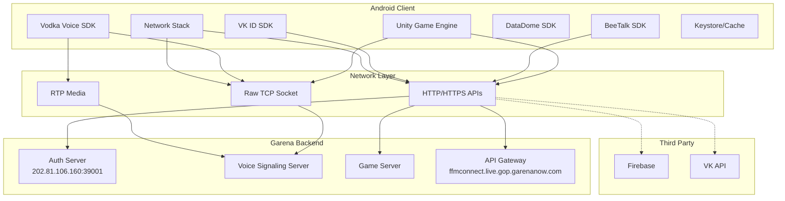
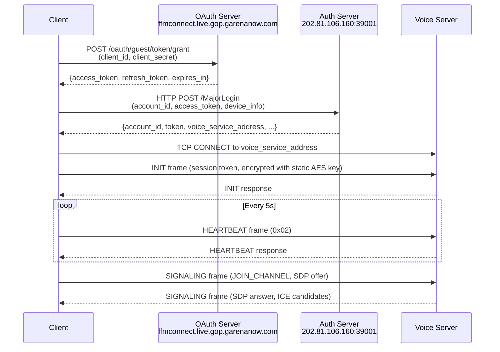
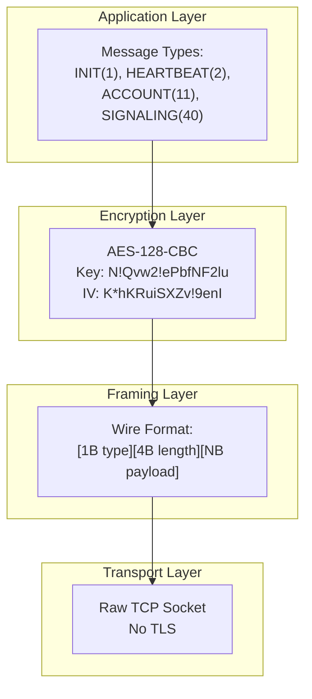
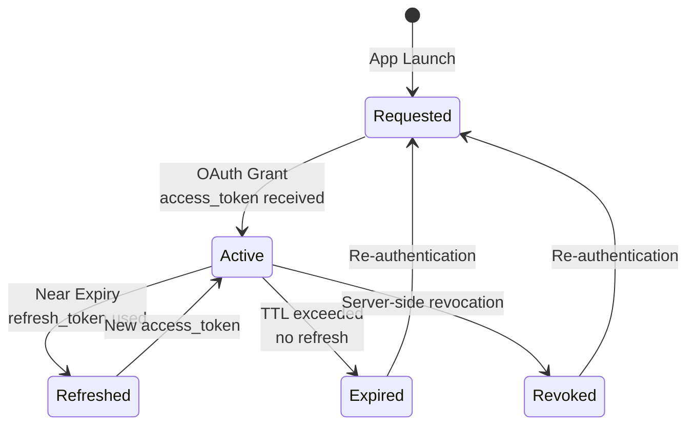
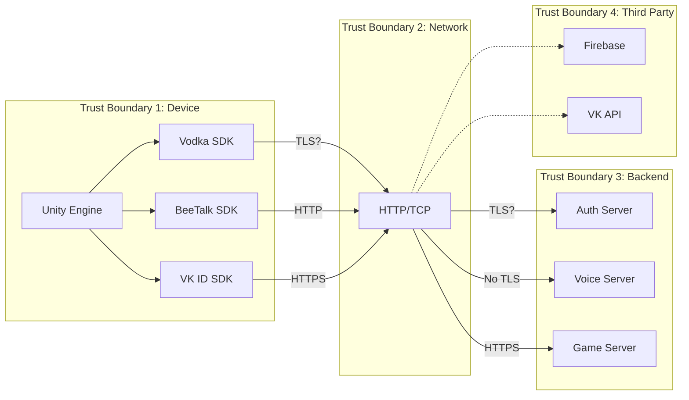

# Application Architecture

**Free Fire OB54 — Architecture Analysis**

---

## High-Level Architecture

---

## Authentication Flow

---

## Voice Signaling Protocol Stack

---

## Token Lifecycle

---

## Trust Boundaries

---

## Component Interaction Map

| Component | Connects To | Protocol | TLS | Auth Method |
|-----------|-------------|----------|-----|-------------|
| Vodka SDK | Voice Server | TCP | No | Static AES + token |
| BeeTalk SDK | API Gateway | HTTP | Configurable | Password in params |
| VK ID SDK | VK API | HTTPS | Yes | OAuth 2.0 |
| Game Client | Auth Server | HTTP | Cleartext permitted | MajorLogin |
| Game Client | Game Server | HTTPS | Yes | Session token |
| Firebase SDK | Firebase | HTTPS | Yes | API Key |
| DataDome SDK | DataDome | HTTPS | Yes | Client key |

---

## Key Architectural Weaknesses

1. **Split-brain encryption**: Voice signaling uses custom AES-CBC on raw TCP while HTTP APIs use TLS. This inconsistency creates two entirely different security postures.

2. **Static key management**: The Vodka SDK uses hardcoded keys for all encryption, while the HTTP stack uses proper TLS. This suggests the voice subsystem was developed independently with lower security standards.

3. **Trust boundary gaps**: The TCP connection crosses from device to network without TLS, meaning the trust boundary between device and backend is unprotected at the transport layer.

4. **No server authentication**: The client does not verify server identity for TCP connections, allowing rogue server impersonation.

---

*Architecture version: 2.0 · Last updated: July 2026*

---

*Author: swift.dev ([@yassinfaresgb-oss](https://github.com/yassinfaresgb-oss)) · Repository: [FreeFire-OB54-Redwood](https://github.com/yassinfaresgb-oss/FreeFire-OB54-Redwood)*
*Assessment conducted: July 2026 · Classification: Confidential — Internal Use Only*
