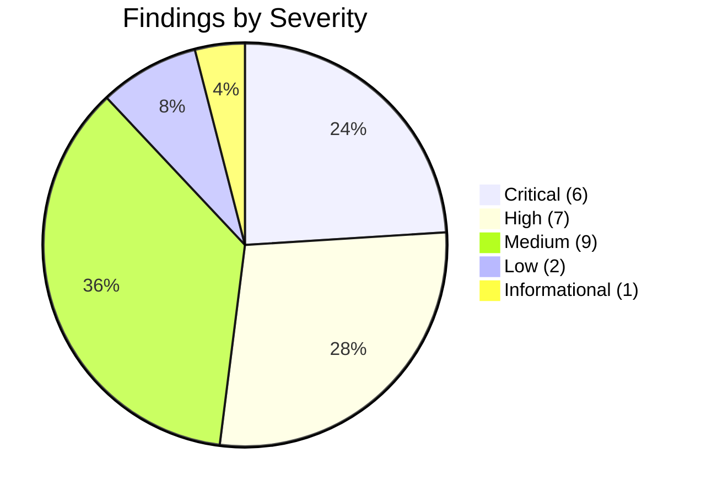
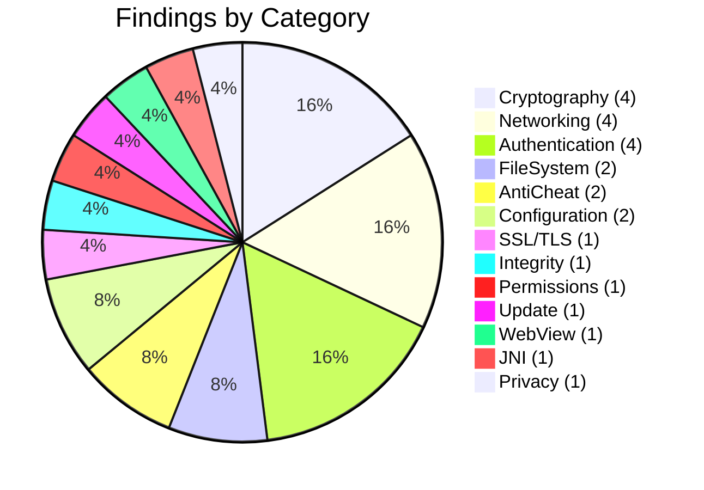

# Findings Summary

**Free Fire OB54 — Complete Findings Reference**

---

## Overview

| Metric | Value |
|--------|-------|
| Total Findings | **25** |
| Critical | **6** (24%) |
| High | **7** (28%) |
| Medium | **9** (36%) |
| Low | **2** (8%) |
| Informational | **1** (4%) |
| Unique CWEs | 21 |
| Findings Verified from Code | 13 |
| Findings Requiring Server Validation | 12 |

---

## Complete Findings Index

| ID | Title | Severity | CVSS | CWE | OWASP MASVS | Category | Confidence | Verified |
|----|-------|----------|------|-----|-------------|----------|------------|----------|
| [FF-0001](findings/Networking/FF-0001-Plaintext-TCP-Signaling.md) | Plaintext TCP Signaling Without TLS | Critical | 9.1 | CWE-319 | M3 | Networking | ★★★★★ 95% | Yes |
| [FF-0002](findings/Cryptography/FF-0002-Static-AES-Key-IV.md) | Static AES Key/IV for All Sessions | Critical | 9.8 | CWE-321 | M5 | Cryptography | ★★★★★ 98% | Yes |
| [FF-0003](findings/SSL_TLS/FF-0003-SSL-Certificate-Validation-Bypass.md) | SSL Certificate Validation Bypass | Critical | 8.1 | CWE-295 | M3 | SSL/TLS | ★★★★★ 92% | Yes |
| [FF-0004](findings/Update/FF-0004-Remote-Native-Library-Download.md) | Remote Native Library Download Without Integrity | Critical | 8.8 | CWE-494 | M8 | Update | ★★★★★ 90% | Yes |
| [FF-0005](findings/Authentication/FF-0005-Hardcoded-App-Credentials.md) | Hardcoded app_key / app_secret | Critical | 7.5 | CWE-798 | M5 | Authentication | ★★★★★ 95% | Yes |
| [FF-0006](findings/Integrity/FF-0006-No-Replay-Protection.md) | No Replay Protection in Signaling Protocol | Critical | 6.5 | CWE-294 | M3 | Integrity | ★★★☆☆ 60% | Server validation required |
| [FF-0007](findings/Cryptography/FF-0007-AES-CBC-Without-MAC.md) | AES-CBC Without Message Authentication Code | High | 7.5 | CWE-353 | M5 | Cryptography | ★★★★★ 95% | Yes |
| [FF-0008](findings/Authentication/FF-0008-One-Way-Authentication.md) | One-Way Authentication in Signaling | High | 7.3 | CWE-300 | M4 | Authentication | ★★★★☆ 80% | Server validation required |
| [FF-0009](findings/Networking/FF-0009-Cleartext-HTTP-Permitted.md) | Cleartext HTTP Traffic Permitted | High | 7.5 | CWE-319 | M3 | Networking | ★★★★★ 90% | Yes |
| [FF-0010](findings/FileSystem/FF-0010-Unencrypted-SharedPreferences.md) | Unencrypted SharedPreferences | High | 5.5 | CWE-312 | M2 | FileSystem | ★★★★☆ 85% | Yes |
| [FF-0011](findings/FileSystem/FF-0011-Overly-Broad-FileProvider.md) | Overly Broad FileProvider Paths | High | 5.5 | CWE-276 | M1 | FileSystem | ★★★★☆ 85% | Yes |
| [FF-0012](findings/Authentication/FF-0012-Long-Lived-Token.md) | Long-Lived Token with Refresh Mechanism | High | 7.5 | CWE-613 | M4 | Authentication | ★★★☆☆ 55% | Server validation required |
| [FF-0013](findings/Permissions/FF-0013-Exported-Components.md) | Exported Components Without Adequate Protection | High | 7.1 | CWE-927 | M1 | Permissions | ★★★★☆ 80% | Yes |
| [FF-0014](findings/AntiCheat/FF-0014-Unlimited-Reconnection.md) | Unlimited Reconnection Attempts | Medium | 5.3 | CWE-799 | M4 | AntiCheat | ★★★☆☆ 65% | Server validation required |
| [FF-0015](findings/AntiCheat/FF-0015-No-Bot-Detection.md) | No Bot Detection in Signaling Protocol | Medium | 5.3 | CWE-300 | M4 | AntiCheat | ★★★☆☆ 55% | Server validation required |
| [FF-0016](findings/Authentication/FF-0016-Spoofable-Device-Fingerprint.md) | Spoofable Device Fingerprint | Medium | 5.3 | CWE-290 | M4 | Authentication | ★★★☆☆ 55% | Server validation required |
| [FF-0017](findings/Cryptography/FF-0017-MD5-SHA1-Usage.md) | MD5 and SHA-1 Hash Usage | Medium | 5.3 | CWE-328 | M5 | Cryptography | ★★★★☆ 80% | Yes |
| [FF-0018](findings/Networking/FF-0018-Passwords-as-HTTP-Parameters.md) | Passwords Transmitted as HTTP Parameters | Medium | 5.3 | CWE-522 | M3 | Networking | ★★★★☆ 75% | Yes |
| [FF-0019](findings/Configuration/FF-0019-Exposed-Firebase-Credentials.md) | Exposed Firebase API Keys | Medium | 5.3 | CWE-200 | M7 | Configuration | ★★★★★ 90% | Yes |
| [FF-0020](findings/WebView/FF-0020-WebView-JS-Bridge.md) | WebView JavaScript Bridge Exposure | Medium | 6.1 | CWE-749 | M1 | WebView | ★★★★☆ 80% | Runtime validation required |
| [FF-0021](findings/Cryptography/FF-0021-AES-ECB-Usage.md) | AES/ECB in Crypto Constructions | Medium | 4.0 | CWE-327 | M5 | Cryptography | ★★☆☆☆ 30% | False positive — standard CMAC/EAX usage |
| [FF-0022](findings/Networking/FF-0022-Unauthenticated-Heartbeat.md) | Unauthenticated Heartbeat Protocol | Low | 3.7 | CWE-345 | M3 | Networking | ★★★☆☆ 60% | Yes |
| [FF-0023](findings/JNI/FF-0023-JNI-Reflection-Proxy.md) | JNI Dynamic Proxy Obfuscation Layer | Low | 3.3 | CWE-94 | M8 | JNI | ★★★☆☆ 50% | Yes |
| [FF-0024](findings/Privacy/FF-0024-VK-Token-Exposed.md) | VK Verification Token Exposed | Low | 3.3 | CWE-200 | M2 | Privacy | ★★★★☆ 85% | Yes |
| [FF-0025](findings/Configuration/FF-0025-Empty-DataDome-Config.md) | Empty DataDome Configuration | Informational | 0.0 | CWE-16 | M7 | Configuration | ★★★★☆ 80% | Yes |

---

## Findings by Category

| Category | Count | Findings | Highest Severity |
|----------|-------|----------|------------------|
| Cryptography | 4 | FF-0002, FF-0007, FF-0017, FF-0021 | Critical |
| Networking | 4 | FF-0001, FF-0009, FF-0018, FF-0022 | Critical |
| Authentication | 4 | FF-0005, FF-0008, FF-0012, FF-0016 | Critical |
| SSL/TLS | 1 | FF-0003 | Critical |
| FileSystem | 2 | FF-0010, FF-0011 | High |
| Integrity | 1 | FF-0006 | Critical |
| Permissions | 1 | FF-0013 | High |
| AntiCheat | 2 | FF-0014, FF-0015 | Medium |
| Update | 1 | FF-0004 | Critical |
| WebView | 1 | FF-0020 | Medium |
| Configuration | 2 | FF-0019, FF-0025 | Medium |
| JNI | 1 | FF-0023 | Low |
| Privacy | 1 | FF-0024 | Low |

---

## Findings by Component

| Component | Findings | Highest Severity |
|-----------|----------|------------------|
| Vodka Signaling SDK | FF-0001, FF-0002, FF-0006, FF-0007, FF-0008, FF-0014, FF-0015, FF-0022 | Critical |
| OkHttp TLS Config | FF-0003 | Critical |
| FFVoiceManager | FF-0004 | Critical |
| VodkaConst | FF-0005 | Critical |
| NetworkSecurityConfig | FF-0009 | High |
| BeeTalk SDK | FF-0010, FF-0012, FF-0018 | High |
| FileProvider | FF-0011 | High |
| AndroidManifest | FF-0013 | High |
| MajorLogin Request | FF-0016 | Medium |
| Multiple Activities | FF-0020 | Medium |
| google-services.json | FF-0019 | Medium |
| BouncyCastle | FF-0021 | Medium |
| JNIBridge | FF-0023 | Low |
| META-INF | FF-0024 | Low |
| config.properties | FF-0025 | Informational |

---

## Distribution

---

*Findings Summary version: 2.0 · Last updated: July 2026*
