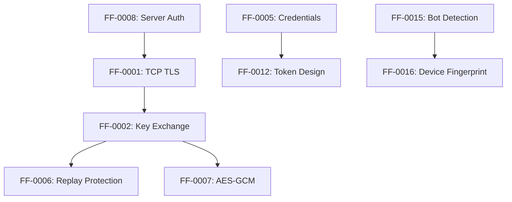

# Priority Roadmap

**Free Fire OB54 — Phased Remediation Timeline**

---

## Phase 1: Immediate (0–7 days)

**Objective:** Address actively exploitable Critical findings that affect all users.

| ID | Finding | Effort | Owner | Dependencies |
|----|---------|--------|-------|-------------|
| FF-0001 | Plaintext TCP Signaling | High | Vodka SDK Team | Server TLS support |
| FF-0002 | Static AES Key/IV | High | Vodka SDK Team + Backend | Key exchange infrastructure |
| FF-0003 | SSL Certificate Validation Bypass | Medium | Network Security Team | None |
| FF-0005 | Hardcoded Credentials | Medium | Backend Team | OAuth infrastructure |

**Estimated Effort:** 2–4 engineer-weeks
**Risk if Delayed:** Active exploitation of voice signaling encryption

---

## Phase 2: Short-Term (1–4 weeks)

**Objective:** Address remaining Critical and High findings with medium effort.

| ID | Finding | Effort | Owner | Dependencies |
|----|---------|--------|-------|-------------|
| FF-0004 | Remote Native Library Download | Medium | DevOps/Security | Code signing infrastructure |
| FF-0006 | No Replay Protection | High | Protocol Team | Protocol redesign |
| FF-0007 | AES-CBC Without MAC | Medium | Vodka SDK Team | Crypto library update |
| FF-0009 | Cleartext HTTP Permitted | Low | Network Security | Config update |
| FF-0013 | Exported Components | Low | Android Team | Manifest update |

**Estimated Effort:** 3–5 engineer-weeks
**Risk if Delayed:** Continued exposure to replay attacks and MITM

---

## Phase 3: Medium-Term (1–3 months)

**Objective:** Address Medium findings and implement defense-in-depth.

| ID | Finding | Effort | Owner | Dependencies |
|----|---------|--------|-------|-------------|
| FF-0008 | One-Way Authentication | High | Protocol Team | mTLS infrastructure |
| FF-0010 | Unencrypted SharedPreferences | Low | BeeTalk SDK | EncryptedSharedPreferences migration |
| FF-0011 | Overly Broad FileProvider | Low | Android Team | Config update |
| FF-0012 | Long-Lived Token | Medium | Auth Team | Token redesign |
| FF-0014 | Unlimited Reconnection | Low | AntiCheat Team | Rate limiting |
| FF-0015 | No Bot Detection | Medium | AntiCheat Team | Play Integrity integration |
| FF-0016 | Spoofable Device Fingerprint | Medium | Auth Team | Play Integrity integration |
| FF-0017 | MD5/SHA-1 Usage | Low | Various Teams | Hash migration |
| FF-0018 | Passwords as HTTP Parameters | Medium | BeeTalk SDK | OAuth migration |
| FF-0019 | Exposed Firebase Credentials | Low | Config Team | Security Rules |
| FF-0020 | WebView JS Bridge | Medium | WebView Team | URL validation |
| FF-0021 | AES/ECB Usage | Low | Crypto Team | Documentation |

**Estimated Effort:** 6–10 engineer-weeks
**Risk if Delayed:** Medium-severity attack vectors remain open

---

## Phase 4: Long-Term (3–6 months)

**Objective:** Address Low/Informational findings and complete security hardening.

| ID | Finding | Effort | Owner | Dependencies |
|----|---------|--------|-------|-------------|
| FF-0022 | Unauthenticated Heartbeat | Low | Protocol Team | Protocol update |
| FF-0023 | JNI Reflection Proxy | Medium | Native Team | JNI audit |
| FF-0024 | VK Token Exposed | Low | OAuth Team | Token rotation |
| FF-0025 | Empty DataDome Config | Low | Config Team | DataDome setup |

**Estimated Effort:** 2–3 engineer-weeks
**Risk if Delayed:** Low-impact gaps persist

---

## Quick Wins (Low Effort, High Impact)

These findings can be addressed with minimal development effort:

| ID | Finding | Effort | Impact |
|----|---------|--------|--------|
| FF-0009 | Cleartext HTTP Permitted | Low | High |
| FF-0013 | Exported Components | Low | High |
| FF-0011 | Overly Broad FileProvider | Low | Medium |
| FF-0019 | Exposed Firebase Credentials | Low | Medium |
| FF-0024 | VK Token Exposed | Low | Low |

---

## Technical Debt

| Category | Findings | Description |
|----------|----------|-------------|
| Static Key Infrastructure | FF-0002, FF-0005 | Hardcoded keys require architectural redesign |
| Voice Protocol Security | FF-0001, FF-0006, FF-0007, FF-0008 | Voice signaling needs TLS + modern crypto |
| Token Lifecycle | FF-0012 | Token design requires backend changes |
| Platform Hardening | FF-0010, FF-0011, FF-0013, FF-0020 | Android configuration improvements |

---

## Dependencies

---

*Priority Roadmap version: 2.0 · Last updated: July 2026*
