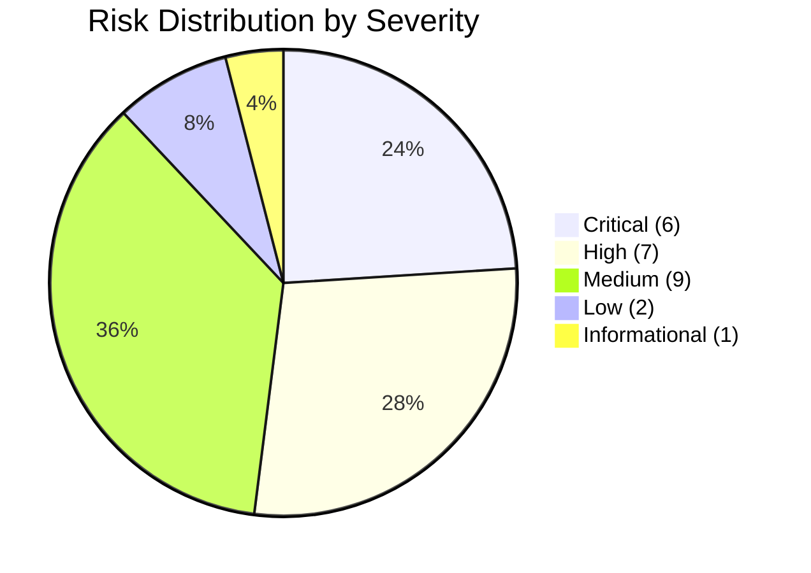

# Risk Matrix

**Free Fire OB54 — CVSS-Based Risk Heat Map**

---

## Risk Matrix

| | Low Impact | Medium Impact | High Impact | Critical Impact |
|---|---|---|---|---|
| **High Likelihood** | | FF-0020 | FF-0009, FF-0010 | FF-0001, FF-0002, FF-0003 |
| **Medium Likelihood** | FF-0022, FF-0023 | FF-0014, FF-0015, FF-0016, FF-0017, FF-0018 | FF-0007, FF-0008, FF-0011, FF-0012 | FF-0004, FF-0005 |
| **Low Likelihood** | FF-0024, FF-0025 | FF-0019, FF-0021 | FF-0013 | FF-0006 |

---

## CVSS Scoring

| ID | Title | CVSS | Vector | Severity |
|----|-------|------|--------|----------|
| FF-0001 | Plaintext TCP Signaling | 9.1 | AV:N/AC:L/PR:N/UI:N/S:U/C:H/I:H/A:N | Critical |
| FF-0002 | Static AES Key/IV | 9.8 | AV:N/AC:L/PR:N/UI:N/S:U/C:H/I:H/A:H | Critical |
| FF-0003 | SSL Certificate Validation Bypass | 8.1 | AV:N/AC:L/PR:N/UI:R/S:U/C:H/I:H/A:N | Critical |
| FF-0004 | Remote Native Library Download | 8.8 | AV:N/AC:L/PR:N/UI:R/S:U/C:H/I:H/A:H | Critical |
| FF-0005 | Hardcoded Credentials | 7.5 | AV:N/AC:L/PR:N/UI:N/S:U/C:H/I:N/A:N | Critical |
| FF-0006 | No Replay Protection | 6.5 | AV:N/AC:L/PR:N/UI:R/S:U/C:N/I:H/A:N | Critical |
| FF-0007 | AES-CBC Without MAC | 7.5 | AV:N/AC:L/PR:N/UI:N/S:U/C:N/I:H/A:N | High |
| FF-0008 | One-Way Authentication | 7.3 | AV:N/AC:H/PR:N/UI:N/S:U/C:H/I:H/A:N | High |
| FF-0009 | Cleartext HTTP Permitted | 7.5 | AV:N/AC:L/PR:N/UI:N/S:U/C:H/I:N/A:N | High |
| FF-0010 | Unencrypted SharedPreferences | 5.5 | AV:L/AC:L/PR:N/UI:N/S:U/C:H/I:N/A:N | High |
| FF-0011 | Overly Broad FileProvider | 5.5 | AV:L/AC:L/PR:N/UI:R/S:U/C:H/I:N/A:N | High |
| FF-0012 | Long-Lived Token | 7.5 | AV:N/AC:L/PR:N/UI:N/S:U/C:H/I:N/A:N | High |
| FF-0013 | Exported Components | 7.1 | AV:L/AC:L/PR:N/UI:R/S:U/C:H/I:H/A:N | High |
| FF-0014 | Unlimited Reconnection | 5.3 | AV:N/AC:L/PR:N/UI:N/S:U/C:N/I:N/A:L | Medium |
| FF-0015 | No Bot Detection | 5.3 | AV:N/AC:L/PR:N/UI:N/S:U/C:N/I:L/A:N | Medium |
| FF-0016 | Spoofable Device Fingerprint | 5.3 | AV:N/AC:L/PR:N/UI:N/S:U/C:N/I:L/A:N | Medium |
| FF-0017 | MD5/SHA-1 Usage | 5.3 | AV:N/AC:L/PR:N/UI:N/S:U/C:N/I:L/A:N | Medium |
| FF-0018 | Passwords as HTTP Parameters | 5.3 | AV:N/AC:L/PR:N/UI:N/S:U/C:H/I:N/A:N | Medium |
| FF-0019 | Exposed Firebase Credentials | 5.3 | AV:N/AC:L/PR:N/UI:N/S:U/C:L/I:N/A:N | Medium |
| FF-0020 | WebView JS Bridge | 6.1 | AV:N/AC:L/PR:N/UI:R/S:U/C:L/I:H/A:N | Medium |
| FF-0021 | AES/ECB Usage | 4.0 | AV:N/AC:H/PR:N/UI:N/S:U/C:L/I:N/A:N | Medium |
| FF-0022 | Unauthenticated Heartbeat | 3.7 | AV:N/AC:H/PR:N/UI:N/S:U/C:N/I:L/A:N | Low |
| FF-0023 | JNI Reflection Proxy | 3.3 | AV:L/AC:H/PR:N/UI:N/S:U/C:L/I:L/A:N | Low |
| FF-0024 | VK Token Exposed | 3.3 | AV:L/AC:H/PR:N/UI:N/S:U/C:L/I:N/A:N | Low |
| FF-0025 | Empty DataDome Config | 0.0 | N/A | Informational |

---

## Risk Distribution

---

## Top 5 Risks by CVSS

| Rank | Finding | CVSS | Rationale |
|------|---------|------|-----------|
| 1 | FF-0002: Static AES Key/IV | 9.8 | Network-accessible, no auth required, full confidentiality + integrity + availability impact |
| 2 | FF-0001: Plaintext TCP Signaling | 9.1 | Network-accessible, no auth required, confidentiality + integrity impact |
| 3 | FF-0003: SSL Certificate Validation Bypass | 8.1 | Requires user interaction (network position), full confidentiality + integrity |
| 4 | FF-0004: Remote Native Library Download | 8.8 | Requires user interaction (app launch), full CIA impact |
| 5 | FF-0005: Hardcoded Credentials | 7.5 | Network-accessible, no auth required, confidentiality impact |

---

*Risk Matrix version: 2.0 · Last updated: July 2026*
