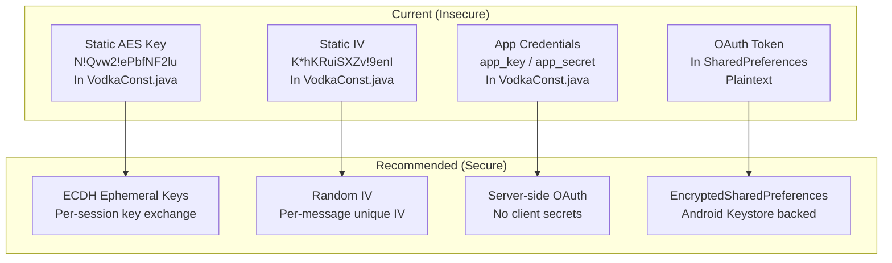

# Cryptographic Architecture Reference

**Free Fire OB54 — Complete Cryptographic Analysis**

---

## Crypto Primitives in Use

| Primitive | Location | Purpose | Security |
|-----------|----------|---------|----------|
| AES-128-CBC | `AbstractC0698c.java` | TCP payload encryption | Weak — static key, no MAC |
| AES-ECB | `C7638m.java` | Internal to AES-CMAC | Acceptable — standard construction |
| AES-ECB | `C7627b.java` | Internal to AES-EAX | Acceptable — standard construction |
| MD5 | `C0184n.java`, `C1081e.java` | General hashing, native lib integrity | Weak — broken hash |
| SHA-1 | `C0479b.java` | Hashing | Weak — deprecated |
| SHA-256 | Various | Some integrity checks | Strong |

## Key Management

## Findings Map

| Finding | Crypto Issue | Severity |
|---------|-------------|----------|
| FF-0002 | Static AES key/IV | Critical |
| FF-0007 | AES-CBC without MAC | High |
| FF-0017 | MD5/SHA-1 usage | Medium |
| FF-0021 | AES/ECB in CMAC/EAX | Low (false positive) |

---

*Architecture version: 2.0 · Last updated: July 2026*

---

*Author: swift.dev ([@yassinfaresgb-oss](https://github.com/yassinfaresgb-oss)) · Repository: [FreeFire-OB54-Redwood](https://github.com/yassinfaresgb-oss/FreeFire-OB54-Redwood)*
*Assessment conducted: July 2026 · Classification: Confidential — Internal Use Only*
