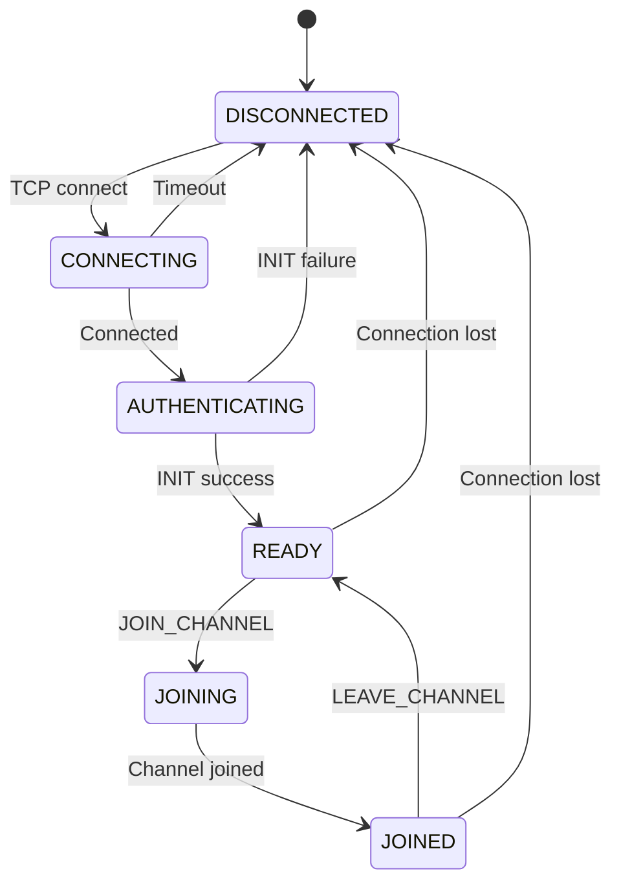
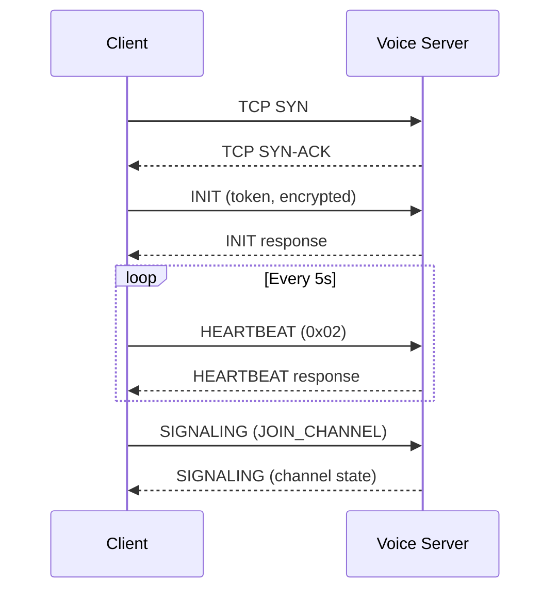

# Protocol Reference

**Free Fire OB54 — TCP Signaling Protocol**

---

## Wire Format

```
[1 byte: protocol_type] [4 bytes: big-endian payload_length] [N bytes: payload]
```

## Protocol Types

| Type | Value | Encrypted | Purpose |
|------|-------|-----------|---------|
| INIT | 1 | Yes (AES-CBC) | Session initialization, token exchange |
| HEARTBEAT | 2 | No | Keep-alive (single byte 0x02) |
| ACCOUNT | 11 | Yes (AES-CBC) | Account binding / identification |
| SIGNALING | 40 | Yes (AES-CBC) | Voice channel signaling |

## Message Types (SIGNALING)

| CMD | Purpose |
|-----|---------|
| Various | JOIN_CHANNEL, LEAVE_CHANNEL, SDP_OFFER, SDP_ANSWER, ICE_CANDIDATE, MUTE, UNMUTE, etc. |

(17 total message types defined in `signalingservice.proto`)

## Connection State Machine



## Authentication Sequence



---

*Protocol Reference version: 2.0 · Last updated: July 2026*

---

*Author: swift.dev ([@yassinfaresgb-oss](https://github.com/yassinfaresgb-oss)) · Repository: [FreeFire-OB54-Redwood](https://github.com/yassinfaresgb-oss/FreeFire-OB54-Redwood)*
*Assessment conducted: July 2026 · Classification: Confidential — Internal Use Only*
