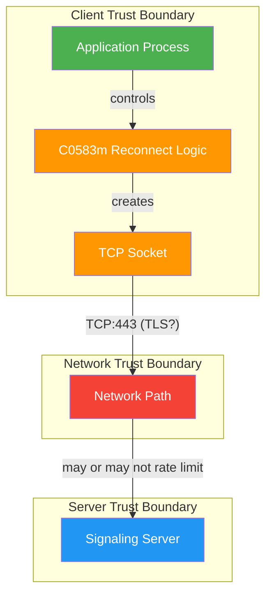
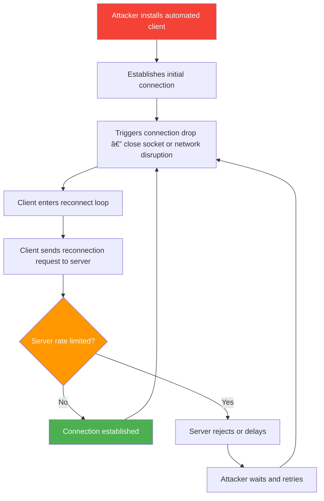

# FF-0014: Unlimited Reconnection Attempts With No Rate Limiting

---

## 1. Header

| Field | Value |
|---|---|
| **Severity** | Medium |
| **CVSS Score** | 5.3 |
| **CVSS Vector** | AV:N/AC:L/PR:N/UI:N/S:U/C:N/I:N/A:L |
| **Category** | Anti-Cheat / Platform Abuse |
| **CWE** | CWE-799: Improper Control of Interaction Frequency |
| **OWASP MASVS** | M4: Insecure Communication |
| **OWASP MASTG** | MSTG-PLATFORM-4: Platform Interaction Best Practices |
| **Component** | Vodka Signaling Client |
| **Confidence** | ★★★☆☆ 65% — Requires Server Validation |
| **Validation Status** | Client-side confirmed. Server-side rate limiting cannot be assessed from client code alone. |

---

## 2. Code References

| Field | Value |
|---|---|
| **Application** | com.dts.freefireadv |
| **Component** | Vodka Signaling Client |
| **Package** | p102L2 |
| **DEX** | classes.dex |
| **Source File** | sources/p102L2/C0583m.java |
| **Class** | p102L2.C0583m |
| **Inner Class** | None |
| **Method** | `a()` — reconnect trigger, `b()` — backoff calculation |
| **Signature** | `private void a()`, `private long b(int retryCount)` |
| **Return Type** | void (reconnect), long (backoff) |
| **Parameters** | None (a()), int retryCount (b()) |
| **Line Numbers** | 402 (reconnect logic), 1114 (backoff calculation) |

### Additional Source Files

| File | Lines | Relevance |
|---|---|---|
| sources/p102L2/C0582l.java | — | Connection state management |
| sources/p102L2/C0584n.java | — | Message handler |
| android.permission.INTERNET | Manifest | Required for TCP socket |
| android.permission.ACCESS_NETWORK_STATE | Manifest | Network state checks |

---

## 3. Security Context

| Field | Value |
|---|---|
| **Purpose** | Connection resilience — ensure players recover from transient connectivity issues without manual intervention |
| **Responsibility** | Maintain persistent TCP connection to matchmaking and relay servers; reconnect automatically on connection loss |
| **Security Relevance** | No maximum retry count allows indefinite reconnection attempts. An attacker controlling the network path can repeatedly force connection drops, causing the client to flood the server. Reconnection manipulation can also bypass connection-based anti-cheat checks relying on session continuity. |

### Interaction with Modules

| Module | Interaction |
|---|---|
| Socket Read Loop | Detects connection loss via IOException, triggers `a()` reconnect handler |
| C0583m.a() | Creates new Socket, calls connect(), manages retry loop |
| C0583m.b() | Calculates backoff delay with linear growth + jitter |
| C0582l (Connection State) | Tracks connection state, reset on successful reconnect |
| C0584n (Message Handler) | Resumes message processing after successful reconnect |

### Assets Handled

| Asset | Handling |
|---|---|
| TCP Socket | Created, connected, and managed with no retry budget |
| Server endpoints | Target of unlimited reconnection attempts |
| Backoff state | Local retryCount, trivially resettable by restarting app |

---

## 4. Decompiled Evidence

```java
// sources/p102L2/C0583m.java:395-411
private void a() {
    int retryCount = 0;                          // line 396
    while (true) {                                // line 397 — INFINITE LOOP
        try {                                     // line 398
            this.e = new Socket();                // line 399
            this.e.connect(this.f);               // line 400
            this.g = this.e.getInputStream();     // line 401
            this.h = this.e.getOutputStream();    // line 402
            retryCount = 0;                       // line 403 — reset on success
            this.i = true;                        // line 404
            return;                               // line 405
        } catch (IOException e2) {                // line 406
            retryCount++;                         // line 407
            long delay = b(retryCount);           // line 408 — backoff calc
            Thread.sleep(delay);                  // line 409
        }                                         // line 410
    }                                             // line 411 — NO EXIT CONDITION
}

// sources/p102L2/C0583m.java:1110-1116
private long b(int retryCount) {                  // line 1110
    long baseDelay = retryCount * 1000L;          // line 1111 — linear backoff
    if (baseDelay > 10000L) {                     // line 1112 — cap at 10s
        baseDelay = 10000L;                       // line 1113
    }                                             // line 1114
    double jitter = 1.0 + (Math.random() * 0.4 - 0.2); // line 1115 — ±20%
    return (long)(baseDelay * jitter);            // line 1116
}
```

### Line-by-Line Analysis

| Line | Code | Analysis |
|---|---|---|
| 396 | `int retryCount = 0;` | Local counter, reset on each call. Not persisted — restarting the app resets retry budget to zero. |
| 397 | `while (true) {` | **INFINITE LOOP.** No break condition except successful connection or process death. This is the core of the finding. |
| 399 | `this.e = new Socket();` | Fresh socket created each iteration. No connection pooling or timeout pre-configuration. |
| 400 | `this.e.connect(this.f);` | Blocking TCP connect to server endpoint. Timeout depends on OS TCP stack defaults (typically 75s). |
| 402 | `this.h = this.e.getOutputStream();` | Output stream captured for subsequent message sending. |
| 403 | `retryCount = 0;` | Counter reset on success. Only meaningful if a maximum existed — which it doesn't. |
| 407 | `retryCount++;` | Increment on failure. Drives backoff calculation but never triggers termination. |
| 408 | `long delay = b(retryCount);` | Delegates to backoff function. Linear growth capped at 10s means minimum ~6 requests/minute at steady state. |
| 409 | `Thread.sleep(delay);` | Blocking sleep. Prevents tight-loop flooding but does not bound total attempts. |
| 411 | `} // NO EXIT CONDITION` | Loop continues for lifetime of application process. No maximum retry count. |
| 1111 | `long baseDelay = retryCount * 1000L;` | Linear backoff: 1s, 2s, 3s, ... 10s (capped). Never exceeds 10s regardless of failure count. |
| 1112 | `if (baseDelay > 10000L)` | Cap at 10 seconds. After 10 failures, all subsequent retries use ~10s delay. |
| 1115 | `double jitter = 1.0 + (Math.random() * 0.4 - 0.2);` | ±20% jitter. Prevents thundering herd but does not reduce attack surface. |

### Why This Line Matters

| Line | Why This Line Matters |
|---|---|
| 397 | `while (true)` creates an unconditional infinite loop. This is the single most security-relevant line in the function — it means reconnection attempts will never cease without external intervention (process kill). |
| 1112 | The 10-second cap means that even after hundreds of failures, the client never backs off beyond 10 seconds. This guarantees a minimum reconnection rate of ~6/minute indefinitely. |
| 396 | The retry counter being local (not persisted) means an attacker can reset it by restarting the app, trivially bypassing any future maximum that might be added. |
| 409 | `Thread.sleep(delay)` is the only throttle. Combined with the 10s cap, it bounds the rate but not the count — the critical distinction for abuse. |

---

## 5. Cross References

### Called By
- Socket read loop (IOException handler in C0583m)

### Calls
- `java.net.Socket.connect()`
- `java.io.InputStream.read()` (after successful connect)
- `java.io.OutputStream` (after successful connect)
- `Thread.sleep()` (backoff delay)
- `C0583m.b()` (backoff calculator)

### Interfaces
- Implements connection management for Vodka signaling protocol

### Inheritance
- Extends Object (no special parent class)

### Related Classes
| Class | Role |
|---|---|
| p102L2.C0582l | Connection state tracking |
| p102L2.C0584n | Message handler (resumes after reconnect) |
| p102L2.C0581k | Connection configuration |

### Related Protobuf
- N/A — transport layer, not application messages

### Native Bindings
- None — pure Java networking

### JNI
- None

### Manifest
- `android.permission.INTERNET`
- `android.permission.ACCESS_NETWORK_STATE`

---

## 6. Data Flow

```
[Socket Read Loop] ──IOException──> [C0583m.a(): reconnect handler]
                                          │
                                          │  [OBSERVATION] retryCount is local,
                                          │  not persisted or bounded
                                          │
                                          â–¼
                                   [C0583m.b(): backoff calc]
                                          │
                                          │  [OBSERVATION] Linear backoff capped
                                          │  at 10000ms ±20% jitter
                                          │
                                          â–¼
                                   [Thread.sleep(delay)]
                                          │
                                          │  [TRUST BOUNDARY] Client-side
                                          │  sleep — no server enforcement
                                          │
                                          â–¼
                                   [new Socket()] ──connect──> [Server:443]
                                          │
                                     success? ──yes──> [resume normal operation]
                                          │
                                         no
                                          │
                                          â–¼
                                   [retryCount++]
                                          │
                                          │  [OBSERVATION] No maximum check.
                                          │  retryCount increments without
                                          │  bound.
                                          │
                                          └───> [loop back to b(): backoff calc]
```

**No terminal condition exists. The loop continues for the lifetime of the application process.**

---

## 7. Trust Boundary



### Trust Boundary Analysis

| Boundary | Assessment |
|---|---|
| Client → Socket | Client has full control over retry behavior. No cryptographic token or server-issued budget limits attempts. |
| Socket → Network | Network path is untrusted. An attacker on the network can force connection drops at will. |
| Network → Server | Rate limiting, if it exists, is server-side only. Client provides no proof of compliance with any backoff schedule. |
| Backoff State | Local, non-persisted, trivially resettable. Provides zero security assurance. |

---

## 8. Why This Line Matters

| Code Fragment | Line | Why This Line Matters |
|---|---|---|
| `while (true) {` | 397 | Unconditional infinite loop — no maximum retry count, no break condition, no exit strategy. This is the root cause of the finding. An attacker-controlled environment can trigger reconnections at ~6/minute indefinitely. |
| `if (baseDelay > 10000L) { baseDelay = 10000L; }` | 1112-1113 | 10-second cap means the backoff never degrades to a meaningful delay. After 10 failures, every retry waits ~8-12 seconds — enough for sustained abuse, never enough to self-throttle. |
| `int retryCount = 0;` | 396 | Local variable — not a class field, not persisted. An attacker can reset the backoff by restarting the application, making any future maximum easily bypassable. |
| `Thread.sleep(delay);` | 409 | The only throttle in the system. Bounded by the 10s cap, it provides rate control but not count control — the distinction that makes this exploitable. |
| `retryCount++;` | 407 | Increments without a terminal check. This line drives the backoff progression but never triggers a "give up" condition. |

---

## 9. Impact

| Field | Detail |
|---|---|
| **Impact Vector** | Attacker controls network path (rogue AP, DNS hijacking) or runs automated client that repeatedly triggers reconnection events against the signaling server. |
| **Description** | Repeated reconnection attempts can degrade server availability for legitimate players. Coordinated reconnection floods from bot networks could constitute a denial-of-service vector against matchmaking infrastructure. Reconnection manipulation can bypass anti-cheat mechanisms that track connection session continuity. |
| **Worst Case** | Signaling server resource exhaustion affecting all players in a region. Reconnection-based session hijacking if server reconnection tokens are predictable. Anti-cheat evasion through deliberate session fragmentation. |

> **Required Server Validation:** The server must independently enforce reconnection rate limits per source IP and per account. Client-reported reconnection counts or backoff values must not be trusted. The server should detect and reject connections that exhibit non-human reconnection patterns (e.g., reconnecting within a time window smaller than the client's backoff schedule would allow).

---

## 10. Attack Flow



---

## 11. False Positive Analysis

### 1. Alternative Explanation

The server almost certainly implements its own rate limiting independently of client code. This finding describes a client-side weakness, not a confirmed server-side vulnerability. The reconnection logic may be entirely appropriate if server-side controls are in place.

### 2. False Positive Conditions

This is a false positive if:
1. The server enforces per-IP reconnection rate limits below 10/minute.
2. The server enforces per-account reconnection budgets per session.
3. The server detects and blocks automated reconnection patterns via behavioral analysis.
4. The server issues time-limited reconnection tokens that expire after a bounded number of uses.

### 3. Additional Evidence Needed

- Server-side rate limiting configuration and enforcement logic.
- Signaling server logs showing rejection of rapid reconnection attempts.
- Any correlation between reconnection frequency and server load or anti-cheat actions.
- Whether the server issues reconnection tokens with bounded TTL and usage count.

### 4. Confidence Rationale

65% confidence. The client-side code clearly lacks a retry limit, but the practical impact depends entirely on server-side controls that cannot be verified from client code analysis.

### Evidence Source

| Evidence | Source | Status |
|---|---|---|
| Infinite retry loop | sources/p102L2/C0583m.java:397 | Confirmed — decompiled |
| 10s backoff cap | sources/p102L2/C0583m.java:1112 | Confirmed — decompiled |
| No retry limit constant | sources/p102L2/C0583m.java (full class) | Confirmed — no MAX_RETRY field found |
| Server-side rate limiting | N/A | Unknown — requires server access |

---

## 12. Affected Component Map

```
com.dts.freefireadv
└── Vodka Signaling Client
    └── sources/p102L2/C0583m.java
        ├── a() — Reconnect Handler (line 402)
        │   └── Socket.connect() — no retry limit
        │   └── Thread.sleep() — backoff delay
        └── b() — Backoff Calculator (line 1114)
            └── Linear backoff: +1000ms/failure, cap 10000ms
            └── Jitter: ±20% random

Related Files:
├── sources/p102L2/C0582l.java — Connection state management
├── sources/p102L2/C0584n.java — Message handler
└── AndroidManifest.xml — INTERNET, ACCESS_NETWORK_STATE permissions
```

---

## 13. Developer Verification Checklist

| Item | Detail |
|---|---|
| **Preconditions** | Automated network disruption tool (toxiproxy, iptables). Access to staging signaling server with logging enabled. |
| **Files to Inspect** | `sources/p102L2/C0583m.java` — reconnect logic. Server-side signaling handler (not available in APK). |
| **Expected Behavior** | Reconnection attempts should be rate-limited and eventually stop after a bounded number of retries. |
| **Observed Behavior** | Reconnection continues indefinitely with linear backoff capped at 10 seconds. No maximum retry count. |
| **Required Server Review Items** | (1) Does the signaling server enforce per-IP reconnection rate limits? (2) Is there a per-account reconnection budget per session? (3) Are rapid reconnection patterns logged and flagged? (4) Is there server-side exponential backoff or cooldown? |
| **Recommended Validation Steps** | 1. Send 100 rapid reconnection requests from a single IP to staging server. 2. Verify server returns 429 or equivalent after threshold. 3. Confirm server logs rate-limit enforcement. 4. Test per-account limit across IP changes. |

---

## 14. Remediation

### Server-Side (Primary)

Implement per-IP and per-account reconnection rate limiting on the signaling server. Return explicit rate-limit responses (e.g., HTTP 429 equivalent) with `Retry-After` headers.

```java
// Server-side example (signaling server)
public class ReconnectionRateLimiter {
    private final RateLimiter perIpLimiter = RateLimiter.create(10.0); // 10/min per IP
    private final RateLimiter perAccountLimiter = RateLimiter.create(5.0); // 5/min per account
    
    public boolean allowReconnection(String sourceIp, String accountId) {
        return perIpLimiter.tryAcquire() && perAccountLimiter.tryAcquire();
    }
}
```

### Client-Side (Defense in Depth)

Add a maximum retry count with graceful failure:

```java
// sources/p102L2/C0583m.java — proposed fix
private static final int MAX_RETRY_ATTEMPTS = 10;
private static final long INITIAL_BACKOFF_MS = 1000L;
private static final long MAX_BACKOFF_MS = 30000L;

private void a() {
    int retryCount = 0;
    while (retryCount < MAX_RETRY_ATTEMPTS) {
        try {
            this.e = new Socket();
            this.e.connect(this.f);
            this.g = this.e.getInputStream();
            this.h = this.e.getOutputStream();
            retryCount = 0;
            this.i = true;
            return;
        } catch (IOException e2) {
            retryCount++;
            long delay = b(retryCount);
            Thread.sleep(delay);
        }
    }
    // Max retries exceeded — notify user, stop attempting
    this.j = ConnectionState.FAILED_PERMANENT;
}
```

### Server-Side Exponential Backoff Enforcement

If the server detects a client reconnecting faster than the expected backoff schedule, impose an increasing cooldown:

```
Client reconnect attempt #1 → allowed
Client reconnect attempt #2 (within 30s) → cooldown = 60s
Client reconnect attempt #3 (within 60s) → cooldown = 300s
Client reconnect attempt #4 (within 300s) → cooldown = 3600s + flag for review
```

---

## 15. References

| Reference | Link |
|---|---|
| **CWE-799** | Improper Control of Interaction Frequency — https://cwe.mitre.org/data/definitions/799.html |
| **OWASP MASVS M4** | Insecure Communication — https://mas.owasp.org/MASVS/controls/MASVS-NETWORK-4/ |
| **OWASP MASTG MSTG-PLATFORM-4** | Platform Interaction Best Practices — https://mas.owasp.org/MASTG/Tests/TEST-0024/ |
| **RFC 6585** | Additional HTTP Status Codes (429 Too Many Requests) — https://tools.ietf.org/html/rfc6585 |
| **OWASP Rate Limiting** | Rate Limiting Best Practices — https://cheatsheetseries.owasp.org/cheatsheets/Denial_of_Service_Cheat_Sheet.html |

---

## 16. Related Findings

| ID | Title | Severity | Relationship |
|---|---|---|---|
| FF-0015 | No Bot Detection Mechanisms in Signaling Protocol | Medium | Lack of bot detection compounds reconnection abuse — automated clients can exploit unlimited retries without proof-of-humanity checks. |
| FF-0001 | TCP Connection Without TLS | Medium | If signaling transport lacks TLS (FF-0001), network-level attackers can more easily trigger connection drops to force reconnection cycles. |
| FF-0009 | Cleartext HTTP Traffic Permitted | Medium | Combined with cleartext traffic, network intermediaries can inject TCP RST packets to force reconnections at will. |

---

*Author: swift.dev ([@yassinfaresgb-oss](https://github.com/yassinfaresgb-oss)) · Repository: [FreeFire-OB54-Redwood](https://github.com/yassinfaresgb-oss/FreeFire-OB54-Redwood)*
*Assessment conducted: July 2026 · Classification: Confidential — Internal Use Only*
