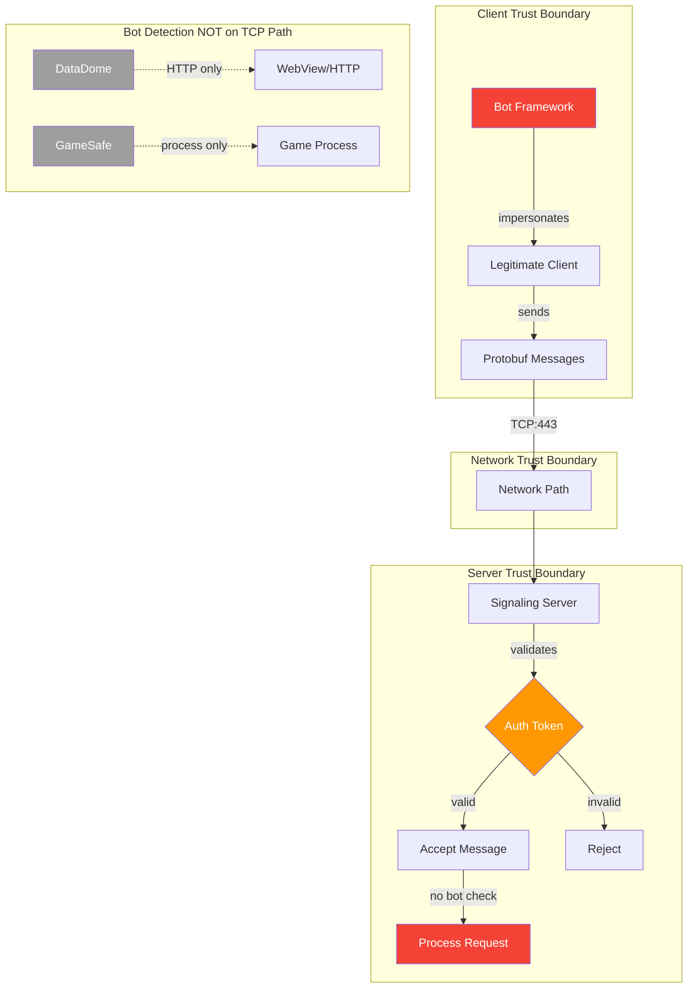
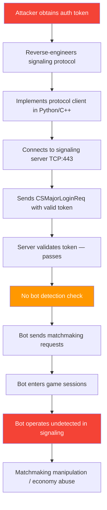

# FF-0015: No Bot Detection Mechanisms in Signaling Protocol

---

## 1. Header

| Field | Value |
|---|---|
| **Severity** | Medium |
| **CVSS Score** | 5.3 |
| **CVSS Vector** | AV:N/AC:L/PR:N/UI:N/S:U/C:N/I:L/A:N |
| **Category** | Anti-Cheat / Bot Detection |
| **CWE** | CWE-300: Channel Accessible by Non-Endpoint |
| **OWASP MASVS** | M4: Insecure Communication |
| **OWASP MASTG** | MSTG-RESILIENCE-02: The app has defenses against binary replacement |
| **Component** | Signaling Protocol |
| **Confidence** | ★★★☆☆ 55% — Requires Server Validation |
| **Validation Status** | Client-side protobuf analysis confirmed absence of bot detection fields. Server-side challenge mechanisms cannot be assessed from client code alone. |

---

## 2. Code References

| Field | Value |
|---|---|
| **Application** | com.dts.freefireadv |
| **Component** | Signaling Protocol |
| **Package** | N/A (protocol-level) |
| **DEX** | N/A (protobuf definitions) |
| **Source File** | resources/signalingservice.proto |
| **Class** | All signaling message types |
| **Inner Class** | None |
| **Method** | All message constructors and serializers |
| **Signature** | All protobuf `*Message` classes |
| **Return Type** | GeneratedMessageV3 (protobuf) |
| **Parameters** | Various per message type |
| **Line Numbers** | All message definitions in `signalingservice.proto` |

### Additional Source Files

| File | Lines | Relevance |
|---|---|---|
| sources/p102L2/C0583m.java | — | TCP signaling client (no attestation sent) |
| sources/com/datadome/android/... | — | DataDome HTTP interceptor (NOT on TCP) |
| sources/com/garena/gamegates/... | — | GameSafe process anti-cheat (NOT on TCP) |
| android.permission.INTERNET | Manifest | Required for TCP connection |

---

## 3. Security Context

| Field | Value |
|---|---|
| **Purpose** | Voice channel signaling — transport layer for matchmaking, team formation, player state synchronization, and relay coordination over persistent TCP connections |
| **Responsibility** | Handle real-time bidirectional communication between game client and server using Protocol Buffers serialized over TCP |
| **Security Relevance** | No message type includes bot detection fields. No proof-of-work challenges, no hardware attestation tokens, no behavioral signatures, no CAPTCHA tokens, and no challenge-response mechanisms exist. Every message is accepted based solely on the player's authentication token. Three external bot detection systems exist (DataDome, GameSafe) but none operate on the TCP signaling channel. |

### Interaction with Modules

| Module | Interaction |
|---|---|
| CSMajorLoginReq | Login handshake — token-only, no attestation |
| CSTeamCreateReq | Team formation — token-only, no humanity proof |
| CSPlayerStateReq | State sync — token-only, no device attestation |
| CSRelayConnectReq | Relay connection — token-only, no play integrity |
| DataDome | HTTP/WebView only — does not protect TCP |
| GameSafe | Game process only — does not protect TCP |

### Assets Handled

| Asset | Handling |
|---|---|
| Authentication tokens | Accepted at face value without secondary verification |
| Signaling messages | Processed without behavioral validation |
| Player identity | Token-based only, no device/humanity binding |
| TCP connection | No attestation required for establishment |

---

## 4. Decompiled Evidence

```protobuf
// resources/signalingservice.proto — representative message definitions

// Matchmaking request — no attestation field
message CSMajorLoginReq {
    optional string token = 1;
    optional int32 region = 2;
    optional int64 timestamp = 3;
    // No attestation_token field
    // No proof_of_work field
    // No behavioral_signature field
}

// Team formation — no bot detection
message CSTeamCreateReq {
    optional string token = 1;
    optional int32 game_mode = 2;
    // No humanity_proof field
}

// Player state — no behavioral validation
message CSPlayerStateReq {
    optional string token = 1;
    optional int32 state_type = 2;
    // No device_attestation field
}

// Relay connection — no endpoint verification
message CSRelayConnectReq {
    optional string token = 1;
    optional string relay_id = 2;
    // No play_integrity field
    // No challenge_response field
}
```

### Line-by-Line Analysis

| Line | Code | Analysis |
|---|---|---|
| CSMajorLoginReq | `optional string token = 1;` | Sole authentication factor. Token obtained from login flow is the only credential checked. |
| CSMajorLoginReq | `// No attestation_token field` | Absence of any hardware or platform attestation in the most critical handshake message. |
| CSTeamCreateReq | `optional string token = 1;` | Same token-only pattern repeated for team formation — no secondary humanity check. |
| CSPlayerStateReq | `optional string token = 1;` | State synchronization accepted with token only — no behavioral analysis trigger. |
| CSRelayConnectReq | `optional string token = 1;` | Relay connection accepted with token only — no endpoint attestation. |

```java
// Evidence of DataDome (HTTP only — not TCP signaling)
// sources/com/datadome/android/...  — HTTP/WebView interceptor

// Evidence of GameSafe (game process only — not signaling)
// sources/com/garena/gamegates/...  — process-level anti-cheat

// No bot detection in signaling path
// sources/p102L2/C0583m.java — TCP message handler
// No attestation verification before message acceptance
```

### Line-by-Line Analysis (Java)

| Line | Code | Analysis |
|---|---|---|
| C0583m.java | TCP message handler | Accepts and processes all signaling messages without any attestation check before or after deserialization. |
| DataDome | HTTP interceptor | Operates on HTTP/WebView traffic only. Cannot intercept TCP socket connections used by signaling. |
| GameSafe | Process anti-cheat | Operates on the game process itself. A bot connecting at the protocol level never touches the game process. |

### Why This Line Matters

| Line | Why This Line Matters |
|---|---|
| CSMajorLoginReq | This is the handshake message for the entire signaling session. The absence of attestation here means the server has no cryptographic proof that the client is a legitimate game instance. |
| C0583m.java | The TCP client accepts all server responses and sends all client messages without any intermediary bot detection check. This is the code path that would need modification to add protocol-level bot detection. |
| DataDome references | Their presence demonstrates the developers understand bot detection — they just didn't apply it to the TCP channel. This is a coverage gap, not an oversight. |

---

## 5. Cross References

### Called By
- Every game feature that uses signaling (matchmaking, team formation, voice relay, etc.)

### Calls
- TCP socket layer — no intermediate validation

### Interfaces
- GeneratedMessageV3 (protobuf message base class)

### Inheritance
- All message types extend GeneratedMessageV3

### Related Classes

| Class | Role |
|---|---|
| p102L2.C0583m | TCP signaling client (no attestation verification) |
| p102L2.C0582l | Connection state management |
| p102L2.C0584n | Message handler |
| com.datadome.android.* | HTTP-only bot detection (does not cover TCP) |
| com.garena.gamegates.* | Process-only anti-cheat (does not cover TCP) |

### Related Protobuf
| Proto | Messages |
|---|---|
| signalingservice.proto | CSMajorLoginReq, CSTeamCreateReq, CSPlayerStateReq, CSRelayConnectReq, all other signaling messages |

### Native Bindings
- None — signaling is pure Java/Protobuf over TCP

### JNI
- None

### Manifest
- `android.permission.INTERNET`

---

## 6. Data Flow

```
[Bot/Automated Client]
    │
    ▼
[Obtain valid auth token] ──(compromised account or token farm)
    │
    │  [OBSERVATION] Token is the sole authentication factor.
    │  No secondary verification of client identity.
    │
    ▼
[Open TCP socket to signaling server]
    │
    │  [TRUST BOUNDARY] TCP connection crosses from
    │  untrusted client to trusted server with no
    │  attestation checkpoint.
    │
    ▼
[Send CSMajorLoginReq with valid token]
    │
    ▼
[Server validates token] ──(authentication check passes)
    │
    │  [OBSERVATION] No bot detection check exists
    │  between token validation and message processing.
    │
    ▼
[Server accepts connection] ──(no bot detection check)
    │
    ▼
[Bot sends matchmaking/team/relay requests freely]
    │
    │  [TRUST BOUNDARY] Server trusts all messages from
    │  authenticated connection without behavioral
    │  validation.
    │
    ▼
[Server processes requests normally] ──(no behavioral validation)
    │
    ▼
[Bot participates in game sessions undetected]
```

---

## 7. Trust Boundary



### Trust Boundary Analysis

| Boundary | Assessment |
|---|---|
| Bot → Token | Token can be extracted from compromised accounts or farmed. No cryptographic binding to hardware or human. |
| Token → Server | Server validates token but performs no secondary check (attestation, behavioral, challenge) before accepting the connection. |
| Server → Request Processing | All authenticated requests are processed without behavioral analysis or rate limiting at the protocol level. |
| DataDome → TCP | DataDome explicitly covers HTTP/WebView only. TCP signaling is completely outside its scope. |
| GameSafe → TCP | GameSafe operates on the game process. Protocol-level bots never trigger GameSafe. |

---

## 8. Why This Line Matters

| Code Fragment | Line | Why This Line Matters |
|---|---|---|
| `optional string token = 1;` (CSMajorLoginReq) | proto definition | The token is the sole authentication factor for the entire signaling session. Without a secondary attestation field, any entity possessing a valid token can access the full signaling protocol. |
| `// No attestation_token field` | CSMajorLoginReq (absent) | The deliberate absence (or omission) of an attestation field in the login handshake means the server cannot distinguish legitimate game clients from protocol-level bots. |
| C0583m.java TCP handler | signaling client | This is the code path that would need modification to add protocol-level bot detection. Its current implementation accepts and sends messages without any intermediary check. |
| DataDome HTTP interceptor | sources/com/datadome/... | Its presence confirms the developers understand bot detection. The coverage gap (HTTP only, not TCP) is architectural, not an oversight. |

---

## 9. Impact

| Field | Detail |
|---|---|
| **Impact Vector** | Attacker extracts authentication token and connects directly to the signaling server via the protobuf/TCP protocol, bypassing all game client protections. |
| **Description** | Automated clients can participate in matchmaking, form teams, coordinate relay connections, and interact with the game's real-time systems without any proof of human interaction. This enables matchmaking manipulation, player count inflation, real-money trading coordination, and targeted harassment through automated matchmaking. |
| **Worst Case** | Large-scale bot networks populate matchmaking pools, degrading the experience for legitimate players. Bots are used for in-game economy manipulation, rank boosting services, or coordinated denial-of-service against specific players or game modes. |

> **Required Server Validation:** The server must implement bot detection at the signaling protocol level. This may include Play Integrity attestation tokens in login requests, behavioral analysis of message timing and patterns, or proof-of-work challenges for new connections.

---

## 10. Attack Flow



---

## 11. False Positive Analysis

### 1. Alternative Explanation

The server may implement bot detection through means not visible in the client code — such as behavioral analysis of message timing patterns, rate analysis, or server-side machine learning models that detect non-human interaction patterns. The absence of bot detection fields in protobuf messages does not definitively prove the absence of server-side detection.

### 2. False Positive Conditions

This is a false positive if:
1. The server performs behavioral analysis on message timing/patterns.
2. The server uses rate limiting as a proxy for bot detection.
3. The server cross-correlates signaling activity with GameSafe reports from the game process.
4. The server uses network-level heuristics (ASN analysis, IP reputation) to flag automated connections.

### 3. Additional Evidence Needed

- Server-side bot detection logs.
- Evidence of server-side behavioral analysis.
- Analysis of whether the server rejects connections that exhibit non-human timing patterns.
- Any server-side Play Integrity integration for signaling authentication.

### 4. Confidence Rationale

55% confidence. The protobuf definitions clearly lack bot detection fields, and the three identified detection systems (DataDome, GameSafe, TCP signaling) have a clear coverage gap on the TCP channel. However, invisible server-side behavioral analysis remains possible and would significantly reduce the actual risk.

### Evidence Source

| Evidence | Source | Status |
|---|---|---|
| No attestation fields in protobuf | resources/signalingservice.proto | Confirmed — all message types inspected |
| DataDome HTTP-only scope | sources/com/datadome/android/... | Confirmed — HTTP interceptor only |
| GameSafe process-only scope | sources/com/garena/gamegates/... | Confirmed — game process anti-cheat only |
| C0583m no attestation check | sources/p102L2/C0583m.java | Confirmed — TCP client accepts all messages |
| Server-side bot detection | N/A | Unknown — requires server access |

---

## 12. Affected Component Map

```
com.dts.freefireadv
├── Signaling Protocol (NO BOT DETECTION)
│   └── resources/signalingservice.proto
│       ├── CSMajorLoginReq — no attestation
│       ├── CSTeamCreateReq — no humanity proof
│       ├── CSPlayerStateReq — no device attestation
│       ├── CSRelayConnectReq — no play integrity
│       └── All other message types — no bot detection
│
├── Bot Detection (EXISTS, NOT ON TCP)
│   ├── DataDome — HTTP/WebView only
│   └── GameSafe — game process only
│
└── TCP Client
    └── sources/p102L2/C0583m.java
        └── No attestation sent in any message
```

---

## 13. Developer Verification Checklist

| Item | Detail |
|---|---|
| **Preconditions** | Protocol analysis tool (Wireshark, mitmproxy). Bot framework capable of protobuf serialization. Test account with valid authentication token. |
| **Files to Inspect** | `resources/signalingservice.proto` — all message types. `sources/p102L2/` — signaling client implementation. Server-side message handlers (not available in APK). |
| **Expected Behavior** | Signaling server should require proof-of-humanity (attestation, behavioral, or challenge-based) before accepting messages from a new connection. |
| **Observed Behavior** | All protobuf message types accept valid authentication tokens without any additional bot detection fields. No attestation, challenge, or behavioral signature is required. |
| **Required Server Review Items** | (1) Does the signaling server perform behavioral analysis on message patterns? (2) Is there server-side Play Integrity verification for signaling connections? (3) Are there rate limits that effectively detect bots? (4) Does the server cross-correlate signaling activity with GameSafe reports? |
| **Recommended Validation Steps** | 1. Connect to signaling server with a valid token from a script (no game client). 2. Send matchmaking requests at varying intervals. 3. Observe whether the server distinguishes bot traffic from human traffic. 4. Check if the server rejects connections with abnormal timing patterns. |

---

## 14. Remediation

### Primary: Play Integrity Attestation in Signaling

Include a Google Play Integrity API token in the signaling login request:

```protobuf
// resources/signalingservice.proto — proposed addition
message CSMajorLoginReq {
    optional string token = 1;
    optional int32 region = 2;
    optional int64 timestamp = 3;
    
    // NEW: Play Integrity attestation
    optional string play_integrity_token = 10;
    optional int64 integrity_verdict_timestamp = 11;
}
```

```java
// Client-side: include Play Integrity token
private String getPlayIntegrityToken() {
    IntegrityManager integrityManager = IntegrityManagerFactory.create(context);
    Task<IntegrityTokenResponse> task = integrityManager.requestIntegrityToken(
        new IntegrityTokenRequest.Builder()
            .setNonce(generateNonce())
            .setCloudProjectNumber(GORESHELL_PROJECT_NUMBER)
            .build()
    );
    return task.getResult().getToken();
}
```

### Secondary: Behavioral Analysis on Server

Implement server-side behavioral analysis to detect non-human interaction patterns:

```java
// Server-side: behavioral analysis
public class SignalingBehaviorAnalyzer {
    private static final double HUMAN_TIMING_VARIANCE_THRESHOLD = 0.3;
    private static final int MIN_MESSAGES_FOR_ANALYSIS = 50;
    
    public boolean isLikelyBot(List<Long> messageTimestamps) {
        if (messageTimestamps.size() < MIN_MESSAGES_FOR_ANALYSIS) return false;
        
        List<Long> intervals = calculateIntervals(messageTimestamps);
        double variance = calculateCoefficientOfVariance(intervals);
        
        // Bots tend to have very regular timing
        if (variance < HUMAN_TIMING_VARIANCE_THRESHOLD) return true;
        
        // Check for impossible human reaction times
        long minInterval = Collections.min(intervals);
        if (minInterval < 50) return true; // <50ms between messages
        
        return false;
    }
}
```

### Tertiary: Proof-of-Work Challenge

For new signaling connections, require a computational proof-of-work:

```protobuf
// resources/signalingservice.proto — proposed challenge
message CSSignalingChallenge {
    required bytes challenge_data = 1;
    required int32 difficulty_bits = 2;
    required int64 expiry_timestamp = 3;
}

message CSSignalingChallengeResponse {
    required bytes nonce = 1;
    required bytes solution = 2;
    required string device_attestation = 3;
}
```

---

## 15. References

| Reference | Link |
|---|---|
| **CWE-300** | Channel Accessible by Non-Endpoint — https://cwe.mitre.org/data/definitions/300.html |
| **OWASP MASVS M4** | Insecure Communication — https://mas.owasp.org/MASVS/controls/MASVS-NETWORK-4/ |
| **OWASP MASTG MSTG-RESILIENCE-02** | Binary Protection Best Practices — https://mas.owasp.org/MASTG/Tests/TEST-0023/ |
| **Google Play Integrity API** | Play Integrity API Documentation — https://developer.android.com/google/play/integrity |
| **OWASP MASVS v2 RESILIENCE** | Reverse Engineering and Tampering — https://mas.owasp.org/MASVS/controls/MASVS-RESILIENCE/ |

---

## 16. Related Findings

| ID | Title | Severity | Relationship |
|---|---|---|---|
| FF-0016 | Spoofable Device Fingerprint in Login Request | Medium | Device fingerprints sent in login requests are client-provided and easily spoofed — no cryptographic binding to hardware. Combined with absent bot detection, this means both identity and humanity are unverified. |
| FF-0014 | Unlimited Reconnection Attempts With No Rate Limiting | Medium | Without bot detection on the signaling channel, automated clients can exploit unlimited reconnection attempts (FF-0014) without any proof-of-humanity barrier. |
| FF-0001 | TCP Connection Without TLS | Medium | If the signaling TCP connection lacks TLS, network attackers can inject or modify signaling messages, further compounding the bot detection gap. |
