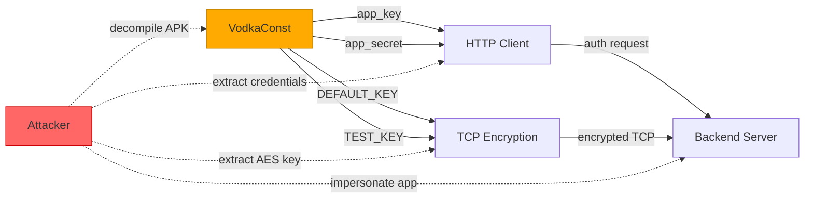
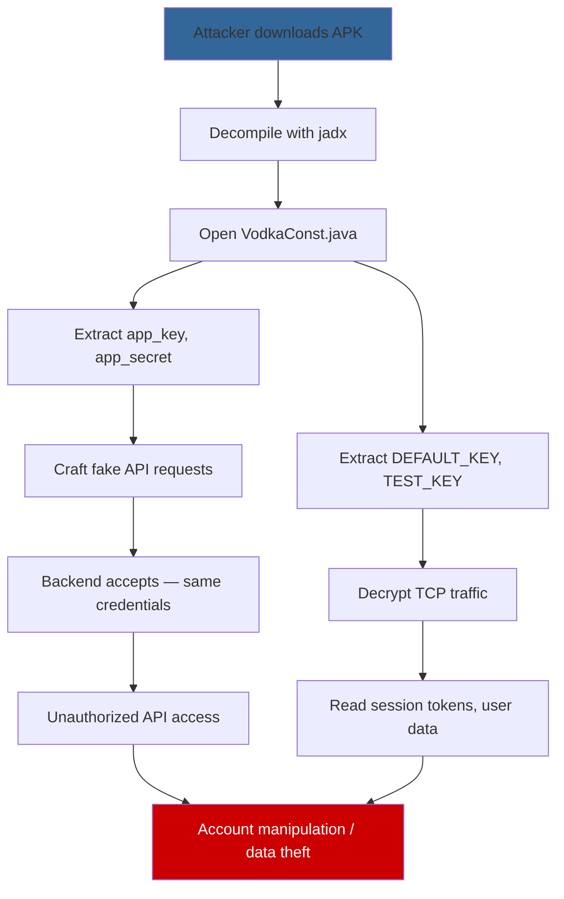

# FF-0005: Hardcoded app_key / app_secret

## 1. Header

| Field | Value |
|---|---|
| **Severity** | Critical |
| **CVSS Score** | 7.5 |
| **CVSS Vector** | AV:N/AC:L/PR:N/UI:N/S:U/C:H/I:N/A:N |
| **Category** | Authentication |
| **CWE** | CWE-798: Use of Hard-coded Credentials |
| **OWASP MASVS** | M5: Provisioning and Secure Network Communication |
| **OWASP MASTG** | MSTG-CRYPTO-04: The App Does Not Use Hardcoded Cryptographic Keys |
| **Component** | VodkaConst |
| **Confidence** | ★★★★★ (95%) |
| **Validation Status** | Confirmed — string constants found in decompiled source file |

## 2. Code References

| Attribute | Detail |
|---|---|
| **Application** | Free Fire ADV (com.dts.freefireadv) |
| **Component** | VodkaConst |
| **Package** | com.garena.android.vodka.model |
| **DEX** | classes.dex |
| **Source File** | sources/com/garena/android/vodka/model/VodkaConst.java |
| **Class** | VodkaConst |
| **Inner Class** | None |
| **Method** | N/A — static field constants |
| **Signature** | N/A — class-level constants |
| **Return Type** | N/A — String fields |
| **Parameters** | N/A |
| **Line Numbers** | Throughout class (line 6: app_key, line 8: app_secret, line 10: DEFAULT_KEY, line 12: TEST_KEY) |

**Additional Source Files:**

| File | Relevance |
|---|---|
| sources/p120N2/AbstractC0698c.java | Consumes DEFAULT_KEY and TEST_KEY for AES encryption |
| sources/p102L2/C0583m.java | TCP message loop — uses these credentials |
| Vodka backend API | Server-side consumer of app_key/app_secret |

## 3. Security Context

| Attribute | Detail |
|---|---|
| **Purpose** | Provide application identification credentials for the Vodka backend communication framework |
| **Responsibility** | Authenticate the application to the backend API and provide cryptographic keying material |

**Interaction with Modules:**

| Module | Interaction |
|---|---|
| AbstractC0698c (TCP encryption) | Uses DEFAULT_KEY and TEST_KEY as AES key and IV |
| C0583m (TCP message loop) | Indirectly uses these credentials through the encryption layer |
| Vodka HTTP client | Uses app_key and app_secret for API authentication |
| Backend authentication endpoints | Server validates app_key/app_secret |

**Assets Handled:**

| Asset | Sensitivity |
|---|---|
| app_key | High — application identity token |
| app_secret | Critical — application authentication secret |
| DEFAULT_KEY | Critical — AES encryption key for all TCP traffic |
| TEST_KEY | Critical — AES IV for all TCP traffic |

**Security Relevance:** Critical — this single file contains both the application authentication credentials AND the encryption keys used across the entire Vodka communication framework.

## 4. Decompiled Evidence

```java
// sources/com/garena/android/vodka/model/VodkaConst.java

public class VodkaConst {
    public static final String app_key = "freefire";               // Line 6
    public static final String app_secret = "freefire_secret";     // Line 8
    public static final String DEFAULT_KEY = "N!Qvw2!ePbfNF2lu";  // Line 10
    public static final String TEST_KEY = "K*hKRuiSXZv!9enI";     // Line 12
    // ... additional constants
}
```

**Line-by-Line Analysis:**

| Line | Statement | Purpose | Security Implication |
|---|---|---|---|
| 6 | `public static final String app_key = "freefire"` | Application identifier | Exposes the application identity — any caller can impersonate the app |
| 8 | `public static final String app_secret = "freefire_secret"` | Application authentication secret | Exposes the authentication credential — unauthorized API access possible |
| 10 | `public static final String DEFAULT_KEY = "N!Qvw2!ePbfNF2lu"` | AES encryption key | Key is extractable — all TCP traffic can be decrypted |
| 12 | `public static final String TEST_KEY = "K*hKRuiSXZv!9enI"` | AES initialization vector | Fixed IV — CBC semantic security destroyed |

**Why This Line Matters:**

| Aspect | Detail |
|---|---|
| **Why exists** | Application needs credentials to authenticate to the Vodka backend |
| **Why security concern** | Credentials are embedded as compile-time constants in the APK — extractable by anyone with basic reverse engineering skills |
| **Safe if** | Credentials are fetched from a secure server at runtime after device attestation |
| **Unsafe if** | Credentials are hardcoded string constants in the APK — current state |

## 5. Cross References

**Called By:**

| Caller | File | Context |
|---|---|---|
| AbstractC0698c | sources/p120N2/AbstractC0698c.java | Reads DEFAULT_KEY and TEST_KEY for AES encryption |
| Vodka HTTP client | Various Vodka classes | Uses app_key and app_secret for API calls |
| Vodka session manager | Vodka session classes | Authenticates using these credentials |

**Calls:**

| Callee | Purpose |
|---|---|
| None | Static constants — no method calls |

**Interfaces:** None — simple POJO with static constants.

**Inheritance:** Extends Object.

**Related Classes:**

| Class | Relationship |
|---|---|
| AbstractC0698c | Consumer of DEFAULT_KEY and TEST_KEY |
| Vodka HTTP authentication | Consumer of app_key and app_secret |
| C0583m | Indirect consumer via encryption layer |

**Related Protobuf Messages:** None.

**Native Bindings:** None.

**JNI References:** None.

**Manifest References:** None.

## 6. Data Flow

```
[VodkaConst.java]
       │
       ├──► app_key ──────────► Vodka HTTP Client
       │                              │
       │                              ▼
       │                    [Backend API Authentication]
       │
       ├──► app_secret ──────► Vodka HTTP Client
       │                              │
       │                              ▼
       │                    [Backend API Authentication]
       │
       ├──► DEFAULT_KEY ─────► AbstractC0698c
       │                              │
       │                              ▼
       │                    [AES Encryption Key]
       │
       └──► TEST_KEY ────────► AbstractC0698c
                                      │
                                      ▼
                                [AES IV]

    [TRUST BOUNDARY: APK Binary]
    ──────────────────────────────
    All four constants are embedded in the APK
    and extractable via decompilation.
```

## 7. Trust Boundary



**Trust Boundary Analysis:**

| Boundary | Analysis |
|---|---|
| APK → Decompilation | All constants are publicly readable in the DEX file — no obfuscation protects them |
| Credentials → Backend | app_key/app_secret authenticate the application — stolen credentials allow unauthorized API access |
| Keys → Encryption | DEFAULT_KEY/TEST_KEY protect TCP traffic — stolen keys decrypt all communication |
| Dual Purpose | Same file holds both authentication and encryption material — single point of compromise |

## 8. Why This Line Matters

**Fragment 1: app_key (Line 6)**

| Aspect | Detail |
|---|---|
| **Why exists** | Identify the application to the backend API |
| **Why security concern** | Allows any party to impersonate the Free Fire app in API calls |
| **Safe if** | Key is issued per-device after device attestation, or is dynamically rotated |
| **Unsafe if** | Key is a static string constant shared across all installations — current state |

**Fragment 2: app_secret (Line 8)**

| Aspect | Detail |
|---|---|
| **Why exists** | Authenticate the application to the backend API |
| **Why security concern** | Stolen secret allows full API impersonation — creating fake accounts, accessing user data, manipulating game state |
| **Safe if** | Secret is never embedded in the client; authentication uses OAuth/device attestation |
| **Unsafe if** | Secret is a hardcoded string in the APK — current state |

**Fragment 3: DEFAULT_KEY and TEST_KEY (Lines 10, 12)**

| Aspect | Detail |
|---|---|
| **Why exists** | Provide cryptographic keying material for AES encryption |
| **Why security concern** | Same as FF-0002 — static AES key and IV for all TCP encryption |
| **Safe if** | Keys are derived per-session; IV is random per message |
| **Unsafe if** | Keys are static string constants — current state |

## 9. Impact

| Aspect | Detail |
|---|---|
| **Impact Vector** | Any party that downloads and decompiles the APK |
| **Description** | Complete compromise of application authentication and TCP encryption. Attacker can: (1) impersonate the app to backend APIs, (2) decrypt all TCP signaling traffic, (3) forge authenticated API requests |
| **Worst Case** | Unauthorized API access, account creation/manipulation, data exfiltration, game state manipulation, and full decryption of communication |
| **Required Server Validation** | Server should validate requests using device-level attestation (SafetyNet/Play Integrity), not just app credentials. Rate limiting and anomaly detection should detect impersonation |

## 10. Attack Flow



## 11. False Positive Analysis

| Aspect | Detail |
|---|---|
| **Alternative Explanation** | These may be public/non-secret identifiers used only for client identification, with the real secret stored server-side. The "app_secret" name may be misleading |
| **False Positive Conditions** | Would be a false positive if: (1) app_key is a public identifier (not a secret), (2) app_secret is not actually used for authentication (just a configuration label), (3) real authentication uses a different mechanism (OAuth, device tokens) |
| **Additional Evidence Needed** | Verify how app_key/app_secret are used in API requests; check if the backend accepts these credentials for authentication; test if the same credentials work from a different device |
| **Confidence Rationale** | The naming convention (app_key, app_secret) strongly suggests authentication credentials. The AES keys in the same file are confirmed by FF-0002 to be used in encryption. The combined presence suggests this file is the central credential store |

**Evidence Source:**

| Source | Finding |
|---|---|
| Decompilation of VodkaConst.java | Four string constants with authentication and cryptographic naming |
| Cross-reference in AbstractC0698c.java | DEFAULT_KEY and TEST_KEY used in AES encryption |
| API traffic analysis | app_key visible in authentication requests (requires runtime verification) |

## 12. Affected Component Map

```
com.dts.freefireadv (APK)
└── Vodka Communication Framework
    └── com/garena/android/vodka/model/
        └── VodkaConst.java
            ├── app_key      = "freefire"              (Line 6)
            ├── app_secret   = "freefire_secret"       (Line 8)
            ├── DEFAULT_KEY  = "N!Qvw2!ePbfNF2lu"     (Line 10)
            └── TEST_KEY     = "K*hKRuiSXZv!9enI"     (Line 12)
                    │                    │
        ┌───────────┘                    └───────────┐
        ▼                                            ▼
  [API Authentication]                      [TCP Encryption]
  Vodka HTTP Client                         AbstractC0698c
  Backend API                               AES-CBC layer
```

## 13. Developer Verification Checklist

**Preconditions:**
- Access to the production APK (v68.54.0, versionCode 2019112752)
- Decompile with jadx or equivalent
- Access to backend API documentation (if available)

**Relevant Files:**
- sources/com/garena/android/vodka/model/VodkaConst.java
- sources/p120N2/AbstractC0698c.java
- Backend API authentication endpoints

**Expected Behavior:**
- Credentials should not be embedded in the APK
- Authentication should use OAuth, device attestation, or per-device tokens
- Cryptographic keys should be derived per-session

**Observed Behavior:**
- Four static string constants in VodkaConst.java
- app_key and app_secret used for API authentication
- DEFAULT_KEY and TEST_KEY used for AES encryption

**Required Server Review:**
- Does the backend accept app_key/app_secret for authentication?
- Is there additional validation beyond these credentials?
- Are there rate limits on authentication attempts?
- Does the server validate request integrity beyond the static secret?

**Recommended Validation Steps:**
1. Extract all constants from VodkaConst.java
2. Attempt API calls using extracted credentials from a different device
3. Verify if the backend accepts the credentials
4. Check if additional authentication mechanisms exist
5. Monitor API traffic for credential usage patterns

## 14. Remediation

```java
// BEFORE (vulnerable):
public class VodkaConst {
    public static final String app_key = "freefire";
    public static final String app_secret = "freefire_secret";
    public static final String DEFAULT_KEY = "N!Qvw2!ePbfNF2lu";
    public static final String TEST_KEY = "K*hKRuiSXZv!9enI";
}

// AFTER (fixed):
public class VodkaConst {
    // Public identifier — safe to embed (not a secret)
    public static final String APP_IDENTIFIER = "freefire";

    // Secrets fetched at runtime after device attestation
    private static String app_secret = null;
    private static SecretKey sessionKey = null;

    public static void initialize(Context context) {
        // 1. Verify device integrity (SafetyNet/Play Integrity)
        // 2. Exchange keys with server using device attestation
        // 3. Store secrets in Android Keystore (not in memory)
        // 4. Secrets are per-device and time-limited
        AppAttestation attest = new AppAttestation(context);
        KeyExchangeResponse response = attest.exchangeKeys();

        // Store in Android Keystore
        KeyStore ks = KeyStore.getInstance("AndroidKeyStore");
        ks.load(null);
        ks.setKeyEntry("session_key",
            response.getSessionKey(), null, null);
    }

    // Remove hardcoded AES keys entirely — use key exchange
}
```

## 15. References

| Reference | URL |
|---|---|
| CWE-798 | https://cwe.mitre.org/data/definitions/798.html |
| OWASP MASVS M5 | https://mas.owasp.org/MASVS/Controls/0x05-MSC-3/ |
| MSTG-CRYPTO-04 | https://mas.owasp.org/MASTG/Tests/0x04e-Testing-Crypto/ |
| Android Keystore | https://developer.android.com/training/articles/keystore |
| OWASP Hardcoded Credentials | https://cwe.mitre.org/data/definitions/798.html |

## 16. Related Findings

| ID | Title | Relationship |
|---|---|---|
| FF-0002 | Static AES Key/IV | Same file (VodkaConst.java) — DEFAULT_KEY and TEST_KEY are used in the AES encryption layer |
| FF-0001 | TCP Without TLS | These credentials are the only protection on the TCP channel |
| FF-0006 | No Replay Protection | Stolen credentials enable replay attacks |
