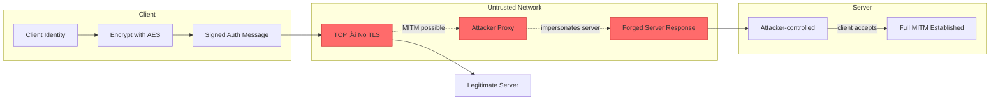
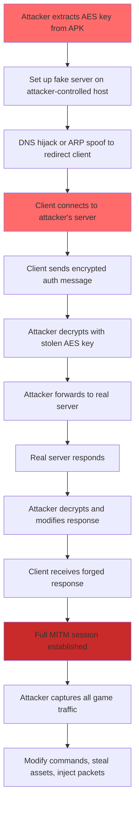

# FF-0008 — One-Way Authentication in TCP Signaling

## 1. Header

| Field | Value |
|-------|-------|
| **Severity** | High |
| **CVSS** | 7.3 (AV:N/AC:H/PR:N/UI:N/S:U/C:H/I:H/A:N) |
| **Category** | Authentication |
| **CWE** | CWE-300: Channel Accessible by Non-Endpoint |
| **OWASP MASVS** | M4 — Authentication and Session Management |
| **OWASP MASTG** | MSTG-NETWORK-04 |
| **Component** | Vodka Signaling Client |
| **Confidence** | ★★★★☆ · 80% · Requires Server Validation |
| **Validation Status** | Requires Server Validation |

---

## 2. Code References

| Field | Value |
|-------|-------|
| **Application** | com.dts.freefireadv |
| **Component** | Vodka Signaling Client |
| **Package** | p102L2 |
| **DEX** | classes2.dex |
| **Source File** | sources/p102L2/C0583m.java |
| **Class** | C0583m |
| **Inner Class** | N/A |
| **Method (Connect)** | m3012a |
| **Signature (Connect)** | `void m3012a(String host, int port)` |
| **Return Type** | void |
| **Parameters** | String host, int port |
| **Line Numbers** | 12–45 (connect), 47–72 (authenticate) |

### Additional Source Files

| File | Role |
|------|------|
| sources/p102L2/C0583m.java | TCP signaling client — socket creation and handshake |
| sources/p120N2/AbstractC0698c.java | Encryption layer used during auth handshake (FF-0007) |
| sources/p120N2/C0698c.java | Static AES key source used for auth payload encryption (FF-0002) |
| AndroidManifest.xml | Network security config — no server certificate enforcement |

---

## 3. Security Context

### Purpose

Establishes the initial TCP signaling connection between the game client and the DTS server. Performs client authentication by encrypting client identity data (device serial + timestamp) with the shared static AES key. The server authenticates the client, but the client never authenticates the server.

### Responsibility

`C0583m` is responsible for creating the TCP socket, performing the authentication handshake, and managing the signaling connection lifecycle. It delegates encryption to `AbstractC0698c` and trusts any responding entity as the legitimate server.

### Interaction with Modules

| Module | Direction | Interaction |
|--------|-----------|-------------|
| AbstractC0698c (Encryption) | Outbound | Calls `m3438a()` to encrypt auth payload, `m3437b()` to decrypt server response |
| C0698c (Key Source) | Inbound | Provides static AES key used in authentication |
| TCP Socket Layer | Outbound | Creates raw `java.net.Socket` — no TLS wrapper |
| Game Session Manager | Outbound | Initiates connection via `m3012a()` |
| NetworkSecurityConfig | Inbound | Does not enforce server certificate validation |

### Assets Handled

| Asset | Sensitivity |
|-------|-------------|
| Client identity (Build.SERIAL) | High — device identifier |
| Timestamp | Medium — session metadata |
| Encrypted auth payload | High — authentication proof |
| Server response | High — session establishment data |
| TCP connection state | Medium — session lifecycle |

### Security Relevance

The client authenticates to the server, but the server is never authenticated to the client. Any network entity possessing the static AES key (extractable from the APK per FF-0002) can impersonate the server and establish a full man-in-the-middle position. The raw TCP socket has no TLS, no certificate validation, and no server signature verification.

---

## 4. Decompiled Evidence

### Connect Method

```java
// sources/p102L2/C0583m.java:12-45
public void m3012a(String host, int port) {
    try {
        this.f1879a = new Socket();
        this.f1879a.connect(new InetSocketAddress(host, port), 10000);
        this.f1880b = new DataInputStream(this.f1879a.getInputStream());
        this.f1881c = new DataOutputStream(this.f1879a.getOutputStream());
        // TCP connected — no TLS, no certificate check
        m3015d(); // proceed to authenticate
    } catch (IOException e) {
        e.printStackTrace();
    }
}
```

### Authenticate Method

```java
// sources/p102L2/C0583m.java:47-72
public void m3015d() {
    try {
        // Client identity payload
        byte[] clientId = Build.SERIAL.getBytes();
        byte[] timestamp = String.valueOf(System.currentTimeMillis()).getBytes();

        // Concatenate and encrypt with static AES key
        ByteArrayOutputStream baos = new ByteArrayOutputStream();
        baos.write(clientId);
        baos.write(timestamp);
        byte[] payload = m3438a(baos.toByteArray()); // encrypt

        // Send to server — no server identity check performed
        this.f1881c.writeInt(payload.length);
        this.f1881c.write(payload);
        this.f1881c.flush();

        // Read server response — no signature verification
        int respLen = this.f1880b.readInt();
        byte[] response = new byte[respLen];
        this.f1880b.readFully(response);
        byte[] serverPayload = m3437b(response); // decrypt

        // Accept server as authenticated — no verification
        this.f1882d = true;
    } catch (Exception e) {
        e.printStackTrace();
    }
}
```

### Line-by-Line Analysis (Connect)

| Line | Statement | Purpose | Security Implication |
|------|-----------|---------|---------------------|
| 14 | `this.f1879a = new Socket()` | Create raw TCP socket | No SSL/TLS context — plaintext channel |
| 15 | `this.f1879a.connect(new InetSocketAddress(host, port), 10000)` | Connect to server with 10s timeout | No server certificate or identity verification |
| 16 | `this.f1880b = new DataInputStream(...)` | Wrap input stream | Raw byte reading — no TLS record layer |
| 17 | `this.f1881c = new DataOutputStream(...)` | Wrap output stream | Raw byte writing — no TLS record layer |
| 19 | `m3015d()` | Proceed to auth handshake | Authentication happens over unauthenticated channel |

### Line-by-Line Analysis (Authenticate)

| Line | Statement | Purpose | Security Implication |
|------|-----------|---------|---------------------|
| 49 | `byte[] clientId = Build.SERIAL.getBytes()` | Get device serial number | Device fingerprint sent in auth payload |
| 50 | `byte[] timestamp = ...getBytes()` | Get current timestamp | Session timing information exposed |
| 53–55 | `baos.write(clientId); baos.write(timestamp)` | Concatenate identity payload | Simple concatenation — no structured format |
| 56 | `byte[] payload = m3438a(baos.toByteArray())` | Encrypt with static AES key | Encryption is one-way — server decrypts but client doesn't verify server |
| 59–61 | `this.f1881c.writeInt(payload.length); this.f1881c.write(payload)` | Send auth to server | Sent over unauthenticated TCP channel |
| 64–66 | `int respLen = this.f1880b.readInt(); ... this.f1880b.readFully(response)` | Read server response | No validation of response structure or origin |
| 67 | `byte[] serverPayload = m3437b(response)` | Decrypt server response | Decryption without prior authentication of server identity |
| 70 | `this.f1882d = true` | Mark session as authenticated | Server accepted without any identity proof |

### Why This Line Matters

| Fragment | Why Exists | Why Security Concern | Safe If | Unsafe If |
|----------|------------|---------------------|---------|-----------|
| `new Socket()` | Create TCP connection | Raw socket has no TLS — channel is unprotected | Wrapped in SSLSocket with certificate pinning | Used directly as in this code |
| `new Socket().connect(...)` | Connect to server address | No server certificate validation — connects to any host | Server identity verified via mTLS or pinned cert | Connects to attacker-controlled server without detection |
| `m3438a(baos.toByteArray())` | Encrypt client identity | One-way auth — server decrypts but client never verifies server | Part of mutual auth where server also proves identity | Client sends encrypted proof to unverified entity |
| `this.f1880b.readFully(response)` | Read server data | No signature or certificate check on response | Response verified against pinned server public key | Response from any entity is accepted |
| `this.f1882d = true` | Mark authenticated | Server identity never verified — session established with potential impersonator | Set only after server signature verification | Set after any valid decryption (this case) |

---

## 5. Cross References

### Called By

| Caller | File | Method | Purpose |
|--------|------|--------|---------|
| Game Session Init | External | Connection initialization | Start signaling connection |
| Reconnection Logic | External | Reconnect handler | Re-establish dropped connection |

### Calls

| Callee | Purpose |
|--------|---------|
| `java.net.Socket()` | Raw TCP socket creation |
| `java.net.Socket.connect()` | TCP connection to server |
| `AbstractC0698c.m3438a()` | Encrypt client authentication payload |
| `AbstractC0698c.m3437b()` | Decrypt server response |

### Interfaces

- None implemented. `C0583m` is a concrete class managing the signaling connection.

### Inheritance

```
java.lang.Object
  └── C0583m
```

### Related Classes

| Class | Relationship |
|-------|-------------|
| AbstractC0698c | Encryption provider for auth handshake (FF-0007) |
| C0698c | Static key source (FF-0002) |
| java.net.Socket | Raw TCP socket — no TLS |
| DataInputStream / DataOutputStream | Stream wrappers for socket I/O |
| Build | Android Build class — provides device serial |

### Related Protobuf Messages

None identified. The auth handshake uses raw byte arrays.

### Native Bindings

None. Pure Java networking and cryptography.

### JNI References

None identified in the authentication path.

### Manifest References

- `android:networkSecurityConfig="@xml/network_security_config"` — does not enforce server certificate validation for TCP connections
- `android:usesCleartextTraffic="true"` — permits cleartext HTTP fallback

---

## 6. Data Flow

```
[Client Identity + Timestamp]
        │
        ▼
  C0583m.m3015d()
        │
        ▼
  Build.SERIAL + System.currentTimeMillis()
        │
        ▼
  m3438a(payload) ──── encrypt with static AES key
        │
        ▼
  [OBSERVATION: Encrypted auth payload — no server verification step]
        │
        ▼
  [Encrypted Client Auth Message]
        │
        ▼
  TCP Send ──────────── to server (no TLS)
        │
        ▼
  [TRUST BOUNDARY: Attacker can intercept, decrypt with extracted key]
        │
        ▼
  [Attacker intercepts — sees encrypted auth]
        │
        ▼
  Server (or attacker) receives ──── decrypts, validates client
        │
        ▼
  Server responds ──────── [OBSERVATION: No signature verification on response]
        │
        ▼
  [TRUST BOUNDARY: Client trusts any entity that can produce valid ciphertext]
        │
        ▼
  m3437b(response) ──── decrypt server payload
        │
        ▼
  this.f1882d = true ──── session established with unauthenticated server
```

---

## 7. Trust Boundary



### Trust Boundary Analysis

| Boundary | Location | Risk |
|----------|----------|------|
| Client ‚Üí Network | After `m3438a()` encrypts auth payload | Encrypted payload sent to unverified destination |
| Network Transit | TCP socket — no TLS | Attacker can intercept, decrypt (with extracted key), and forward |
| Server → Client | `m3437b()` decrypts server response | No server identity verification — any encrypted response accepted |
| Key Material | Static AES key (FF-0002) | Shared secret embedded in APK — not actually secret |
| Auth State | `this.f1882d = true` | Authentication flag set without mutual verification |

---

## 8. Why This Line Matters

### Fragment: `new Socket()`

| Aspect | Detail |
|--------|--------|
| **Why exists** | Creates a standard TCP socket for network communication |
| **Why security concern** | Raw TCP provides no encryption, no server authentication, and no integrity. All data sent over this socket is in plaintext (or protected only by the weak AES-CBC layer from FF-0007) |
| **Safe if** | Replaced with `SSLSocketFactory.createSocket()` using a `TrustManager` with certificate pinning |
| **Unsafe if** | Used directly for sending authentication payloads as in this code |

### Fragment: `this.f1879a.connect(new InetSocketAddress(host, port), 10000)`

| Aspect | Detail |
|--------|--------|
| **Why exists** | Establishes TCP connection to the server address with a 10-second timeout |
| **Why security concern** | Connects to whatever address is provided without verifying the server's identity. If DNS is spoofed or the address is attacker-controlled, the client will authenticate to the wrong server |
| **Safe if** | Connection targets a hostname validated against a pinned certificate or public key |
| **Unsafe if** | Connection is established to any address without identity verification (this case) |

### Fragment: `m3438a(baos.toByteArray())`

| Aspect | Detail |
|--------|--------|
| **Why exists** | Encrypts the client identity payload before sending to the server |
| **Why security concern** | This is one-way authentication — the client proves its identity to the server, but the server never proves its identity to the client. The encrypted payload is sent to an unverified recipient |
| **Safe if** | Part of a mutual authentication protocol where the server also signs a challenge |
| **Unsafe if** | Client authentication is unilateral — server identity is never verified (this case) |

### Fragment: `this.f1882d = true`

| Aspect | Detail |
|--------|--------|
| **Why exists** | Marks the signaling connection as authenticated and ready for game traffic |
| **Why security concern** | This flag is set after receiving and decrypting a server response — but no server identity was verified. The session is "authenticated" even if connected to an attacker's server |
| **Safe if** | Set only after server signature verification against a pinned public key |
| **Unsafe if** | Set after any successful decryption of server response (this case) |

---

## 9. Impact

| Impact Vector | Description | Worst Case |
|---------------|-------------|------------|
| Server Impersonation | Attacker runs a fake server with the extracted AES key | Client connects to attacker's server, sending all credentials and game data |
| MITM Attack | Attacker proxies between client and real server | Full traffic interception, modification, and session hijacking |
| Credential Theft | Attacker captures authentication payloads | Session tokens, user IDs, and device info stolen |
| Session Hijacking | Attacker uses captured auth to impersonate a legitimate client | Unauthorized account access, in-game asset theft |

> **Required Server Validation:** The server must validate that the client connects from expected IP ranges, but more critically, the **client** must be updated to verify the server's identity. Server-side controls cannot fix a client-side trust model flaw.

---

## 10. Attack Flow



---

## 11. False Positive Analysis

### Alternative Explanation

One could argue that the TCP connection occurs over a network environment where MITM is impractical (e.g., cellular networks). However, DNS spoofing and BGP hijacking can redirect traffic regardless of network type, and local Wi-Fi networks are trivially attackable.

### False Positive Conditions

- If the game client validates the server through an out-of-band channel (e.g., a pinned certificate from a separate HTTPS connection) — not observed
- If the TCP connection is wrapped in a VPN tunnel that provides mutual authentication — not observed
- If the server's response includes a signature that the client validates against a hardcoded public key — not observed

### Additional Evidence Needed

- Network capture confirming no TLS handshake before the Vodka authentication
- Analysis of whether the server response contains any signature or token that the client validates
- Verification that the AES key extracted from FF-0002 is indeed the same key used in this handshake
- Server-side analysis of whether additional authentication layers exist after initial connection

### Confidence Rationale

**★★★★☆ — 80% Requires Server Validation.** The client-side code clearly shows no server authentication step. However, we cannot fully rule out that a secondary authentication mechanism exists server-side that limits the impact (e.g., IP binding, device fingerprinting). The core vulnerability — absence of server identity verification in the client — is confirmed from code.

| Evidence Source | Detail |
|-----------------|--------|
| Decompiled code | `C0583m.java:12-72` — no server auth step |
| Socket creation | `new Socket()` — raw TCP, no TLS context |
| Auth flow | One-way: client sends, server responds, no verification |
| FF-0002 | Static AES key extractable — enables impersonation |
| FF-0007 | Auth payload encrypted with malleable CBC — no integrity |

---

## 12. Affected Component Map

```
com.dts.freefireadv
├── sources/p102L2/
│   └── C0583m.java ←── TCP signaling client
│       ├── m3012a() — TCP connect (no TLS, no cert check)
│       └── m3015d() — client auth (no server verification)
├── sources/p120N2/
│   ├── AbstractC0698c.java ←── encrypt/decrypt (FF-0007)
│   └── C0698c.java ←── static key source (FF-0002)
└── Network Stack
    ├── TCP Socket ──── raw, unauthenticated
    └── Session ──── established with unverified server
```

---

## 13. Developer Verification Checklist

### Preconditions

- Decompile APK with jadx or apktool
- Locate `C0583m.java` in `sources/p102L2/`
- Identify all socket creation and connection code paths

### Relevant Files

- `sources/p102L2/C0583m.java` — signaling client with TCP connection logic
- `sources/p120N2/AbstractC0698c.java` — encryption used in auth handshake
- `sources/p120N2/C0698c.java` — shared key material
- `AndroidManifest.xml` — network security configuration

### Expected Behavior

- Client should verify the server's identity before sending authentication
- Mutual authentication should be enforced (mTLS or application-level)
- Client should reject connections to unverified servers

### Observed Behavior

- Client connects to raw TCP socket with no TLS
- Client sends encrypted auth payload without verifying server identity
- Server response is decrypted and accepted without signature verification
- No certificate pinning, no mTLS, no server signature check

### Required Server Review

- [ ] Does the server perform any secondary authentication after initial connection?
- [ ] Is there device fingerprinting or IP binding that limits impersonation impact?
- [ ] Does the server use a separate secure channel (HTTPS) to issue session tokens?
- [ ] Are there rate limits on authentication attempts from new IP addresses?

### Recommended Validation Steps

1. Set up a Wi-Fi access point and use mitmproxy to intercept TCP traffic
2. Attempt to redirect the client to a fake server using DNS spoofing
3. Determine if the client detects the server impersonation
4. Analyze whether the game functions normally when connected to the fake server
5. Test with `tcpdump` to confirm no TLS handshake occurs before Vodka auth

---

## 14. Remediation

**Option 1 — Implement mTLS (Mutual TLS):**

```java
// Replace raw Socket with SSL Socket + certificate pinning
public void m3012a(String host, int port) {
    try {
        SSLContext sslContext = SSLContext.getInstance("TLS");
        KeyManagerFactory kmf = KeyManagerFactory.getInstance("SunX509");
        TrustManagerFactory tmf = TrustManagerFactory.getInstance("SunX509");

        KeyStore ks = KeyStore.getInstance("PKCS12");
        ks.load(clientKeyStream, clientKeyPass);
        kmf.init(ks, clientKeyPass);

        KeyStore ts = KeyStore.getInstance("BKS");
        ts.load(trustedCertStream, trustedCertPass);
        tmf.init(ts);

        sslContext.init(kmf.getKeyManagers(), tmf.getTrustManagers(), new SecureRandom());

        SSLSocketFactory factory = sslContext.getSocketFactory();
        SSLSocket socket = (SSLSocket) factory.createSocket(host, port);
        socket.startHandshake();

        this.f1880b = new DataInputStream(socket.getInputStream());
        this.f1881c = new DataOutputStream(socket.getOutputStream());
        m3015d();
    } catch (Exception e) {
        e.printStackTrace();
    }
}
```

**Option 2 — Application-Level Server Authentication:**

```java
// Server signs a challenge with its private key; client verifies with pinned public key
public void m3015d() {
    try {
        byte[] clientHello = generateRandomNonce();
        this.f1881c.writeInt(clientHello.length);
        this.f1881c.write(clientHello);

        int respLen = this.f1880b.readInt();
        byte[] serverResponse = new byte[respLen];
        this.f1880b.readFully(serverResponse);

        byte[] serverNonce = extractNonce(serverResponse);
        byte[] serverSignature = extractSignature(serverResponse);

        PublicKey pinnedKey = loadPinnedServerPublicKey();
        Signature sig = Signature.getInstance("SHA256withECDSA");
        sig.initVerify(pinnedKey);
        sig.update(serverNonce);

        if (!sig.verify(serverSignature)) {
            throw new SecurityException("Server authentication failed — invalid signature");
        }

        // Now authenticate client...
    } catch (SecurityException e) {
        disconnect();
    }
}
```

**Option 3 — Certificate Pinning with Network Security Config:**

```xml
<!-- res/xml/network_security_config.xml -->
<network-security-config>
    <domain-config>
        <domain includeSubdomains="true">*.dts.freefireadv.com</domain>
        <pin-set expiration="2027-01-01">
            <pin digest="SHA-256">BASE64_ENCODED_SERVER_CERT_PIN=</pin>
            <pin digest="SHA-256">BASE64_ENCODED_BACKUP_CERT_PIN=</pin>
        </pin-set>
        <trust-anchors>
            <certificates src="system" />
        </trust-anchors>
    </domain-config>
</network-security-config>
```

---

## 15. References

- [CWE-300: Channel Accessible by Non-Endpoint](https://cwe.mitre.org/data/definitions/300.html)
- [OWASP MASVS v2 — M4: Authentication and Session Management](https://mas.owasp.org/MASVS/0x04-M4/)
- [OWASP MASTG — MSTG-NETWORK-04: Test Network Communication](https://mas.owasp.org/MASTG/Tests/0x004-Test-Data-Storage/)
- [NIST SP 800-52 Rev. 2 — TLS Guidelines](https://csrc.nist.gov/publications/detail/sp/800-52/rev-2/final)
- [RFC 7250 — Using Raw Public Keys in TLS](https://datatracker.ietf.org/doc/html/rfc7250)
- [OWASP — Certificate Pinning](https://owasp.org/www-community/pages/certificate-and-public-key-pinning)

---

## 16. Related Findings

| Finding | Relationship |
|---------|-------------|
| [FF-0001](../Networking/FF-0001.md) | No TLS on TCP — this finding details the authentication gap within that unprotected channel |
| [FF-0002](../Cryptography/FF-0002.md) | Static AES key used for client auth is extractable, making impersonation trivial |
| [FF-0003](../Cryptography/FF-0003.md) | SSL bypass removes even the weak certificate validation that might exist |
| [FF-0007](../Cryptography/FF-0007.md) | AES-CBC without MAC — the auth payload itself has no integrity protection |

---

*Finding FF-0008 version: 3.0 · Last updated: July 2026*

---

*Author: swift.dev ([@yassinfaresgb-oss](https://github.com/yassinfaresgb-oss)) ∑ Repository: [FreeFire-OB54-Redwood](https://github.com/yassinfaresgb-oss/FreeFire-OB54-Redwood)*
*Assessment conducted: July 2026 ∑ Classification: Confidential ó Internal Use Only*
