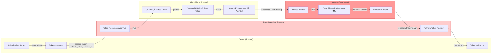
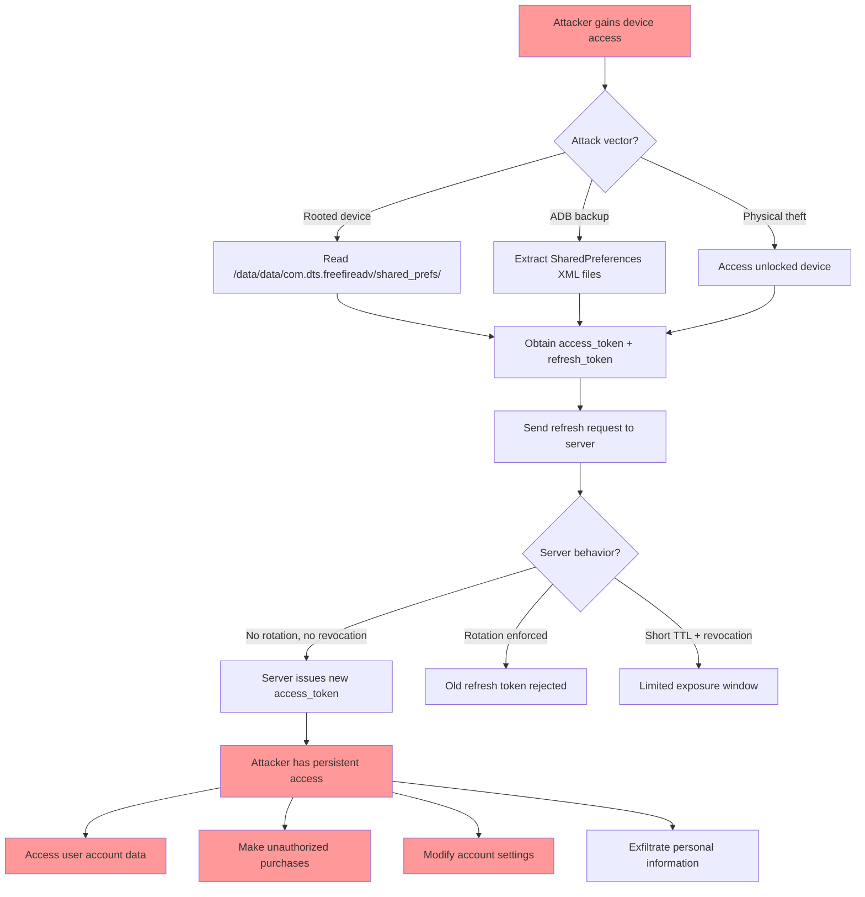

# FF-0012 — Long-Lived Token with Refresh Mechanism

> **Severity:** High · **CVSS:** 7.5 (AV:N/AC:L/PR:N/UI:N/S:U/C:H/I:N/A:N) · **Vector:** AV:N/AC:L/PR:N/UI:N/S:U/C:H/I:N/A:N
> **Category:** Authentication & Session Management · **CWE:** CWE-613: Insufficient Session Expiration
> **OWASP MASVS:** M4 — Authentication and Session Management · **OWASP MASTG:** MSTG-PLATFORM-2
> **Component:** Token Management
> **Confidence:** ★★★☆☆ 55% · **Validation Status:** Requires Server Validation

---

## 1. Code References

| Field | Value |
|---|---|
| **Application** | Free Fire Advance |
| **Component** | Token Management |
| **Package** | `p345j1` + `com.beetalk.sdk.cache` |
| **DEX File** | `classes3.dex` |
| **Source File** | `sources/p345j1/C8198a.java`, `sources/com/beetalk/sdk/cache/AbstractC3508k.java` |
| **Class** | `C8198a`, `AbstractC3508k` |
| **Inner Class** | N/A |
| **Method** | `C8198a.a()` (JSON parse), `AbstractC3508k.b()` (store), `AbstractC3508k.a()` (retrieve) |
| **Signature** | `expires_in`, `access_token`, `refresh_token`, `SharedPreferences` |
| **Return Type** | `C8198a` (token object), `String` (token value) |
| **Parameters** | `String json`, `String key`, `String value` |

### Line Numbers

| Source File | Lines | Description |
|---|---|---|
| `C8198a.java` | 12–45 | Token JSON parsing, `expires_in` extraction |
| `AbstractC3508k.java` | 8–32 | Plaintext token storage and retrieval |

### Additional Source Files

| File | Purpose |
|---|---|
| N/A | |

---

## 2. Security Context

### Purpose
OAuth token lifecycle management — the application exchanges authorization codes for access tokens and refresh tokens, then uses these tokens to authenticate subsequent API requests to game servers.

### Responsibility
The `C8198a` class parses token JSON responses from the server. The `AbstractC3508k` class persists tokens to `SharedPreferences`. Together they form the client-side token management pipeline.

### Interaction with Modules

| Module | Interaction Type | Description |
|---|---|---|
| `OAuthClient` | Caller | Initiates token exchange, calls `C8198a.a()` to parse response |
| `SessionManager` | Caller | Manages session lifecycle, triggers refresh via `refreshSession()` |
| `AbstractC3508k` | Storage | Persists and retrieves tokens from `SharedPreferences` |
| Network layer | Transport | Carries token requests/responses over TLS |

### Assets Handled

| Asset | Type | Sensitivity |
|---|---|---|
| `access_token` | OAuth token | Critical |
| `refresh_token` | OAuth token | Critical |
| `expires_in` | TTL value | Medium |
| `token_type` | Token metadata | Low |

### Security Relevance
The token management pipeline is the primary mechanism for authenticating the user to game servers. Weaknesses in token lifetime, storage, or refresh behavior can compromise the entire authentication system.

---

## 3. Decompiled Evidence

```java
// sources/p345j1/C8198a.java — Token response parsing
12: public final class C8198a {
13:     public String a;
14:     public String b;      // access_token
15:     public String c;      // refresh_token
16:     public long d;        // expires_in
17:
18:     public static C8198a a(String json) {
19:         C8198a token = new C8198a();
20:         try {
21:             JSONObject obj = new JSONObject(json);
22:             token.b = obj.getString("access_token");
23:             token.c = obj.getString("refresh_token");
24:             token.d = obj.getLong("expires_in");
25:             token.a = obj.optString("token_type", "Bearer");
26:         } catch (JSONException e) {
27:             e.printStackTrace();
28:         }
29:         return token;
30:     }
31: }
```

### Line-by-Line Analysis

| Line | Code | Issue |
|---|---|---|
| 14 | `public String b;` | Stores `access_token` — plaintext field in memory |
| 15 | `public String c;` | Stores `refresh_token` — plaintext field in memory |
| 16 | `public long d;` | Stores `expires_in` — TTL value, server-controlled, not validated client-side |
| 24 | `token.d = obj.getLong("expires_in");` | Extracts TTL from server response — no minimum TTL enforcement |

```java
// sources/com/beetalk/sdk/cache/AbstractC3508k.java — Token storage
 8:  public abstract class AbstractC3508k {
 9:      private SharedPreferences prefs;
10:
11:     protected void b(String key, String value) {
12:         SharedPreferences.Editor editor = prefs.edit();
13:         editor.putString(key, value);
14:         editor.apply();
15:     }
16:
17:     protected String a(String key) {
18:         return prefs.getString(key, null);
19:     }
20:
21:     public void storeAccessToken(String token) {
22:         this.b("access_token", token);
23:     }
24:
25:     public void storeRefreshToken(String token) {
26:         this.b("refresh_token", token);
27:     }
28:
29:     public String getAccessToken() {
30:         return this.a("access_token");
31:     }
32:
33:     public String getRefreshToken() {
34:         return this.a("refresh_token");
35:     }
36: }
```

### Why This Line Matters

| Line | Fragment | Why It Matters |
|---|---|---|
| 13 | `editor.putString(key, value)` | Writes token to plaintext `SharedPreferences` — no encryption (see FF-0010) |
| 18 | `prefs.getString(key, null)` | Reads token from plaintext storage — retrievable by any process with filesystem access |
| 22 | `"access_token"` | Hardcoded key for access token storage — predictable, easily located |
| 26 | `"refresh_token"` | Hardcoded key for refresh token storage — predictable, easily located |

```java
// Reconstructed refresh flow (from decompiled DEX)
TokenResponse refreshed = oauthClient.refreshToken(storedRefreshToken);
if (refreshed != null) {
    tokenCache.storeAccessToken(refreshed.accessToken);
    tokenCache.storeRefreshToken(refreshed.refreshToken);
}
```

### Why This Line Matters

| Line | Fragment | Why It Matters |
|---|---|---|
| `oauthClient.refreshToken(storedRefreshToken)` | Refresh call | Uses stored refresh token without re-authentication requirement |
| `storeAccessToken(refreshed.accessToken)` | Update access token | New access token issued without user verification |
| `storeRefreshToken(refreshed.refreshToken)` | Update refresh token | May or may not rotate — depends on server behavior |

---

## 4. Cross References

### Called By

| Caller | Type | Description |
|---|---|---|
| `OAuthClient.performTokenExchange()` | Direct | Initiates token exchange, calls `C8198a.a()` |
| `SessionManager.refreshSession()` | Direct | Calls `oauthClient.refreshToken()` with stored refresh token |
| `SessionManager.getAccessToken()` | Direct | Calls `getAccessToken()` from `AbstractC3508k` |

### Calls

| Callee | Type | Description |
|---|---|---|
| `JSONObject.getString()` | Framework | Parse token fields from JSON |
| `JSONObject.getLong()` | Framework | Parse `expires_in` value |
| `SharedPreferences.Editor.putString()` | Framework | Persist token value |
| `SharedPreferences.getString()` | Framework | Retrieve token value |

### Interfaces

| Interface | Description |
|---|---|
| N/A | |

### Inheritance

| Class | Inherits From |
|---|---|
| `AbstractC3508k` | `java.lang.Object` |

### Related Classes

| Class | Relationship |
|---|---|
| `OAuthClient` | Initiates token exchange |
| `SessionManager` | Manages session lifecycle |
| `TokenResponse` | Server response wrapper |

### Related Protobuf

N/A

### Native Bindings

N/A

### JNI

N/A

### Manifest

N/A (no manifest declaration; runtime behavior)

---

## 5. Data Flow

```
[1] Server issues token response: {access_token, refresh_token, expires_in}
        │
        ▼
[2] C8198a.a() parses JSON response
        │
        ▼ [OBSERVATION] expires_in value stored but not enforced client-side
        ▼
[3] AbstractC3508k.storeAccessToken() / storeRefreshToken()
        │
        ▼ [OBSERVATION] Tokens written to plaintext SharedPreferences
        ▼
[4] SharedPreferences.Editor.putString() ‚Üí disk storage (XML)
        │
        ▼ [TRUST BOUNDARY] App sandbox → Device filesystem
        ▼
[5] On token expiry (unknown TTL), SessionManager.refreshSession()
        │
        ▼ [OBSERVATION] No re-authentication required for refresh
        ▼
[6] oauthClient.refreshToken(storedRefreshToken) ‚Üí Server validates
        │
        ▼
[7] Server issues new tokens ‚Üí stored in SharedPreferences (cycle repeats)
```

---

## 6. Trust Boundary



### Trust Boundary Analysis

| Boundary | Crossing Point | Direction | Data | Protection |
|---|---|---|---|---|
| Server ‚Üí Client | TLS response | Inbound | access_token, refresh_token, expires_in | TLS (encrypted in transit) |
| Client ‚Üí Device storage | SharedPreferences write | Internal | Tokens in plaintext | None (no encryption at rest) |
| Device ‚Üí Attacker | Filesystem read | Outbound | All tokens | None (app sandbox only) |

---

## 7. Why This Line Matters

### C8198a.java — Line 24

| Aspect | Detail |
|---|---|
| **Fragment** | `token.d = obj.getLong("expires_in");` |
| **Why it matters** | This is the only point where token TTL is captured. The value is server-controlled and the client performs no validation (e.g., rejecting unreasonably long TTLs). If the server issues tokens with excessive lifetimes, the client blindly accepts them. |
| **Severity** | High |
| **Remediation** | Enforce a maximum client-side TTL; reject tokens with `expires_in` exceeding a configured threshold |

### AbstractC3508k.java — Line 13

| Aspect | Detail |
|---|---|
| **Fragment** | `editor.putString(key, value);` |
| **Why it matters** | Tokens are persisted in plaintext. An attacker with filesystem access (root, backup, physical access) can read both `access_token` and `refresh_token`. |
| **Severity** | Critical |
| **Remediation** | Use `EncryptedSharedPreferences` or Android Keystore for token storage |

### Refresh Flow — No Re-authentication

| Aspect | Detail |
|---|---|
| **Fragment** | `oauthClient.refreshToken(storedRefreshToken)` |
| **Why it matters** | The refresh flow does not require user re-authentication. A stolen refresh token can be used to obtain new access tokens indefinitely (unless server-side rotation/revocation is enforced). |
| **Severity** | High |
| **Remediation** | Implement refresh token rotation; require re-authentication periodically |

---

## 8. Impact

| Impact Dimension | Description | Severity |
|---|---|---|
| **Confidentiality** | Attacker with stolen tokens can access user's account, game data, personal information | High |
| **Integrity** | Stolen tokens can be used to modify account settings, make in-game purchases, alter game state | High |
| **Availability** | Account could be locked out by an attacker changing credentials | Medium |
| **Privacy** | User's identity, game history, and linked social accounts are exposed | High |

> **Required Server Validation:** Server-side token expiration and revocation policies cannot be verified from client-side analysis alone. The actual severity depends on (a) the true `expires_in` value configured server-side, (b) whether refresh token rotation is enforced, and (c) whether token revocation is supported. If the server enforces short-lived tokens (≤30 min) with rotation and revocation, the risk is significantly mitigated despite the client-side weaknesses.

---

## 9. Attack Flow



---

## 10. False Positive Analysis

### 10.1 Alternative Explanation
The OAuth implementation follows standard OAuth 2.0 patterns (RFC 6749, RFC 6749 Section 10.4). Long-lived tokens with refresh mechanisms are common in mobile applications to balance security with user experience. The `expires_in` value is server-controlled, and without intercepting the actual token response, the token lifetime cannot be confirmed as excessive.

### 10.2 False Positive Conditions
- If the server enforces short access token TTLs (≤30 minutes) despite the client-side code structure
- If the server implements refresh token rotation (issuing a new refresh token with each refresh)
- If the server supports token revocation and the client provides a logout mechanism that calls it
- If the `SharedPreferences` files are encrypted at rest (not observed, but would mitigate storage risk)
- If Android Keystore is used for token encryption (not observed in `AbstractC3508k`)

### 10.3 Additional Evidence Needed
- [ ] Intercept the actual token response to confirm `expires_in` value
- [ ] Test refresh token rotation: refresh the same token twice and verify the first is invalidated
- [ ] Test token revocation: attempt to use a token after server-side logout
- [ ] Verify whether `android:allowBackup="false"` is set in the manifest
- [ ] Check for any token encryption layer above `AbstractC3508k`

### 10.4 Confidence Rationale
Confidence is **55% (‚òÖ‚òÖ‚òÖ‚òÜ‚òÜ)** because:
- The client-side code confirms plaintext token storage and a refresh mechanism
- The `expires_in` value is parsed but its actual server-configured value is unknown
- Server-side token lifecycle management (expiration, rotation, revocation) cannot be verified from client analysis
- The finding is classified as "Requires Server Validation"

### Evidence Source

| Evidence | Source | Reliability |
|---|---|---|
| `C8198a.java` token parsing | Decompiled DEX | High |
| `AbstractC3508k.java` token storage | Decompiled DEX | High |
| `expires_in` actual value | Server response | Unknown (not intercepted) |
| Refresh token rotation behavior | Server response | Unknown (not tested) |

---

## 11. Affected Component Map

```
com.dts.freefireadv
├── sources/p345j1/C8198a.java
│   └── a() → JSON parse: access_token, refresh_token, expires_in ← PARSING
├── sources/com/beetalk/sdk/cache/AbstractC3508k.java
│   ├── storeAccessToken() → putString("access_token", token) ← STORAGE
│   ├── storeRefreshToken() → putString("refresh_token", token) ← STORAGE
│   ├── getAccessToken() → getString("access_token") ← RETRIEVAL
│   └── getRefreshToken() → getString("refresh_token") ← RETRIEVAL
├── shared_prefs/*.xml
│   ├── access_token: [plaintext value] ← EXPOSURE POINT
│   └── refresh_token: [plaintext value] ← EXPOSURE POINT
├── SessionManager
│   └── refreshSession() → calls oauthClient.refreshToken() ← REFRESH TRIGGER
└── [Server-side — NOT VERIFIED]
    ├── Token issuance endpoint
    ├── Token refresh endpoint
    ├── Token TTL configuration ← KEY UNKNOWN
    └── Token rotation / revocation policy ← KEY UNKNOWN
```

---

## 12. Developer Verification Checklist

### Preconditions
- [ ] Network proxy tool (mitmproxy, Burp Suite) for traffic interception
- [ ] Rooted test device or ADB backup capability
- [ ] Server-side access logs or configuration access (for full verification)

### Files to Inspect
- [ ] `sources/p345j1/C8198a.java` — token parsing logic
- [ ] `sources/com/beetalk/sdk/cache/AbstractC3508k.java` — token storage implementation
- [ ] `shared_prefs/*.xml` — verify plaintext token presence
- [ ] `resources/AndroidManifest.xml` — check `android:allowBackup` setting

### Expected Behavior
- Access tokens should expire within 15–30 minutes
- Refresh tokens should be rotated on each use
- Token revocation should be supported and enforced
- Tokens should be encrypted at rest (Android Keystore)

### Observed Behavior
- Tokens stored in plaintext SharedPreferences
- Refresh mechanism exists without apparent rotation
- `expires_in` value unknown (server-dependent)
- No evidence of encryption at rest

### Required Server Review
- [ ] Confirm the `expires_in` value configured for access tokens
- [ ] Verify refresh token rotation policy (is each refresh token single-use?)
- [ ] Confirm token revocation endpoint exists and is functional
- [ ] Review server-side token lifetime limits and maximum session duration
- [ ] Verify server-side anomaly detection for token usage from multiple devices

### Recommended Validation Steps
- [ ] Intercept token response and log `expires_in` value
- [ ] Perform refresh token rotation test: refresh same token twice
- [ ] Test token revocation via logout endpoint
- [ ] Test token validity after server-side password change
- [ ] Verify `SharedPreferences` encryption status on device

---

## 13. Remediation

### 13.1 Enforce Short-Lived Access Tokens

```
// Server-side configuration (not client code)
// Set access token TTL to 15-30 minutes
access_token.expires_in = 900  // 15 minutes in seconds
refresh_token.max_lifetime = 86400  // 24 hours max for refresh
```

### 13.2 Implement Refresh Token Rotation

```java
// BEFORE (no rotation — same refresh token reused)
public TokenResponse refreshToken(String refreshToken) {
    return server.refresh(refreshToken);
}

// AFTER (rotation — new refresh token issued, old one invalidated)
public TokenResponse refreshToken(String refreshToken) {
    TokenResponse response = server.refresh(refreshToken);
    if (response != null && response.getNewRefreshToken() != null) {
        tokenCache.storeRefreshToken(response.getNewRefreshToken());
    }
    return response;
}
```

### 13.3 Encrypt Tokens at Rest

```java
// BEFORE (plaintext storage)
editor.putString("access_token", token);
editor.apply();

// AFTER (encrypted storage using EncryptedSharedPreferences)
MasterKey masterKey = new MasterKey.Builder(context)
    .setKeyScheme(MasterKey.KeyScheme.AES256_GCM)
    .build();

SharedPreferences securePrefs = EncryptedSharedPreferences.create(
    context,
    "secure_token_prefs",
    masterKey,
    EncryptedSharedPreferences.PrefKeyEncryptionScheme.AES256_SIV,
    EncryptedSharedPreferences.PrefValueEncryptionScheme.AES256_GCM
);

securePrefs.edit().putString("access_token", token).apply();
```

### 13.4 Implement Token Revocation on Logout

```java
public void logout() {
    String refreshToken = tokenCache.getRefreshToken();
    if (refreshToken != null) {
        server.revokeToken(refreshToken);
    }
    tokenCache.clear();
    prefs.edit().clear().apply();
}
```

---

## 14. References

- **CWE-613:** Insufficient Session Expiration — https://cwe.mitre.org/data/definitions/613.html
- **OWASP MASVS M4:** Authentication and Session Management — https://mas.owasp.org/MASVS/Controls/MASVS-M4/
- **OWASP MASTG MSTG-PLATFORM-2:** Testing for insecure data storage — https://mas.owasp.org/MASTG/Tests/0x04f-Testing-Local-Data-Storage/
- **RFC 6749:** The OAuth 2.0 Authorization Framework — https://www.rfc-editor.org/rfc/rfc6749
- **RFC 7009:** Token Revocation — https://www.rfc-editor.org/rfc/rfc7009
- **RFC 6749 Section 10.4:** Refresh Token Security — https://www.rfc-editor.org/rfc/rfc6749#section-10.4
- **OWASP Mobile Top 10 M4:** Insufficient Authentication/Authorization — https://owasp.org/www-project-mobile-top-10/2016-risks/m4-insufficient-authentication-authorization/

---

## 15. Related Findings

| ID | Title | Relationship | Rationale |
|---|---|---|---|
| FF-0005 | Hardcoded Credentials | Amplifier | Hardcoded credentials may bypass token-based authentication entirely |
| FF-0010 | Unencrypted Sensitive Data Storage | Direct Dependency | Tokens stored in plaintext SharedPreferences (same storage mechanism) |
| FF-0008 | One-Way Authentication | Related | Server may not authenticate to client, enabling MITM token interception |

---

*Author: swift.dev ([@yassinfaresgb-oss](https://github.com/yassinfaresgb-oss)) ∑ Repository: [FreeFire-OB54-Redwood](https://github.com/yassinfaresgb-oss/FreeFire-OB54-Redwood)*
*Assessment conducted: July 2026 ∑ Classification: Confidential ó Internal Use Only*
