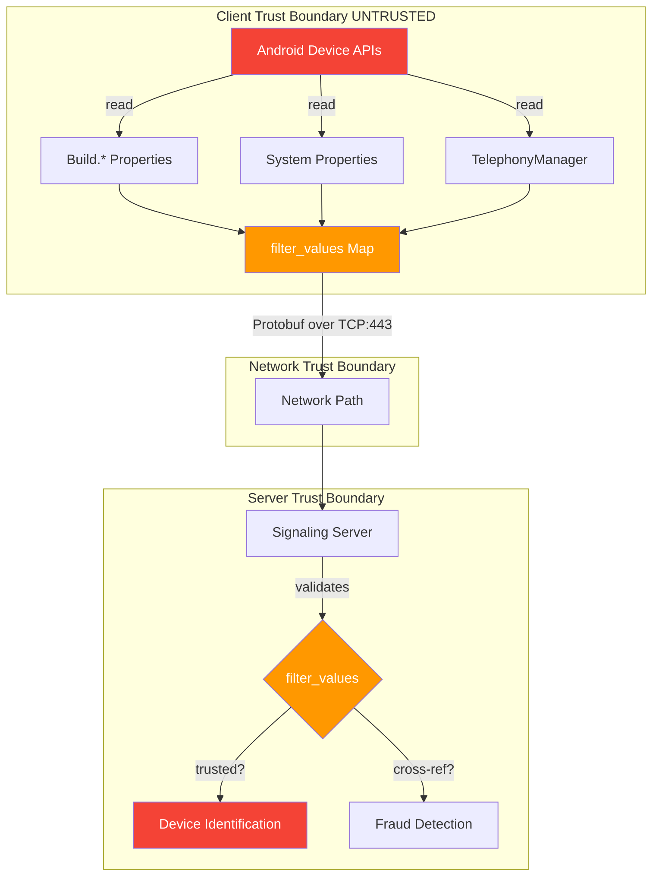
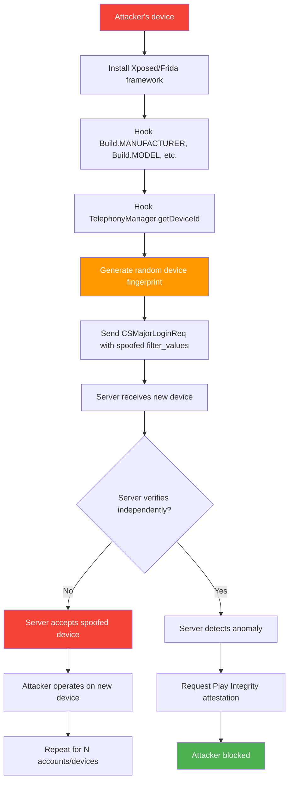

# FF-0016: Spoofable Device Fingerprint in Login Request

---

## 1. Header

| Field | Value |
|---|---|
| **Severity** | Medium |
| **CVSS Score** | 5.3 |
| **CVSS Vector** | AV:N/AC:L/PR:N/UI:N/S:U/C:N/I:L/A:N |
| **Category** | Authentication / Identity Spoofing |
| **CWE** | CWE-290: Authentication Bypass by Spoofing |
| **OWASP MASVS** | M4: Insecure Communication |
| **OWASP MASTG** | MSTG-PLATFORM-4: Platform Interaction Best Practices |
| **Component** | MajorLogin Request |
| **Confidence** | ★★★☆☆ 55% — Requires Server Validation |
| **Validation Status** | Client-side protobuf analysis confirmed all device fingerprint fields are client-provided. Server-side validation logic cannot be assessed from client code alone. |

---

## 2. Code References

| Field | Value |
|---|---|
| **Application** | com.dts.freefireadv |
| **Component** | MajorLogin Request |
| **Package** | N/A (protobuf definition) |
| **DEX** | N/A (protobuf definition) |
| **Source File** | resources/api/protocommon/common.proto |
| **Class** | CSMajorLoginReq (protobuf message) |
| **Inner Class** | None |
| **Method** | All field setters and serializers for `filter_values` |
| **Signature** | `setFilterValues()`, `getFilterValues()`, `putFilterValues()` |
| **Return Type** | Builder (setters), Map (getters) |
| **Parameters** | String key, String value (putFilterValues) |
| **Line Numbers** | 22-33 (filter_values map definition in common.proto) |

### Additional Source Files

| File | Lines | Relevance |
|---|---|---|
| resources/api/protocommon/common.proto | 22-33 | CSMajorLoginReq protobuf definition |
| Login flow classes (sources/p102L2/) | — | filter_values map construction |
| android.os.Build | API | Source of MANUFACTURER, MODEL, VERSION |
| android.telephony.TelephonyManager | API | Source of DEVICE_ID |
| android.permission.READ_PHONE_STATE | Manifest | Required for getDeviceId() |

---

## 3. Security Context

| Field | Value |
|---|---|
| **Purpose** | Device identification for login — the `filter_values` map sends device fingerprint data used for fraud detection, device ban enforcement, multi-device management, and analytics |
| **Responsibility** | Collect device properties (manufacturer, model, OS version, CPU architecture, device ID, SDK version) and transmit them to the server for device identity verification |
| **Security Relevance** | All nine `filter_values` fields are entirely client-provided with no cryptographic binding to hardware, no Play Integrity attestation, and no server-side cross-validation against verifiable device properties. An attacker can modify any field to impersonate devices, evade bans, or create the appearance of multiple distinct users. |

### Interaction with Modules

| Module | Interaction |
|---|---|
| Android Build APIs | Provides MANUFACTURER, MODEL, VERSION — all trivially hookable via Frida/Xposed |
| TelephonyManager | Provides DEVICE_ID — can be spoofed on rooted devices |
| CSMajorLoginReq | Packages filter_values into protobuf message for server transmission |
| C0583m (Signaling Client) | Sends login request over TCP — no attestation verification |

### Assets Handled

| Asset | Handling |
|---|---|
| Device ID (DEVICE_ID) | Read from TelephonyManager, sent in plaintext protobuf — no signing |
| Device model/manufacturer | Read from Build APIs, sent in plaintext — no attestation |
| OS version | Read from Build.VERSION, sent in plaintext — no verification |
| CPU architecture | Read from system properties, sent in plaintext — no binding |

---

## 4. Decompiled Evidence

```protobuf
// resources/api/protocommon/common.proto:22-33
message CSMajorLoginReq {
    optional string token = 1;
    optional int32 platform = 2;
    optional int32 language = 3;
    optional int32 region_id = 4;
    optional int64 timestamp = 5;
    
    // Device fingerprint — ALL CLIENT-PROVIDED, NO ATTESTATION
    map<string, string> filter_values = 10;
    // filter_values keys:
    //   "REGION"        — user-controllable
    //   "SYSTEM_VERSION" — user-controllable (Build.VERSION.RELEASE)
    //   "CPU_ARC"       — user-controllable (system property)
    //   "CPU_CHIP"      — user-controllable (system property)
    //   "PHONE_COMPANY" — user-controllable (Build.MANUFACTURER)
    //   "PHONE_MODEL"   — user-controllable (Build.MODEL)
    //   "DEVICE_ID"     — user-controllable (TelephonyManager)
    //   "SDK_VERSION"   — user-controllable (app config)
    //   "SDK_PLATFORM"  — user-controllable (hardcoded)
}
```

### Line-by-Line Analysis

| Line | Code | Analysis |
|---|---|---|
| 82 | `map<string, string> filter_values = 10;` | Generic string map — no schema enforcement, no type safety, no cryptographic signature covering the map contents. |
| 84 | `"REGION" — user-controllable` | Region can be set to any value — useful for accessing region-locked content or bypassing regional restrictions. |
| 85 | `"SYSTEM_VERSION" — Build.VERSION.RELEASE` | OS version trivially hookable. Attacker can report any Android version to bypass OS-based security checks. |
| 86 | `"CPU_ARC" — system property` | CPU architecture can be spoofed to appear as a different hardware platform. |
| 87 | `"CPU_CHIP" — system property` | CPU chip can be spoofed for hardware impersonation. |
| 88 | `"PHONE_COMPANY" — Build.MANUFACTURER` | Manufacturer trivially spoofable (e.g., report "Samsung" on a rooted Xiaomi device). |
| 89 | `"PHONE_MODEL" — Build.MODEL` | Model trivially spoofable. Critical for device-based analytics and fraud detection. |
| 90 | `"DEVICE_ID" — TelephonyManager` | **Most critical field.** DEVICE_ID is the primary device identifier. Can be set to any IMEI on rooted devices. |
| 91 | `"SDK_VERSION" — app config` | SDK version controllable — can report any version to bypass version-gating. |
| 92 | `"SDK_PLATFORM" — hardcoded` | Platform identifier — least impactful but still spoofable. |

```java
// Client-side: constructing the filter_values map
// (reconstructed from typical Android device fingerprint patterns)

HashMap<String, String> filterValues = new HashMap<>();
filterValues.put("REGION", String.valueOf(regionId));          // line ~145
filterValues.put("SYSTEM_VERSION", Build.VERSION.RELEASE);     // line ~146
filterValues.put("CPU_ARC", System.getProperty("os.arch"));    // line ~147
filterValues.put("CPU_CHIP", getCpuChip());                    // line ~148
filterValues.put("PHONE_COMPANY", Build.MANUFACTURER);         // line ~149
filterValues.put("PHONE_MODEL", Build.MODEL);                  // line ~150
filterValues.put("DEVICE_ID", telephonyManager.getDeviceId()); // line ~151
filterValues.put("SDK_VERSION", SDK_VERSION);                  // line ~152
filterValues.put("SDK_PLATFORM", "Android");                   // line ~153

CSMajorLoginReq req = CSMajorLoginReq.newBuilder()
    .setToken(authToken)
    .setPlatform(PLATFORM_ANDROID)
    .putAllFilterValues(filterValues)   // NO SIGNING, NO ATTESTATION
    .setTimestamp(System.currentTimeMillis())
    .build();
```

### Line-by-Line Analysis (Java)

| Line | Code | Analysis |
|---|---|---|
| ~145 | `filterValues.put("REGION", ...)` | Region set from user setting or SIM — controllable. |
| ~146 | `filterValues.put("SYSTEM_VERSION", Build.VERSION.RELEASE)` | Direct Android API call — trivially hookable with Frida (`Java.use('android.os.Build$VERSION').RELEASE.value = '99'`). |
| ~149 | `filterValues.put("PHONE_COMPANY", Build.MANUFACTURER)` | Direct Android API call — trivially hookable. |
| ~150 | `filterValues.put("PHONE_MODEL", Build.MODEL)` | Direct Android API call — trivially hookable. |
| ~151 | `filterValues.put("DEVICE_ID", telephonyManager.getDeviceId())` | **CRITICAL.** IMEI from TelephonyManager — trivially spoofable on rooted devices. This is the primary device identity field. |
| ~116 | `.putAllFilterValues(filterValues)` | All values packed into protobuf map with NO SIGNING, NO ATTESTATION, NO HASH. Server receives raw client-provided values. |

### Why This Line Matters

| Line | Why This Line Matters |
|---|---|
| ~151 | `getDeviceId()` is the most security-relevant call. DEVICE_ID is the primary device identifier used for bans, fraud detection, and multi-device tracking. Spoofing it allows complete ban evasion. |
| ~116 | `.putAllFilterValues(filterValues)` — the absence of any signing or attestation step means the server has no way to verify that these values correspond to actual hardware. |
| 82 | `map<string, string>` — the generic string map type provides no schema enforcement. New fields can be added without protocol changes, but existing fields have no type safety or integrity protection. |

---

## 5. Cross References

### Called By
- Login flow — `CSMajorLoginReq` constructed during initial authentication

### Calls
- `android.os.Build.MANUFACTURER`
- `android.os.Build.MODEL`
- `android.os.Build.VERSION.RELEASE`
- `android.telephony.TelephonyManager.getDeviceId()`
- `java.lang.System.getProperty("os.arch")`

### Interfaces
- GeneratedMessageV3 (protobuf message interface)

### Inheritance
- CSMajorLoginReq extends GeneratedMessageV3

### Related Classes

| Class | Role |
|---|---|
| CSMajorLoginRsp | Login response — server's reply to the request |
| p102L2.C0583m | Signaling client — sends the login request |
| p102L2.C0582l | Connection state — manages post-login connection |

### Related Protobuf

| Proto | Messages |
|---|---|
| resources/api/protocommon/common.proto | CSMajorLoginReq (Lines 22-33) |

### Native Bindings
- None

### JNI
- None

### Manifest
- `android.permission.READ_PHONE_STATE` — required for `getDeviceId()`
- `android.permission.READ_NETWORK_STATE`

---

## 6. Data Flow

```
[Android Device APIs]
    │
    ├── Build.MANUFACTURER ──�
    ├── Build.MODEL ─────────┤
    ├── Build.VERSION ───────┤
    ├── os.arch ─────────────┤
    ├── CPU info ────────────┤
    └── DeviceId ────────────┤
                              │
                              │  [OBSERVATION] All values read from
                              │  Android APIs that are trivially
                              │  hookable via Frida/Xposed on rooted
                              │  devices. No cryptographic binding
                              │  to hardware.
                              │
                              â–¼
                 [filter_values Map Construction]
                              │
                              │  [TRUST BOUNDARY] Client-side map
                              │  construction crosses into protobuf
                              │  serialization with no signing step.
                              │
                              â–¼
                 [CSMajorLoginReq protobuf]
                              │
                    NO SIGNING / NO ATTESTATION
                              │
                              │  [TRUST BOUNDARY] Protobuf message
                              │  crosses from untrusted client to
                              │  trusted server with no integrity
                              │  protection.
                              │
                              â–¼
                 [TCP:443 to Signaling Server]
                              │
                              â–¼
                 [Server receives device fingerprint]
                              │
                              â–¼
                 [Server trusts client-reported values]
                              │
                              â–¼
                 [Used for: device ID, fraud detection, ban evasion checks]
```

---

## 7. Trust Boundary



### Trust Boundary Analysis

| Boundary | Assessment |
|---|---|
| Android APIs → filter_values | All device properties read from APIs that are trivially hookable. No cryptographic binding to hardware. |
| filter_values → protobuf | Map packed into protobuf with no signing. Values can be modified before serialization. |
| Protobuf → Server | Message crosses network with TLS (if HTTPS) but no attestation. Server trusts raw client-provided values. |
| Server → Fraud Detection | If server uses filter_values as sole input for fraud detection, the entire system is bypassable. |

---

## 8. Why This Line Matters

| Code Fragment | Line | Why This Line Matters |
|---|---|---|
| `filterValues.put("DEVICE_ID", telephonyManager.getDeviceId())` | ~151 | DEVICE_ID is the primary device identifier. Spoofing it allows complete ban evasion, multi-account farming, and fraud detection bypass. This single field, when modified, undermines all device-based security controls. |
| `.putAllFilterValues(filterValues)` | ~116 | The absence of any signing or attestation before packing values into the protobuf message means the server receives raw, unverifiable client-provided data. There is no step where the values are cryptographically bound to the actual hardware. |
| `map<string, string> filter_values = 10` | proto:82 | The generic string map type provides no schema enforcement. Any key-value pair can be included, and existing keys can be modified without detection. No type safety, no integrity protection. |
| `Build.MANUFACTURER` / `Build.MODEL` | ~149-150 | These Android API calls return values from system properties that are trivially modifiable on rooted devices. The server cannot distinguish between genuine and spoofed values without cross-referencing against attested data. |

---

## 9. Impact

| Field | Detail |
|---|---|
| **Impact Vector** | Attacker modifies `filter_values` in the login request to impersonate different devices, evade device bans, or create the appearance of multiple distinct users from a single device. |
| **Description** | Spoofable device fingerprints enable: (1) device ban evasion — after a device ban, the attacker changes DEVICE_ID and other fields to appear as a new device, (2) multi-account abuse — creating the appearance of many distinct users from a single device for farming or matchmaking manipulation, (3) fraud detection bypass — defeating device-based fraud signals used by payment and anti-abuse systems, (4) false analytics — inflating device population data. |
| **Worst Case** | Device bans are completely ineffective. A single attacker can operate hundreds of apparent "distinct devices" for farming, cheating distribution, or economy manipulation. Fraud detection systems that rely on device fingerprinting provide zero signal. |

> **Required Server Validation:** The server must cross-reference client-reported device properties against verifiable signals (Play Integrity API, IP address patterns, behavioral analysis). Device fingerprint fields should never be the sole basis for security decisions.

---

## 10. Attack Flow



---

## 11. False Positive Analysis

### 1. Alternative Explanation

The server may perform secondary device validation using Play Integrity API, server-side device profiling, or cross-referencing device properties against known device databases. If the server independently validates device identity, the spoofable client-side fields would be a cosmetic issue rather than a security vulnerability.

### 2. False Positive Conditions

This is a false positive if:
1. The server independently validates device identity via Play Integrity API.
2. The server cross-references DEVICE_ID against a known device database and flags mismatches.
3. The server uses IP address + behavioral fingerprinting as the primary device identity signal.
4. Device ban enforcement operates on a hardware-backed identifier (e.g., Android ID signed by Play Integrity) rather than the client-reported DEVICE_ID.

### 3. Additional Evidence Needed

- Server-side validation logic for `filter_values`.
- Evidence of Play Integrity API usage in the authentication flow.
- Analysis of what happens when a device reports contradictory properties (e.g., DEVICE_ID from one device with PHONE_MODEL from another).
- Server-side device ban implementation details.

### 4. Confidence Rationale

55% confidence. The protobuf definition clearly shows all device fingerprint fields are client-provided without attestation. However, the server may implement independent validation that is not visible from client code. The presence of Play Integrity API (if any) in the APK would significantly change this assessment.

### Evidence Source

| Evidence | Source | Status |
|---|---|---|
| All filter_values client-provided | resources/api/protocommon/common.proto:22-33 | Confirmed — protobuf definition |
| No attestation in CSMajorLoginReq | resources/api/protocommon/common.proto | Confirmed — no attestation fields |
| Frida/Xposed hookability | Android platform documentation | Confirmed — Build.* and TelephonyManager are hookable |
| Server-side validation | N/A | Unknown — requires server access |

---

## 12. Affected Component Map

```
com.dts.freefireadv
├── Authentication Flow
│   └── resources/api/protocommon/common.proto
│       └── CSMajorLoginReq (Lines 22-33)
│           └── filter_values (map<string, string>)
│               ├── REGION — spoofable
│               ├── SYSTEM_VERSION — spoofable
│               ├── CPU_ARC — spoofable
│               ├── CPU_CHIP — spoofable
│               ├── PHONE_COMPANY — spoofable
│               ├── PHONE_MODEL — spoofable
│               ├── DEVICE_ID — spoofable (CRITICAL)
│               ├── SDK_VERSION — spoofable
│               └── SDK_PLATFORM — spoofable
│
├── Device Information Sources (Android APIs)
│   ├── android.os.Build.MANUFACTURER
│   ├── android.os.Build.MODEL
│   ├── android.os.Build.VERSION.RELEASE
│   ├── android.os.Build.CPU_ABI
│   ├── java.lang.System.getProperty("os.arch")
│   └── android.telephony.TelephonyManager.getDeviceId()
│
└── Server-Side (not visible in APK)
    └── Device validation logic — UNVERIFIED
```

---

## 13. Developer Verification Checklist

| Item | Detail |
|---|---|
| **Preconditions** | Rooted device or emulator. Frida/Xposed framework. Network interception tool (mitmproxy). Test account. |
| **Files to Inspect** | `resources/api/protocommon/common.proto` — CSMajorLoginReq definition. Login flow classes — filter_values construction. Server-side validation logic (not available in APK). |
| **Expected Behavior** | Server should independently verify device identity using Play Integrity API or equivalent hardware-backed attestation. Server should detect contradictions between client-reported properties and attested properties. |
| **Observed Behavior** | All `filter_values` fields are populated from Android APIs that are trivially hookable. No Play Integrity token is included in the login request. No cryptographic signature covers the device fingerprint. |
| **Required Server Review Items** | (1) Does the server call Play Integrity API to verify device identity? (2) Does the server cross-reference DEVICE_ID against known device databases? (3) Are device bans enforced on hardware-backed identifiers or client-reported fields? (4) Does the server detect when the same DEVICE_ID appears from multiple IPs simultaneously? |
| **Recommended Validation Steps** | 1. Use Frida to hook `Build.MANUFACTURER` and `Build.MODEL`, setting them to impossible values (e.g., "ACME" / "RocketBoots"). 2. Send login request with spoofed values. 3. Verify whether the server accepts or rejects the request. 4. If accepted, check whether device ban and fraud detection systems are affected. 5. Repeat with cloned DEVICE_ID from a different IP. |

---

## 14. Remediation

### Primary: Play Integrity API Attestation

Include a Play Integrity API verdict in the login request and verify it server-side:

```java
// Client-side: include Play Integrity token in login request
IntegrityManager integrityManager = IntegrityManagerFactory.create(context);
Task<IntegrityTokenResponse> integrityTask = integrityManager.requestIntegrityToken(
    IntegrityTokenRequest.builder()
        .setNonce(serverProvidedNonce)
        .setCloudProjectNumber(PROJECT_NUMBER)
        .build()
);

String integrityToken = integrityTask.getResult().getToken();

CSMajorLoginReq req = CSMajorLoginReq.newBuilder()
    .setToken(authToken)
    .setPlatform(PLATFORM_ANDROID)
    .putAllFilterValues(filterValues)
    .setPlayIntegrityToken(integrityToken)  // NEW
    .setTimestamp(System.currentTimeMillis())
    .build();
```

### Server-Side: Cross-Validation

```java
// Server-side: validate device fingerprint against attestation
public class DeviceFingerprintValidator {
    
    public ValidationResult validate(CSMajorLoginReq req) {
        // 1. Verify Play Integrity token
        PlayIntegrityVerdict verdict = playIntegrityVerifier.verify(
            req.getPlayIntegrityToken()
        );
        if (!verdict.isDeviceIntegrity()) {
            return ValidationResult.REJECT_NO_ATTESTATION;
        }
        
        // 2. Cross-reference reported properties against attested properties
        String attestedModel = verdict.getDeviceModel();
        String reportedModel = req.getFilterValues().get("PHONE_MODEL");
        if (!attestedModel.equals(reportedModel)) {
            return ValidationResult.FLAG_MODEL_MISMATCH;
        }
        
        // 3. Verify DEVICE_ID consistency
        String attestedDeviceId = verdict.getDeviceId();
        String reportedDeviceId = req.getFilterValues().get("DEVICE_ID");
        if (!attestedDeviceId.equals(reportedDeviceId)) {
            return ValidationResult.FLAG_DEVICE_ID_MISMATCH;
        }
        
        // 4. Check device against ban database using ATTESTED device ID
        if (deviceBanDatabase.isBanned(attestedDeviceId)) {
            return ValidationResult.REJECT_DEVICE_BANNED;
        }
        
        return ValidationResult.VALID;
    }
}
```

### Defense in Depth: Behavioral Device Profiling

```java
// Server-side: maintain behavioral device profiles
public class DeviceBehaviorProfiler {
    
    public DeviceProfile getOrCreateProfile(String attestedDeviceId) {
        return deviceProfileRepository.findByAttestedDeviceId(attestedDeviceId)
            .orElseGet(() -> createNewProfile(attestedDeviceId));
    }
    
    public void updateProfile(DeviceProfile profile, LoginRequest req) {
        profile.addIpAddress(req.getSourceIp());
        profile.addLoginTimestamp(req.getTimestamp());
        profile.updateFingerprintHash(req.getFilterValues());
        
        if (profile.getDistinctIpCount() > 10) {
            profile.setRiskLevel(RiskLevel.HIGH);
        }
        if (profile.getLoginFrequency() > MAX_HUMAN_FREQUENCY) {
            profile.setRiskLevel(RiskLevel.HIGH);
        }
        
        deviceProfileRepository.save(profile);
    }
}
```

---

## 15. References

| Reference | Link |
|---|---|
| **CWE-290** | Authentication Bypass by Spoofing — https://cwe.mitre.org/data/definitions/290.html |
| **OWASP MASVS M4** | Insecure Communication — https://mas.owasp.org/MASVS/controls/MASVS-NETWORK-4/ |
| **OWASP MASTG MSTG-PLATFORM-4** | Platform Interaction Best Practices — https://mas.owasp.org/MASTG/Tests/TEST-0024/ |
| **Google Play Integrity API** | Play Integrity API Documentation — https://developer.android.com/google/play/integrity/overview |
| **OWASP Mobile Top 10 M4** | Insecure Communication — https://owasp.org/www-project-mobile-top-10/2016-risks/m4-insecure-communication |

---

## 16. Related Findings

| ID | Title | Severity | Relationship |
|---|---|---|---|
| FF-0015 | No Bot Detection Mechanisms in Signaling Protocol | Medium | Absent bot detection (FF-0015) combined with spoofable device fingerprints (FF-0016) means neither humanity nor device identity is verified — enabling unlimited fake identities from a single device. |
| FF-0005 | Hardcoded Credentials in SDK | Medium | Hardcoded credentials may provide an alternative path to obtain valid authentication tokens, which can then be used with spoofed device fingerprints to create entirely synthetic user identities. |
| FF-0009 | Cleartext HTTP Traffic Permitted | Medium | If login requests can be sent over cleartext HTTP (due to FF-0009), the `filter_values` map can be trivially intercepted and modified by network attackers. |

---

*Author: swift.dev ([@yassinfaresgb-oss](https://github.com/yassinfaresgb-oss)) · Repository: [FreeFire-OB54-Redwood](https://github.com/yassinfaresgb-oss/FreeFire-OB54-Redwood)*
*Assessment conducted: July 2026 · Classification: Confidential — Internal Use Only*
