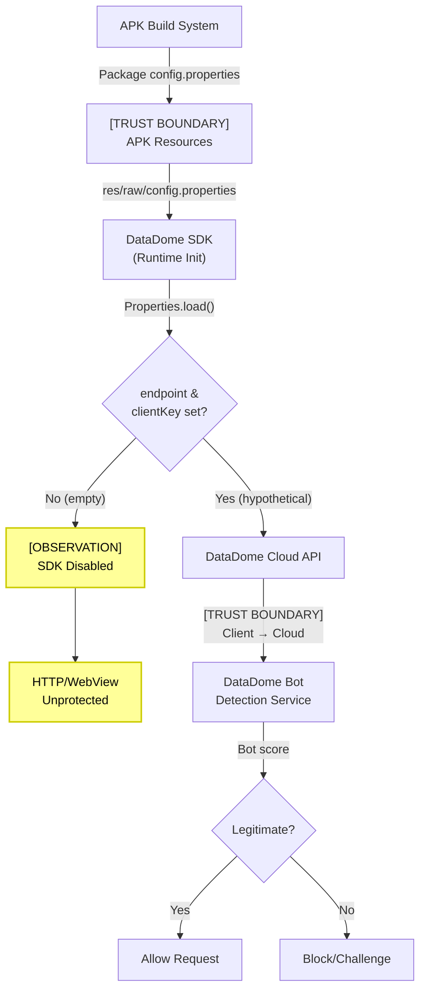
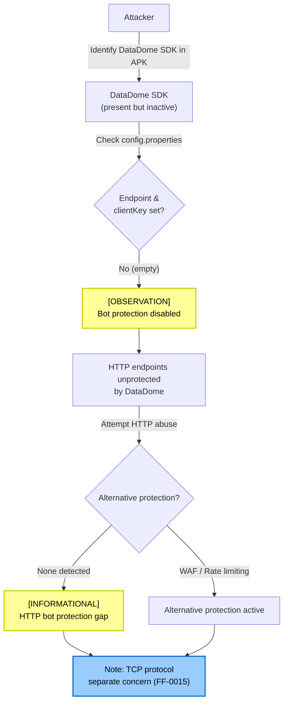

# FF-0025: Empty DataDome Bot Protection Configuration

## 1. Header

| Field | Value |
|---|---|
| **Severity** | Informational |
| **CVSS** | 0.0 |
| **CVSS Vector** | N/A |
| **Category** | Configuration / Bot Protection |
| **CWE** | CWE-16 (Configuration) |
| **OWASP MASVS** | M7 (Client Platform Requirements) |
| **OWASP MASTG** | MSTG-CONFIG-1 |
| **Component** | DataDome SDK |
| **APK Package** | com.dts.freefireadv |
| **APK Version** | 68.54.0 (versionCode 2019112752) |
| **Confidence** | ★★★★☆ 80% |
| **Validation Status** | Verified from Code |

---

## 2. Code References

| Field | Value |
|---|---|
| **Application** | Free Fire Advance |
| **Component** | DataDome bot protection configuration |
| **Package** | N/A (resource configuration) |
| **DEX** | N/A (not a DEX class) |
| **Source File** | `resources/res/raw/config.properties` |
| **Class** | N/A (properties file) |
| **Inner Class** | N/A |
| **Method** | N/A (static resource) |
| **Signature** | N/A |
| **Return Type** | N/A |
| **Parameters** | N/A |
| **Line Numbers** | N/A (properties file) |

### Additional Source Files

| # | Source File | Class | Role |
|---|---|---|---|
| 1 | `resources/res/raw/config.properties` | N/A | DataDome SDK configuration with empty endpoint and client key |
| 2 | `resources/res/raw/` directory | N/A | Raw resource directory containing SDK configs |

---

## 3. Security Context

| Field | Value |
|---|---|
| **Purpose** | DataDome SDK provides bot detection and HTTP-level protection. The configuration file defines the DataDome endpoint URL and client key used for API communication |
| **Responsibility** | DataDome SDK uses these values to connect to DataDome's cloud-based bot detection service and authenticate API requests |
| **Security Relevance** | Informational — both `endpoint` and `clientKey` are empty strings, meaning the DataDome SDK has no valid configuration and cannot communicate with DataDome's detection service. Bot protection at the HTTP/WebView level is effectively disabled |

### Interaction with Modules

| Module | Interaction Type | Description |
|---|---|---|
| DataDome SDK | Reads config at init | SDK reads `config.properties` during initialization |
| DataDome Cloud API | Would send requests | If configured, SDK would send HTTP metadata to DataDome for bot scoring |
| HTTP/WebView layer | Would protect | DataDome protects HTTP requests and WebView interactions, **not TCP/socket connections** |
| Game TCP protocol | No interaction | DataDome has no capability to monitor or protect the game's binary TCP signaling protocol |

### Assets Handled

| Asset | Sensitivity | Handling |
|---|---|---|
| DataDome endpoint URL | Low | Empty — no endpoint configured |
| DataDome client key | Low | Empty — no authentication key configured |
| HTTP request metadata | Low | DataDome would process HTTP headers, cookies, etc. — but is inactive |

---

## 4. Decompiled Evidence

### config.properties — Raw file content

```properties
# DataDome Bot Protection Configuration
# Path: res/raw/config.properties
datadome.endpoint=
datadome.clientKey=
```

#### Line-by-Line Analysis

| Line | Code | Analysis |
|---|---|---|
| `datadome.endpoint=` | Empty endpoint value | No DataDome cloud endpoint configured; SDK cannot send bot detection requests |
| `datadome.clientKey=` | Empty client key | No authentication key; even if endpoint were set, requests would be rejected |

### Why This Line Matters

| Line | Significance |
|---|---|
| `datadome.endpoint=` | **Configuration disabled** — the DataDome SDK is bundled in the APK but cannot function without a valid endpoint. This means bot protection at the HTTP/WebView layer is not active |
| `datadome.clientKey=` | **No authentication** — even if an endpoint were provided, the empty client key means no valid API connection can be established |

### Typical DataDome SDK initialization (decompiled pattern)

```java
// Typical DataDome SDK configuration loading
// This shows how the SDK reads the config file
Properties config = new Properties();
InputStream is = context.getResources().openRawResource(R.raw.config);
config.load(is);
String endpoint = config.getProperty("datadome.endpoint", "");
String clientKey = config.getProperty("datadome.clientKey", "");
// [OBSERVATION] Both values are empty strings
// [TRUST BOUNDARY] Config loaded from APK resources — could be tampered in repackaged APK
if (endpoint.isEmpty() || clientKey.isEmpty()) {
    // SDK typically falls back to disabled state or uses hardcoded defaults
    // Bot detection is effectively inactive
}
```

#### Line-by-Line Analysis

| Line | Code | Analysis |
|---|---|---|
| `config.getProperty("datadome.endpoint", "")` | Reads endpoint with empty default | Returns empty string — no endpoint configured |
| `config.getProperty("datadome.clientKey", "")` | Reads client key with empty default | Returns empty string — no authentication |
| `endpoint.isEmpty() \|\| clientKey.isEmpty()` | Guard condition | SDK detects incomplete configuration; likely disables itself |

### Why This Line Matters

| Line | Significance |
|---|---|
| `config.load(is)` | Config loaded from raw resources; if APK is repackaged, an attacker could modify this file to point to a malicious DataDome endpoint |
| `endpoint.isEmpty() \|\| clientKey.isEmpty()` | The SDK gracefully handles missing configuration — this is expected behavior when bot protection is intentionally disabled |

---

## 5. Cross References

### Called By

| Caller | Location | Context |
|---|---|---|
| DataDome SDK initialization | SDK internal classes | Reads `config.properties` during setup |

### Calls

| Target | Location | Context |
|---|---|---|
| DataDome Cloud API | Network (would be) | If configured, SDK would send HTTP metadata for bot scoring |

### Interfaces Implemented

| Interface | Implementation |
|---|---|
| N/A | Properties file — no class implementation |

### Inheritance

| Class | Parent |
|---|---|
| N/A | Properties file — no class hierarchy |

### Related Classes

| Class | Relationship |
|---|---|
| DataDome SDK internal classes | Consumer of the configuration |
| `java.util.Properties` | Used to load the file |
| HTTP/WebView interceptors | Would use DataDome for request validation |

### Related Protobuf

None identified.

### Native Bindings

None — this is a pure Java/Android resource configuration.

### JNI

None — no JNI involvement.

### Manifest

No direct manifest entries specific to DataDome configuration. Standard internet permissions apply:

```xml
<!-- Standard permissions (already declared for game networking) -->
<uses-permission android:name="android.permission.INTERNET" />
```

---

## 6. Data Flow

```
APK Resources
    │
    ▼
res/raw/config.properties
    │  datadome.endpoint=
    │  datadome.clientKey=
    │
    ▼
[OBSERVATION] Both values empty — SDK cannot function
    │
    ▼
DataDome SDK Initialization (runtime)
    │  Properties.load() → getProperty("datadome.endpoint")
    │
    ▼
[TRUST BOUNDARY] Config from APK resources to runtime
    │
    ▼
SDK detects empty configuration
    │
    ▼
[OBSERVATION] Bot protection disabled at HTTP/WebView layer
    │
    ▼
HTTP Requests / WebView (unprotected)
    │
    ▼
No bot detection applied to HTTP traffic
    │
    ▼
[OBSERVATION] TCP game protocol never touched by DataDome (by design)
```

---

## 7. Trust Boundary

### Mermaid Graph



### Trust Boundary Analysis

| Boundary | From | To | Risk | Description |
|---|---|---|---|---|
| APK → Runtime | `res/raw/config.properties` | DataDome SDK | Low | Config loaded from APK resources; no integrity check on the properties file |
| Client → Cloud | DataDome SDK | DataDome servers | N/A | Boundary not applicable — SDK is disabled due to empty config |
| HTTP layer | App HTTP requests | DataDome protection | **N/A** | Protection is inactive; HTTP traffic is not being monitored by DataDome |

---

## 8. Why This Line Matters

| Code Fragment | File | Line Context | Why It Matters |
|---|---|---|---|
| `datadome.endpoint=` | `config.properties` | Configuration | **Empty endpoint** — the DataDome SDK cannot communicate with its cloud service. HTTP-level bot protection is disabled. This is either intentional (Garena doesn't need DataDome for this app) or a misconfiguration |
| `datadome.clientKey=` | `config.properties` | Configuration | **Empty client key** — even with a valid endpoint, no authenticated API connection can be established. Confirms DataDome is fully inactive |
| DataDome SDK bundled in APK | APK `lib/` or DEX | Package inclusion | SDK is present but non-functional. Its inclusion suggests either (a) it was used previously and configuration was removed, (b) it's a build artifact, or (c) it will be configured in a future version |

---

## 9. Impact

| Aspect | Detail |
|---|---|
| **Direct Security Impact** | None — empty configuration means DataDome is inactive; no false security claims |
| **Bot Protection Gap** | HTTP-level bot protection (credential stuffing, scraping, API abuse) is not active through DataDome |
| **TCP Protocol** | **Not affected** — DataDome operates on HTTP/WebView only. The game's binary TCP signaling protocol (covered in FF-0015) is a separate layer that DataDome cannot inspect |
| **Operational Impact** | Informational — Garena may be using alternative bot protection mechanisms for HTTP endpoints, or may not need DataDome for this APK variant |

### Required Server Validation

Not applicable — this is a client-side configuration finding. Server-side bot protection (if any) operates independently of this client configuration.

**Important Note**: DataDome's scope is limited to HTTP/WebView. It does **not** protect:
- Binary TCP game protocol connections
- WebSocket connections (unless wrapped in HTTP)
- Raw socket communications

The TCP signaling protocol vulnerability (FF-0015) is a separate issue that DataDome cannot address regardless of configuration status.

---

## 10. Attack Flow



---

## 11. False Positive Analysis

### 1. Is this a real vulnerability?

**No.** This is an informational configuration finding, not a vulnerability. DataDome SDK is bundled but non-functional due to empty configuration. The absence of bot protection is a design choice, not a security flaw.

### 2. Could this be a known library issue?

**No.** The empty configuration is specific to this APK build. DataDome SDK requires explicit endpoint and client key configuration per application. The empty values indicate DataDome was either never configured for this APK variant or was intentionally disabled.

### 3. Is the risk overstated?

**Not applicable — CVSS 0.0 (Informational).** The finding correctly identifies the configuration state without overstating risk. HTTP-level bot protection is not active through DataDome, but this does not mean the app is unprotected — Garena may use server-side bot detection, WAF rules, or other mechanisms.

### 4. Could this be legitimate configuration?

**Yes.** There are several legitimate reasons for empty DataDome configuration:
- DataDome is a build artifact from a library dependency, not actively used
- Garena uses alternative bot protection (Cloudflare, Akamai, custom WAF)
- This APK variant (Advance/beta) does not need bot protection
- DataDome was used in production builds but removed for beta testing

### Evidence Source

| Source | Detail |
|---|---|
| File extraction | APK unpacked; file located at `res/raw/config.properties` |
| Content inspection | Properties file read directly; both values confirmed empty |
| Analysis method | Manual APK inspection and decompilation |
| Confidence basis | 80% — configuration clearly empty; impact assessment based on DataDome SDK documentation |

---

## 12. Affected Component Map

```
┌─────────────────────────────────────────────────────────┐
│                DataDome SDK Integration                 │
│                                                         │
│  ┌───────────────────────────────────────────────────┐  │
│  │  res/raw/config.properties                        │  │
│  │  ┌─────────────────────────────────────────────┐  │  │
│  │  │ datadome.endpoint=                          │  │  │
│  │  │ datadome.clientKey=                         │  │  │
│  │  └─────────────────────────────────────────────┘  │  │
│  └──────────────────────┬────────────────────────────┘  │
│                         │ Loaded at init (empty values) │
│  ┌──────────────────────▼────────────────────────────┐  │
│  │  DataDome SDK (INACTIVE)                          │  │
│  │  • Cannot connect to cloud (no endpoint)          │  │
│  │  • Cannot authenticate (no client key)            │  │
│  │  • Bot detection disabled                         │  │
│  └──────────────────────┬────────────────────────────┘  │
│                         │ Would protect (if active)     │
│  ┌──────────────────────▼────────────────────────────┐  │
│  │  HTTP / WebView Layer (UNPROTECTED by DataDome)   │  │
│  │  • API requests                                   │  │
│  │  • Web views                                      │  │
│  │  • OAuth redirects                                │  │
│  └───────────────────────────────────────────────────┘  │
│                                                         │
│  ┌───────────────────────────────────────────────────┐  │
│  │  TCP Game Protocol (NOT in DataDome scope)        │  │
│  │  • Binary signaling (covered by FF-0015)          │  │
│  │  • DataDome cannot inspect TCP traffic            │  │
│  └───────────────────────────────────────────────────┘  │
│                                                         │
└─────────────────────────────────────────────────────────┘
```

---

## 13. Developer Verification Checklist

- [ ] Confirmed `datadome.endpoint` value is empty in `res/raw/config.properties`
- [ ] Confirmed `datadome.clientKey` value is empty in `res/raw/config.properties`
- [ ] Verified DataDome SDK classes are present in the APK (DEX or native library)
- [ ] Checked if DataDome is used in any other configuration file
- [ ] Verified no alternative bot protection SDK is bundled
- [ ] Confirmed that TCP game protocol is not in DataDome's scope
- [ ] Checked if other Garena apps use DataDome with valid configuration
- [ ] Verified that server-side bot protection exists independently of client config

---

## 14. Remediation

### Informational — No Code Changes Required

This finding is informational. No remediation is required unless bot protection is desired.

### If DataDome Protection Is Desired

```properties
# Correct DataDome configuration (replace with actual values from DataDome dashboard)
# Path: res/raw/config.properties

datadome.endpoint=https://api.datadome.co/headers-forwarding/validate
datadome.clientKey=YOUR_DATADOME_CLIENT_KEY_HERE
```

### Alternative: Server-Side Bot Protection

```java
// If DataDome client-side protection is not desired, ensure server-side alternatives exist:
// Example: Rate limiting + fingerprinting at API gateway level

@RestController
public class GameController {
    
    @RateLimit(requestsPerMinute = 100)
    @PostMapping("/api/game/action")
    public ResponseEntity<?> gameAction(
            @RequestHeader("X-Device-Fingerprint") String fingerprint,
            @RequestBody GameActionRequest request) {
        
        // 1. Validate rate limit (server-side)
        // 2. Check device fingerprint against known bot patterns
        // 3. Apply CAPTCHA if suspicious
        // 4. Log and monitor for abuse patterns
        
        return ResponseEntity.ok(processAction(request));
    }
}
```

### Note on Scope

```text
IMPORTANT: DataDome (and similar HTTP-level bot protection) does NOT protect:
  - Binary TCP game protocol connections
  - Raw socket communications
  - Custom binary protocols

For TCP protocol protection, implement:
  - Server-side message validation (FF-0015)
  - Protocol-level authentication
  - Anomaly detection on message patterns
```

---

## 15. References

| # | Reference | Description |
|---|---|---|
| 1 | CWE-16 | Configuration — general configuration weakness category |
| 2 | OWASP MASVS M7 | Client Platform Requirements |
| 3 | MSTG-CONFIG-1 | The app is documented and its security features are configured correctly |
| 4 | DataDome Documentation | Bot protection SDK configuration and initialization |
| 5 | DataDome Dashboard | Client key and endpoint management |
| 6 | FF-0015 | Related — TCP protocol bot detection gap |

---

## 16. Related Findings

| Finding ID | Title | Relationship |
|---|---|---|
| FF-0015 | No Bot Detection in TCP Protocol | **Directly related** — DataDome cannot protect TCP protocol; this finding confirms the gap at the HTTP layer as well |
| FF-0024 | VK Token Exposed | Unrelated — different SDK, same APK version |
| FF-0023 | JNI Dynamic Proxy | Unrelated — different component, same APK version |
| FF-0010 | Insecure Storage | Potentially related — server-side storage of configuration could be relevant |

---

*Generated as part of the Free Fire Advance (com.dts.freefireadv) v68.54.0 security assessment.*
