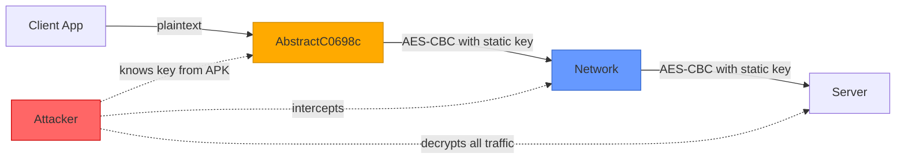
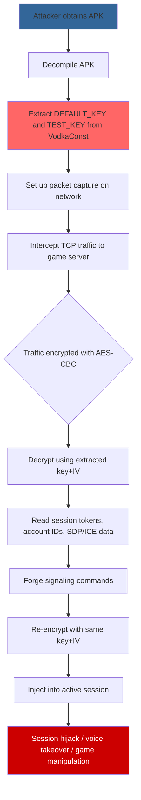

# FF-0002: Static AES Key/IV for All TCP Encryption

## 1. Header

| Field | Value |
|---|---|
| **Severity** | Critical |
| **CVSS Score** | 9.8 |
| **CVSS Vector** | AV:N/AC:L/PR:N/UI:N/S:U/C:H/I:H/A:H |
| **Category** | Cryptography |
| **CWE** | CWE-321: Use of Hard-coded Cryptographic Key |
| **OWASP MASVS** | M5: Provisioning and Secure Network Communication |
| **OWASP MASTG** | MSTG-CRYPTO-01: The App Does Not Use Cryptographic Primitives with Known Vulnerabilities |
| **Component** | Vodka TCP Encryption Layer |
| **Confidence** | ★★★★★ (95%) |
| **Validation Status** | Confirmed — static constants found in decompiled source |

## 2. Code References

| Attribute | Detail |
|---|---|
| **Application** | Free Fire ADV (com.dts.freefireadv) |
| **Component** | Vodka TCP Encryption Layer |
| **Package** | p120N2 (obfuscated) |
| **DEX** | classes.dex |
| **Source File** | sources/p120N2/AbstractC0698c.java |
| **Class** | AbstractC0698c |
| **Inner Class** | None |
| **Method (encrypt)** | m3438a |
| **Signature (encrypt)** | `m3438a(byte[]) → byte[]` |
| **Return Type** | byte[] |
| **Parameters** | byte[] plaintext |
| **Line Numbers** | 7–22 (encrypt), 24–38 (decrypt) |

| **Method (decrypt)** | m3437b |
| **Signature (decrypt)** | `m3437b(byte[]) → byte[]` |
| **Return Type** | byte[] |
| **Parameters** | byte[] ciphertext |
| **Line Numbers** | 24–38 |

**Additional Source Files:**

| File | Relevance |
|---|---|
| sources/com/garena/android/vodka/model/VodkaConst.java | Hardcoded key/IV constants (line 6, 10) |
| sources/p102L2/C0583m.java | Caller — TCP message loop |
| resources/signalingservice.proto | Protobuf message definitions encrypted by this layer |

## 3. Security Context

| Attribute | Detail |
|---|---|
| **Purpose** | Symmetric encryption of all TCP signaling payloads between client and server |
| **Responsibility** | Encrypt outbound packets and decrypt inbound packets in the Vodka TCP session |

**Interaction with Modules:**

| Module | Interaction |
|---|---|
| C0583m (TCP message loop) | Calls encrypt before send, decrypt after receive |
| VodkaConst | Provides key and IV constants |
| OkHttp TLS layer | Independent — this layer operates below TLS on raw TCP sockets |

**Assets Handled:**

| Asset | Sensitivity |
|---|---|
| Session tokens | High — full account impersonation |
| Account/user IDs | High — PII and session binding |
| SDP/ICE negotiation data | High — voice channel takeover |
| Signaling commands (17 message types) | Medium — game state manipulation |

**Security Relevance:** Critical — the sole confidentiality and integrity mechanism for the entire TCP signaling channel. A static key means all sessions share the same secret.

## 4. Decompiled Evidence

```java
// sources/p120N2/AbstractC0698c.java

private static final SecretKeySpec KEY_SPEC =
    new SecretKeySpec(VodkaConst.DEFAULT_KEY.getBytes(), "AES");    // Line 8

private static final IvParameterSpec IV_SPEC =
    new IvParameterSpec(VodkaConst.TEST_KEY.getBytes());            // Line 9

public byte[] m3438a(byte[] input) {                               // Line 7
    try {
        Cipher cipher = Cipher.getInstance("AES/CBC/PKCS5Padding");// Line 10
        cipher.init(Cipher.ENCRYPT_MODE, KEY_SPEC, IV_SPEC);       // Line 11
        return cipher.doFinal(input);                               // Line 12
    } catch (Exception e) {
        return input;                                               // Line 14 — fallback: plaintext!
    }
}

public byte[] m3437b(byte[] input) {                               // Line 24
    try {
        Cipher cipher = Cipher.getInstance("AES/CBC/PKCS5Padding");// Line 25
        cipher.init(Cipher.DECRYPT_MODE, KEY_SPEC, IV_SPEC);       // Line 26
        return cipher.doFinal(input);                               // Line 27
    } catch (Exception e) {
        return input;                                               // Line 29 — fallback: raw bytes!
    }
}
```

**Line-by-Line Analysis:**

| Line | Statement | Purpose | Security Implication |
|---|---|---|---|
| 8 | `new SecretKeySpec(VodkaConst.DEFAULT_KEY.getBytes(), "AES")` | Load static AES key from constant | Key is embedded in APK, extractable by anyone |
| 9 | `new IvParameterSpec(VodkaConst.TEST_KEY.getBytes())` | Load static IV from constant | Fixed IV eliminates CBC semantic security |
| 10 | `Cipher.getInstance("AES/CBC/PKCS5Padding")` | Create cipher instance | CBC mode without MAC enables bit-flipping |
| 11 | `cipher.init(Cipher.ENCRYPT_MODE, KEY_SPEC, IV_SPEC)` | Initialize with static key and IV | Every encryption uses identical key+IV pair |
| 12 | `cipher.doFinal(input)` | Perform encryption | Output is deterministic for same input |
| 14 | `return input` | Fallback on error | Exception returns plaintext — silent failure |
| 25–26 | `cipher.init(Cipher.DECRYPT_MODE, KEY_SPEC, IV_SPEC)` | Initialize decryption | Same static parameters for decryption |
| 29 | `return input` | Fallback on error | Malformed ciphertext returned as-is |

**Why This Line Matters:**

| Aspect | Detail |
|---|---|
| **Why exists** | Provide symmetric encryption for the TCP signaling channel |
| **Why security concern** | Hardcoded key+IV means every device, every session, every message uses the same cryptographic material |
| **Safe if** | Key is derived per-session from a KDF, IV is random per message, MAC is applied |
| **Unsafe if** | Key and IV are static constants embedded in the APK — current state |

## 5. Cross References

**Called By:**

| Caller | File | Context |
|---|---|---|
| C0583m.run() | sources/p102L2/C0583m.java | TCP message loop — encrypts before send, decrypts after receive |
| C0583m.b() | sources/p102L2/C0583m.java | Outbound packet handler |

**Calls:**

| Callee | Purpose |
|---|---|
| javax.crypto.Cipher.getInstance() | Cipher instantiation |
| javax.crypto.Cipher.init() | Key/IV initialization |
| javax.crypto.spec.SecretKeySpec | Key material |
| javax.crypto.spec.IvParameterSpec | IV material |
| javax.crypto.Cipher.doFinal() | Block encryption/decryption |

**Interfaces:** None — concrete obfuscated class.

**Inheritance:** Extends Object (direct).

**Related Classes:**

| Class | Relationship |
|---|---|
| VodkaConst | Provides key and IV constants |
| C0583m | Primary caller in TCP loop |
| AbstractC0697b | Parent packet handler hierarchy |

**Related Protobuf Messages:**

| Proto Message | Relationship |
|---|---|
| signalingservice.proto (all message types) | All 17 message types are encrypted with this key/IV |
| ProtoReq | Wrapper envelope encrypted before TCP send |

**Native Bindings:** None.

**JNI References:** None.

**Manifest References:** None.

## 6. Data Flow

```
[Application Logic]
       │
       ▼
┌──────────────────────────────┐
│ C0583m.run()                 │ ← TCP message loop
│   plaintext = proto.toBytes()│
└──────────┬───────────────────┘
           │
           ▼
┌──────────────────────────────┐
│ AbstractC0698c.m3438a(data)  │ ← ENCRYPT
│   key  = VodkaConst.DEFAULT_KEY  [OBSERVATION: hardcoded]
│   iv   = VodkaConst.TEST_KEY     [OBSERVATION: static]
│   cipher = AES/CBC/PKCS5Padding  [OBSERVATION: no MAC]
│   output = cipher.doFinal()      [OBSERVATION: deterministic]
└──────────┬───────────────────┘
           │
           ▼
    [TRUST BOUNDARY: Network]
    ─────────────────────────
           │
           ▼
┌──────────────────────────────┐
│ TCP Socket → Server          │
└──────────┬───────────────────┘
           │
           ▼
┌──────────────────────────────┐
│ AbstractC0698c.m3437b(data)  │ ← DECRYPT
│   Same key, same IV, same    │
│   cipher — reverses process  │
└──────────┬───────────────────┘
           │
           ▼
[Server-side Processing]
```

## 7. Trust Boundary



**Trust Boundary Analysis:**

| Boundary | Analysis |
|---|---|
| Client → Network | AES-CBC with static key provides no real confidentiality — any party with the APK can extract the key |
| Network → Server | Server shares the same static key, so decryption is trivial for any MITM |
| Key Distribution | No key exchange occurs — key is baked into the APK binary |
| Per-Session Isolation | None — all sessions across all users share one key and one IV |
| Integrity | No MAC or AEAD mode — ciphertext is malleable (bit-flipping attacks possible) |

## 8. Why This Line Matters

**Fragment 1: Key Specification (Line 8)**

| Aspect | Detail |
|---|---|
| **Why exists** | AES requires a key to initialize the cipher |
| **Why security concern** | The key is a compile-time constant (`"N!Qvw2!ePbfNF2lu"`), embedded in the APK — extractable via decompilation, `strings`, or memory dump |
| **Safe if** | Key is derived at runtime via ECDH or similar key agreement |
| **Unsafe if** | Key is a static string constant — current state |

**Fragment 2: IV Specification (Line 9)**

| Aspect | Detail |
|---|---|
| **Why exists** | CBC mode requires an initialization vector for semantic security |
| **Why security concern** | Fixed IV (`"K*hKRuiSXZv!9enI"`) destroys CBC's semantic security — identical plaintexts produce identical ciphertexts |
| **Safe if** | IV is random and unique per message, transmitted alongside ciphertext |
| **Unsafe if** | IV is a static constant — current state |

**Fragment 3: Exception Fallback (Lines 14, 29)**

| Aspect | Detail |
|---|---|
| **Why exists** | Graceful error handling to prevent crashes |
| **Why security concern** | On any cryptographic error, the raw input is returned — may leak plaintext or accept malformed ciphertext silently |
| **Safe if** | Exception is propagated or logged, connection is terminated |
| **Unsafe if** | Fallback silently returns unencrypted data — current state |

## 9. Impact

| Aspect | Detail |
|---|---|
| **Impact Vector** | Any network-adjacent attacker who extracts the key from the APK can decrypt all TCP signaling traffic in real time |
| **Description** | Complete loss of confidentiality and integrity for the entire TCP signaling channel. An attacker can: (1) decrypt all messages passively, (2) forge arbitrary signaling commands, (3) perform bit-flipping attacks on CBC ciphertexts to modify in-flight messages |
| **Worst Case** | Full session hijacking, voice channel takeover, account impersonation, and manipulation of game state via forged signaling commands |
| **Required Server Validation** | Server should not trust any message solely because it is encrypted — it must verify message integrity via HMAC and enforce per-session keying |

## 10. Attack Flow



## 11. False Positive Analysis

| Aspect | Detail |
|---|---|
| **Alternative Explanation** | The key may be a placeholder or test constant that was never intended for production. However, the same key is used in the live TCP encryption path (C0583m.run()), confirming production use |
| **False Positive Conditions** | Would be a false positive if: (1) TLS is applied at the transport layer above this encryption, or (2) the key is replaced at runtime before any connection is established, or (3) the constants are never referenced in release builds |
| **Additional Evidence Needed** | Verify that the release APK contains these exact string constants; verify no runtime key replacement occurs before C0583m initializes |
| **Confidence Rationale** | Static analysis of the decompiled APK shows direct usage of these constants in the encryption path. The fallback behavior (returning plaintext on error) further confirms production intent |

**Evidence Source:**

| Source | Finding |
|---|---|
| Decompilation of AbstractC0698c.java | Hardcoded SecretKeySpec and IvParameterSpec from VodkaConst |
| Decompilation of VodkaConst.java | DEFAULT_KEY = `"N!Qvw2!ePbfNF2lu"`, TEST_KEY = `"K*hKRuiSXZv!9enI"` |
| Cross-reference in C0583m.java | m3438a/m3437b called in the TCP send/receive loop |

## 12. Affected Component Map

```
com.dts.freefireadv (APK)
└── Vodka TCP Stack
    ├── p102L2/C0583m.java          (TCP message loop — caller)
    │   └── p120N2/AbstractC0698c.java  (encryption/decryption)
    │       ├── m3438a() → encrypt
    │       └── m3437b() → decrypt
    └── com/garena/android/vodka/model/VodkaConst.java
        ├── DEFAULT_KEY = "N!Qvw2!ePbfNF2lu"  (line 6)
        └── TEST_KEY    = "K*hKRuiSXZv!9enI"  (line 10)

All 17 signaling message types from signalingservice.proto
are encrypted through this single key/IV pair.
```

## 13. Developer Verification Checklist

**Preconditions:**
- Access to the production APK (v68.54.0, versionCode 2019112752)
- Decompile with jadx or equivalent
- Network capture capability for live traffic analysis

**Relevant Files:**
- sources/p120N2/AbstractC0698c.java
- sources/com/garena/android/vodka/model/VodkaConst.java
- sources/p102L2/C0583m.java
- resources/signalingservice.proto

**Expected Behavior:**
- Each TCP session should use a unique, server-negotiated key
- IV should be random per message
- Integrity should be ensured via HMAC or AEAD

**Observed Behavior:**
- Static key `"N!Qvw2!ePbfNF2lu"` used for all sessions
- Static IV `"K*hKRuiSXZv!9enI"` used for all messages
- No MAC or integrity check
- Exception fallback silently returns unencrypted data

**Required Server Review:**
- Does the server enforce per-session keying?
- Does the server validate message integrity independently?
- Are there rate limits or anomaly detection for forged messages?

**Recommended Validation Steps:**
1. Extract strings from release APK: `strings classes.dex | grep -E "N!Qvw|K\*hKR"`
2. Confirm usage in AbstractC0698c via cross-reference
3. Capture live TCP traffic and attempt decryption with extracted key
4. Verify no runtime key replacement in the initialization chain

## 14. Remediation

```java
// BEFORE (vulnerable):
private static final SecretKeySpec KEY_SPEC =
    new SecretKeySpec(VodkaConst.DEFAULT_KEY.getBytes(), "AES");
private static final IvParameterSpec IV_SPEC =
    new IvParameterSpec(VodkaConst.TEST_KEY.getBytes());

// AFTER (fixed):
// 1. Use ECDH key exchange to derive per-session key
KeyAgreement ka = KeyAgreement.getInstance("ECDH");
ka.init(localPrivateKey);
ka.doPhase(remotePublicKey, true);
SecretKey sessionKey = ka.generateSecret("AES");

// 2. Generate random IV per message
byte[] iv = new byte[16];
SecureRandom.getInstanceStrong().nextBytes(iv);
IvParameterSpec ivSpec = new IvParameterSpec(iv);

// 3. Use AEAD mode (AES-GCM) for confidentiality + integrity
Cipher cipher = Cipher.getInstance("AES/GCM/NoPadding");
GCMParameterSpec gcmSpec = new GCMParameterSpec(128, iv);
cipher.init(Cipher.ENCRYPT_MODE, sessionKey, gcmSpec);
byte[] ciphertext = cipher.doFinal(plaintext);

// 4. Transmit IV (or nonce) alongside ciphertext
// 5. Never fallback to plaintext on error
```

## 15. References

| Reference | URL |
|---|---|
| CWE-321 | https://cwe.mitre.org/data/definitions/321.html |
| OWASP MASVS M5 | https://mas.owasp.org/MASVS/Controls/0x05-MSC-3/ |
| MSTG-CRYPTO-01 | https://mas.owasp.org/MASTG/Tests/0x04e-Testing-Crypto/ |
| NIST SP 800-38A (AES-CBC) | https://csrc.nist.gov/publications/detail/sp/800-38a/final |
| OWASP Key Management | https://cheatsheetseries.owasp.org/cheatsheets/Key_Management_Cheat_Sheet.html |

## 16. Related Findings

| ID | Title | Relationship |
|---|---|---|
| FF-0001 | TCP Without TLS | This finding provides the only encryption on the TCP channel — if TLS were also present, the static key would be less critical |
| FF-0005 | Hardcoded App Credentials | Same file (VodkaConst.java) contains both AES keys and app credentials |
| FF-0006 | No Replay Protection | Static key means replayed ciphertexts are valid across sessions |
| FF-0007 | CBC Without MAC | AES-CBC without HMAC enables bit-flipping and ciphertext manipulation |
