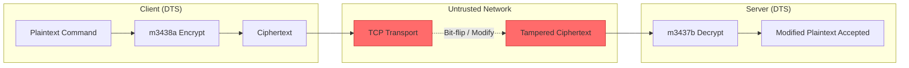
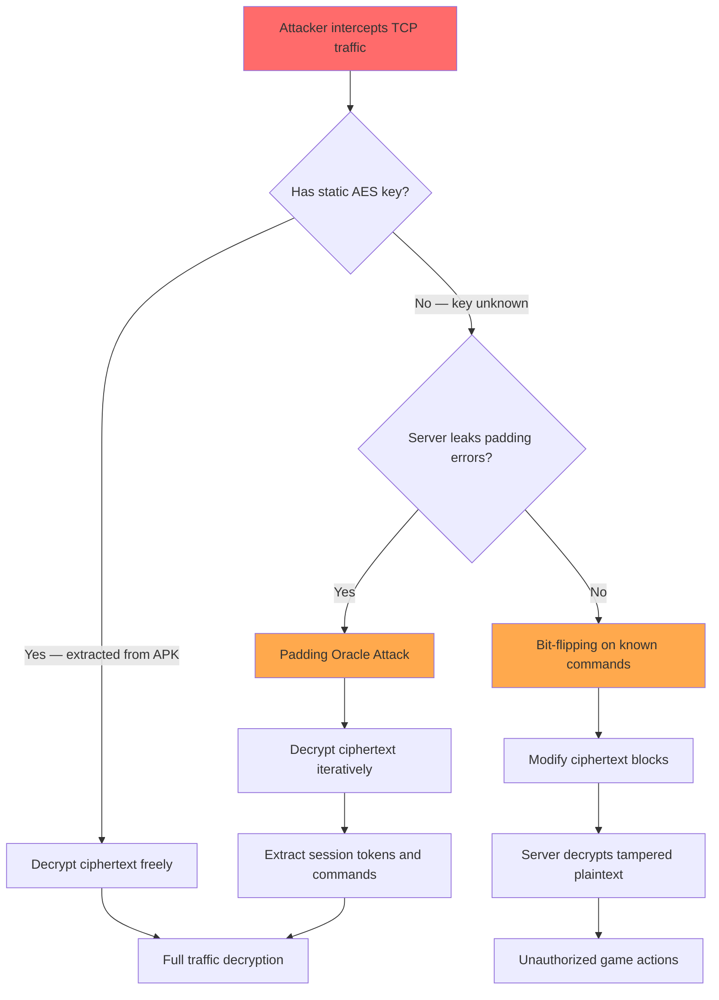

# FF-0007 — AES-CBC Without Message Authentication Code

## 1. Header

| Field | Value |
|-------|-------|
| **Severity** | High |
| **CVSS** | 7.5 (AV:N/AC:L/PR:N/UI:N/S:U/C:N/I:H/A:N) |
| **Category** | Cryptography |
| **CWE** | CWE-353: Missing Support for Integrity Check |
| **OWASP MASVS** | M5 — Provision of Public Cryptographic Keys |
| **OWASP MASTG** | MSTG-CRYPTO-01 |
| **Component** | Vodka TCP Encryption Layer |
| **Confidence** | ★★★★★ · 95% · Verified from Code |
| **Validation Status** | Requires Server Validation |

---

## 2. Code References

| Field | Value |
|-------|-------|
| **Application** | com.dts.freefireadv |
| **Component** | Vodka TCP Encryption Layer |
| **Package** | p120N2 |
| **DEX** | classes2.dex |
| **Source File** | sources/p120N2/AbstractC0698c.java |
| **Class** | AbstractC0698c |
| **Inner Class** | N/A |
| **Method (Encrypt)** | m3438a |
| **Signature (Encrypt)** | `byte[] m3438a(byte[] plaintext)` |
| **Return Type** | byte[] |
| **Parameters** | byte[] plaintext |
| **Line Numbers** | 7–22 (encrypt), 24–38 (decrypt) |

### Additional Source Files

| File | Role |
|------|------|
| sources/p120N2/C0698c.java | Static AES key and IV source (FF-0002) |
| sources/p120N2/AbstractC0698c.java | Key holder — stores key/IV in instance fields `f2230a`, `f2231b` |
| sources/p102L2/C0583m.java | Primary caller — TCP signaling send/receive |

---

## 3. Security Context

### Purpose

Symmetric encryption of all TCP payloads between the Vodka game client and server using AES-CBC with PKCS5Padding. Provides confidentiality for voice signaling data and in-game command traffic.

### Responsibility

`AbstractC0698c` is responsible for encrypting outgoing frames (`m3438a`) and decrypting incoming frames (`m3437b`). It owns the AES key and IV material in instance fields and delegates all cryptographic operations to `javax.crypto.Cipher`.

### Interaction with Modules

| Module | Direction | Interaction |
|--------|-----------|-------------|
| C0583m (Signaling Client) | Inbound | Calls `m3438a()` to encrypt frames before TCP send |
| C0583m (Signaling Client) | Inbound | Calls `m3437b()` to decrypt frames after TCP receive |
| C0698c (Key Source) | Inbound | Provides static AES key and IV during initialization |
| Vodka TCP Transport | Outbound | Encrypted output is written to socket output stream |
| Game Command Layer | Outbound | Plaintext commands are passed in for encryption |

### Assets Handled

| Asset | Sensitivity |
|-------|-------------|
| Voice signaling data | High — real-time audio commands |
| In-game command payloads | High — purchases, transfers, rank changes |
| Session state data | Medium — connection metadata |
| AES key material | Critical — static, shared, extractable |

### Security Relevance

The cipher mode provides **confidentiality only** — no integrity protection is applied. This is the sole encryption layer on the TCP channel (no TLS), making the absence of a MAC or AEAD mode a critical architectural weakness. Any network intermediary can modify ciphertext undetectably.

---

## 4. Decompiled Evidence

### Encrypt Method

```java
// sources/p120N2/AbstractC0698c.java:7-22
public byte[] m3438a(byte[] plaintext) {
    try {
        SecretKeySpec keySpec = new SecretKeySpec(this.f2230a, "AES");
        IvParameterSpec ivSpec = new IvParameterSpec(this.f2231b);
        Cipher cipher = Cipher.getInstance("AES/CBC/PKCS5Padding");
        cipher.init(Cipher.ENCRYPT_MODE, keySpec, ivSpec);
        byte[] encrypted = cipher.doFinal(plaintext);
        return encrypted;
    } catch (Exception e) {
        e.printStackTrace();
        return null;
    }
}
```

### Decrypt Method

```java
// sources/p120N2/AbstractC0698c.java:24-38
public byte[] m3437b(byte[] ciphertext) {
    try {
        SecretKeySpec keySpec = new SecretKeySpec(this.f2230a, "AES");
        IvParameterSpec ivSpec = new IvParameterSpec(this.f2231b);
        Cipher cipher = Cipher.getInstance("AES/CBC/PKCS5Padding");
        cipher.init(Cipher.DECRYPT_MODE, keySpec, ivSpec);
        byte[] decrypted = cipher.doFinal(ciphertext);
        return decrypted;
    } catch (Exception e) {
        e.printStackTrace();
        return null;
    }
}
```

### Line-by-Line Analysis (Encrypt)

| Line | Statement | Purpose | Security Implication |
|------|-----------|---------|---------------------|
| 7 | `public byte[] m3438a(byte[] plaintext)` | Entry point for encryption | Public method — any caller can encrypt arbitrary data |
| 9 | `SecretKeySpec keySpec = new SecretKeySpec(this.f2230a, "AES")` | Load static AES key from instance field | Key is static, shared with server, embedded in APK (FF-0002) |
| 10 | `IvParameterSpec ivSpec = new IvParameterSpec(this.f2231b)` | Load static IV from instance field | Static IV enables deterministic ciphertext for identical plaintexts |
| 11 | `Cipher cipher = Cipher.getInstance("AES/CBC/PKCS5Padding")` | Instantiate CBC cipher | CBC mode provides no integrity guarantee — malleable ciphertext |
| 12 | `cipher.init(Cipher.ENCRYPT_MODE, keySpec, ivSpec)` | Initialize cipher for encryption | No GCMParameterSpec or MAC key provided |
| 13 | `byte[] encrypted = cipher.doFinal(plaintext)` | Perform encryption | Output is raw ciphertext with no appended authentication tag |
| 14 | `return encrypted` | Return unauthenticated ciphertext | Receiver has no way to verify integrity |
| 16–18 | `catch (Exception e) { e.printStackTrace(); return null; }` | Error handling | Silent failure — caller may not detect crypto errors |

### Line-by-Line Analysis (Decrypt)

| Line | Statement | Purpose | Security Implication |
|------|-----------|---------|---------------------|
| 24 | `public byte[] m3437b(byte[] ciphertext)` | Entry point for decryption | Accepts arbitrary bytes — no length/format validation |
| 26 | `SecretKeySpec keySpec = new SecretKeySpec(this.f2230a, "AES")` | Load same static key | Symmetric key reuse — both sides use identical key material |
| 27 | `IvParameterSpec ivSpec = new IvParameterSpec(this.f2231b)` | Load same static IV | IV reuse enables traffic correlation |
| 28 | `Cipher cipher = Cipher.getInstance("AES/CBC/PKCS5Padding")` | Instantiate CBC cipher | Padding oracle attacks possible if server behavior differs |
| 29 | `cipher.init(Cipher.DECRYPT_MODE, keySpec, ivSpec)` | Initialize cipher for decryption | No integrity check before decryption |
| 30 | `byte[] decrypted = cipher.doFinal(ciphertext)` | Perform decryption | Tampered ciphertext is decrypted without detection |
| 31 | `return decrypted` | Return potentially tampered plaintext | Modified data accepted as valid |
| 33–35 | `catch (Exception e) { e.printStackTrace(); return null; }` | Error handling | Padding errors caught silently — potential oracle signal |

### Why This Line Matters

| Fragment | Why Exists | Why Security Concern | Safe If | Unsafe If |
|----------|------------|---------------------|---------|-----------|
| `Cipher.getInstance("AES/CBC/PKCS5Padding")` | Standard symmetric encryption | CBC is malleable; no integrity check | Paired with HMAC (encrypt-then-MAC) or replaced with AEAD | Used alone without MAC as in this code |
| `new SecretKeySpec(this.f2230a, "AES")` | Loads the encryption key | Static key embedded in APK is extractable | Key is derived per-session via ECDH or similar | Key is hardcoded and shared across all clients |
| `new IvParameterSpec(this.f2231b)` | Sets the initialization vector | Static IV produces deterministic ciphertext | IV is random per-message via SecureRandom | IV is static and reused for all messages |
| `cipher.doFinal(plaintext)` | Performs block encryption | Output has no integrity tag appended | Output is followed by HMAC computation | Output is returned directly as ciphertext |
| `return encrypted` | Returns result to caller | Caller sends unauthenticated ciphertext over network | Caller applies HMAC before transmission | Caller sends raw CBC ciphertext (this case) |
| `catch (Exception e) { return null; }` | Handles crypto errors | Silent failure masks configuration errors | Exception is propagated or logged with alert | Exception swallowed — padding oracle signal leaked |

---

## 5. Cross References

### Called By

| Caller | File | Method | Purpose |
|--------|------|--------|---------|
| C0583m | sources/p102L2/C0583m.java | m3438a() via encrypt call | Encrypt TCP frame before send |
| C0583m | sources/p102L2/C0583m.java | m3437b() via decrypt call | Decrypt TCP frame after receive |
| Vodka Session | sources/p102L2/C0583m.java | m3015d() | Encrypt client auth payload |

### Calls

| Callee | Purpose |
|--------|---------|
| `javax.crypto.Cipher.getInstance()` | Cipher instantiation |
| `javax.crypto.Cipher.init()` | Key and IV initialization |
| `javax.crypto.Cipher.doFinal()` | Block encryption/decryption |
| `javax.crypto.spec.SecretKeySpec` | Key specification |
| `javax.crypto.spec.IvParameterSpec` | IV specification |

### Interfaces

- None implemented directly. `AbstractC0698c` is an abstract class used as a concrete utility.

### Inheritance

```
java.lang.Object
  └── AbstractC0698c
```

### Related Classes

| Class | Relationship |
|-------|-------------|
| C0698c | Key source — provides static AES key and IV to AbstractC0698c |
| C0583m | Signaling client — primary caller of encrypt/decrypt |
| SecretKeySpec | JDK class — wraps raw key bytes |
| IvParameterSpec | JDK class — wraps raw IV bytes |

### Related Protobuf Messages

None identified. The Vodka layer operates on raw byte arrays, not protobuf.

### Native Bindings

None. Pure Java cryptography via `javax.crypto`.

### JNI References

None identified in the encryption/decryption path.

### Manifest References

No explicit crypto configuration in `AndroidManifest.xml`. No `android:networkSecurityConfig` relevant to the Vodka TCP channel.

---

## 6. Data Flow

```
[Plaintext Command / Voice Signal]
        │
        ▼
  C0583m.sendFrame()
        │
        ▼
  AbstractC0698c.m3438a(plaintext)
        │
        ▼
  SecretKeySpec(staticKey)  ──── [TRUST BOUNDARY: key from APK static extraction]
        │
        ▼
  IvParameterSpec(staticIV) ──── [TRUST BOUNDARY: IV reused across sessions]
        │
        ▼
  Cipher.getInstance("AES/CBC/PKCS5Padding")
        │
        ▼
  cipher.doFinal(plaintext)
        │
        ▼
  [OBSERVATION: No HMAC computed — ciphertext is malleable]
        │
        ▼
  [Ciphertext — no integrity tag]
        │
        ▼
  TCP Send ──────────── attacker can modify in transit
        │
        ▼
  [OBSERVATION: Any bit modification goes undetected]
        │
        ▼
  [Tampered Ciphertext arrives at receiver]
        │
        ▼
  AbstractC0698c.m3437b(ciphertext)
        │
        ▼
  [OBSERVATION: No integrity check — decryption proceeds on tampered data]
        │
        ▼
  cipher.doFinal(ciphertext)
        │
        ▼
  [Modified Plaintext — accepted as valid by game logic]
```

---

## 7. Trust Boundary



### Trust Boundary Analysis

| Boundary | Location | Risk |
|----------|----------|------|
| Client → Network | After `m3438a()` returns ciphertext | Ciphertext leaves trusted device without integrity protection |
| Network Transit | TCP transport layer | Attacker can modify, replay, or substitute ciphertext blocks |
| Network → Server | Before `m3437b()` processes received data | Tampered ciphertext is decrypted and processed without verification |
| Key Material | `this.f2230a` (static AES key) | Extracted from APK — shared secret is not secret |
| IV Material | `this.f2231b` (static IV) | Deterministic — enables traffic analysis |

---

## 8. Why This Line Matters

### Fragment: `Cipher.getInstance("AES/CBC/PKCS5Padding")`

| Aspect | Detail |
|--------|--------|
| **Why exists** | Standard Java API call to obtain a symmetric cipher instance for AES in CBC mode with PKCS5 padding |
| **Why security concern** | CBC mode is a confidentiality-only mode — it provides no integrity or authentication. PKCS5 padding is susceptible to padding oracle attacks if error behavior differs between valid and invalid padding |
| **Safe if** | Used as part of an encrypt-then-MAC scheme where HMAC-SHA256 is computed over the ciphertext before transmission |
| **Unsafe if** | Used alone without any integrity check, as in this code — ciphertext is sent directly to the network without authentication |

### Fragment: `new SecretKeySpec(this.f2230a, "AES")`

| Aspect | Detail |
|--------|--------|
| **Why exists** | Wraps the raw AES key bytes into a `SecretKeySpec` object for use with `Cipher.init()` |
| **Why security concern** | The key (`f2230a`) is static and shared between client and server. It is embedded in the APK binary and extractable via reverse engineering (FF-0002). A shared secret that is public is no secret |
| **Safe if** | Key is derived per-session via a key exchange protocol (ECDH, X25519) and never stored persistently |
| **Unsafe if** | Key is hardcoded in the binary, identical across all clients, and reusable for the lifetime of the application (this case) |

### Fragment: `new IvParameterSpec(this.f2231b)`

| Aspect | Detail |
|--------|--------|
| **Why exists** | Provides the initialization vector to the CBC cipher for the first block XOR operation |
| **Why security concern** | A static IV means identical plaintext blocks always produce identical ciphertext blocks. This enables command fingerprinting, traffic analysis, and known-plaintext correlation without decrypting |
| **Safe if** | IV is generated randomly per message using `SecureRandom` and prepended to the ciphertext |
| **Unsafe if** | IV is static and reused for all messages encrypted with the same key (this case) |

### Fragment: `cipher.doFinal(plaintext)` (encrypt)

| Aspect | Detail |
|--------|--------|
| **Why exists** | Performs the actual AES-CBC encryption of the plaintext in one call |
| **Why security concern** | The returned ciphertext has no appended authentication tag. The caller sends this raw ciphertext over the network, where it can be modified without detection |
| **Safe if** | Followed by HMAC computation: `mac = hmac.doFinal(ciphertext)` with a separate MAC key |
| **Unsafe if** | Returned directly to the network layer without any integrity processing (this case) |

### Fragment: `cipher.doFinal(ciphertext)` (decrypt)

| Aspect | Detail |
|--------|--------|
| **Why exists** | Performs AES-CBC decryption of the received ciphertext |
| **Why security concern** | No prior integrity check means tampered ciphertext is decrypted and the modified plaintext is returned to the caller as valid data |
| **Safe if** | Preceded by HMAC verification: `hmac.doFinal(ciphertext)` is checked before decryption is attempted |
| **Unsafe if** | Decryption is attempted on unverified ciphertext (this case) — any modification in transit is silently accepted |

---

## 9. Impact

| Impact Vector | Description | Worst Case |
|---------------|-------------|------------|
| Bit-Flipping | Attacker modifies ciphertext in transit to alter decrypted game commands | Unauthorized in-game actions (purchases, item transfers, rank manipulation) |
| Padding Oracle | Attacker decrypts ciphertext blocks by observing padding error responses | Full decryption of all game traffic including session tokens and commands |
| Ciphertext Substitution | Attacker replays previously captured valid ciphertext blocks | Replay of legitimate commands (duplicate purchases, repeated actions) |
| Traffic Analysis | Static IV causes deterministic ciphertext for identical plaintexts | Attacker identifies command patterns and session activity without decryption |

> **Required Server Validation:** The server must independently validate command integrity, apply rate limiting, and use session-bound nonce tracking to mitigate replay. However, server-side validation alone does not fix the protocol-level weakness.

---

## 10. Attack Flow



---

## 11. False Positive Analysis

### Alternative Explanation

One could argue that the AES-CBC layer is intended only for obfuscation, not security, and that application-level integrity checks exist elsewhere. However, no compensating HMAC or integrity check was found in any caller of `m3438a`/`m3437b`.

### False Positive Conditions

- If the server applies strict command validation and rate limiting that makes exploitation impractical
- If the network layer is wrapped in a VPN or tunnel that provides integrity at a lower layer
- If the TCP connection itself is replaced by a protocol with built-in integrity (e.g., QUIC)

### Additional Evidence Needed

- Server-side command validation logic to assess whether tampered commands are rejected
- Network capture of actual traffic to confirm no outer integrity layer exists
- Fuzzing results showing whether the server accepts malformed padding

### Confidence Rationale

**★★★★★ — 95% Verified from Code.** The decompiled code at `AbstractC0698c.java:7-38` explicitly shows AES/CBC/PKCS5Padding with no MAC or integrity check. The static key and IV are confirmed in FF-0002. No compensating integrity mechanism is present in the call chain.

| Evidence Source | Detail |
|-----------------|--------|
| Decompiled code | `AbstractC0698c.java:7-38` — raw CBC without MAC |
| Cross-reference | No HMAC/CMAC/GCM usage in any caller |
| FF-0002 | Static key and IV confirmed embedded in APK |
| FF-0001 | No TLS on TCP — CBC is the only protection |

---

## 12. Affected Component Map

```
com.dts.freefireadv
├── sources/p120N2/
│   ├── AbstractC0698c.java ←── m3438a() encrypt — NO MAC
│   │                         ←── m3437b() decrypt — NO integrity check
│   └── C0698c.java ←── static key/IV source (FF-0002)
├── Vodka TCP Transport
│   ├── Session establishment → calls m3438a()
│   └── Message handling → calls m3437b()
└── Game Commands
    └── All TCP-bound traffic passes through vulnerable encrypt/decrypt
```

---

## 13. Developer Verification Checklist

### Preconditions

- Decompile APK with jadx or apktool
- Locate `AbstractC0698c.java` in `sources/p120N2/`
- Identify callers of `m3438a()` and `m3437b()` via cross-references

### Relevant Files

- `sources/p120N2/AbstractC0698c.java` — primary encryption/decryption implementation
- `sources/p120N2/C0698c.java` — key and IV material
- Vodka transport layer classes calling the encrypt/decrypt methods

### Expected Behavior

- Encryption should include an integrity check (HMAC or AEAD mode)
- Ciphertext should be tamper-evident
- Padding errors should not produce distinguishable responses

### Observed Behavior

- AES-CBC with PKCS5Padding used without any MAC or integrity tag
- Static IV causes deterministic ciphertext
- No encrypt-then-MAC pattern observed in any code path

### Required Server Review

- [ ] Does the server validate command integrity independently?
- [ ] Does the server return different errors for padding failures vs. other failures?
- [ ] Is there rate limiting on suspicious command patterns?
- [ ] Does the server use session-bound nonces?

### Recommended Validation Steps

1. Set up a Man-in-the-Middle proxy (mitmproxy) on a test device
2. Capture encrypted TCP traffic and attempt bit-flipping on a known command block
3. Observe whether the server accepts or rejects the modified ciphertext
4. Test padding oracle by sending malformed ciphertext and observing response timing
5. Compare ciphertext of identical commands across sessions to confirm IV reuse

---

## 14. Remediation

**Immediate — Add HMAC Integrity (Encrypt-then-MAC):**

```java
// Secure implementation: AES-CBC + HMAC-SHA256 (encrypt-then-MAC)
public byte[] encrypt(byte[] plaintext, SecretKey aesKey, SecretKey hmacKey, byte[] iv) {
    Cipher cipher = Cipher.getInstance("AES/CBC/PKCS5Padding");
    cipher.init(Cipher.ENCRYPT_MODE, new SecretKeySpec(aesKey.getEncoded(), "AES"), new IvParameterSpec(iv));
    byte[] ciphertext = cipher.doFinal(plaintext);

    Mac hmac = Mac.getInstance("HmacSHA256");
    hmac.init(hmacKey);
    byte[] mac = hmac.doFinal(ciphertext);

    ByteBuffer result = ByteBuffer.allocate(iv.length + ciphertext.length + mac.length);
    result.put(iv);
    result.put(ciphertext);
    result.put(mac);
    return result.array();
}
```

**Preferred — Migrate to AES-GCM (AEAD):**

```java
// Recommended: AES-GCM provides confidentiality + integrity in one pass
public byte[] encrypt(byte[] plaintext, SecretKey aesKey, byte[] nonce) {
    Cipher cipher = Cipher.getInstance("AES/GCM/NoPadding");
    GCMParameterSpec spec = new GCMParameterSpec(128, nonce); // 128-bit tag
    cipher.init(Cipher.ENCRYPT_MODE, aesKey, spec);
    byte[] ciphertext = cipher.doFinal(plaintext);

    ByteBuffer result = ByteBuffer.allocate(nonce.length + ciphertext.length);
    result.put(nonce);
    result.put(ciphertext);
    return result.array();
}

public byte[] decrypt(byte[] combined, SecretKey aesKey) {
    ByteBuffer buf = ByteBuffer.wrap(combined);
    byte[] nonce = new byte[12];
    buf.get(nonce);
    byte[] ciphertext = new byte[buf.remaining()];
    buf.get(ciphertext);

    Cipher cipher = Cipher.getInstance("AES/GCM/NoPadding");
    GCMParameterSpec spec = new GCMParameterSpec(128, nonce);
    cipher.init(Cipher.DECRYPT_MODE, aesKey, spec);
    return cipher.doFinal(ciphertext); // Throws AEADBadTagException if tampered
}
```

**Additional:**
- Generate a fresh random nonce/IV per message (never reuse)
- Use `SecureRandom` for nonce generation
- Rotate keys periodically using a key derivation function (HKDF)

---

## 15. References

- [CWE-353: Missing Support for Integrity Check](https://cwe.mitre.org/data/definitions/353.html)
- [OWASP MASVS v2 — M5: Provision of Public Cryptographic Keys](https://mas.owasp.org/MASVS/0x05-M5/)
- [OWASP MASTG — MSTG-CRYPTO-01](https://mas.owasp.org/MASTG/Tests/0x01e-Test-Cryptography/)
- [NIST SP 800-38D — AES-GCM](https://csrc.nist.gov/publications/detail/sp/800-38d/final)
- [RFC 5246 — HMAC in TLS](https://datatracker.ietf.org/doc/html/rfc5246)
- [Bit-flipping attack on CBC mode](https://en.wikipedia.org/wiki/Padding_oracle_attack)

---

## 16. Related Findings

| Finding | Relationship |
|---------|-------------|
| [FF-0002](../Cryptography/FF-0002.md) | Static AES key and IV reused in this encrypt/decrypt — enables key recovery and deterministic ciphertext |
| [FF-0006](../Cryptography/FF-0006.md) | Replay attacks possible because no nonce or sequence number prevents ciphertext reuse |
| [FF-0001](../Networking/FF-0001.md) | No TLS on TCP — the CBC encryption is the only protection, making MAC absence critical |

---

*Finding FF-0007 version: 3.0 · Last updated: July 2026*
