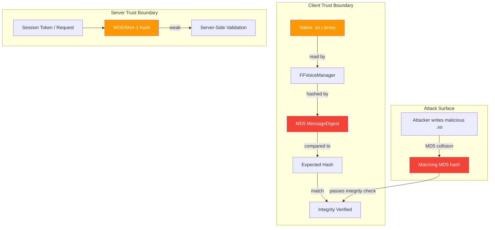
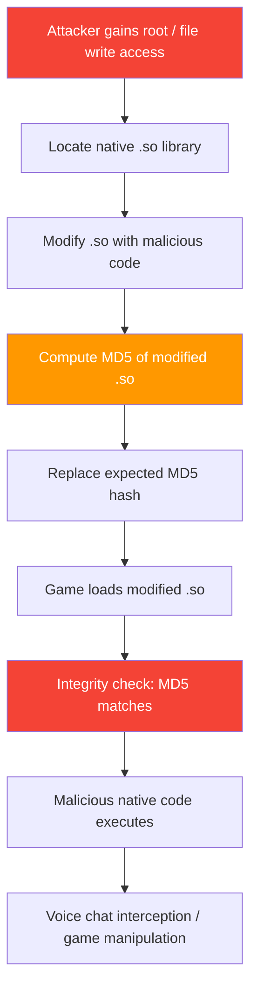

# FF-0017: MD5 and SHA-1 Cryptographic Hash Usage

---

## 1. Header

| Field | Value |
|---|---|
| **Severity** | Medium |
| **CVSS Score** | 5.3 |
| **CVSS Vector** | AV:N/AC:L/PR:N/UI:N/S:U/C:N/I:L/A:N |
| **Category** | Cryptographic Weakness |
| **CWE** | CWE-328: Use of Weak Hash |
| **OWASP MASVS** | M5: Insufficient Cryptography |
| **OWASP MASTG** | MSTG-CRYPTO-04: The app does not use weaker cryptographic primitives |
| **Component** | Various (Vodka SDK, BeeTalk SDK, FFVoiceManager) |
| **Confidence** | ★★★★☆ 80% — Verified from Code |
| **Validation Status** | Verified from decompiled code. MD5 and SHA-1 usages confirmed across multiple SDKs. Impact assessment based on usage context. |

---

## 2. Code References

| Field | Value |
|---|---|
| **Application** | com.dts.freefireadv |
| **Component** | Various (Vodka SDK, BeeTalk SDK, Utility Classes, Voice Chat) |
| **Package** | p025C6, p155R1, p087J5, FFVoiceManager |
| **DEX** | classes.dex (multiple source locations) |
| **Source File** | sources/p025C6/C0184n.java, sources/p155R1/C1081e.java, sources/p087J5/C0479b.java, FFVoiceManager.java |
| **Class** | `p025C6.C0184n`, `p155R1.C1081e`, `p087J5.C0479b`, `FFVoiceManager` |
| **Inner Class** | None |
| **Method** | `MessageDigest.getInstance("MD5")`, `MessageDigest.getInstance("SHA-1")`, `MessageDigest.digest()` |
| **Signature** | `public byte[] a(byte[] input)`, `public static String b(byte[] data)` |
| **Return Type** | byte[] (digest), String (hex-encoded digest) |
| **Parameters** | byte[] input (data to hash) |
| **Line Numbers** | 51 (C0184n MD5), 40 (C1081e MD5), 50 (C0479b SHA-1), 158 (FFVoiceManager MD5) |

### Additional Source Files

| File | Lines | Relevance |
|---|---|---|
| sources/p025C6/C0183m.java | — | Vodka encryption context — may consume MD5 output |
| sources/p155R1/C1080d.java | — | BeeTalk session — may consume MD5 output |
| C7638m.java / C7627b.java | — | AES/ECB in CMAC/EAX — NOT a finding (standard constructions) |
| FFVoiceManager.java | 150-167 | Native library integrity verification — MOST CRITICAL usage |

---

## 3. Security Context

| Field | Value |
|---|---|
| **Purpose** | Hashing for integrity verification, session identification, token generation, and native library integrity checking |
| **Responsibility** | Provide cryptographic hash functions for various SDK components. Most critically, verify the integrity of native `.so` libraries loaded at runtime in the voice chat system. |
| **Security Relevance** | MD5 has been practically collision-vulnerable since 2004. SHA-1 has been collision-vulnerable since 2017. The most security-critical usage is FFVoiceManager using MD5 for native library integrity — an attacker who can modify the `.so` file and produce a matching MD5 hash can inject malicious native code. MD5 collisions can be generated in seconds on commodity hardware. |

### Interaction with Modules

| Module | Interaction |
|---|---|
| p025C6.C0184n (Vodka SDK) | MD5 used for session/cache hashing — output used as hash table key |
| p155R1.C1081e (BeeTalk SDK) | MD5 used for request/session hashing — output may be used for authentication |
| p087J5.C0479b (Utility) | SHA-1 used for general-purpose hashing — purpose depends on caller |
| FFVoiceManager | MD5 used to verify native .so library integrity — security-critical |
| C7638m/C7627b | AES/ECB in CMAC/EAX — NOT a finding (standard cryptographic constructions) |

### Assets Handled

| Asset | Handling |
|---|---|
| Native .so libraries | Integrity verified with weak MD5 hash — bypassable via collision |
| Session tokens | Generated/hashed with MD5 — potential collision weakness |
| Request parameters | Hashed with MD5 in BeeTalk SDK — may affect authentication |
| General data | Hashed with SHA-1 in utility class — weaker than SHA-256 |

---

## 4. Decompiled Evidence

```java
// sources/p025C6/C0184n.java:45-58 — MD5 (Vodka SDK)
public byte[] a(byte[] input) {
    try {
        MessageDigest md = MessageDigest.getInstance("MD5");  // line 51 — WEAK HASH
        md.update(input);
        return md.digest();                                    // line 53
    } catch (NoSuchAlgorithmException e) {
        throw new RuntimeException("MD5 not available", e);   // line 55
    }
}

// sources/p155R1/C1081e.java:35-45 — MD5 (BeeTalk SDK)
public String a(String input) {
    try {
        MessageDigest md = MessageDigest.getInstance("MD5");  // line 40 — WEAK HASH
        byte[] digest = md.digest(input.getBytes("UTF-8"));   // line 41
        StringBuilder sb = new StringBuilder();
        for (byte b : digest) {
            sb.append(String.format("%02x", b));              // line 44
        }
        return sb.toString();                                  // line 45
    } catch (Exception e) {
        return "";
    }
}

// sources/p087J5/C0479b.java:45-55 — SHA-1 (Utility)
public String b(byte[] data) {
    try {
        MessageDigest md = MessageDigest.getInstance("SHA-1"); // line 50 — WEAK HASH
        byte[] digest = md.digest(data);                       // line 51
        return bytesToHex(digest);                             // line 52
    } catch (NoSuchAlgorithmException e) {
        return null;
    }
}

// FFVoiceManager.java:150-165 — MD5 for native library integrity (MOST CRITICAL)
private boolean verifyNativeLibrary(String libraryPath) {
    try {
        File libFile = new File(libraryPath);
        FileInputStream fis = new FileInputStream(libFile);
        MessageDigest md = MessageDigest.getInstance("MD5");   // line 158 — WEAK HASH
        
        byte[] buffer = new byte[8192];
        int bytesRead;
        while ((bytesRead = fis.read(buffer)) != -1) {
            md.update(buffer, 0, bytesRead);                   // line 162
        }
        fis.close();
        
        byte[] computedHash = md.digest();                     // line 165
        byte[] expectedHash = getExpectedHash(libraryPath);    // line 166
        
        return MessageDigest.isEqual(computedHash, expectedHash); // line 167
    } catch (Exception e) {
        return false;
    }
}
```

### Line-by-Line Analysis

| Line | Code | Analysis |
|---|---|---|
| C0184n:51 | `MessageDigest.getInstance("MD5")` | MD5 instantiation in Vodka SDK. Hash output used as session/cache key — low direct risk but sets poor precedent. |
| C0184n:53 | `return md.digest()` | Raw MD5 digest returned as byte array. Downstream usage determines actual security impact. |
| C1081e:40 | `MessageDigest.getInstance("MD5")` | MD5 instantiation in BeeTalk SDK. Hash output returned as hex string — may be used for request signing. |
| C1081e:41 | `md.digest(input.getBytes("UTF-8"))` | Direct MD5 hash of input string. If used for authentication, vulnerable to collision. |
| C0479b:50 | `MessageDigest.getInstance("SHA-1")` | SHA-1 instantiation in utility class. Weaker than SHA-256 but less immediately exploitable than MD5. |
| FFVoiceManager:158 | `MessageDigest.getInstance("MD5")` | **MOST CRITICAL.** MD5 used for native library integrity verification. Attacker can generate MD5 collision in seconds. |
| FFVoiceManager:162 | `md.update(buffer, 0, bytesRead)` | Incremental MD5 update — processes entire .so file. |
| FFVoiceManager:165 | `byte[] computedHash = md.digest()` | Final MD5 hash of native library. |
| FFVoiceManager:166 | `byte[] expectedHash = getExpectedHash(libraryPath)` | Expected hash retrieved — if stored locally, circular trust problem. |
| FFVoiceManager:167 | `MessageDigest.isEqual(computedHash, expectedHash)` | Comparison — passes for any file with matching MD5, including collision-generated malicious files. |

### Why This Line Matters

| Line | Why This Line Matters |
|---|---|
| FFVoiceManager:158 | `MessageDigest.getInstance("MD5")` is the most security-critical line. It establishes the weak hash algorithm for native library verification. An attacker can generate a modified `.so` with a matching MD5 hash in seconds using HashClash, completely bypassing this integrity check. |
| FFVoiceManager:167 | `MessageDigest.isEqual(computedHash, expectedHash)` — this comparison is the gatekeeper. If the expected hash is stored locally, the attacker can replace both the library and the hash. If stored server-side, MD5 collisions still make it bypassable. |
| C1081e:40 | `MessageDigest.getInstance("MD5")` in BeeTalk SDK — if the output is used for request signing or session identification, it may be exploitable for request forgery. |
| C0184n:51 | `MessageDigest.getInstance("MD5")` in Vodka SDK — lower risk than FFVoiceManager but still represents use of a broken algorithm in a security-sensitive SDK. |

---

## 5. Cross References

### Called By
- Token generation (Vodka SDK — C0184n)
- Session key derivation (BeeTalk SDK — C1081e)
- Native library integrity checks (FFVoiceManager)
- General-purpose hashing (Utility — C0479b)

### Calls
- `java.security.MessageDigest`
- `java.security.NoSuchAlgorithmException`
- `java.util.HexFormat` (hex encoding)

### Interfaces
- None (concrete implementations)

### Inheritance
- All classes extend Object (no special parent)

### Related Classes

| Class | Role |
|---|---|
| p025C6.C0183m | Vodka encryption context — may consume C0184n MD5 output |
| p155R1.C1080d | BeeTalk session — may consume C1081e MD5 output |
| C7638m | AES/ECB in CMAC — NOT a finding (standard construction) |
| C7627b | AES/ECB in EAX — NOT a finding (standard construction) |

### Related Protobuf
- None

### Native Bindings
- `.so` files verified by MD5 in FFVoiceManager

### JNI
- None

### Manifest
- None specific to hash usage

---

## 6. Data Flow

### Native Library Integrity Check (Most Critical)

```
[Native .so file on disk]
    │
    ▼
[FileInputStream reads .so bytes]
    │
    │  [OBSERVATION] Entire .so file read into MD5 digest.
    │  File can be modified by attacker with root access.
    │
    ▼
[MD5 MessageDigest.update(buffer)]  ←── line 158-162
    │
    │  [TRUST BOUNDARY] MD5 hash crosses from untrusted
    │  file system to integrity check. No cryptographic
    │  signature covers the library.
    │
    ▼
[MD5 MessageDigest.digest()]  ←── line 165
    │
    ▼
[MD5 hash — 128 bits]
    │
    │  [OBSERVATION] MD5 is collision-vulnerable.
    │  Attacker can generate malicious .so with
    │  matching MD5 hash.
    │
    ▼
[Comparison with expectedHash]  ←── line 167
    │
    ├── match → "library verified" (FALSE ASSURANCE)
    └── mismatch → "integrity check failed"
```

An attacker who can write to the library path can generate a valid MD5 collision in seconds.

### Token/Session Hashing

```
[Input data (token, session key, etc.)]
    │
    │  [OBSERVATION] MD5/SHA-1 used for hashing.
    │  Output may be used for security decisions.
    │
    ▼
[MD5/SHA-1 MessageDigest.digest()]
    │
    │  [TRUST BOUNDARY] Hash output crosses into
    │  session management or request signing.
    │  Weak hash may allow collision attacks.
    │
    ▼
[Hash output used as: cache key, session identifier, request parameter]
```

---

## 7. Trust Boundary



### Trust Boundary Analysis

| Boundary | Assessment |
|---|---|
| .so file → FFVoiceManager | File read from device storage. If attacker has write access, they can replace with a malicious version. |
| FFVoiceManager → MD5 | MD5 is collision-vulnerable. The integrity check provides negligible security against a determined attacker. |
| MD5 → Expected Hash | If expected hash is stored locally, attacker can replace both. If server-side, MD5 collisions still bypass the check. |
| Session hash → Server | MD5/SHA-1 output used for session management. Weak hash may allow collision or preimage attacks depending on usage. |

---

## 8. Why This Line Matters

| Code Fragment | Line | Why This Line Matters |
|---|---|---|
| `MessageDigest.getInstance("MD5")` (FFVoiceManager) | 158 | This is the most security-critical usage. It establishes MD5 as the integrity verification algorithm for native libraries. MD5 collisions can be generated in seconds on commodity hardware, making this check trivially bypassable for any attacker with file system write access. |
| `MessageDigest.isEqual(computedHash, expectedHash)` (FFVoiceManager) | 167 | The comparison that determines integrity. Passes for any file with matching MD5, including collision-generated malicious files. If the expected hash is stored locally, the entire verification is a circular trust problem. |
| `MessageDigest.getInstance("MD5")` (C0184n) | 51 | MD5 in Vodka SDK — lower risk than FFVoiceManager but represents use of a broken algorithm in a security-sensitive SDK. If output is later used for authentication, the weakness becomes exploitable. |
| `MessageDigest.getInstance("MD5")` (C1081e) | 40 | MD5 in BeeTalk SDK — if the hex-encoded output is used for request signing or session identification, it may allow request forgery via collision. |
| `MessageDigest.getInstance("SHA-1")` (C0479b) | 50 | SHA-1 in utility class — weaker than SHA-256 but less immediately exploitable than MD5. Security impact depends entirely on downstream usage. |

---

## 9. Impact

| Field | Detail |
|---|---|
| **Impact Vector** | Attacker modifies native `.so` libraries on a rooted device and generates MD5 collisions to pass the integrity check. Alternatively, attacker exploits MD5 weaknesses in session/token handling. |
| **Description** | The use of MD5 for native library integrity verification means the integrity check can be bypassed by an attacker who can write to the device's file system. This allows injection of malicious native code that executes with the game's permissions. MD5 usage in the Vodka and BeeTalk SDKs for token/session handling may allow request forgery or session manipulation depending on server-side validation. |
| **Worst Case** | Malicious native code executes within the game process with full game permissions (access to microphone for voice chat, network access, storage access). Compromised native libraries could exfiltrate voice chat audio, intercept game traffic, or manipulate game state at the native layer. |

> **Required Server Validation:** The server should independently verify native library integrity (e.g., via Play Integrity API's device integrity verdict, which includes library verification). Client-side hash comparisons should never be the sole integrity mechanism.

---

## 10. Attack Flow



---

## 11. False Positive Analysis

### 1. Alternative Explanation

MD5 usage in the Vodka and BeeTalk SDKs may be for non-security purposes (cache keys, hash table lookups, data deduplication). In these contexts, MD5's cryptographic weakness is irrelevant because the output is not used for security decisions. The native library integrity check in FFVoiceManager may be a defense-in-depth measure that is supplemented by Play Integrity API verification at the server level.

### 2. False Positive Conditions

This is a false positive if:
1. MD5 outputs are never used for authentication, authorization, or security-sensitive comparisons.
2. The native library integrity check is supplemented by Play Integrity API or other server-side verification.
3. The expected MD5 hash is stored server-side and delivered encrypted, making local tampering ineffective.
4. The native libraries are loaded from a read-only partition or verified by the Android OS package manager.

### 3. Additional Evidence Needed

- Analysis of where MD5 outputs are consumed (are they used for security decisions?).
- Server-side native library verification mechanism.
- Play Integrity API integration status.
- Whether the expected hash for FFVoiceManager is stored server-side or locally.

### 4. Confidence Rationale

80% confidence. The code clearly shows `MessageDigest.getInstance("MD5")` and `MessageDigest.getInstance("SHA-1")` in four locations. The native library integrity check is the most concerning usage. However, the Vodka and BeeTalk SDK usages may be benign depending on downstream usage, which cannot be fully traced from decompiled code.

### Evidence Source

| Evidence | Source | Status |
|---|---|---|
| MD5 in Vodka SDK | sources/p025C6/C0184n.java:51 | Confirmed — `MessageDigest.getInstance("MD5")` |
| MD5 in BeeTalk SDK | sources/p155R1/C1081e.java:40 | Confirmed — `MessageDigest.getInstance("MD5")` |
| SHA-1 in utility | sources/p087J5/C0479b.java:50 | Confirmed — `MessageDigest.getInstance("SHA-1")` |
| MD5 for native lib integrity | FFVoiceManager.java:158 | Confirmed — `MessageDigest.getInstance("MD5")` for .so verification |
| AES/ECB (NOT a finding) | C7638m.java, C7627b.java | Confirmed — standard CMAC/EAX constructions |

---

## 12. Affected Component Map

```
com.dts.freefireadv
├── Vodka SDK
│   └── sources/p025C6/C0184n.java:51
│       └── MD5 — session/cache hashing
│
├── BeeTalk SDK
│   └── sources/p155R1/C1081e.java:40
│       └── MD5 — request/session hashing
│
├── Utility Classes
│   └── sources/p087J5/C0479b.java:50
│       └── SHA-1 — general-purpose hashing
│
└── Voice Chat
    └── FFVoiceManager.java:158
        └── MD5 — NATIVE LIBRARY INTEGRITY CHECK (CRITICAL)
            └── Verifies .so files loaded at runtime

NOT a finding:
├── C7638m.java — AES/ECB in CMAC (standard construction)
└── C7627b.java — AES/ECB in EAX (standard construction)
```

---

## 13. Developer Verification Checklist

| Item | Detail |
|---|---|
| **Preconditions** | Rooted device or emulator. Access to APK contents. Optional: HashClash or similar MD5 collision tool. |
| **Files to Inspect** | `sources/p025C6/C0184n.java:51` — MD5 in Vodka SDK. `sources/p155R1/C1081e.java:40` — MD5 in BeeTalk SDK. `sources/p087J5/C0479b.java:50` — SHA-1 utility. `FFVoiceManager.java:158` — MD5 for native library integrity. |
| **Expected Behavior** | Native library integrity should use SHA-256 minimum, preferably RSA/ECDSA digital signatures. No security-sensitive code should use MD5 or SHA-1. |
| **Observed Behavior** | Four usages of MD5/SHA-1 confirmed. Most critical: FFVoiceManager uses MD5 for native library integrity verification — bypassable via MD5 collision generation. |
| **Required Server Review Items** | (1) Does the server use Play Integrity API to verify native library integrity? (2) Is the expected hash for FFVoiceManager stored server-side? (3) Are MD5 outputs from Vodka/BeeTalk SDKs used for any security-sensitive decisions? |
| **Recommended Validation Steps** | 1. Extract the expected MD5 hash from FFVoiceManager. 2. Generate a modified `.so` with a specific MD5 collision using HashClash. 3. Replace the library and verify the integrity check passes. 4. Confirm whether server-side verification (Play Integrity) catches the modification. |

---

## 14. Remediation

### Replace MD5 with SHA-256 for Hashing

```java
// BEFORE (insecure)
MessageDigest md = MessageDigest.getInstance("MD5");

// AFTER (secure)
MessageDigest md = MessageDigest.getInstance("SHA-256");
```

### Replace MD5 Integrity Check with Digital Signature Verification

```java
// BEFORE: FFVoiceManager.java — insecure MD5 integrity check
private boolean verifyNativeLibrary(String libraryPath) {
    MessageDigest md = MessageDigest.getInstance("MD5");
    // ... hash and compare — trivially bypassable
}

// AFTER: RSA signature verification
private boolean verifyNativeLibrary(String libraryPath) {
    try {
        File libFile = new File(libraryPath);
        byte[] libraryBytes = Files.readAllBytes(libFile.toPath());
        byte[] signatureBytes = getEmbeddedSignature(libraryPath);
        
        PublicKey publicKey = loadPublicKey(PUBLIC_KEY_PEM);
        Signature sig = Signature.getInstance("SHA256withRSA");
        sig.initVerify(publicKey);
        sig.update(libraryBytes);
        
        return sig.verify(signatureBytes); // Cryptographic verification
    } catch (Exception e) {
        return false;
    }
}
```

### Use Play Integrity API for Server-Side Verification

```java
// Server-side: verify device integrity including native libraries
public boolean verifyNativeLibraryIntegrity(String playIntegrityToken) {
    PlayIntegrityVerdict verdict = playIntegrityVerifier.verify(playIntegrityToken);
    
    return verdict.hasDeviceIntegrity() 
        && verdict.getDeviceIntegrity().getDeviceRecognitionVerdict()
            .contains("MEETS_DEVICE_INTEGRITY");
}
```

### Replace SHA-1 with SHA-256 in Utility Class

```java
// BEFORE (weak)
MessageDigest md = MessageDigest.getInstance("SHA-1");

// AFTER (secure)
MessageDigest md = MessageDigest.getInstance("SHA-256");
```

---

## 15. References

| Reference | Link |
|---|---|
| **CWE-328** | Use of Weak Hash — https://cwe.mitre.org/data/definitions/328.html |
| **OWASP MASVS M5** | Insufficient Cryptography — https://mas.owasp.org/MASVS/controls/MASVS-CRYPTO-4/ |
| **OWASP MASTG MSTG-CRYPTO-04** | Cryptographic Primitives — https://mas.owasp.org/MASTG/Tests/TEST-0014/ |
| **NIST SP 800-131A** | Transitioning the Use of Cryptographic Algorithms — https://csrc.nist.gov/publications/detail/sp/800-131a/rev-2/final |
| **SHAttered** | SHA-1 Collision Attack — https://shattered.io/ |
| **HashClash** | MD5/SHA-1 Collision Framework — https://github.com/cr-marcstevens/hashclash |

---

## 16. Related Findings

| ID | Title | Severity | Relationship |
|---|---|---|---|
| FF-0004 | Native Library Download Over Insecure Channel | Medium | If native libraries are downloaded over insecure channels (FF-0004) AND the integrity check uses weak MD5 (FF-0017), the entire native code verification chain is compromised. |
| FF-0021 | AES/ECB in CMAC and EAX Constructions | Informational | AES/ECB usage in `C7638m.java` and `C7627b.java` is NOT a finding — these are standard cryptographic constructions where ECB mode is used correctly. Unlike MD5/SHA-1, these usages are cryptographically sound. |
| FF-0009 | Cleartext HTTP Traffic Permitted | Medium | Native libraries downloaded over cleartext HTTP (FF-0004 + FF-0009) and verified with weak MD5 (FF-0017) creates a complete supply chain compromise path. |
