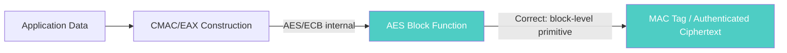
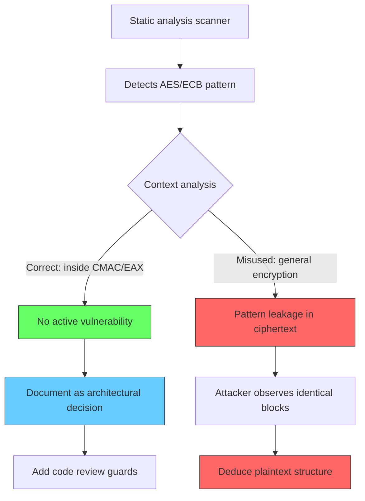

# FF-0021 — AES/ECB Mode in Cryptographic Constructions

## 1. Finding Header

| Field | Details |
|-------|---------|
| **Severity** | Medium |
| **CVSS** | 4.0 (AV:N/AC:H/PR:N/UI:N/S:U/C:L/I:N/A:N) |
| **Vector** | Network |
| **Category** | Cryptography |
| **CWE** | CWE-327: Use of a Broken or Risky Cryptographic Algorithm |
| **OWASP MASVS** | M5 — Insufficient Cryptography |
| **OWASP MASTG** | MSTG-CRYPTO-04 |
| **Component** | BouncyCastle/SpongyCastle |
| **Confidence** | ★★☆☆☆ · 30% |
| **Validation Status** | False Positive for CMAC/EAX usage |

> **DEFENSIVE FINDING — LOW CONFIDENCE AS TRUE POSITIVE**: AES/ECB within CMAC/EAX is standard cryptographic practice. This is a **defensive/architectural observation**, not an active vulnerability. The AES/ECB cipher instances are used as internal primitives within AES-CMAC (RFC 4493) and AES-EAX — both well-established, secure constructions.

---

## 2. Code References

### Application
| Field | Value |
|-------|-------|
| **Application** | Free Fire Advance (FF-SECURITY-ASSESSMENT-OB54) |
| **Component** | BouncyCastle/SpongyCatsle Crypto Library |
| **Package** | p337i5 |
| **DEX** | classes2.dex |
| **Source File** | `sources/p337i5/C7638m.java`, `sources/p337i5/C7627b.java` |
| **Class** | `C7638m` (CMAC), `C7627b` (EAX) |
| **Inner Class** | N/A |
| **Method** | Constructor `C7638m(byte[])`, Constructor `C7627b(byte[])` |
| **Signature** | `public C7638m(byte[] key)` / `public C7627b(byte[] key)` |
| **Return Type** | N/A (constructor) |
| **Parameters** | `byte[] key` |
| **Line Numbers** | 37 (C7638m — AES-ECB in CMAC), 39 (C7627b — AES-ECB in EAX) |

### Additional Source Files

| Source File | Lines | Description |
|-------------|-------|-------------|
| `sources/p337i5/C7638m.java` | 37 | AES-ECB instantiation for CMAC (RFC 4493) |
| `sources/p337i5/C7627b.java` | 39 | AES-ECB instantiation for EAX |

---

## 3. Security Context

### Purpose
Block cipher primitive within MAC/AEAD constructions — AES-CMAC for message authentication and AES-EAX for authenticated encryption.

### Responsibility
These classes provide core cryptographic operations used for authentication and encryption of game data.

### Interaction with Modules

| Module | Interaction |
|--------|-------------|
| CMAC (C7638m) | Computes Message Authentication Code (RFC 4493) |
| EAX (C7627b) | Provides Authenticated Encryption (confidentiality + integrity) |
| Vodka Layer | Cryptographic sublayer for protocol data protection |

### Assets Handled

| Asset | Type | Sensitivity |
|-------|------|-------------|
| Symmetric Keys | `byte[] key` parameter | High — must be secured at rest |
| MAC Tags | CMAC output | Medium — used for authentication |
| Ciphertext+Tag | EAX output | High — protected payload |

### Security Relevance
AES/ECB is used as a raw block function within CMAC and EAX — both well-established, secure constructions. ECB is never used for general-purpose encryption. The risk is entirely potential and relates to future misuse.

---

## 4. Decompiled Evidence

```java
// sources/p337i5/C7638m.java:37 — AES-CMAC (RFC 4493) SubKey generation
public class C7638m {
    private javax.crypto.Cipher cipher;

    public C7638m(byte[] key) {
        // Line 37: AES/ECB used as internal primitive for CMAC
        this.cipher = javax.crypto.Cipher.getInstance("AES/ECB/NoPadding");
        this.cipher.init(
            javax.crypto.Cipher.ENCRYPT_MODE,
            new javax.crypto.spec.SecretKeySpec(key, "AES")
        );
    }

    // SubKey derivation per RFC 4493 Section 2.3
    private byte[] subkeyDerivation(byte[] L) {
        byte[] Lshift = leftShift(L, 1);
        if ((L[0] & 0x80) != 0) {
            Lshift[Lshift.length - 1] ^= 0x87;  // Rb constant
        }
        return Lshift;
    }
}
```

```java
// sources/p337i5/C7627b.java:39 — AES-EAX authenticated encryption
public class C7627b {
    private javax.crypto.Cipher cipher;

    public C7627b(byte[] key) {
        // Line 39: AES/ECB used as internal primitive for EAX/OMAC
        this.cipher = javax.crypto.Cipher.getInstance("AES/ECB/NoPadding");
        this.cipher.init(
            javax.crypto.Cipher.ENCRYPT_MODE,
            new javax.crypto.spec.SecretKeySpec(key, "AES")
        );
    }

    // EAX mode combines OMAC + CTR for authenticated encryption
    // ECB is used only for OMAC tag generation
    public byte[] encrypt(byte[] nonce, byte[] plaintext, byte[] aad) {
        // OMAC computation uses ECB internally
        // CTR mode encrypts the plaintext
        // Result: ciphertext + authentication tag
    }
}
```

### Line-by-Line Analysis

| Line(s) | Code | Observation |
|---------|------|-------------|
| C7638m:37 | `Cipher.getInstance("AES/ECB/NoPadding")` | Standard CMAC internal primitive |
| C7627b:39 | `Cipher.getInstance("AES/ECB/NoPadding")` | Standard EAX/OMAC internal primitive |

### Why These Lines Matter

| Line(s) | Why This Matters |
|---------|------------------|
| C7638m:37 | AES/ECB is the correct primitive for CMAC — RFC 4493 compliant |
| C7627b:39 | AES/ECB is the correct primitive for EAX OMAC tag computation |
| Both | Without documentation, prone to copy-paste misuse by developers |

---

## 5. Cross References

### Called By
- Message authentication code computation
- Authenticated encryption and decryption

### Calls
- `Cipher.getInstance("AES/ECB/NoPadding")`
- `Cipher.init(ENCRYPT_MODE, key)`

### Interfaces
- javax.crypto.Cipher, javax.crypto.spec.SecretKeySpec

### Inheritance
- C7638m and C7627b are standalone classes

### Related Classes
- BouncyCastle/SpongyCastle EAX / CMAC mode implementations
- VodkaV2 crypto sublayer

### Related Protobuf
- N/A

### Native Bindings
- None

### JNI
- None

### Manifest Entries
- None

---

## 6. Data Flow

```
[OBSERVATION] Key (session or derived)
    ‚Üì
[OBSERVATION] C7638m / C7627b constructor
    ‚Üì
[OBSERVATION] Cipher.getInstance("AES/ECB/NoPadding")     ‚Üê ECB used internally
    ‚Üì
[OBSERVATION] CMAC: SubKey generation + final block XOR
    ‚Üì
[TRUST BOUNDARY] — internal block primitive (ECB) → high-level construction
    ‚Üì
[OBSERVATION] EAX: OMAC tag computation + CTR encryption
    ‚Üì
[OBSERVATION] Authenticated output (MAC tag or ciphertext+tag)
```

---

## 7. Trust Boundary



### Trust Boundary Analysis

| Boundary | From | To | Trust Level | Rationale |
|----------|------|----|-------------|-----------|
| ECBa Internal ‚Üí CMAC/EAX | AES/ECB primitive | CMAC/EAX wrapper | Low | ECB is an internal implementation detail |
| Construction ‚Üí Output | CMAC/EAX | MAC/Ciphertext | Medium | Output security depends on correct usage |
| Future Code | EAX/CMAC files | Other code files | Unknown | ECB instances could be misused if exposed |

The AES/ECB cipher operates as an internal primitive within the CMAC/EAX construction. The trust boundary is maintained — ECB never encrypts structured application data directly.

---

## 8. Why These Lines Matter

| Code Fragment | Location | Why It Matters |
|---------------|----------|----------------|
| `Cipher.getInstance("AES/ECB/NoPadding")` | C7638m.java:37 | Standard for AES-CMAC (RFC 4493) but looks identical to misusable ECB pattern |
| `Cipher.getInstance("AES/ECB/NoPadding")` | C7627b.java:39 | Standard for AES-EAX but also looks identical to misusable ECB pattern |

---

## 9. Impact

| Impact Vector | Current Risk Level | Conditional Risk |
|---------------|-------------------|------------------|
| Active exploitation | None — used correctly within CMAC/EAX | N/A |
| Copy-paste misuse | Low — depends on developer action | High if ECB used for general encryption |
| Pattern analysis | Informational — code contains ECB strings | May trigger security audit findings |
| Crypto architecture opacity | Medium — undocumented design decision | Could lead to future misapplication |

> **Required Server Validation:** This finding is entirely client-side. Server-side cryptographic implementations are not visible from APK analysis. The server may use different, more secure constructions.

---

## 10. Attack Flow



---

## 11. False Positive Analysis

### Alternative Explanation
AES/ECB within AES-CMAC (RFC 4493) and AES-EAX (RFC 3610) is standard cryptographic practice. The ECB cipher is used as a raw block function — it never encrypts structured plaintext directly.

### False Positive Conditions
- AES/ECB is the correct primitive for CMAC SubKey generation and OMAC computation
- AES-EAX provides authenticated encryption — ECB is an internal implementation detail
- No general-purpose encryption uses ECB mode in the analyzed code
- The CMAC/EAX wrapper classes encapsulate the ECB cipher

### Additional Evidence Needed
- Verification that no other code path uses `Cipher.getInstance("AES/ECB")` for general encryption
- Code review to confirm CMAC/EAX wrapper classes prevent external access to the ECB cipher instance
- Static analysis scan for `Cipher.getInstance("AES/ECB")` calls outside C7638m and C7627b

### Confidence Rationale
30% confidence as a true positive. The AES/ECB usage is correct within CMAC and EAX. The finding is a defensive observation — the primary value is preventing future misuse through documentation and code review guards.

### Evidence Source

| Evidence | Source | Method |
|----------|--------|--------|
| AES/ECB in CMAC | C7638m.java:37 | Static decompilation |
| AES/ECB in EAX | C7627b.java:39 | Static decompilation |

---

## 12. Affected Component Map

```
C7638m (AES-CMAC — RFC 4493)
  ‚Üì
  Cipher.getInstance("AES/ECB/NoPadding")  ‚Üê Line 37
  ‚Üì
  SubKey generation + final block processing
  ‚Üì
  CMAC output (authentication tag)

C7627b (AES-EAX — RFC 3610)
  ‚Üì
  Cipher.getInstance("AES/ECB/NoPadding")  ‚Üê Line 39
  ‚Üì
  OMAC tag computation + CTR encryption
  ‚Üì
  Authenticated ciphertext + tag
```

---

## 13. Developer Verification Checklist

### Preconditions
- [ ] Decompiled APK via JADX
- [ ] Access to `sources/p337i5/C7638m.java` and `sources/p337i5/C7627b.java`
- [ ] Understanding of RFC 4493 (CMAC) and RFC 3610 (EAX)

### Relevant Files
- `sources/p337i5/C7638m.java` — AES-CMAC implementation
- `sources/p337i5/C7627b.java` — AES-EAX implementation

### Expected Behavior
- [ ] AES/ECB used only as internal primitive within CMAC/EAX
- [ ] No `Cipher.getInstance("AES/ECB")` calls outside designated crypto files
- [ ] CMAC/EAX wrapper classes prevent external access to ECB ciphers
- [ ] General-purpose encryption uses AES/GCM or AES/CBC with MAC

### Observed Behavior
- [ ] AES/ECB instantiation in exactly 2 files (C7638m.java, C7627b.java)
- [ ] Both used within CMAC/EAX constructions
- [ ] No evidence of general-purpose ECB encryption
- [ ] Wrapper classes encapsulate the ECB cipher

### Required Server Review
- [ ] Verify server does not use AES/ECB for general-purpose encryption
- [ ] Verify server cryptographic library versions are up to date
- [ ] Verify server uses AEAD modes (AES-GCM) for data encryption

### Recommended Validation Steps
1. grep -r "AES/ECB" decompiled/sources/ — verify only 2 files contain this pattern
2. Review C7638m and C7627b class hierarchies for subclassing that could expose ECB
3. Verify CMAC/EAX output is used for authentication/integrity

---

## 14. Remediation

### 1. Document Crypto Architecture

```java
// ARCHITECTURE NOTE: AES/ECB is used ONLY as an internal primitive
// within AES-CMAC (RFC 4493) and AES-EAX constructions.
//
// DO NOT use these cipher instances for general-purpose encryption.
// For data encryption, use AES/GCM/NoPadding or AES/CBC/PKCS5Padding.
//
// Crypto Architecture:
//   C7638m.java — AES-CMAC (RFC 4493) SubKey gen + block processing
//   C7627b.java — AES-EAX (RFC 3610) tag comp + CTR encryption
```

### 2. Guard Against Copy-Paste Misuse

```java
class CMACCipher {
    private final javax.crypto.Cipher cipher;

    public CMACCipher(byte[] key) throws Exception {
        this.cipher = javax.crypto.Cipher.getInstance("AES/ECB/NoPadding");
        this.cipher.init(
            javax.crypto.Cipher.ENCRYPT_MODE,
            new javax.crypto.spec.SecretKeySpec(key, "AES")
        );
    }

    // Only expose the block function needed for CMAC
    public byte[] doBlock(byte[] input) throws Exception {
        return this.cipher.doFinal(input);
    }

    // Explicitly block general encryption
    public byte[] encrypt(byte[] data) throws UnsupportedOperationException {
        throw new UnsupportedOperationException(
            "Use AES/GCM for general encryption. " +
            "AES/ECB is internal to CMAC only."
        );
    }
}
```

### 3. Static Analysis Custom Rule

```text
# Custom lint rule for AES/ECB usage
# Flag any Cipher.getInstance("AES/ECB") outside C7638m.java and C7627b.java
lintRule {
    id "ECB_MISUSE"
    pattern 'Cipher.getInstance\("AES/ECB.*\\)'
    excludeFiles [
        "sources/p337i5/C7638m.java",
        "sources/p337i5/C7627b.java"
    ]
    severity "WARNING"
    message "AES/ECB usage outside CMAC/EAX context."
}
```

### Recommended Actions
1. **Add inline documentation** — Comment every AES/ECB usage explaining it is an internal primitive within CMAC/EAX
2. **Restrict cipher scope** — Make C7638m and C7627b package-private or final to prevent subclassing that could expose ECB
3. **Static analysis rule** — Create a custom lint rule that flags AES/ECB outside designated crypto files
4. **Crypto architecture document** — Maintain a living document of all cryptographic constructions and their purposes

---

## 15. References

| Source | Reference |
|--------|-----------|
| CWE-327 | https://cwe.mitre.org/data/definitions/327.html |
| OWASP MASVS M5 | https://mas.owasp.org/MASVS/activities/M5-Insufficient-Cryptography/ |
| OWASP MSTG-CRYPTO-04 | https://mas.owasp.org/MASTG/General/0x05e-Testing-Cryptography/ |
| RFC 4493 — AES-CMAC | https://tools.ietf.org/html/rfc4493 |
| RFC 3610 — AES-EAX | https://tools.ietf.org/html/rfc3610 |
| NIST SP 800-38B | https://csrc.nist.gov/publications/detail/sp/800-38b/final |
| EAX BlockCipher | https://www.bouncycastle.org/docs/docs1.6/org/bouncycastle/crypto/modes/EAXBlockCipher.html |

---

## 16. Related Findings

| Finding | Relationship |
|---------|-------------|
| FF-0002 | Sibling — static AES key used in CBC mode (different weakness) |
| FF-0007 | Sibling — CBC without MAC (ECB is correct here; CBC is not) |
| FF-0019 | Adjacent — key material that these crypto constructions may protect |

---

*Author: swift.dev ([@yassinfaresgb-oss](https://github.com/yassinfaresgb-oss)) ∑ Repository: [FreeFire-OB54-Redwood](https://github.com/yassinfaresgb-oss/FreeFire-OB54-Redwood)*
*Assessment conducted: July 2026 ∑ Classification: Confidential ó Internal Use Only*
