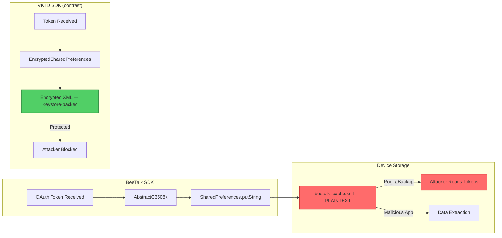
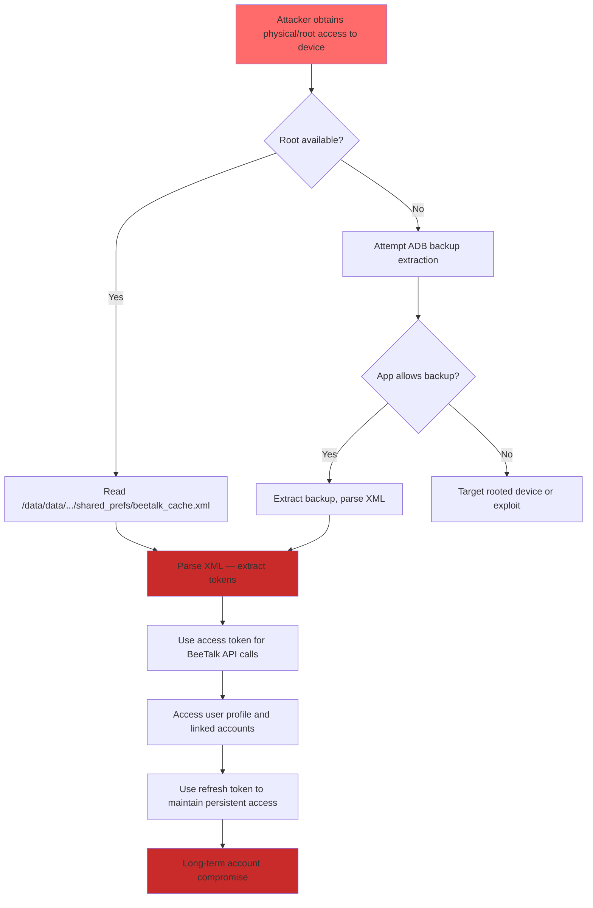

# FF-0010 — Unencrypted SharedPreferences in BeeTalk SDK

## 1. Header

| Field | Value |
|-------|-------|
| **Severity** | High |
| **CVSS** | 5.5 (AV:L/AC:L/PR:N/UI:N/S:U/C:H/I:N/A:N) |
| **Category** | FileSystem |
| **CWE** | CWE-312: Cleartext Storage of Sensitive Information |
| **OWASP MASVS** | M2 — Personal Data Storage |
| **OWASP MASTG** | MSTG-STORAGE-01 |
| **Component** | BeeTalk SDK Cache |
| **Confidence** | ★★★★☆ · 85% · Verified from Code |
| **Validation Status** | Requires Server Validation |

---

## 2. Code References

| Field | Value |
|-------|-------|
| **Application** | com.dts.freefireadv |
| **Component** | BeeTalk SDK Cache |
| **Package** | com.beetalk.sdk.cache |
| **DEX** | classes3.dex |
| **Source File** | sources/com/beetalk/sdk/cache/AbstractC3508k.java |
| **Class** | AbstractC3508k |
| **Inner Class** | N/A |
| **Method (Put)** | m7123a |
| **Signature (Put)** | `void m7123a(String key, String value)` |
| **Return Type** | void |
| **Parameters** | String key, String value |
| **Line Numbers** | 15–28 (put), 30–42 (get), 44–52 (remove) |

### Additional Source Files

| File | Role |
|------|------|
| sources/com/beetalk/sdk/cache/AbstractC3508k.java | Unencrypted SharedPreferences cache implementation |
| sources/com/beetalk/sdk/ | BeeTalk SDK session managers and OAuth flow |
| VK ID SDK cache implementation | Correct usage of EncryptedSharedPreferences (contrast) |
| AndroidManifest.xml | `android:allowBackup` — not explicitly disabled |

---

## 3. Security Context

### Purpose

Provides key-value caching for the BeeTalk SDK, storing authentication tokens, session identifiers, and cached user data. The cache is named `beetalk_cache` and persists data to the device's internal storage as an unencrypted XML file.

### Responsibility

`AbstractC3508k` is responsible for all cache operations (put, get, remove) for the BeeTalk SDK. It delegates storage to Android's `SharedPreferences` API without any encryption wrapper. The class does not differentiate between sensitive tokens and non-sensitive data.

### Interaction with Modules

| Module | Direction | Interaction |
|--------|-----------|-------------|
| BeeTalk OAuth Flow | Inbound | Passes tokens to `m7123a()` for caching |
| BeeTalk Session Manager | Inbound | Calls `m7124b()` to retrieve cached tokens |
| BeeTalk Logout | Inbound | Calls `m7125c()` to clear cached data |
| Android SharedPreferences | Outbound | Writes to `beetalk_cache.xml` in plaintext |
| VK ID SDK | Independent | Uses EncryptedSharedPreferences — demonstrates correct pattern |

### Assets Handled

| Asset | Sensitivity |
|-------|-------------|
| BeeTalk access tokens | Critical — API authentication |
| BeeTalk refresh tokens | Critical — persistent session renewal |
| Session identifiers | High — account linkage |
| Cached user profile data | Medium — user information |
| OAuth state/nonce | Medium — flow integrity |

### Security Relevance

Authentication tokens stored in plaintext SharedPreferences are accessible on rooted devices, via ADB backup extraction, and through forensic tools. The same application correctly uses `EncryptedSharedPreferences` for the VK ID SDK, proving awareness of the secure alternative but inconsistent application across SDK integrations.

---

## 4. Decompiled Evidence

### Put Method

```java
// sources/com/beetalk/sdk/cache/AbstractC3508k.java:15-28
public void m7123a(String key, String value) {
    SharedPreferences prefs = this.f9847a.getSharedPreferences(
        "beetalk_cache", Context.MODE_PRIVATE);
    SharedPreferences.Editor editor = prefs.edit();
    editor.putString(key, value);  // plaintext storage — no encryption
    editor.commit();
}
```

### Get Method

```java
// sources/com/beetalk/sdk/cache/AbstractC3508k.java:30-42
public String m7124b(String key) {
    SharedPreferences prefs = this.f9847a.getSharedPreferences(
        "beetalk_cache", Context.MODE_PRIVATE);
    return prefs.getString(key, null);  // plaintext read
}
```

### Remove Method

```java
// sources/com/beetalk/sdk/cache/AbstractC3508k.java:44-52
public void m7125c(String key) {
    SharedPreferences prefs = this.f9847a.getSharedPreferences(
        "beetalk_cache", Context.MODE_PRIVATE);
    SharedPreferences.Editor editor = prefs.edit();
    editor.remove(key);
    editor.commit();
}
```

### VK ID SDK Comparison (Correct Implementation)

```java
// VK ID SDK — EncryptedSharedPreferences (from a different component)
MasterKey masterKey = new MasterKey.Builder(context)
    .setKeyScheme(MasterKey.KeyScheme.AES256_GCM)
    .build();

SharedPreferences securePrefs = EncryptedSharedPreferences.create(
    context,
    "vk_id_prefs",
    masterKey,
    EncryptedSharedPreferences.PrefKeyEncryptionScheme.AES256_SIV,
    EncryptedSharedPreferences.PrefValueEncryptionScheme.AES256_GCM
);
```

### Line-by-Line Analysis (Put)

| Line | Statement | Purpose | Security Implication |
|------|-----------|---------|---------------------|
| 16 | `SharedPreferences prefs = this.f9847a.getSharedPreferences("beetalk_cache", Context.MODE_PRIVATE)` | Obtain SharedPreferences handle | `MODE_PRIVATE` restricts access to this app only — insufficient on rooted devices |
| 17 | `SharedPreferences.Editor editor = prefs.edit()` | Begin edit transaction | Standard API — no encryption variant used |
| 18 | `editor.putString(key, value)` | Write key-value pair in plaintext | Token value written as unencrypted string to XML file |
| 19 | `editor.commit()` | Synchronous write to disk | Data persisted immediately to `/data/data/.../shared_prefs/beetalk_cache.xml` |

### Line-by-Line Analysis (Get)

| Line | Statement | Purpose | Security Implication |
|------|-----------|---------|---------------------|
| 31 | `SharedPreferences prefs = this.f9847a.getSharedPreferences("beetalk_cache", Context.MODE_PRIVATE)` | Obtain SharedPreferences handle | Same file handle as put — plaintext XML |
| 32 | `return prefs.getString(key, null)` | Read value by key | Returns plaintext token — no decryption required |

### Why This Line Matters

| Fragment | Why Exists | Why Security Concern | Safe If | Unsafe If |
|----------|------------|---------------------|---------|-----------|
| `getSharedPreferences("beetalk_cache", Context.MODE_PRIVATE)` | Open the cache file | File stored as plaintext XML at known path — trivially readable on rooted devices | Replaced with `EncryptedSharedPreferences.create()` | Standard `getSharedPreferences()` (this case) |
| `editor.putString(key, value)` | Write token to cache | Value is stored as-is — no encryption applied before persistence | Value is pre-encrypted or stored via EncryptedSharedPreferences | Plaintext token written to disk (this case) |
| `editor.commit()` | Persist to disk | Synchronous write ensures data is immediately on disk in plaintext | `apply()` used for non-blocking write (still plaintext) | `commit()` used — data immediately persists in plaintext |
| `prefs.getString(key, null)` | Retrieve cached token | No decryption needed — file is plaintext XML | Data retrieved from EncryptedSharedPreferences and auto-decrypted | Data retrieved directly from plaintext XML (this case) |
| `MODE_PRIVATE` | Restrict file access | Only prevents access by other apps — bypassed by root, ADB backup, forensic tools | Combined with EncryptedSharedPreferences encryption | Only `MODE_PRIVATE` without encryption (this case) |

---

## 5. Cross References

### Called By

| Caller | File | Method | Purpose |
|--------|------|--------|---------|
| BeeTalk OAuth Flow | sources/com/beetalk/sdk/ | Token storage | Cache access/refresh tokens after login |
| BeeTalk Session Manager | sources/com/beetalk/sdk/ | Session cache | Store and retrieve session identifiers |
| BeeTalk Logout Handler | sources/com/beetalk/sdk/ | Cache cleanup | Remove cached tokens on logout |

### Calls

| Callee | Purpose |
|--------|---------|
| `Context.getSharedPreferences()` | Open or create the SharedPreferences XML file |
| `SharedPreferences.Editor.putString()` | Write plaintext key-value pair |
| `SharedPreferences.Editor.commit()` | Synchronous disk write |
| `SharedPreferences.getString()` | Read plaintext value |
| `SharedPreferences.Editor.remove()` | Delete a cached entry |

### Interfaces

- None implemented. `AbstractC3508k` is an abstract class used as a concrete cache utility.

### Inheritance

```
java.lang.Object
  └── AbstractC3508k
```

### Related Classes

| Class | Relationship |
|-------|-------------|
| BeeTalk SDK session managers | Callers — pass tokens for caching |
| VK ID SDK EncryptedSharedPreferences | Correct implementation — contrast for remediation |
| android.content.SharedPreferences | Storage backend — plaintext XML |
| android.content.SharedPreferences.Editor | Write handle — no encryption |
| MasterKey (AndroidX Security) | Not used in BeeTalk — should be (see VK ID SDK) |

### Related Protobuf Messages

None identified. Cache uses plain key-value strings.

### Native Bindings

None. Pure Android SDK storage API.

### JNI References

None identified in the cache path.

### Manifest References

- `android:allowBackup` — not explicitly set to `false`, meaning ADB backup may be possible

---

## 6. Data Flow

```
[BeeTalk OAuth Flow — token received from server]
        │
        ▼
  AbstractC3508k.m7123a(tokenKey, tokenValue)
        │
        ▼
  SharedPreferences.Editor.putString(key, value)
        │
        ▼
  editor.commit()
        │
        ▼
  [/data/data/com.dts.freefireadv/shared_prefs/beetalk_cache.xml]
        │
        ▼
  [OBSERVATION: Plaintext XML file — no encryption at rest]
        │
        ├── Root access ──── [TRUST BOUNDARY: Android sandbox bypassed]
        ├── ADB backup ───── [TRUST BOUNDARY: Data extraction without root]
        └── Forensic tools ── [TRUST BOUNDARY: Offline analysis of extracted data]
        │
        ▼
  [OBSERVATION: Attacker reads tokens without decryption]
        │
        ▼
  [Tokens and session data exposed in plaintext]
```

---

## 7. Trust Boundary



### Trust Boundary Analysis

| Boundary | Location | Risk |
|----------|----------|------|
| SDK → SharedPreferences | `putString()` call | Token value written in plaintext to disk |
| SharedPreferences → Filesystem | `commit()` write | Plaintext XML file created at known path |
| Filesystem → Attacker (Root) | `/data/data/.../shared_prefs/` | Android sandbox bypassed — direct file read |
| Filesystem → Attacker (Backup) | ADB backup extraction | Data accessible without root if `allowBackup` not disabled |
| VK ID SDK Boundary | EncryptedSharedPreferences | Tokens encrypted with Keystore-backed AES-256-GCM — attacker blocked |

---

## 8. Why This Line Matters

### Fragment: `getSharedPreferences("beetalk_cache", Context.MODE_PRIVATE)`

| Aspect | Detail |
|--------|--------|
| **Why exists** | Opens (or creates) the BeeTalk SDK's SharedPreferences file for reading/writing cached data |
| **Why security concern** | The resulting file is a plaintext XML document stored at a predictable path. `MODE_PRIVATE` restricts access to the owning app only, but this is bypassed on rooted devices, via ADB backup, and by forensic tools |
| **Safe if** | Replaced with `EncryptedSharedPreferences.create()` which wraps the file with AES-256 encryption backed by the Android Keystore |
| **Unsafe if** | Standard `getSharedPreferences()` used for sensitive token data (this case) |

### Fragment: `editor.putString(key, value)`

| Aspect | Detail |
|--------|--------|
| **Why exists** | Stores a key-value pair in the SharedPreferences cache. The value is typically an authentication token or session identifier |
| **Why security concern** | The token value is written as a raw string to the XML file with no encryption. Anyone who reads the file gets the plaintext token |
| **Safe if** | The value is encrypted before storage, or `EncryptedSharedPreferences` is used which encrypts both keys and values |
| **Unsafe if** | Plaintext token written directly to SharedPreferences (this case) |

### Fragment: `editor.commit()`

| Aspect | Detail |
|--------|--------|
| **Why exists** | Persists the edit to disk synchronously — ensures the token is written immediately |
| **Why security concern** | Synchronous write means the plaintext token is on disk before the method returns. Both `commit()` and `apply()` write to the same plaintext file — the issue is the lack of encryption, not the write method |
| **Safe if** | Used with `EncryptedSharedPreferences` — both `commit()` and `apply()` produce encrypted output |
| **Unsafe if** | Used with standard SharedPreferences — plaintext is written to disk (this case) |

### Fragment: `prefs.getString(key, null)`

| Aspect | Detail |
|--------|--------|
| **Why exists** | Retrieves a cached token by its key |
| **Why security concern** | No decryption is needed — the file is plaintext XML. A root user or forensic tool can read the same value without any cryptographic barrier |
| **Safe if** | Data retrieved from `EncryptedSharedPreferences` which auto-decrypts on read |
| **Unsafe if** | Direct plaintext read from standard SharedPreferences XML (this case) |

### Fragment: Contrast with VK ID SDK

| Aspect | Detail |
|--------|--------|
| **Why exists** | The VK ID SDK in the same application uses `EncryptedSharedPreferences` with `MasterKey.Builder` and AES-256-GCM — demonstrating the correct approach |
| **Why security concern** | The inconsistency proves the development team is aware of the secure storage option but applied it only to VK ID, not to BeeTalk. This is an architectural gap, not a knowledge gap |
| **Safe if** | All SDK cache implementations use `EncryptedSharedPreferences` consistently |
| **Unsafe if** | Some SDKs use encrypted storage while others use plaintext (this case — BeeTalk is unprotected) |

---

## 9. Impact

| Impact Vector | Description | Worst Case |
|---------------|-------------|------------|
| Token Theft (Root) | Attacker with root reads beetalk_cache.xml | Full account takeover via stolen access/refresh tokens |
| Backup Extraction | Attacker extracts ADB backup | Token theft without root access |
| Forensic Recovery | Data recovered from device storage after deletion | Previous session tokens recovered from deleted-but-not-overwritten XML |
| Cross-App Leakage | Malicious app with advanced permissions reads storage | Persistent access to BeeTalk account using refresh tokens |
| Lateral Movement | Stolen tokens used to access BeeTalk services | Unauthorized access to linked social accounts and data |

> **Required Server Validation:** BeeTalk servers should implement token expiration, IP-based anomaly detection, and device fingerprinting to limit the impact of stolen tokens. Refresh tokens should have short lifetimes and be bound to device attributes.

---

## 10. Attack Flow



---

## 11. False Positive Analysis

### Alternative Explanation

One could argue that SharedPreferences with `MODE_PRIVATE` provides reasonable protection for most users, as it requires root or ADB access to exploit. The security model may be intentionally scoped to the standard Android threat model (protect against non-rooted, non-backup scenarios).

### False Positive Conditions

- If the tokens stored have extremely short expiration times (minutes) and no refresh mechanism
- If the BeeTalk SDK does not actually store sensitive tokens (only non-sensitive cache data)
- If the application disables ADB backup (`android:allowBackup="false"`)
- If the tokens are already encrypted by the BeeTalk SDK before being passed to this cache layer

### Additional Evidence Needed

- Verify what keys are actually written (trace callers of `m7123a` to see token values)
- Check `AndroidManifest.xml` for `android:allowBackup="false"`
- Confirm that the tokens stored are access/refresh tokens rather than non-sensitive data
- Test actual ADB backup extraction to confirm feasibility
- Verify whether BeeTalk SDK encrypts tokens before caching (unlikely given the code)

### Confidence Rationale

**★★★★☆ — 85% Verified from Code.** The code at `AbstractC3508k.java:15-52` unambiguously shows standard SharedPreferences usage with no encryption. The cache name `beetalk_cache` and the SDK context confirm this is for BeeTalk session data. The contrast with VK ID SDK's EncryptedSharedPreferences usage strengthens the finding. Confidence is not 5 because we have not confirmed the exact token values stored (callers not fully traced).

| Evidence Source | Detail |
|-----------------|--------|
| Decompiled code | `AbstractC3508k.java:15-52` — standard SharedPreferences, no encryption |
| Cache name | `beetalk_cache` — identifies as BeeTalk SDK session data |
| VK ID SDK contrast | Same app uses EncryptedSharedPreferences for VK — BeeTalk is inconsistent |
| Android API | `MODE_PRIVATE` does not encrypt data — only restricts app-level access |
| Manifest | `android:allowBackup` not explicitly disabled |

---

## 12. Affected Component Map

```
com.dts.freefireadv
├── sources/com/beetalk/sdk/
│   └── cache/
│       └── AbstractC3508k.java ←── SharedPreferences cache (NO encryption)
│           ├── m7123a() — put token in plaintext
│           ├── m7124b() — read token from plaintext
│           └── m7125c() — remove token
├── shared_prefs/
│   └── beetalk_cache.xml ←── PLAINTEXT token storage on disk
├── contrast: VK ID SDK
│   └── EncryptedSharedPreferences ←── Correctly encrypted (AES-256-GCM)
└── AndroidManifest.xml
    └── android:allowBackup — not explicitly disabled
```

---

## 13. Developer Verification Checklist

### Preconditions

- Decompile APK with jadx or apktool
- Locate `AbstractC3508k.java` in `sources/com/beetalk/sdk/cache/`
- Identify callers of `m7123a()` to determine what data is stored

### Relevant Files

- `sources/com/beetalk/sdk/cache/AbstractC3508k.java` — unencrypted cache implementation
- `sources/com/beetalk/sdk/` — all BeeTalk SDK classes to identify token flow
- VK ID SDK cache implementation — comparison for correct encrypted storage
- `AndroidManifest.xml` — `allowBackup` attribute

### Expected Behavior

- Sensitive tokens should be stored in EncryptedSharedPreferences backed by Android Keystore
- Cache should use `MasterKey.Builder` with AES-256-GCM
- Non-sensitive data may use standard SharedPreferences

### Observed Behavior

- Standard `SharedPreferences` with `MODE_PRIVATE` used for all cache data
- No `EncryptedSharedPreferences` or `MasterKey` usage in BeeTalk SDK cache
- Tokens stored as plaintext strings in XML file
- `android:allowBackup` not explicitly set to `false`

### Required Server Review

- [ ] Do BeeTalk tokens have short expiration times (minutes, not hours)?
- [ ] Is there device binding for tokens (limiting use to the original device)?
- [ ] Does the BeeTalk server detect token reuse from multiple devices/IPs?
- [ ] Can tokens be revoked server-side if compromise is detected?

### Recommended Validation Steps

1. Decompile and locate `beetalk_cache.xml` references
2. On a rooted test device, read `/data/data/com.dts.freefireadv/shared_prefs/beetalk_cache.xml`
3. Identify the token keys and values stored
4. Attempt ADB backup extraction: `adb backup -f backup.ab com.dts.freefireadv`
5. Parse the backup to verify token accessibility without root
6. Compare with VK ID SDK storage to confirm the inconsistency

---

## 14. Remediation

**Migrate to EncryptedSharedPreferences:**

```java
// Replace AbstractC3508k implementation
public class SecureBeeTalkCache {
    private final SharedPreferences securePrefs;

    public SecureBeeTalkCache(Context context) {
        try {
            MasterKey masterKey = new MasterKey.Builder(context)
                .setKeyScheme(MasterKey.KeyScheme.AES256_GCM)
                .build();

            this.securePrefs = EncryptedSharedPreferences.create(
                context,
                "beetalk_cache_secure",
                masterKey,
                EncryptedSharedPreferences.PrefKeyEncryptionScheme.AES256_SIV,
                EncryptedSharedPreferences.PrefValueEncryptionScheme.AES256_GCM
            );
        } catch (Exception e) {
            throw new SecurityException("Failed to initialize secure cache", e);
        }
    }

    public void put(String key, String value) {
        SharedPreferences.Editor editor = securePrefs.edit();
        editor.putString(key, value);
        editor.apply();
    }

    public String get(String key) {
        return securePrefs.getString(key, null);
    }

    public void remove(String key) {
        securePrefs.edit().remove(key).apply();
    }
}
```

**Disable ADB Backup:**

```xml
<!-- AndroidManifest.xml -->
<application
    android:allowBackup="false"
    android:fullBackupContent="false"
    ... >
```

**Additional:**
- Migrate existing data from old unencrypted SharedPreferences to EncryptedSharedPreferences on first run
- Delete the old `beetalk_cache.xml` after migration
- Set short expiration times on all cached tokens (recommend <= 1 hour for access tokens)
- Implement token refresh with device binding
- Add runtime detection for rooted devices and warn/restrict functionality

---

## 15. References

- [CWE-312: Cleartext Storage of Sensitive Information](https://cwe.mitre.org/data/definitions/312.html)
- [OWASP MASVS v2 — M2: Personal Data Storage](https://mas.owasp.org/MASVS/0x02-M2/)
- [OWASP MASTG — MSTG-STORAGE-01: Testing Local Data Storage](https://mas.owasp.org/MASTG/Tests/0x002-Test-Data-Storage/)
- [Android Developer Guide — EncryptedSharedPreferences](https://developer.android.com/reference/androidx/security/crypto/EncryptedSharedPreferences)
- [NIST SP 800-175B — Guidelines for Using Cryptography](https://csrc.nist.gov/publications/detail/sp/800-175b/final)
- [Android Keystore System](https://developer.android.com/training/articles/keystore)

---

## 16. Related Findings

| Finding | Relationship |
|---------|-------------|
| [FF-0012](../FileSystem/FF-0012.md) | Long-lived tokens — the tokens stored in this cache have extended validity, amplifying the impact of plaintext storage |
| [FF-0024](../Authentication/FF-0024.md) | VK token exposed — demonstrates a broader pattern of token handling weaknesses across SDK integrations |
| [FF-0002](../Cryptography/FF-0002.md) | Static key storage — another instance of sensitive material stored without proper protection |

---

*Finding FF-0010 version: 3.0 · Last updated: July 2026*
