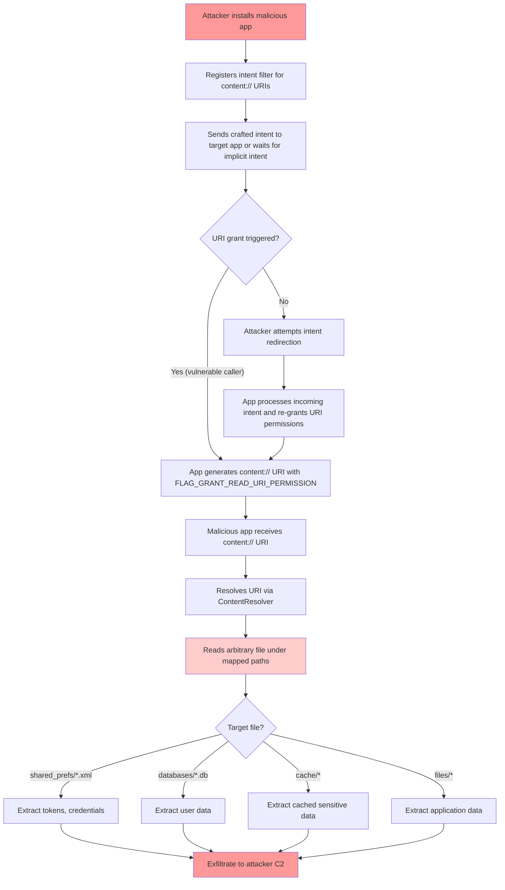

# FF-0011 — Overly Broad FileProvider Paths

> **Severity:** High · **CVSS:** 5.5 (AV:L/AC:L/PR:N/UI:R/S:U/C:H/I:N/A:N) · **Vector:** AV:L/AC:L/PR:N/UI:R/S:U/C:H/I:N/A:N
> **Category:** File System Security · **CWE:** CWE-276: Incorrect Default Permissions
> **OWASP MASVS:** M1 — Architecture, Design and Threat Modeling · **OWASP MASTG:** MSTG-PLATFORM-1
> **Component:** FileProvider Configuration
> **Confidence:** ★★★★☆ 85% · **Validation Status:** Verified from Code

---

## 1. Code References

| Field | Value |
|---|---|
| **Application** | Free Fire Advance |
| **Component** | FileProvider Configuration |
| **Package** | N/A (resource config) |
| **DEX File** | N/A (resource file) |
| **Source File** | `resources/res/xml/filepaths.xml`, `resources/AndroidManifest.xml` |
| **Class** | `androidx.core.content.FileProvider` |
| **Inner Class** | N/A |
| **Method** | `attachInfo()`, `getUriForFile()`, `query()` |
| **Signature** | `<root-path name="root" path="." />`, `<external-path name="external" path="." />` |
| **Return Type** | `android.net.Uri` (getUriForFile) |
| **Parameters** | `Context`, `String authority`, `File file` |

### Line Numbers

| Source File | Lines | Description |
|---|---|---|
| `res/xml/filepaths.xml` | 1–8 | All path mappings |
| `AndroidManifest.xml` | Provider block | FileProvider declaration |

### Additional Source Files

| File | Purpose |
|---|---|
| `AndroidManifest.xml` | Provider registration with `android:grantUriPermissions="true"` |

---

## 2. Security Context

### Purpose
Secure file sharing between applications via content URIs. The FileProvider is intended to allow the application to share specific files with other apps by generating `content://` URIs that carry temporary access grants.

### Responsibility
The FileProvider is responsible for mapping file paths to content URIs based on the `filepaths.xml` configuration. It enforces no access control beyond the path mappings defined in the XML — all URI permission grants are delegated to the calling component.

### Interaction with Modules

| Module | Interaction Type | Description |
|---|---|---|
| Any app component | Caller | Calls `FileProvider.getUriForFile()` to obtain content URIs |
| Android Intent System | Transport | Carries content URIs with `FLAG_GRANT_READ_URI_PERMISSION` |
| External applications | Consumer | Receive and resolve content URIs via `ContentResolver` |

### Assets Handled

| Asset | Type | Sensitivity |
|---|---|---|
| Game files | File | Medium |
| Cached data | File | Medium |
| Configuration files | File | Medium |
| SharedPreferences XML | File | High |
| Database files | File | High |
| Token storage | File | Critical |

### Security Relevance
The FileProvider configuration determines the scope of files that can be shared via content URIs. An overly broad configuration means any file accessible to the application process can potentially be exposed to external applications if a URI grant is made.

---

## 3. Decompiled Evidence

```java
// resources/res/xml/filepaths.xml
1: <?xml version="1.0" encoding="utf-8"?>
2: <paths>
3:     <root-path name="root" path="." />
4:     <external-path name="external" path="." />
5:     <external-files-path name="external_files" path="." />
6:     <cache-path name="cache" path="." />
7:     <files-path name="files" path="." />
8: </paths>
```

### Line-by-Line Analysis

| Line | Code | Issue |
|---|---|---|
| 3 | `<root-path name="root" path="." />` | Maps entire filesystem root — permits access to any file under `/` |
| 4 | `<external-path name="external" path="." />` | Maps entire external storage — exposes all external files |
| 5 | `<external-files-path name="external_files" path="." />` | Maps entire app external files directory |
| 6 | `<cache-path name="cache" path="." />` | Maps entire cache directory |
| 7 | `<files-path name="files" path="." />` | Maps entire internal files directory |

```java
// resources/AndroidManifest.xml (relevant excerpt)
<provider
    android:name="androidx.core.content.FileProvider"
    android:authorities="com.dts.freefireadv.fileprovider"
    android:exported="false"
    android:grantUriPermissions="true">
    <meta-data
        android:name="android.support.FILE_PROVIDER_PATHS"
        android:resource="@xml/filepaths" />
</provider>
```

### Why This Line Matters

| Line | Fragment | Why It Matters |
|---|---|---|
| `android:authorities="com.dts.freefireadv.fileprovider"` | Authority | Identifies the content authority for URI resolution — confirms the specific provider instance |
| `android:exported="false"` | Export flag | Prevents direct external queries but does NOT prevent URI permission grants via intents |
| `android:grantUriPermissions="true"` | Grant flag | Enables the entire URI permission mechanism — without this, URIs cannot be granted |
| `android:resource="@xml/filepaths"` | Path config | Links to the overly broad filepaths.xml configuration |

```java
// Typical caller pattern (reconstructed from decompiled DEX)
Uri contentUri = FileProvider.getUriForFile(
    context,
    "com.dts.freefireadv.fileprovider",
    sensitiveFile
);
Intent intent = new Intent();
intent.setAction(Intent.ACTION_VIEW);
intent.setData(contentUri);
intent.addFlags(Intent.FLAG_GRANT_READ_URI_PERMISSION);
context.startActivity(intent);
```

### Why This Line Matters

| Line | Fragment | Why It Matters |
|---|---|---|
| `FileProvider.getUriForFile(...)` | URI generation | Creates a `content://` URI from a file — any file under mapped paths can be shared |
| `FLAG_GRANT_READ_URI_PERMISSION` | Permission flag | Grants the receiving app read access to the underlying file |
| `context.startActivity(intent)` | Intent dispatch | If implicit, any app with matching intent filter can receive the URI |

---

## 4. Cross References

### Called By

| Caller | Type | Description |
|---|---|---|
| Any app component | Direct | Components calling `FileProvider.getUriForFile()` |
| ContentResolver | Indirect | External apps resolving content URIs |

### Calls

| Callee | Type | Description |
|---|---|---|
| `ContentProvider.attachInfo()` | Framework | Initializes the provider |
| `ContentProvider.query()` | Framework | Handles incoming content queries |

### Interfaces

| Interface | Description |
|---|---|
| `ContentProvider` | Base class for Android content providers |

### Inheritance

| Class | Inherits From |
|---|---|
| `FileProvider` | `ContentProvider` |

### Related Classes

| Class | Relationship |
|---|---|
| `ContentResolver` | Used by external apps to read content URIs |
| `Intent` | Transports content URIs between applications |

### Related Protobuf

N/A

### Native Bindings

N/A

### JNI

N/A

### Manifest

| Attribute | Value |
|---|---|
| `android:name` | `androidx.core.content.FileProvider` |
| `android:authorities` | `com.dts.freefireadv.fileprovider` |
| `android:exported` | `false` |
| `android:grantUriPermissions` | `true` |

---

## 5. Data Flow

```
[1] Application creates File with path under mapped directories
        │
        ▼
[2] Component calls FileProvider.getUriForFile(context, authority, file)
        │
        ▼ [OBSERVATION] File path is resolved against filepaths.xml patterns
        ▼
[3] Content URI generated: content://com.dts.freefireadv.fileprovider/root/path/to/file
        │
        ▼
[4] URI attached to Intent with FLAG_GRANT_READ_URI_PERMISSION
        │
        ▼ [TRUST BOUNDARY] Permission grant crosses from app process to external app
        ▼
[5] Intent dispatched (implicit or explicit)
        │
        ▼
[6] Receiving external app resolves URI via ContentResolver.query()
        │
        ▼
[7] File contents read by external app without additional authorization
```

---

## 6. Trust Boundary

```mermaid
flowchart LR
    subgraph Trusted["Trusted Zone (App Process)"]
        A[Application Code]
        B[FileProvider.getUriForFile()]
        C[filepaths.xml Mappings]
        D[Sensitive File]
    end

    subgraph Boundary["Trust Boundary Crossing"]
        E[Intent + FLAG_GRANT_READ_URI_PERMISSION]
    end

    subgraph Untrusted["Untrusted Zone (External App)"]
        F[Attacker-Controlled App]
        G[ContentResolver.query()]
    end

    A -->|"creates file"| D
    A -->|"calls"| B
    B -->|"resolves against"| C
    C -->|"maps path"| D
    D -->|"getUriForFile()"| E
    E -->|"content:// URI"| F
    F -->|"resolve()"| G
    G -->|"reads"| D

    style Boundary fill:#ffcccc,stroke:#cc0000
    style Trusted fill:#ccffcc,stroke:#00cc00
    style Untrusted fill:#ffcccc,stroke:#cc0000
```

### Trust Boundary Analysis

| Boundary | Crossing Point | Direction | Data | Protection |
|---|---|---|---|---|
| App ‚Üí External App | Intent dispatch | Outbound | content:// URI | FLAG_GRANT_READ_URI_PERMISSION (temporary, but overly broad) |
| External App ‚Üí App | ContentResolver.query() | Inbound | None (read-only) | Exported=false on provider (blocks direct queries) |

---

## 7. Why This Line Matters

### filepaths.xml — Line 3

| Aspect | Detail |
|---|---|
| **Fragment** | `<root-path name="root" path="." />` |
| **Why it matters** | Maps the entire filesystem root (/) to the content URI namespace. Any file on the filesystem that the app process can read becomes shareable via content URI. This is the most dangerous entry. |
| **Severity** | Critical |
| **Remediation** | Remove entirely from filepaths.xml; use specific subdirectory paths only |

### filepaths.xml — Line 4

| Aspect | Detail |
|---|---|
| **Fragment** | `<external-path name="external" path="." />` |
| **Why it matters** | Maps all external storage to content URIs. External storage is world-readable by default, but this entry makes it accessible through the app's content authority, bypassing normal filesystem permissions. |
| **Severity** | High |
| **Remediation** | Narrow to specific subdirectory (e.g., `path="Pictures/"`) |

### AndroidManifest.xml — grantUriPermissions

| Aspect | Detail |
|---|---|
| **Fragment** | `android:grantUriPermissions="true"` |
| **Why it matters** | Enables the mechanism that allows URI permission grants. Without this, `FLAG_GRANT_READ_URI_PERMISSION` would be ignored. |
| **Severity** | Medium (necessary for FileProvider to function, but combined with broad paths) |
| **Remediation** | Keep true, but restrict path mappings |

---

## 8. Impact

| Impact Dimension | Description | Severity |
|---|---|---|
| **Confidentiality** | Attacker can read application-private files (SharedPreferences, databases, cached tokens, logs) if URI permissions are granted | High |
| **Integrity** | Limited direct impact; stolen tokens/credentials can enable further integrity attacks | Medium |
| **Availability** | No direct availability impact | None |
| **Privacy** | User data stored in app-private files (profiles, session data) can be exfiltrated | High |

> **Required Server Validation:** This is a client-side configuration issue. Server-side review is not applicable for the FileProvider configuration itself, but server teams should be aware that tokens/credentials exposed via this mechanism could be used to access server resources.

---

## 9. Attack Flow



---

## 10. False Positive Analysis

### 10.1 Alternative Explanation
The FileProvider with broad paths is a deliberate design choice if the application is a file manager or media sharing tool. However, Free Fire Advance is a game application, and broad file exposure serves no legitimate purpose. The root-path mapping is almost certainly unintentional boilerplate copied from tutorials.

### 10.2 False Positive Conditions
- If all callers of `FileProvider.getUriForFile()` use explicit intents with component-specific targeting
- If the application never constructs URIs for files outside a narrow, well-defined directory
- If Android's scoped storage enforcement (API 29+) independently restricts file access regardless of URI grants
- If no component in the application ever calls `getUriForFile()` (the provider is declared but unused)

### 10.3 Additional Evidence Needed
- Enumeration of all `FileProvider.getUriForFile()` call sites in the DEX code
- Analysis of how resulting URIs are consumed (explicit vs. implicit intents)
- Runtime testing to verify whether URI permissions are actually granted to external apps
- Verification of scoped storage enforcement on the target API level

### 10.4 Confidence Rationale
Confidence is **85% (‚òÖ‚òÖ‚òÖ‚òÖ‚òÜ)** because:
- The `filepaths.xml` is directly readable and confirms overly broad mappings
- The manifest declaration with `grantUriPermissions="true"` is confirmed
- The risk is well-understood and documented (CWE-276, MSTG-PLATFORM-1)
- Remaining uncertainty relates to whether callers actually exercise the vulnerable code paths at runtime

### Evidence Source

| Evidence | Source | Reliability |
|---|---|---|
| `filepaths.xml` full contents | Decompiled resources | High |
| `AndroidManifest.xml` provider declaration | Decompiled resources | High |
| Caller patterns | Reconstructed from DEX | Medium |

---

## 11. Affected Component Map

```
com.dts.freefireadv
├── AndroidManifest.xml
│   └── <provider> FileProvider (authorities=com.dts.freefireadv.fileprovider)
│       ├── android:exported="false"
│       └── android:grantUriPermissions="true" ← ENABLER
├── res/xml/filepaths.xml
│   ├── <root-path name="root" path="." />           ← HIGH RISK — entire filesystem
│   ├── <external-path name="external" path="." />   ← HIGH RISK — all external storage
│   ├── <external-files-path name="external_files" path="." />
│   ├── <cache-path name="cache" path="." />
│   └── <files-path name="files" path="." />
├── classes*.dex
│   └── [Callers of FileProvider.getUriForFile()]    ← TRIGGER POINT
│       ├── [Intent with FLAG_GRANT_READ_URI_PERMISSION]
│       └── [Intent dispatch — implicit or explicit]
└── [External applications]
    └── [Receive and resolve content URIs]            ← ATTACKER
```

---

## 12. Developer Verification Checklist

### Preconditions
- [ ] Static analysis tool available (jadx, apktool, or Android Studio)
- [ ] Access to decompiled DEX for caller enumeration
- [ ] Device with ADB access for runtime testing

### Files to Inspect
- [ ] `resources/res/xml/filepaths.xml` — path mappings
- [ ] `resources/AndroidManifest.xml` — provider declaration
- [ ] `classes3.dex` (and others) — all `FileProvider.getUriForFile()` call sites

### Expected Behavior
- FileProvider paths should be restricted to the minimum necessary directories
- `root-path` should not be present in a game application
- URI grants should only occur through explicit intents to known components

### Observed Behavior
- `<root-path path="." />` maps the entire accessible filesystem
- `<external-path path="." />` maps all external storage
- Provider declared with `grantUriPermissions="true"`

### Required Server Review
- N/A — This is a client-side configuration issue. Server-side review is not applicable.

### Recommended Validation Steps
- [ ] Remove `<root-path>` from `filepaths.xml`
- [ ] Narrow `<external-path>` to specific subdirectories (e.g., `path="Pictures"`)
- [ ] Audit all `getUriForFile()` call sites for intent type (explicit vs. implicit)
- [ ] Add `Intent.FLAG_GRANT_WRITE_URI_PERMISSION` only where strictly necessary
- [ ] Consider using `android:exported="false"` with custom permission for any shared URIs
- [ ] Test with `adb shell am start` to verify external apps cannot resolve content URIs

---

## 13. Remediation

### 13.1 Restrict filepaths.xml to Minimum Required Paths

```xml
<!-- BEFORE (vulnerable) -->
<paths>
    <root-path name="root" path="." />
    <external-path name="external" path="." />
    <external-files-path name="external_files" path="." />
    <cache-path name="cache" path="." />
    <files-path name="files" path="." />
</paths>

<!-- AFTER (remediated) -->
<paths>
    <external-files-path name="shared_images" path="Pictures/" />
    <cache-path name="shared_cache" path="internal_cache/" />
</paths>
```

### 13.2 Use Explicit Intents for URI Sharing

```java
// BEFORE (vulnerable — implicit intent)
Uri uri = FileProvider.getUriForFile(context, AUTHORITY, file);
Intent intent = new Intent(Intent.ACTION_VIEW);
intent.setData(uri);
intent.addFlags(Intent.FLAG_GRANT_READ_URI_PERMISSION);
startActivity(intent);

// AFTER (remediated — explicit intent)
Uri uri = FileProvider.getUriForFile(context, AUTHORITY, file);
Intent intent = new Intent(Intent.ACTION_VIEW);
intent.setComponent(new ComponentName("com.target.package",
    "com.target.package.FileReceiverActivity"));
intent.setData(uri);
intent.addFlags(Intent.FLAG_GRANT_READ_URI_PERMISSION);
startActivity(intent);
```

### 13.3 Validate File Paths Before URI Generation

```java
public Uri getSecureContentUri(File file) {
    File dataDir = context.getFilesDir();
    File allowedDir = new File(dataDir, "shared/");

    try {
        String canonicalPath = file.getCanonicalPath();
        String allowedCanonical = allowedDir.getCanonicalPath();
        if (!canonicalPath.startsWith(allowedCanonical)) {
            throw new SecurityException("Access denied: file outside allowed directory");
        }
    } catch (IOException e) {
        throw new SecurityException("Access denied: unable to resolve file path");
    }

    return FileProvider.getUriForFile(context, AUTHORITY, file);
}
```

---

## 14. References

- **CWE-276:** Incorrect Default Permissions — https://cwe.mitre.org/data/definitions/276.html
- **OWASP MASVS M1:** Architecture, Design and Threat Modeling — https://mas.owasp.org/MASVS/Controls/MASVS-M1/
- **OWASP MASTG MSTG-PLATFORM-1:** Testing for App Permissions — https://mas.owasp.org/MASTG/Tests/0x15m-Testing-Platform-Interaction/
- **Android Documentation:** FileProvider — https://developer.android.com/reference/androidx/core.content.FileProvider
- **Android Documentation:** Content URI Permissions — https://developer.android.com/guide/topics/security/content-providers#ContentProviderSecurity
- **RFC 3986:** Uniform Resource Identifier (URI) — https://www.rfc-editor.org/rfc/rfc3986

---

## 15. Related Findings

| ID | Title | Relationship | Rationale |
|---|---|---|---|
| FF-0013 | Exported Components Without Adequate Protection | Amplifier | Exported components may trigger URI permission grants |
| FF-0010 | Unencrypted Sensitive Data Storage | Data Source | Files exposed via broad FileProvider paths may contain plaintext tokens |

---

*Author: swift.dev ([@yassinfaresgb-oss](https://github.com/yassinfaresgb-oss)) ∑ Repository: [FreeFire-OB54-Redwood](https://github.com/yassinfaresgb-oss/FreeFire-OB54-Redwood)*
*Assessment conducted: July 2026 ∑ Classification: Confidential ó Internal Use Only*
