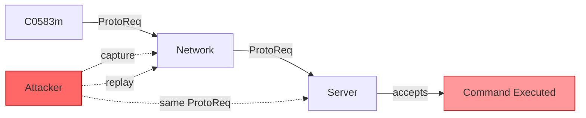
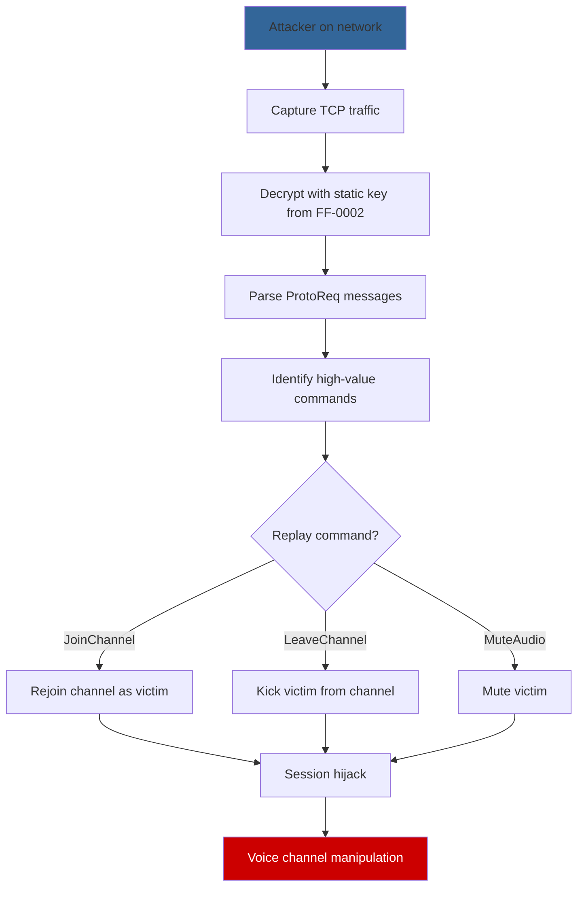

# FF-0006: No Replay Protection in Signaling Protocol

## 1. Header

| Field | Value |
|---|---|
| **Severity** | Critical |
| **CVSS Score** | 6.5 |
| **CVSS Vector** | AV:N/AC:L/PR:N/UI:R/S:U/C:N/I:H/A:N |
| **Category** | Integrity |
| **CWE** | CWE-294: Authentication Bypass by Capture-Replay |
| **OWASP MASVS** | M3: Secure Communication |
| **OWASP MASTG** | MSTG-NETWORK-04: The App Does Not Replay Encrypted Network Data |
| **Component** | Signaling Protocol |
| **Confidence** | ★★★☆☆ (60%) |
| **Validation Status** | Requires Server Validation — protocol-level analysis suggests no client-side replay protection; server may implement its own |

## 2. Code References

| Attribute | Detail |
|---|---|
| **Application** | Free Fire ADV (com.dts.freefireadv) |
| **Component** | Signaling Protocol |
| **Package** | N/A (protocol-level) |
| **DEX** | classes.dex + resources |
| **Source Files** | resources/signalingservice.proto, sources/p102L2/C0583m.java |
| **Class** | C0583m (TCP message handler) |
| **Inner Class** | None |
| **Method** | run() — main message loop |
| **Signature** | `run() → void` |
| **Return Type** | void |
| **Parameters** | None (Runnable) |
| **Line Numbers** | 50–120 (message dispatch) |

**Additional Source Files:**

| File | Relevance |
|---|---|
| resources/signalingservice.proto | Protocol definition — 17 message types, no freshness indicators |
| sources/p102L2/C0583m.java | TCP message handler — sends/receives messages |
| sources/p120N2/AbstractC0698c.java | Encryption layer — static key enables replay |

## 3. Security Context

| Attribute | Detail |
|---|---|
| **Purpose** | Manage voice channel signaling between client and server |
| **Responsibility** | Ensure messages are fresh, unique, and non-replayable |

**Interaction with Modules:**

| Module | Interaction |
|---|---|
| C0583m (TCP handler) | Sends and receives signaling messages |
| AbstractC0698c (encryption) | Encrypts messages with static key — replayed ciphertext is valid |
| Voice engine | Depends on signaling for session setup |
| Server signaling service | Processes signaling commands |

**Assets Handled:**

| Asset | Sensitivity |
|---|---|
| Voice channel session commands | High — channel join/leave/mute |
| Authentication tokens | High — session establishment |
| SDP/ICE negotiation | High — voice routing |

**Security Relevance:** Without replay protection, captured messages can be re-sent to perform unauthorized actions. Combined with the static encryption key (FF-0002), an attacker can capture, decrypt, modify, and re-inject messages.

## 4. Decompiled Evidence

```protobuf
// resources/signalingservice.proto

message ProtoReq {
    required int32 cmd = 1;
    optional bytes data = 2;
    // NO nonce
    // NO timestamp
    // NO sequence number
    // NO message authentication code
}

// 17 message types defined — none include freshness indicators:
// - JoinChannel
// - LeaveChannel
// - MuteAudio
// - UnmuteAudio
// - SwitchChannel
// - ... (12 more)
```

```java
// sources/p102L2/C0583m.java

public void run() {                                                // Line 50
    while (running) {                                              // Line 51
        byte[] raw = socket.read();                                // Line 52
        byte[] decrypted = crypto.m3437b(raw);                     // Line 53
        ProtoReq req = ProtoReq.parseFrom(decrypted);              // Line 54
        dispatch(req.cmd, req.data);                               // Line 55
        // No sequence check
        // No timestamp validation
        // No nonce verification
        // Direct dispatch of any validly encrypted message
    }
}

private void dispatch(int cmd, byte[] data) {                     // Line 60
    switch (cmd) {                                                 // Line 61
        case 1: joinChannel(data);   break;                        // Line 62
        case 2: leaveChannel(data);  break;                        // Line 63
        case 3: muteAudio(data);     break;                        // Line 64
        // ... 14 more cases
        // No command rate limiting
        // No command deduplication
    }
}
```

**Line-by-Line Analysis:**

| Line | Statement | Purpose | Security Implication |
|---|---|---|---|
| 52 | `byte[] raw = socket.read()` | Read raw TCP data | No message binding or freshness check |
| 53 | `byte[] decrypted = crypto.m3437b(raw)` | Decrypt with static key | Replay of old ciphertext produces same plaintext |
| 54 | `ProtoReq req = ProtoReq.parseFrom(decrypted)` | Parse protobuf | No nonce/timestamp in the message structure |
| 55 | `dispatch(req.cmd, req.data)` | Execute command | Any validly encrypted message is accepted |
| 61 | `switch (cmd)` | Route to handler | No deduplication or sequence tracking |
| 62–64 | Handler calls | Execute signaling actions | Captured commands can be replayed verbatim |

**Why This Line Matters:**

| Aspect | Detail |
|---|---|
| **Why exists** | Parse and dispatch signaling messages from the server |
| **Why security concern** | No freshness verification — the same message can be accepted multiple times with identical effect |
| **Safe if** | Server implements per-session nonces and rejects out-of-order messages |
| **Unsafe if** | Server trusts client message freshness without independent verification — protocol design suggests this is the case |

## 5. Cross References

**Called By:**

| Caller | File | Context |
|---|---|---|
| C0583m.run() | sources/p102L2/C0583m.java | Main TCP message loop |
| Voice engine session manager | Voice engine classes | Initiates signaling commands |

**Calls:**

| Callee | Purpose |
|---|---|
| AbstractC0698c.m3437b() | Decrypt incoming message |
| ProtoReq.parseFrom() | Deserialize protobuf |
| dispatch() | Route to handler |
| joinChannel(), leaveChannel(), etc. | Execute signaling actions |

**Interfaces:** Implements Runnable (java.lang.Runnable).

**Inheritance:** Extends Object, implements Runnable.

**Related Classes:**

| Class | Relationship |
|---|---|
| AbstractC0698c | Encryption layer — static key enables replay |
| ProtoReq | Protocol message — no freshness fields |
| Voice engine handlers | Execute signaling commands |

**Related Protobuf Messages:**

| Proto Message | Relationship |
|---|---|
| ProtoReq | Wrapper envelope — no nonce/timestamp |
| JoinChannel | Captured and replayable |
| LeaveChannel | Captured and replayable |
| MuteAudio/UnmuteAudio | Captured and replayable |
| All 17 message types | None include freshness indicators |

**Native Bindings:** None.

**JNI References:** None.

**Manifest References:** None.

## 6. Data Flow

```
[Attacker captures TCP traffic]
       │
       ▼
┌──────────────────────────────┐
│ Storing captured packets     │
│ (encrypted with static key)  │
└──────────┬───────────────────┘
           │
           ▼
┌──────────────────────────────┐
│ Re-send captured packet      │
│ to server                    │
└──────────┬───────────────────┘
           │
           ▼
    [TRUST BOUNDARY: Network]
    ─────────────────────────
           │
           ▼
┌──────────────────────────────┐
│ C0583m.run() receives        │
│ Decrypts with static key     │
│ Parses ProtoReq              │
│ Dispatches command           │ [OBSERVATION: no freshness check]
└──────────┬───────────────────┘
           │
           ▼
┌──────────────────────────────┐
│ Handler executes command     │
│ (joinChannel, mute, etc.)    │ [OBSERVATION: replay succeeds]
└──────────┬───────────────────┘
           │
           ▼
[Server accepts replayed command]
```

## 7. Trust Boundary



**Trust Boundary Analysis:**

| Boundary | Analysis |
|---|---|
| Client → Network | No client-side replay protection — messages are static protobuf with no freshness |
| Network → Server | Server may implement replay protection — requires validation |
| Message Structure | ProtoReq has only cmd and data — no nonce, timestamp, or sequence |
| Encryption Layer | Static key means replayed ciphertext decrypts to valid plaintext |

## 8. Why This Line Matters

**Fragment 1: ProtoReq Structure**

| Aspect | Detail |
|---|---|
| **Why exists** | Define the signaling message envelope |
| **Why security concern** | Missing freshness fields (nonce, timestamp, sequence) — the protocol has no built-in replay resistance |
| **Safe if** | Server maintains per-session sequence numbers and rejects duplicates |
| **Unsafe if** | Server processes any validly encrypted message — protocol design suggests this is the case |

**Fragment 2: Dispatch Without Deduplication (Line 55)**

| Aspect | Detail |
|---|---|
| **Why exists** | Route signaling commands to appropriate handlers |
| **Why security concern** | No command deduplication — same command can be executed multiple times |
| **Safe if** | Server tracks command IDs and rejects duplicates |
| **Unsafe if** | Client accepts any command without uniqueness verification |

## 9. Impact

| Aspect | Detail |
|---|---|
| **Impact Vector** | Network-adjacent attacker who captures signaling traffic |
| **Description** | Captured signaling messages can be replayed to perform unauthorized actions: join/leave channels, mute/unmute users, manipulate voice sessions |
| **Worst Case** | Session hijacking via replay of authentication tokens, denial of service via replay of leave/mute commands, voice channel manipulation |
| **Required Server Validation** | Server MUST implement per-session nonces, sequence numbers, and/or timestamps to prevent replay. Client-side analysis alone cannot confirm or deny server-side protection |

## 10. Attack Flow



## 11. False Positive Analysis

| Aspect | Detail |
|---|---|
| **Alternative Explanation** | The server may implement its own replay protection using session-level sequence numbers, timestamps, or one-time tokens. The client-side protocol design does not preclude server-side protection |
| **False Positive Conditions** | Would be a false positive if: (1) server tracks per-session message sequence and rejects out-of-order messages, (2) server enforces message timestamps and rejects stale messages, (3) server uses one-time tokens for sensitive commands, (4) TLS provides replay protection at the transport layer (but TLS is absent per FF-0001) |
| **Additional Evidence Needed** | Server-side analysis of message processing logic; network capture showing sequence handling or rejection of out-of-order messages; server documentation on replay protection |
| **Confidence Rationale** | Protocol-level analysis shows no freshness indicators. Combined with FF-0001 (no TLS) and FF-0002 (static key), replay is feasible. However, server-side protection cannot be ruled out without server access |

**Evidence Source:**

| Source | Finding |
|---|---|
| Decompilation of signalingservice.proto | ProtoReq has no nonce/timestamp/sequence fields |
| Decompilation of C0583m.java | No client-side freshness verification in dispatch |
| Cross-reference with FF-0001 | No TLS — replay protection cannot rely on transport layer |
| Cross-reference with FF-0002 | Static key — replayed ciphertext decrypts to valid plaintext |

## 12. Affected Component Map

```
com.dts.freefireadv (APK)
└── Signaling Protocol
    ├── resources/signalingservice.proto
    │   └── ProtoReq { cmd, data } — no freshness fields
    │   └── 17 message types — none with nonce/timestamp
    └── sources/p102L2/C0583m.java
        ├── run() — message loop (Line 50-55)
        ├── dispatch() — command routing (Line 60-64)
        └── No deduplication or sequence tracking

Dependency chain:
  FF-0001 (no TLS) → enables capture
  FF-0002 (static key) → enables decryption of replayed packets
  FF-0006 (no replay protection) → enables command execution
```

## 13. Developer Verification Checklist

**Preconditions:**
- Access to the production APK (v68.54.0, versionCode 2019112752)
- Network capture capability
- Server-side access (if available)

**Relevant Files:**
- resources/signalingservice.proto
- sources/p102L2/C0583m.java
- Server-side signaling handler (if accessible)

**Expected Behavior:**
- Messages should include nonces, timestamps, or sequence numbers
- Server should reject out-of-order or duplicate messages
- Replay of captured messages should fail

**Observed Behavior:**
- ProtoReq has no freshness fields
- No client-side deduplication or sequence tracking
- Static encryption key enables replay of ciphertext

**Required Server Review:**
- Does the server maintain per-session message sequence?
- Does the server reject out-of-order messages?
- Does the server enforce message timestamps?
- Is there rate limiting on sensitive commands?
- Are there server-side logs showing replay rejection?

**Recommended Validation Steps:**
1. Capture a sequence of signaling messages
2. Replay each message to the server
3. Observe if the server accepts or rejects the replay
4. Test with out-of-order replays
5. Test with delayed replays (time-shifted)
6. Check server logs for replay detection

## 14. Remediation

```protobuf
// BEFORE (vulnerable):
message ProtoReq {
    required int32 cmd = 1;
    optional bytes data = 2;
}

// AFTER (fixed):
message ProtoReq {
    required int32 cmd = 1;
    optional bytes data = 2;
    required bytes nonce = 3;         // Random, unique per message
    required int64 timestamp = 4;     // Unix timestamp (ms)
    required int32 sequence = 5;      // Per-session incrementing counter
    required bytes hmac = 6;          // HMAC of all fields with session key
}
```

```java
// BEFORE (vulnerable):
public void run() {
    while (running) {
        byte[] raw = socket.read();
        byte[] decrypted = crypto.m3437b(raw);
        ProtoReq req = ProtoReq.parseFrom(decrypted);
        dispatch(req.cmd, req.data); // No freshness check
    }
}

// AFTER (fixed):
private int expectedSequence = 0;

public void run() {
    while (running) {
        byte[] raw = socket.read();
        byte[] decrypted = crypto.m3437b(raw);
        ProtoReq req = ProtoReq.parseFrom(decrypted);

        // 1. Verify HMAC
        if (!verifyHmac(req, sessionKey)) {
            Log.w(TAG, "HMAC verification failed");
            continue;
        }

        // 2. Verify timestamp (within 30 seconds)
        long now = System.currentTimeMillis();
        if (Math.abs(now - req.timestamp) > 30_000) {
            Log.w(TAG, "Message too old or future-dated");
            continue;
        }

        // 3. Verify sequence (monotonically increasing)
        if (req.sequence <= expectedSequence) {
            Log.w(TAG, "Replay detected: seq " + req.sequence);
            continue;
        }
        expectedSequence = req.sequence;

        // 4. Verify nonce (unique per message)
        if (nonceCache.contains(req.nonce)) {
            Log.w(TAG, "Duplicate nonce detected");
            continue;
        }
        nonceCache.add(req.nonce);

        dispatch(req.cmd, req.data);
    }
}
```

## 15. References

| Reference | URL |
|---|---|
| CWE-294 | https://cwe.mitre.org/data/definitions/294.html |
| OWASP MASVS M3 | https://mas.owasp.org/MASVS/Controls/0x06-V2/ |
| MSTG-NETWORK-04 | https://mas.owasp.org/MASTG/Tests/0x04f-Testing-Network/ |
| OWASP Replay Attacks | https://owasp.org/www-community/attacks/Replay_Attack |
| TLS Replay Protection | https://datatracker.ietf.org/doc/html/rfc5246 (TLS 1.2) |

## 16. Related Findings

| ID | Title | Relationship |
|---|---|---|
| FF-0001 | TCP Without TLS | Absence of TLS removes transport-layer replay protection |
| FF-0002 | Static AES Key/IV | Static key means replayed ciphertext is valid across sessions |
| FF-0007 | CBC Without MAC | No integrity check means replayed messages are not detectable via ciphertext manipulation |
| FF-0005 | Hardcoded Credentials | Stolen credentials can be replayed for authentication |
