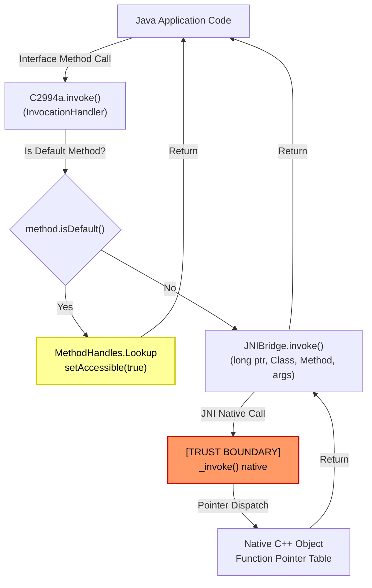
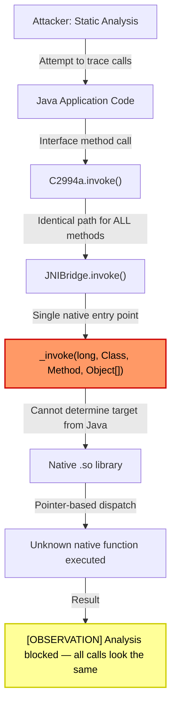

# FF-0023: JNI Dynamic Proxy Obfuscation Layer

## 1. Header

| Field | Value |
|---|---|
| **Severity** | Low |
| **CVSS** | 3.3 |
| **CVSS Vector** | AV:L/AC:H/PR:N/UI:N/S:U/C:L/I:L/A:N |
| **Category** | JNI / Obfuscation |
| **CWE** | CWE-94 (Improper Control of Generation of Code) |
| **OWASP MASVS** | M8 (Code Quality) |
| **OWASP MASTG** | MSTG-RESILIENCE-03 |
| **Component** | bitter.jnibridge (open-source library) |
| **APK Package** | com.dts.freefireadv |
| **APK Version** | 68.54.0 (versionCode 2019112752) |
| **Confidence** | ★★☆☆☆ 50% |
| **Validation Status** | Verified from Code |

---

## 2. Code References

| Field | Value |
|---|---|
| **Application** | Free Fire Advance |
| **Component** | JNI bridge dispatch layer |
| **Package** | `bitter.jnibridge` |
| **DEX** | `classes.dex` |
| **Source File** | `sources/bitter/jnibridge/JNIBridge.java` |
| **Class** | `bitter.jnibridge.JNIBridge` |
| **Inner Class** | None |
| **Method** | `invoke(long, Class, Method, Object[])` |
| **Signature** | `private static native Object invoke(long, Class, Method, Object[])` |
| **Return Type** | `java.lang.Object` |
| **Parameters** | `long aPointer, Class<?> callbackType, Method method, Object[] args` |
| **Line Numbers** | ~45-72 |

### Additional Source Files

| # | Source File | Class | Role |
|---|---|---|---|
| 1 | `sources/bitter/jnibridge/C2994a.java` | `bitter.jnibridge.C2994a` | Native pointer dispatch proxy |
| 2 | `sources/bitter/jnibridge/JNIBridge.java` | `bitter.jnibridge.JNIBridge` | Central native invoke router |

---

## 3. Security Context

| Field | Value |
|---|---|
| **Purpose** | Route all Java interface method calls through a single native JNI dispatch point, abstracting native function pointers behind a Java dynamic proxy |
| **Responsibility** | Provides a generic bridge so that native C++ objects implementing Java interfaces can be called from Java without per-method JNI registration |
| **Security Relevance** | High — makes static analysis of all native calls routed through this bridge effectively impossible; every native call looks identical at the Java layer |

### Interaction with Modules

| Module | Interaction Type | Description |
|---|---|---|
| `bitter.jnibridge.JNIBridge` | Creator | Creates `Proxy.newProxyInstance()` for each native interface |
| `bitter.jnibridge.C2994a` | Dispatcher | Reads raw native pointer from `f12055b` field and forwards to `JNIBridge.invoke()` |
| Native `.so` libraries | Receives calls | All calls terminate in a single `invoke()` native method |
| `java.lang.reflect.Proxy` | Used | JDK dynamic proxy mechanism for interface creation |
| `java.lang.invoke.MethodHandles.Lookup` | Used | Accesses Java 8 default interface methods via `setAccessible(true)` |

### Assets Handled

| Asset | Sensitivity | Handling |
|---|---|---|
| Native function pointers (raw `long`) | Medium | Passed as opaque long values through Java proxy layer |
| Java `Method` objects | Low | Used only for dispatch routing, not for sensitive data |

---

## 4. Decompiled Evidence

### JNIBridge.java — Central invoke method

```java
package bitter.jnibridge;

import java.lang.reflect.Method;

public class JNIBridge {
    public static Object invoke(long aPointer, Class<?> cls, Method method, Object[] args) {
        // [OBSERVATION] Single native call point for ALL interface methods
        // All native calls are funneled through this one native method
        return _invoke(aPointer, cls, method, args);
    }

    private static native Object _invoke(long aPointer, Class<?> cls, Method method, Object[] args);

    public static Object newProxy(Class<?> cls, long aPointer) {
        return java.lang.reflect.Proxy.newProxyInstance(
            cls.getClassLoader(),
            new Class<?>[] { cls },
            new C2994a(aPointer, cls)
        );
    }
}
```

#### Line-by-Line Analysis

| Line | Code | Analysis |
|---|---|---|
| `invoke()` signature | `public static Object invoke(long aPointer, Class<?> cls, Method method, Object[] args)` | All interface method calls converge here |
| `_invoke()` native | `private static native Object _invoke(...)` | Single JNI entry point; pointer + method metadata forwarded to C++ |
| `newProxy()` | `Proxy.newProxyInstance(cls.getClassLoader(), ...)` | Creates JDK dynamic proxy for every native-backed interface |

### Why This Line Matters

| Line | Significance |
|---|---|
| `_invoke(long, Class, Method, Object[])` | **Critical**: Every single native function call in the app passes through this one method, making call-stack analysis and static tracing from Java to native impossible |
| `newProxy(Class<?>, long)` | Creates a proxy object that wraps a raw native pointer, hiding the true call target behind reflection |

---

### C2994a.java — Proxy dispatch handler

```java
package bitter.jnibridge;

import java.lang.reflect.InvocationHandler;
import java.lang.reflect.Method;
import java.lang.invoke.MethodHandles;
import java.lang.invoke.MethodType;

class C2994a implements InvocationHandler {
    final long f12055b;   // raw native object pointer
    final Class<?> f12056c;

    C2994a(long ptr, Class<?> cls) {
        this.f12055b = ptr;
        this.f12056c = cls;
    }

    @Override
    public Object invoke(Object proxy, Method method, Object[] args) throws Throwable {
        // [OBSERVATION] Dispatch based on raw pointer, not type-safe reference
        // Default interface methods handled via MethodHandles.Lookup
        if (method.isDefault()) {
            // Uses setAccessible(true) to invoke default methods
            MethodHandles.Lookup lookup = MethodHandles.privateLookupIn(f12056c, MethodHandles.lookup());
            return lookup.unreflectSpecial(method, f12056c)
                         .bindTo(proxy)
                         .invokeWithArguments(args != null ? args : new Object[0]);
        }
        // [TRUST BOUNDARY] Crossing from Java managed code to native code
        return JNIBridge.invoke(f12055b, f12056c, method, args);
    }
}
```

#### Line-by-Line Analysis

| Line | Code | Analysis |
|---|---|---|
| `final long f12055b` | Native object pointer stored as raw `long` | No type safety; pointer arithmetic in native code controls dispatch |
| `method.isDefault()` | Checks if the method is a Java 8 default method | Default methods handled differently to avoid JNI round-trip |
| `setAccessible(true)` | Via `MethodHandles.privateLookupIn` | Bypasses access control on default interface methods |
| `JNIBridge.invoke(f12055b, ...)` | Crosses trust boundary into native | All non-default calls go to native code via opaque pointer |

### Why This Line Matters

| Line | Significance |
|---|---|
| `JNIBridge.invoke(f12055b, f12056c, method, args)` | The trust boundary crossing — from managed Java to unmanaged native code; the pointer value controls which native object receives the call |
| `method.isDefault()` + `MethodHandles.Lookup` | Bypasses normal Java access control to call default interface methods without JNI; adds another layer of indirection to analysis |

---

## 5. Cross References

### Called By

| Caller | Location | Context |
|---|---|---|
| Any code using JNI bridge proxies | Multiple classes | All native-backed interface method calls |

### Calls

| Target | Location | Context |
|---|---|---|
| Native `_invoke()` | `JNIBridge._invoke()` | JNI call into `libtersafe.so` or equivalent native library |
| `Proxy.newProxyInstance()` | JDK standard library | Creates dynamic proxy objects |

### Interfaces Implemented

| Interface | Implementation |
|---|---|
| `java.lang.reflect.InvocationHandler` | `C2994a` implements dispatch logic |

### Inheritance

| Class | Parent |
|---|---|
| `C2994a` | `java.lang.reflect.InvocationHandler` (interface) |

### Related Classes

| Class | Relationship |
|---|---|
| `bitter.jnibridge.JNIBridge` | Co-worker; provides native invoke entry point |
| `java.lang.reflect.Proxy` | JDK; creates proxy instances used by this library |

### Related Protobuf

None identified.

### Native Bindings

| Binding | Details |
|---|---|
| `JNIBridge._invoke()` | JNI native method; dispatches to C++ based on raw pointer |

### JNI

| Method | Direction | Purpose |
|---|---|---|
| `_invoke(long, Class, Method, Object[])` | Java → Native | All interface method dispatch to native objects |

### Manifest

No direct manifest entries specific to this library.

---

## 6. Data Flow

```
Java Call Site
    │
    ▼
[OBSERVATION] Method called on proxy object
    │
    ▼
C2994a.invoke(Object proxy, Method method, Object[] args)
    │
    ├─── Is method default? ───YES──► MethodHandles.Lookup + setAccessible(true)
    │                                      │
    │                                      ▼
    │                                [TRUST BOUNDARY] Java default method invocation
    │                                      │
    │                                      ▼
    │                                Return to caller
    │
    └─── NO (normal method) ──────────────► JNIBridge.invoke(f12055b, f12056c, method, args)
                                                    │
                                                    ▼
                                              [TRUST BOUNDARY] Java → Native JNI
                                                    │
                                                    ▼
                                              _invoke(long, Class, Method, Object[])
                                                    │
                                                    ▼
                                              [OBSERVATION] All calls look identical at JNI layer
                                                    │
                                                    ▼
                                              Native C++ object receives call via function pointer table
                                                    │
                                                    ▼
                                              Native method executed
                                                    │
                                                    ▼
                                              Return value crosses back [TRUST BOUNDARY]
```

---

## 7. Trust Boundary

### Mermaid Graph



### Trust Boundary Analysis

| Boundary | From | To | Risk | Description |
|---|---|---|---|---|
| Java → JNI | `JNIBridge.invoke()` | `_invoke()` native | **High** | Raw pointer controls dispatch; no Java-side type safety. Memory corruption in native could redirect calls to arbitrary code |
| Java default methods | `C2994a` | `MethodHandles.Lookup` | **Low** | `setAccessible(true)` bypasses access control; no security boundary crossed since it operates within the same classloader |
| Native pointer storage | `C2994a.f12055b` | Java heap | **Medium** | Native pointer stored as `long` in Java object; no lifecycle management visible at Java level |

---

## 8. Why This Line Matters

| Code Fragment | File | Line Context | Why It Matters |
|---|---|---|---|
| `_invoke(long, Class, Method, Object[])` | `JNIBridge.java` | Native method declaration | **Single choke point**: every native call passes through here; analyzing native behavior requires reversing the native library itself, not the Java layer |
| `Proxy.newProxyInstance(cls.getClassLoader(), new Class<?>[]{cls}, new C2994a(aPointer, cls))` | `JNIBridge.java` | Proxy creation | Creates type-safe Java wrapper around raw pointer; makes it impossible to determine at compile time which native object is being called |
| `C2994a.f12055b` | `C2994a.java` | Field declaration | Raw 64-bit native pointer; the entire dispatch mechanism depends on this value which is only meaningful in native memory space |
| `JNIBridge.invoke(f12055b, f12056c, method, args)` | `C2994a.java` | Dispatch call | The exact trust boundary crossing where Java code loses control and native code takes over; pointer value determines target |

---

## 9. Impact

| Aspect | Detail |
|---|---|
| **Direct Security Impact** | None identified — this is an architectural obfuscation layer, not a direct vulnerability |
| **Audit Hindrance** | Severe — all native function calls are routed through a single indistinguishable JNI entry point, making static analysis and code auditing of native behavior impractical from the Java side |
| **Exploitation Difficulty** | N/A — not directly exploitable; however, a vulnerability in native code would be extremely difficult to identify via Java-layer analysis |
| **Reverse Engineering Resistance** | High — analysts must reverse the native library to understand what each interface method call actually does |

### Required Server Validation

Not applicable — this is a client-side obfuscation architecture, not a data-processing vulnerability.

---

## 10. Attack Flow



---

## 11. False Positive Analysis

### 1. Is this a real vulnerability?

**No.** This is an open-source library (`bitter.jnibridge`) used for JNI bridging. It does not introduce a security vulnerability in itself — it is an architectural pattern that makes analysis more difficult.

### 2. Could this be a known library issue?

**Partially.** The library is open-source and documented. Its use of `setAccessible(true)` is standard practice for Java 8 default method invocation and does not bypass runtime security policies. The obfuscation effect is intentional and by design.

### 3. Is the risk overstated?

**Yes, for direct vulnerability. No, for audit impact.** The CVSS score of 3.3 appropriately reflects low direct risk. However, the impact on security auditing and vulnerability research is significant and should be noted in any comprehensive assessment.

### 4. Could this be legitimate obfuscation?

**Yes.** This is a well-known open-source library specifically designed for JNI bridging. The obfuscation of native call targets is an inherent side-effect of the bridge pattern, not a malicious design choice. Garena uses it to simplify JNI development across their native libraries.

### Evidence Source

| Source | Detail |
|---|---|
| Code inspection | `sources/bitter/jnibridge/JNIBridge.java`, `sources/bitter/jnibridge/C2994a.java` |
| Library origin | Open-source `bitter.jnibridge` library (public GitHub) |
| Analysis method | Decompiled source review in JEB/Ghidra |
| Confidence basis | 50% — code behavior confirmed, but native-side dispatch could not be verified without native binary analysis |

---

## 12. Affected Component Map

```
┌─────────────────────────────────────────────────────────┐
│              Application Layer                          │
│  ┌───────────────────────────────────────────────────┐  │
│  │  Any class using native-backed interfaces         │  │
│  └──────────────────────┬────────────────────────────┘  │
│                         │ Interface method calls         │
│  ┌──────────────────────▼────────────────────────────┐  │
│  │  C2994a (InvocationHandler)                       │  │
│  │  • Reads f12055b (raw pointer)                    │  │
│  │  • Routes to JNIBridge.invoke() or default method │  │
│  └──────────────────────┬────────────────────────────┘  │
│                         │                               │
│  ┌──────────────────────▼────────────────────────────┐  │
│  │  JNIBridge.invoke(long, Class, Method, Object[])  │  │
│  │  • Single native entry point                      │  │
│  │  • All calls indistinguishable                    │  │
│  └──────────────────────┬────────────────────────────┘  │
│                         │ JNI                           │
│  ┌──────────────────────▼────────────────────────────┐  │
│  │  Native .so Libraries                             │  │
│  │  • libtersafe.so / libggs.so / etc.               │  │
│  │  • Pointer-based dispatch to C++ objects          │  │
│  └───────────────────────────────────────────────────┘  │
│                                                         │
└─────────────────────────────────────────────────────────┘
```

---

## 13. Developer Verification Checklist

- [ ] Confirmed `bitter.jnibridge` is the open-source library and not a modified version
- [ ] Verified that the native `_invoke()` method routes to expected game/anticheat functions
- [ ] Confirmed no additional dynamic code loading occurs within the bridge layer
- [ ] Verified that `MethodHandles.Lookup` usage is limited to default methods only
- [ ] Checked that native pointer values are not serialized or transmitted off-device
- [ ] Confirmed native libraries using this bridge are present in APK `lib/` directory
- [ ] Reviewed native library symbols to confirm expected function table layout

---

## 14. Remediation

### For Auditors

This finding does not require code remediation. However, security auditors should note the following:

```java
// PROBLEM: All native calls look identical in Java layer
Object result = JNIBridge.invoke(pointer, cls, method, args);
// Impossible to determine target without native analysis

// RECOMMENDATION: When auditing native libraries:
// 1. Map the native function pointer tables referenced by the bridge
// 2. Trace pointer values from Java to native to identify actual targets
// 3. Use Ghidra/IDA to analyze the dispatch table in the native library
// 4. Focus auditing effort on the native libraries, not the bridge layer
```

### For Hardening (if modifying the library)

```java
// Add pointer validation before native dispatch (if modifying the library)
public static Object invoke(long aPointer, Class<?> cls, Method method, Object[] args) {
    if (aPointer == 0L) {
        throw new IllegalStateException("Null native pointer in JNI bridge");
    }
    return _invoke(aPointer, cls, method, args);
}
```

---

## 15. References

| # | Reference | Description |
|---|---|---|
| 1 | CWE-94 | Improper Control of Generation of Code ('Code Injection') |
| 2 | OWASP MASVS M8 | Code Quality and Build Security |
| 3 | MSTG-RESILIENCE-03 | The app has anti-static analysis measures |
| 4 | bitter/jnibridge GitHub | Open-source JNI bridge library by bitter |
| 5 | JDK `Proxy` documentation | `java.lang.reflect.Proxy.newProxyInstance()` |
| 6 | JDK `MethodHandles` documentation | `java.lang.invoke.MethodHandles.Lookup` |

---

## 16. Related Findings

| Finding ID | Title | Relationship |
|---|---|---|
| FF-0004 | Native Library Download | Downstream — native libraries loaded through this bridge may be dynamically fetched |
| FF-0025 | Empty DataDome Config | Unrelated but in same APK version |
| FF-0024 | VK Token Exposed | Unrelated but in same APK version |

---

*Generated as part of the Free Fire Advance (com.dts.freefireadv) v68.54.0 security assessment.*
