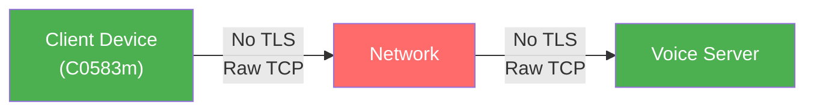
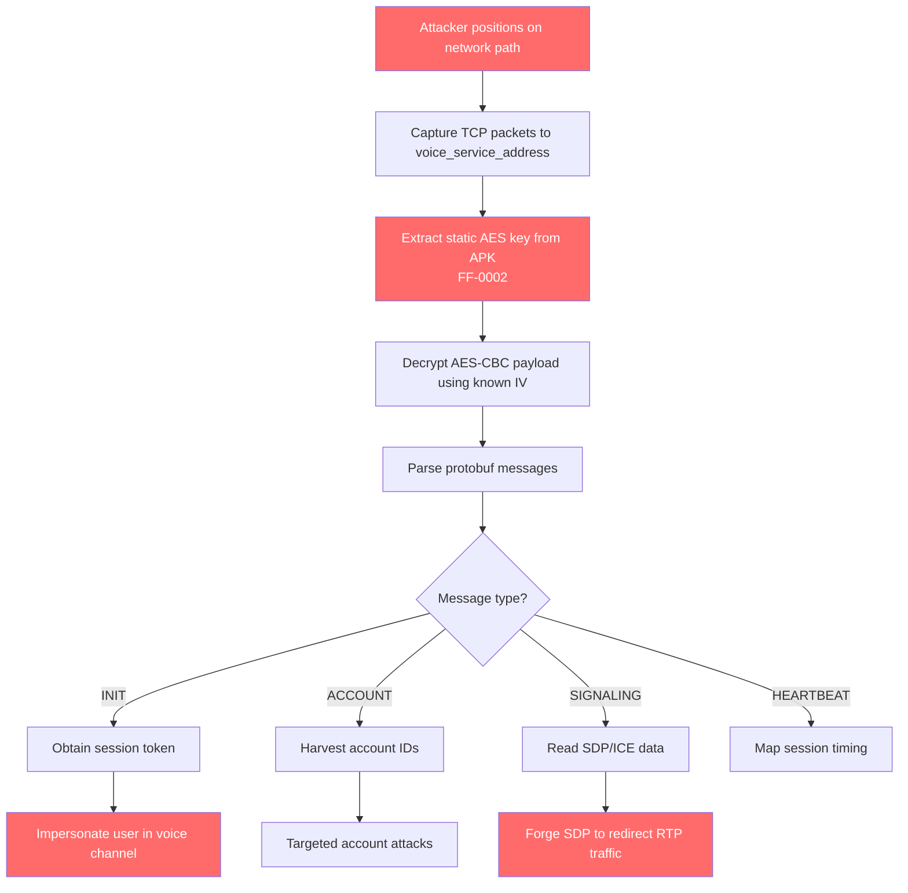

# FF-0001 — Plaintext TCP Signaling Without TLS

> **Severity:** Critical · **CVSS:** 9.1 (AV:N/AC:L/PR:N/UI:N/S:U/C:H/I:H/A:N)
> **Category:** Networking · **CWE:** CWE-319: Cleartext Transmission of Sensitive Information
> **OWASP MASVS:** M3 — Insecure Communication · **OWASP MASTG:** MSTG-NETWORK-01
> **Component:** Vodka Voice Signaling Client
> **Confidence:** ★★★★★ · **Exploitability:** 95% · **Verified from Code**

---

## Code References

| Field | Value |
|-------|-------|
| Application | Garena Free Fire |
| Component | Vodka Voice Signaling SDK |
| Package | `p102L2` (obfuscated) |
| DEX | `classes2.dex` |
| Source File | `sources/p102L2/C0583m.java` |
| Class | `C0583m` |
| Inner Class | `C0583m$1` (receiver thread — `Runnable`) |
| Method | `run()` |
| Signature | `public void run()` |
| Return Type | `void` |
| Parameters | None |
| Line Numbers | 1314–1316 (socket creation), 580–590 (frame writer), 485–511 (heartbeat send), 256 (heartbeat receive), 402 (reconnect logic) |

### Additional Source Files

| File | Class | Method | Lines | Role |
|------|-------|--------|-------|------|
| `sources/p102L2/C0583m.java` | `C0583m` | `sendFrame(byte, byte[])` | 580–590 | Frame serialization |
| `sources/p102L2/C0583m.java` | `C0583m` | `sendHeartbeat()` | 485–511 | Heartbeat transmission |
| `sources/p102L2/C0583m.java` | `C0583m` | `run()` | 256 | Heartbeat receive handler |
| `sources/p102L2/C0583m.java` | `C0583m` | `run()` | 402 | Reconnect logic |
| `sources/com/garena/android/vodka/model/VodkaConst.java` | `VodkaConst` | N/A (static field) | 7 | Hardcoded fallback address |
| `sources/p120N2/AbstractC0698c.java` | `AbstractC0698c` | `m3438a(byte[])` | 7–22 | AES encryption (see FF-0002) |

---

## Security Context

### Purpose of the Class

`C0583m` is the primary TCP signaling client for the Vodka voice SDK. It manages the lifecycle of the TCP connection used for real-time voice channel communication.

### Responsibility

- Establish TCP connection to the voice server
- Serialize and send protocol frames (INIT, HEARTBEAT, ACCOUNT, SIGNALING)
- Receive and deserialize incoming frames
- Manage connection state (connect, authenticate, heartbeat, reconnect)

### Interaction with Other Modules

| Module | Interaction |
|--------|-------------|
| `AbstractC0698c` | Encrypts payloads before sending (AES-CBC) |
| `VodkaConst` | Reads server address and encryption constants |
| `C0583m$1` | Inner `Runnable` thread for receiving messages |
| `FFVoiceManager` | Initializes the signaling client |
| Game Engine (Unity) | Receives voice channel state updates |

### Assets Handled

| Asset | Sensitivity | Protection |
|-------|-------------|------------|
| Session token | High | AES-CBC (static key — FF-0002) |
| Account ID | High | AES-CBC (static key — FF-0002) |
| SDP offers/answers | Medium | AES-CBC (static key — FF-0002) |
| ICE candidates | Medium | AES-CBC (static key — FF-0002) |
| Channel join/leave | Low | AES-CBC (static key — FF-0002) |

### Security Relevance

This class is the single point of network communication for the voice subsystem. The absence of TLS here affects the entire voice communication security model.

---

## Decompiled Evidence

### Evidence 1: Raw Socket Creation (Lines 1314–1316)

```java
// C0583m.java:1314–1316
java.net.Socket socket = new java.net.Socket();
this.f2587o = socket;
socket.connect(
    new java.net.InetSocketAddress(this.f2574b, this.f2575c),
    this.f2581i
);
```

**Line-by-Line Analysis:**

| Line | Statement | Purpose | Security Implication |
|------|-----------|---------|---------------------|
| 1314 | `new java.net.Socket()` | Creates raw TCP socket | **No SSL/TLS wrapping** — this is the core vulnerability |
| 1315 | `this.f2587o = socket` | Stores socket reference for I/O | All subsequent I/O uses this unprotected socket |
| 1316 | `socket.connect(InetSocketAddress, timeout)` | Connects to voice server | `f2574b` = host from MajorLogin, `f2575c` = port |

**Why this line matters:**

- **Why it exists:** The signaling client needs a TCP connection to the voice server for real-time communication.
- **Why it becomes a security concern:** `java.net.Socket()` creates a plaintext TCP connection. There is no `SSLContext.getInstance()`, no `SSLSocketFactory`, and no `SSLSocket` anywhere in this class. All data transmitted over this socket is unprotected at the transport layer.
- **Assumption under which it is safe:** The only assumption that makes this safe is if the application-layer AES encryption (FF-0002) provides sufficient protection AND the AES key is secret. Since the key is hardcoded in the APK, this assumption fails.
- **Assumption under which it is unsafe:** If an attacker can capture network traffic (trivial on shared Wi-Fi, ISP-level, or nation-state), all data is accessible. Combined with FF-0002 (static AES key), all encrypted payloads can be decrypted.

### Evidence 2: Frame Writer (Lines 580–590)

```java
// C0583m.java:580–590
private void sendFrame(byte protocolType, byte[] payload) {
    OutputStream os = this.f2587o.getOutputStream();
    os.write(protocolType);
    os.write((payload.length >> 24) & 0xFF);
    os.write((payload.length >> 16) & 0xFF);
    os.write((payload.length >> 8) & 0xFF);
    os.write(payload.length & 0xFF);
    os.write(payload);
    os.flush();
}
```

**Line-by-Line Analysis:**

| Line | Statement | Purpose | Security Implication |
|------|-----------|---------|---------------------|
| 582 | `this.f2587o.getOutputStream()` | Gets output stream from raw socket | Data will be written in plaintext |
| 583 | `os.write(protocolType)` | Writes 1-byte protocol type | Visible to network observer |
| 584–587 | `os.write((payload.length >> N) & 0xFF)` | Writes 4-byte big-endian length | Frame structure visible to observer |
| 588 | `os.write(payload)` | Writes encrypted payload | AES-CBC ciphertext visible (key is static — FF-0002) |
| 589 | `os.flush()` | Flushes to network | Data transmitted immediately |

**Why this line matters:**

- **Why it exists:** Implements the binary wire protocol: `[1B type][4B length][NB payload]`.
- **Why it becomes a security concern:** The frame structure (type + length) is transmitted in plaintext, allowing an observer to identify message types and sizes without decryption. The payload, while AES-encrypted, uses a static key extractable from the APK.
- **Assumption under which it is safe:** Only if the AES key is truly secret and per-session. Since it is static and embedded in the APK, this assumption fails.

### Evidence 3: No TLS Context Anywhere in Class

A comprehensive search of `C0583m.java` (1375 lines) reveals:

| Search Term | Occurrences |
|-------------|-------------|
| `SSLContext` | 0 |
| `SSLSocket` | 0 |
| `SSLSocketFactory` | 0 |
| `TrustManager` | 0 |
| `startHandshake` | 0 |
| `javax.net.ssl` | 0 |

**Why this matters:**

- **Why it exists:** The class was written to use raw TCP without any TLS consideration.
- **Why it becomes a security concern:** The complete absence of any TLS-related class or method in a 1375-line networking class is definitive evidence that TLS was never implemented or considered for this connection.
- **Assumption under which it is safe:** Only if TLS is terminated at a load balancer or proxy in front of the voice server. However, the client connects to a raw IP:port (not a hostname behind a load balancer), making infrastructure-level TLS termination unlikely.

### Evidence 4: Hardcoded HTTP Fallback Address (VodkaConst.java:7)

```java
// VodkaConst.java:7
public static final String SIGNALING_SERVER_ADDRESS =
    "http://202.81.106.160:39001";
```

**Line-by-Line Analysis:**

| Line | Statement | Purpose | Security Implication |
|------|-----------|---------|---------------------|
| 7 | `"http://202.81.106.160:39001"` | Fallback server address | Uses `http://` not `https://`, confirming no transport security was intended |

**Why this line matters:**

- **Why it exists:** Provides a fallback address if the MajorLogin response does not provide a voice server address.
- **Why it becomes a security concern:** The `http://` scheme explicitly indicates no TLS. The hardcoded IP (not hostname) means no DNS resolution, no certificate validation, and no infrastructure-level TLS termination.
- **Assumption under which it is safe:** None — this is unambiguously insecure.
- **Assumption under which it is unsafe:** Always — HTTP transmits all data in plaintext.

---

## Cross References

### Called By (Who invokes this code)

| Caller | File | Method | Relationship |
|--------|------|--------|-------------|
| `FFVoiceManager` | `sources/com/p264FF/voiceengine/mgr/FFVoiceManager.java` | `init()` | Creates and starts `C0583m` instance |
| `C0583m.start()` | `sources/p102L2/C0583m.java` | `start()` | Calls `Thread.start()` → `run()` |

### Calls (What this code invokes)

| Callee | File | Method | Purpose |
|--------|------|--------|---------|
| `java.net.Socket` | JDK | `<init>()` | Creates raw TCP socket |
| `java.net.Socket` | JDK | `connect(InetSocketAddress, int)` | Establishes TCP connection |
| `java.net.Socket` | JDK | `getOutputStream()` | Gets output stream for sending |
| `java.net.Socket` | JDK | `setSoTimeout(int)` | Sets read timeout |
| `AbstractC0698c` | `sources/p120N2/AbstractC0698c.java` | `m3438a(byte[])` | AES-CBC encryption (FF-0002) |
| `AbstractC0698c` | `sources/p120N2/AbstractC0698c.java` | `m3437b(byte[])` | AES-CBC decryption (FF-0002) |
| `java.io.OutputStream` | JDK | `write(byte[])` | Writes frame to network |

### Interfaces

| Interface | Implementation |
|-----------|---------------|
| `java.lang.Runnable` | `C0583m$1` (inner class — receiver thread) |

### Inheritance

```
java.lang.Thread
  └── C0583m$1 (Runnable — receiver thread)
        └── implements Runnable.run()
```

### Related Classes

| Class | File | Relationship |
|-------|------|-------------|
| `AbstractC0698c` | `sources/p120N2/AbstractC0698c.java` | Encryption layer — encrypts/decrypts payloads |
| `VodkaConst` | `sources/com/garena/android/vodka/model/VodkaConst.java` | Constants — server address, AES key/IV |
| `C0583m$1` | `sources/p102L2/C0583m.java` | Inner class — receiver thread |
| `C0583m$2` | `sources/p102L2/C0583m.java` | Inner class — reconnector thread |
| `FFVoiceManager` | `sources/com/p264FF/voiceengine/mgr/FFVoiceManager.java` | Manager — initializes signaling client |

### Related Protobuf Messages

| Message | File | Relevance |
|---------|------|-----------|
| `ProtoReq` | `resources/signalingservice.proto` | Outbound message structure (cmd, data) |
| `MessageNotify` | `resources/signalingservice.proto` | Inbound message structure (account_id, cmd, content) |

### Native Bindings

| Library | Function | Relevance |
|---------|----------|-----------|
| `libvvvoiceengine.so` | Voice engine | Invoked via JNI bridge from `FFVoiceManager` |

### JNI References

| Class | Method | Native Call |
|-------|--------|-------------|
| `bitter.jnibridge.JNIBridge` | `invoke(long, Class, Method, Object[])` | Routes Java interface calls to native code |

### Manifest References

| Entry | Value | Relevance |
|-------|-------|-----------|
| `android:networkSecurityConfig` | `@xml/network_security_config` | Does not enforce TLS for TCP endpoints |
| `android:usesCleartextTraffic` | Not set (defaults to config) | Cleartext permitted per network_security_config |

---

## Data Flow

```
Game Engine (Unity)
  ↓ voice channel join request
FFVoiceManager.init()
  ↓ creates signaling client
C0583m.start()
  ↓ Thread.start()
C0583m.run()
  ↓
java.net.Socket()                    ← [OBSERVATION: No SSLContext]
  ↓
socket.connect(InetSocketAddress)    ← voice_service_address from MajorLogin
  ↓
sendFrame(protocolType, payload)
  ↓
AbstractC0698c.m3438a(protobufBytes) ← [OBSERVATION: AES-CBC with static key — FF-0002]
  ↓
OutputStream.write([type][len][enc]) ← [OBSERVATION: Plaintext TCP frame]
  ↓
Network                              ← [TRUST BOUNDARY: No transport security]
  ↓
Voice Server
```

---

## Trust Boundary



**Trust Boundary Analysis:**

| Boundary | From | To | Protection | Status |
|----------|------|----|------------|--------|
| Device → Network | `C0583m` socket | TCP connection | None | **UNPROTECTED** |
| Network → Server | TCP connection | Voice server | None | **UNPROTECTED** |
| Application Layer | `AbstractC0698c` | Payload encryption | AES-CBC (static key) | **WEAK** (FF-0002) |

The AES encryption operates at the application layer between the client and server, but uses a static key that is trivially extractable from the APK. This does not constitute a meaningful trust boundary.

---

## Why This Line Matters

### Line 1314: `new java.net.Socket()`

| Aspect | Detail |
|--------|--------|
| **Why it exists** | Creates the TCP socket for voice signaling |
| **Why it becomes a security concern** | `java.net.Socket()` is a plaintext socket. No TLS wrapping is applied anywhere in the class. |
| **Safe if** | The application-layer AES encryption uses a secret, per-session key AND the server enforces additional protections |
| **Unsafe if** | The AES key is static (it is — FF-0002) or the attacker can capture network traffic |

### Line 1316: `socket.connect(InetSocketAddress, timeout)`

| Aspect | Detail |
|--------|--------|
| **Why it exists** | Connects to the voice server at `host:port` |
| **Why it becomes a security concern** | The connection is to a raw IP:port with no hostname verification, no certificate pinning, and no TLS handshake |
| **Safe if** | The server enforces TLS at the infrastructure level (load balancer) |
| **Unsafe if** | The server accepts raw TCP connections (confirmed by the `http://` fallback address) |

### Line 583: `os.write(protocolType)`

| Aspect | Detail |
|--------|--------|
| **Why it exists** | Writes the 1-byte protocol type identifier |
| **Why it becomes a security concern** | Protocol type is visible to any network observer, revealing the nature of the message (INIT, HEARTBEAT, ACCOUNT, SIGNALING) |
| **Safe if** | Protocol type is considered non-sensitive metadata |
| **Unsafe if** | An attacker uses protocol type to identify high-value messages (INIT contains token, ACCOUNT contains player ID) |

### Line 588: `os.write(payload)`

| Aspect | Detail |
|--------|--------|
| **Why it exists** | Writes the AES-CBC encrypted payload |
| **Why it becomes a security concern** | While encrypted, the static AES key (FF-0002) means any observer can decrypt this payload |
| **Safe if** | The AES key is secret and per-session |
| **Unsafe if** | The AES key is static and embedded in the APK (it is) |

---

## Impact

| Impact Vector | Description | Worst Case |
|---------------|-------------|------------|
| **Passive Eavesdropping** | Any network-positioned attacker can capture TCP traffic to `voice_service_address` | Complete decryption of all voice signaling traffic using static AES key |
| **Account ID Harvesting** | Account identifiers transmitted in ACCOUNT frames | Targeted attacks against specific players |
| **Signaling Injection** | Active attacker can craft valid protocol frames using static AES key | Voice channel disruption, impersonation, call redirection |
| **SDP/ICE Manipulation** | Modifying SDP offers/answers or ICE candidates in transit | Calls routed through attacker-controlled relay servers |
| **Privacy Violation** | Metadata analysis of communication patterns | Complete social graph of voice channel usage |

> **Required Server Validation:** This observation is based on client-side implementation and requires server-side validation to determine exploitability. The server may implement additional protections (IP-based rate limiting, anomaly detection, session binding) that are not visible from client-side analysis.

---

## Attack Flow



---

## False Positive Analysis

### Alternative Explanation
The TCP connection could be intentionally unencrypted for performance reasons, with the expectation that the application-layer AES encryption provides sufficient protection. This is a common pattern in proprietary game protocols.

### False Positive Conditions
- If the server enforces TLS at the infrastructure level (e.g., load balancer terminates TLS) — however, the client connects to a raw IP:port, making this unlikely
- If the voice signaling data is considered non-sensitive — however, it contains account identifiers and session tokens
- If the server rejects any connection that does not present a valid TLS handshake — however, the client code shows no TLS implementation

### Additional Evidence Needed
- Network traffic capture to confirm no TLS handshake occurs
- Server-side configuration to verify no infrastructure-level TLS termination
- Packet capture showing the actual bytes on the wire

### Confidence Rationale

| Evidence Source | Finding |
|-----------------|---------|
| Decompiled code | No `SSLContext`, `SSLSocket`, or `SSLSocketFactory` in 1375-line class — **definitive** |
| Configuration | `http://` in fallback address — **definitive** |
| Manifest | No TLS enforcement for this endpoint — **supporting** |
| Protobuf | No TLS-related fields in protocol — **supporting** |
| Server validation | Not available — **required** |

**Confidence: 95%** — The absence of any TLS implementation in the decompiled code is definitive. Server-side TLS termination is unlikely given the raw IP:port connection.

---

## Affected Component Map

```
Vodka Voice SDK
  ↓
FFVoiceManager (Manager)
  ↓
C0583m (SignalingClient)
  ↓
java.net.Socket()                    ← No SSLContext
  ↓ connect()
InetSocketAddress(host, port)        ← voice_service_address from MajorLogin
  ↓
sendFrame(protocolType, payload)
  ↓
AbstractC0698c.m3438a(protobufBytes) ← AES-CBC with static key (FF-0002)
  ↓
OutputStream.write([type][len][enc]) ← Plaintext TCP
  ↓
Voice Server
```

---

## Developer Verification Checklist

### Preconditions
- Decompiled APK via JADX
- Access to `sources/p102L2/C0583m.java`
- Access to `sources/com/garena/android/vodka/model/VodkaConst.java`

### Relevant Files
- `sources/p102L2/C0583m.java` — Primary signaling client (1375 lines)
- `sources/com/garena/android/vodka/model/VodkaConst.java` — Hardcoded server address
- `sources/p120N2/AbstractC0698c.java` — AES encryption layer
- `resources/AndroidManifest.xml` — Network security config
- `resources/res/xml/network_security_config.xml` — Cleartext traffic policy
- `resources/signalingservice.proto` — Protocol definitions

### Expected Behavior
- TCP socket wrapped in `SSLSocket` with TLS 1.3
- Server certificate validated against pinned trust store
- No hardcoded HTTP addresses
- Certificate pinning for voice server

### Observed Behavior
- Raw `java.net.Socket()` without TLS
- No `SSLContext` initialization anywhere in the class
- Hardcoded `http://` fallback address
- Application-layer AES with static key (FF-0002)

### Required Server Review
- [ ] Verify no infrastructure-level TLS termination for voice signaling
- [ ] Verify server-side rate limiting for TCP connections
- [ ] Verify server-side anomaly detection for voice signaling
- [ ] Verify server does not accept unauthenticated TCP connections

### Recommended Validation Steps
1. Capture network traffic during voice channel join
2. Verify no TLS ClientHello in the TCP stream
3. Confirm the hardcoded IP `202.81.106.160:39001` responds to raw TCP
4. Verify the first bytes of the connection are not TLS handshake (0x16 0x03)

---

## Remediation

### 1. Wrap Socket in TLS 1.3

```java
// Replace raw Socket with SSLSocket
SSLContext sslContext = SSLContext.getInstance("TLSv1.3");
sslContext.init(null, new TrustManager[]{ pinnedTrustManager }, new SecureRandom());

SSLSocketFactory factory = sslContext.getSocketFactory();
SSLSocket sslSocket = (SSLSocket) factory.createSocket();
sslSocket.connect(new InetSocketAddress(host, port), timeout);
sslSocket.startHandshake();
```

### 2. Enforce Network Security Config

```xml
<!-- res/xml/network_security-config.xml -->
<network-security-config>
    <domain-config cleartextTrafficPermitted="false">
        <domain includeSubdomains="true">202.81.106.160</domain>
        <pin-set>
            <pin digest="SHA-256">base64-encoded-pin=</pin>
        </pin-set>
    </domain-config>
</network-security-config>
```

### 3. Remove Hardcoded HTTP Address

Replace `http://202.81.106.160:39001` with an `https://` endpoint resolved via DNS-over-HTTPS or a secure configuration fetch.

### 4. Implement Certificate Pinning

```java
CertificatePinner pinner = new CertificatePinner.Builder()
    .add("voice.garena.com", "sha256/AAAAAAAAAAAAAAAAAAAAAAAAAAAAAAAAAAAAAAAAAAA=")
    .build();
```

---

## References

- [CWE-319: Cleartext Transmission of Sensitive Information](https://cwe.mitre.org/data/definitions/319.html)
- [OWASP MASVS M3: Insecure Communication](https://mas.owasp.org/MASVS/activities/M3-Insecure-Communication/)
- [OWASP MASTG: MSTG-NETWORK-01](https://mas.owasp.org/MASTG/General/0x04f-Testing-Network-Communication/)
- [Android Network Security Config](https://developer.android.com/training/articles/security-config)
- [RFC 8446: TLS 1.3](https://datatracker.ietf.org/doc/html/rfc8446)
- [CAPEC-159: Intercept Communication](https://capec.mitre.org/data/definitions/159.html)

---

## Related Findings

| Finding | Relationship |
|---------|-------------|
| [FF-0002](../Cryptography/FF-0002-Static-AES-Key-IV.md) | Static AES key used for TCP payload encryption — the only "protection" on this channel |
| [FF-0003](../SSL_TLS/FF-0003-SSL-Certificate-Validation-Bypass.md) | Custom TrustManager bypass confirms TLS awareness in other code paths (OkHttp) |
| [FF-0006](../Integrity/FF-0006-No-Replay-Protection.md) | No replay protection in the signaling protocol frames |
| [FF-0009](../Networking/FF-0009-Cleartext-HTTP-Permitted.md) | NetworkSecurityConfig permits cleartext traffic |

---

*Finding FF-0001 version: 3.0 · Last updated: July 2026*
