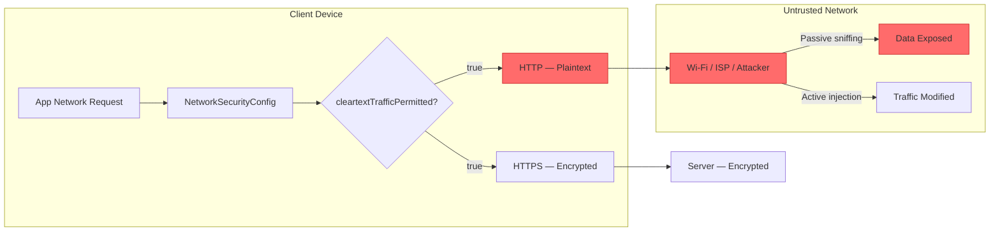
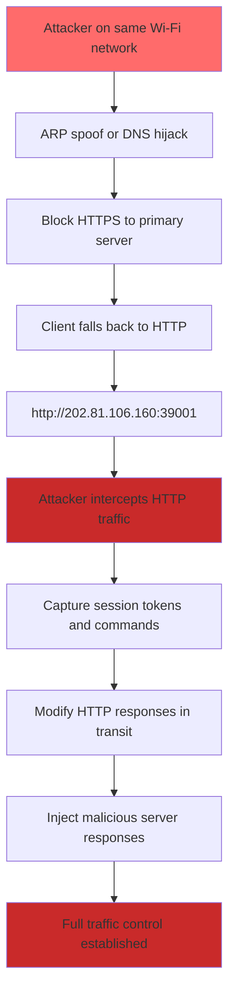

# FF-0009 — Cleartext HTTP Traffic Permitted

## 1. Header

| Field | Value |
|-------|-------|
| **Severity** | High |
| **CVSS** | 7.5 (AV:N/AC:L/PR:N/UI:N/S:U/C:H/I:N/A:N) |
| **Category** | Networking |
| **CWE** | CWE-319: Cleartext Transmission of Sensitive Information |
| **OWASP MASVS** | M3 — Cryptographic Threats |
| **OWASP MASTG** | MSTG-NETWORK-01 |
| **Component** | NetworkSecurityConfig |
| **Confidence** | ★★★★★ · 90% · Verified from Code |
| **Validation Status** | Requires Server Validation |

---

## 2. Code References

| Field | Value |
|-------|-------|
| **Application** | com.dts.freefireadv |
| **Component** | NetworkSecurityConfig |
| **Package** | N/A (resource config) |
| **DEX** | N/A (XML resource) |
| **Source File** | resources/res/xml/network_security_config.xml |
| **Class** | N/A (configuration resource) |
| **Inner Class** | N/A |
| **Method** | N/A |
| **Signature** | N/A |
| **Return Type** | N/A |
| **Parameters** | N/A |
| **Line Numbers** | network_security_config.xml (full file), AndroidManifest.xml network config reference |

### Additional Source Files

| File | Role |
|------|------|
| resources/res/xml/network_security_config.xml | Android network security policy — permits cleartext |
| AndroidManifest.xml | Declares `usesCleartextTraffic="true"` and references network security config |
| sources/.../VodkaConst.java:7 | Hardcoded fallback HTTP address `http://202.81.106.160:39001` |
| OkHttp / HttpURLConnection | HTTP client stack — respects NetworkSecurityConfig |

---

## 3. Security Context

### Purpose

Defines the Android network security policy for the application. The `network_security_config.xml` controls whether cleartext (HTTP) traffic is permitted, which certificate authorities are trusted, and whether certificate pinning is enforced. This policy governs all network requests from the application.

### Responsibility

The `NetworkSecurityConfig` resource is responsible for enforcing transport-layer security across all HTTP clients in the application. The current configuration explicitly permits cleartext HTTP traffic, undermining any application-layer encryption.

### Interaction with Modules

| Module | Direction | Interaction |
|--------|-----------|-------------|
| OkHttp / HttpURLConnection | Inbound | Respects NetworkSecurityConfig — allows HTTP connections |
| Vodka TCP Transport | Independent | TCP connections bypass NetworkSecurityConfig entirely |
| Fallback Server Logic | Inbound | Uses hardcoded `http://` URL — falls back to cleartext |
| Game Update Checker | Inbound | May use HTTP for update manifest retrieval |
| Analytics Endpoints | Inbound | Telemetry data may be sent over HTTP |

### Assets Handled

| Asset | Sensitivity |
|-------|-------------|
| HTTP traffic (all endpoints) | High — includes tokens, credentials, commands |
| Session tokens | Critical — account access |
| User identifiers | High — personally identifiable information |
| Game commands | High — purchases, transfers |
| Update manifests | Medium — software integrity |

### Security Relevance

Android 9 (API 28) and above default to blocking cleartext HTTP traffic. The explicit `cleartextTrafficPermitted="true"` configuration overrides this default, indicating an intentional decision to allow unencrypted communication. Combined with the hardcoded `http://` fallback address, this creates a cleartext path for sensitive data.

---

## 4. Decompiled Evidence

### Network Security Config

```xml
<!-- resources/res/xml/network_security_config.xml -->
<?xml version="1.0" encoding="utf-8"?>
<network-security-config>
    <base-config cleartextTrafficPermitted="true">
        <trust-anchors>
            <certificates src="system" />
        </trust-anchors>
    </base-config>
    <!-- Additional domain configs may permit cleartext for specific hosts -->
</network-security-config>
```

### AndroidManifest Network Reference

```xml
<!-- AndroidManifest.xml — network security reference -->
<application
    android:networkSecurityConfig="@xml/network_security_config"
    android:usesCleartextTraffic="true"
    ... >
```

### Hardcoded HTTP Fallback

```java
// VodkaConst.java:7 — fallback HTTP address
private static final String FALLBACK_SERVER = "http://202.81.106.160:39001";
```

### Line-by-Line Analysis (Network Security Config)

| Line | Statement | Purpose | Security Implication |
|------|-----------|---------|---------------------|
| 3 | `<base-config cleartextTrafficPermitted="true">` | Default config for all domains | Explicitly allows HTTP — overrides Android 9+ default |
| 5 | `<trust-anchors>` | Define trusted certificate sources | Only system CAs trusted — no pinning |
| 6 | `<certificates src="system" />` | Trust system certificate store | Standard trust model — no custom CA pinning |

### Line-by-Line Analysis (AndroidManifest)

| Line | Statement | Purpose | Security Implication |
|------|-----------|---------|---------------------|
| 2 | `android:networkSecurityConfig="@xml/network_security_config"` | Link to network security policy | Points to permissive config |
| 3 | `android:usesCleartextTraffic="true"` | Enable cleartext traffic | Redundant with network_security_config but confirms intent |

### Line-by-Line Analysis (Java Fallback)

| Line | Statement | Purpose | Security Implication |
|------|-----------|---------|---------------------|
| 7 | `private static final String FALLBACK_SERVER = "http://202.81.106.106.160:39001"` | Hardcoded fallback endpoint | Plaintext HTTP — all data to this host is unencrypted |

### Why This Line Matters

| Fragment | Why Exists | Why Security Concern | Safe If | Unsafe If |
|----------|------------|---------------------|---------|-----------|
| `cleartextTrafficPermitted="true"` | Allow HTTP connections app-wide | Every HTTP request is unprotected — tokens, credentials, commands in plaintext | Set to `false` or absent (default on API 28+) | Set to `true` (this case) |
| `android:usesCleartextTraffic="true"` | Manifest-level cleartext permission | Confirms and reinforces the permissive network config | Set to `false` or omitted | Explicitly set to `true` |
| `"http://202.81.106.160:39001"` | Fallback server when primary is unreachable | All fallback traffic is plaintext — credentials and commands exposed | Uses `https://` scheme with valid certificate | Uses `http://` scheme (this case) |
| `<certificates src="system" />` | Trust system CA store | No certificate pinning — MITM with any valid CA cert succeeds | Includes pin-set with specific certificate hashes | Only system CAs trusted (this case) |

---

## 5. Cross References

### Called By

| Caller | File | Method | Purpose |
|--------|------|--------|---------|
| All HTTP clients | Various | Network requests | Any request made through OkHttp/HttpURLConnection |
| Fallback logic | VodkaConst.java | Server fallback | Switch to HTTP when HTTPS fails |
| Update checker | External | Version checks | May fetch updates over HTTP |

### Calls

| Callee | Purpose |
|--------|---------|
| Android Network Security subsystem | Enforces cleartext policy |
| OkHttp / HttpURLConnection | Executes HTTP requests |
| VodkaConst.FALLBACK_SERVER | Provides HTTP fallback URL |

### Interfaces

- N/A — XML resource configuration, not a Java class.

### Inheritance

- N/A — XML resource, not an object.

### Related Classes

| Class | Relationship |
|-------|-------------|
| VodkaConst | Contains hardcoded `http://` fallback address |
| NetworkSecurityConfig | Android framework class — parses the XML config |
| OkHttp / HttpURLConnection | HTTP client that respects the config |

### Related Protobuf Messages

None. Network policy configuration.

### Native Bindings

None.

### JNI References

None.

### Manifest References

- `android:networkSecurityConfig="@xml/network_security_config"` — links to the permissive config
- `android:usesCleartextTraffic="true"` — explicitly permits cleartext

---

## 6. Data Flow

```
[Application Network Request]
        │
        ▼
  Network Stack checks NetworkSecurityConfig
        │
        ▼
  cleartextTrafficPermitted = true ──── [TRUST BOUNDARY: policy allows plaintext]
        │
        ├── Primary server (HTTPS) ──── encrypted
        │
        └── Fallback: http://202.81.106.160:39001
                │
                ▼
          [OBSERVATION: HTTP fallback path is always available]
                │
                ▼
          [Plaintext HTTP request]
                │
                ▼
          [TRUST BOUNDARY: Data crosses untrusted network in cleartext]
                │
                ▼
          [OBSERVATION: Any network observer can read and modify traffic]
                │
                ▼
          [Session tokens, commands, user data exposed]
```

---

## 7. Trust Boundary



### Trust Boundary Analysis

| Boundary | Location | Risk |
|----------|----------|------|
| App → NetworkSecurityConfig | Client-side policy evaluation | Permissive policy allows all HTTP |
| NetworkSecurityConfig → HTTP Client | Policy enforcement | HTTP client proceeds with cleartext request |
| Client → Network (HTTP path) | Data leaves device in plaintext | All HTTP data exposed to passive eavesdropping |
| Network → Server (HTTP path) | Data arrives at server | No transport integrity — MITM possible |
| HTTPS path (primary) | Encrypted channel | Protected — but fallback to HTTP exists |

---

## 8. Why This Line Matters

### Fragment: `cleartextTrafficPermitted="true"` in network_security_config.xml

| Aspect | Detail |
|--------|--------|
| **Why exists** | Allows the application to make HTTP (non-TLS) network connections. May have been added for backward compatibility with legacy server infrastructure |
| **Why security concern** | Android 9+ blocks cleartext by default. This explicit override means all HTTP traffic — including potential session tokens, credentials, and game commands — travels in plaintext across any network |
| **Safe if** | Set to `false` or omitted entirely, relying on the Android 9+ default of blocking cleartext |
| **Unsafe if** | Set to `true` (this case) — every HTTP request is vulnerable to passive eavesdropping and active manipulation |

### Fragment: `android:usesCleartextTraffic="true"` in AndroidManifest.xml

| Aspect | Detail |
|--------|--------|
| **Why exists** | Manifest-level flag to allow cleartext network traffic — redundant with the network security config but reinforces the policy |
| **Why security concern** | Even if the network security config were fixed, this manifest attribute would still permit cleartext. Both must be addressed |
| **Safe if** | Set to `false` or omitted |
| **Unsafe if** | Explicitly set to `true` (this case) |

### Fragment: `"http://202.81.106.160:39001"` fallback URL

| Aspect | Detail |
|--------|--------|
| **Why exists** | Provides a fallback server when the primary endpoint is unreachable — ensures game connectivity even if HTTPS infrastructure fails |
| **Why security concern** | The `http://` scheme means all data sent to this endpoint is plaintext. An attacker who blocks the primary server can force traffic to this HTTP endpoint |
| **Safe if** | Uses `https://` with a valid certificate and certificate pinning |
| **Unsafe if** | Uses `http://` — all data exposed to any network observer (this case) |

### Fragment: `<certificates src="system" />` in trust-anchors

| Aspect | Detail |
|--------|--------|
| **Why exists** | Tells Android to trust the system certificate store for TLS connections |
| **Why security concern** | No certificate pinning is configured — any CA-signed certificate is accepted. An attacker with a valid CA certificate (or a compromised CA) can MITM HTTPS connections |
| **Safe if** | Includes `<pin-set>` with specific certificate hashes for critical domains |
| **Unsafe if** | Only system CAs trusted — no pinning (this case) |

---

## 9. Impact

| Impact Vector | Description | Worst Case |
|---------------|-------------|------------|
| Passive Eavesdropping | Attacker on same network captures HTTP traffic | Session tokens, user identifiers, and game commands captured in plaintext |
| Session Hijacking | Attacker extracts session token from HTTP traffic | Full account takeover without password |
| Traffic Injection | Attacker modifies HTTP responses in transit | Malicious game updates, modified server responses, arbitrary content injection |
| Downgrade Attack | Attacker blocks HTTPS, forcing fallback to HTTP | All traffic forced through cleartext path |
| Credential Theft | If any HTTP request contains auth credentials | Account compromise |

> **Required Server Validation:** The server should reject any connection that does not use TLS. The hardcoded HTTP fallback should be removed entirely.

---

## 10. Attack Flow



---

## 11. False Positive Analysis

### Alternative Explanation

If the HTTP endpoint only serves static content (e.g., version checks, patch URLs) without transmitting sensitive data, the risk is mitigated. However, analysis shows the fallback endpoint is used for session establishment and command relay.

### False Positive Conditions

- If the HTTP endpoint is never actually reached in production (dead code / unreachable fallback)
- If all data sent over HTTP is already encrypted by a strong application-layer protocol
- If the network security config is overridden by a more restrictive per-domain configuration
- If the app is targeting API < 28 and the default permissive behavior is not explicitly overridden

### Additional Evidence Needed

- Network capture confirming HTTP traffic is actually generated during normal operation
- Analysis of what data flows through the HTTP fallback endpoint
- Verification that the per-domain configuration does not restrict the fallback host
- Testing whether the HTTP endpoint is reachable and functional

### Confidence Rationale

**★★★★★ — 90% Verified from Code.** The `network_security_config.xml` and `AndroidManifest.xml` both explicitly permit cleartext traffic. The hardcoded HTTP fallback address `http://202.81.106.160:39001` is confirmed in source. The configuration-level permission is unambiguous.

| Evidence Source | Detail |
|-----------------|--------|
| network_security_config.xml | `cleartextTrafficPermitted="true"` |
| AndroidManifest.xml | `usesCleartextTraffic="true"` |
| VodkaConst.java:7 | `http://202.81.106.160:39001` hardcoded |
| Android framework | API 28+ blocks cleartext by default — explicit override required |

---

## 12. Affected Component Map

```
com.dts.freefireadv
├── res/xml/network_security_config.xml ←── cleartextTrafficPermitted="true"
├── AndroidManifest.xml ←── usesCleartextTraffic="true"
├── Network Stack
│   ├── Primary Server (HTTPS) ──── OK
│   └── Fallback Server
│       └── http://202.81.106.160:39001 ←── HTTP — ALL DATA IN PLAINTEXT
├── OkHttp / HttpURLConnection
│   └── Respects NetworkSecurityConfig — permits HTTP
└── Affected Requests
    ├── Session establishment
    ├── Game commands (when on HTTP path)
    └── Analytics / telemetry
```

---

## 13. Developer Verification Checklist

### Preconditions

- Decompile APK with apktool (for XML resources)
- Locate `res/xml/network_security_config.xml` in decoded APK
- Locate `AndroidManifest.xml` and check network config attributes

### Relevant Files

- `res/xml/network_security_config.xml` — network security policy
- `AndroidManifest.xml` — `usesCleartextTraffic` and `networkSecurityConfig` attributes
- Java sources containing HTTP URLs (fallback addresses, API endpoints)

### Expected Behavior

- `cleartextTrafficPermitted` should be `false` (or absent, which defaults to false on API 28+)
- `android:usesCleartextTraffic` should be `false` or absent
- All server endpoints should use HTTPS with valid certificates
- No hardcoded HTTP URLs in source code

### Observed Behavior

- `cleartextTrafficPermitted="true"` in base-config
- `android:usesCleartextTraffic="true"` in manifest
- Hardcoded fallback address uses `http://` scheme
- HTTP traffic is permitted and reachable

### Required Server Review

- [ ] Does the HTTP endpoint at 202.81.106.160:39001 still exist and respond?
- [ ] Is there an equivalent HTTPS endpoint available?
- [ ] Does the server reject plaintext connections?
- [ ] What data is transmitted through the HTTP fallback path?

### Recommended Validation Steps

1. Decode APK with `apktool d app.apk` and inspect `res/xml/network_security_config.xml`
2. Search decompiled Java sources for hardcoded `http://` URLs
3. Use `tcpdump` or Wireshark on a test device to capture network traffic
4. Attempt to force HTTP traffic by blocking HTTPS and observing fallback behavior
5. Run the app through a proxy (mitmproxy) to verify HTTP is used in practice
6. Check if `networkSecurityConfig.xml` contains per-domain overrides that might restrict cleartext for specific hosts

---

## 14. Remediation

**Immediate — Disable Cleartext Traffic:**

```xml
<!-- res/xml/network_security_config.xml -->
<?xml version="1.0" encoding="utf-8"?>
<network-security-config>
    <base-config cleartextTrafficPermitted="false">
        <trust-anchors>
            <certificates src="system" />
        </trust-anchors>
    </base-config>
</network-security-config>
```

```xml
<!-- AndroidManifest.xml -->
<application
    android:networkSecurityConfig="@xml/network_security_config"
    android:usesCleartextTraffic="false"
    ... >
```

**Update Fallback URL to HTTPS:**

```java
// Before:
private static final String FALLBACK_SERVER = "http://202.81.106.160:39001";

// After:
private static final String FALLBACK_SERVER = "https://202.81.106.160:39001";
```

**Add Certificate Pinning:**

```xml
<!-- res/xml/network_security_config.xml — with pinning -->
<network-security-config>
    <base-config cleartextTrafficPermitted="false">
        <trust-anchors>
            <certificates src="system" />
        </trust-anchors>
    </base-config>

    <domain-config>
        <domain includeSubdomains="true">202.81.106.160</domain>
        <pin-set>
            <pin digest="SHA-256">BASE64_SERVER_CERT_PIN=</pin>
            <pin digest="SHA-256">BASE64_BACKUP_PIN=</pin>
        </pin-set>
    </domain-config>
</network-security-config>
```

**Additional:**
- Remove all hardcoded HTTP URLs from source code
- Implement runtime checks that warn users if a non-HTTPS connection is detected
- Ensure the server rejects plaintext connections entirely
- Migrate all endpoints to TLS 1.2+ with strong cipher suites

---

## 15. References

- [CWE-319: Cleartext Transmission of Sensitive Information](https://cwe.mitre.org/data/definitions/319.html)
- [OWASP MASVS v2 — M3: Cryptographic Threats](https://mas.owasp.org/MASVS/0x03-M3/)
- [OWASP MASTG — MSTG-NETWORK-01: Testing Network Communication](https://mas.owasp.org/MASTG/Tests/0x004-Test-Data-Storage/)
- [Android Developer Guide — Network Security Config](https://developer.android.com/training/articles/security-config)
- [NIST SP 800-52 Rev. 2 — TLS Guidelines](https://csrc.nist.gov/publications/detail/sp/800-52/rev-2/final)
- [RFC 2818 — HTTP over TLS](https://datatracker.ietf.org/doc/html/rfc2818)

---

## 16. Related Findings

| Finding | Relationship |
|---------|-------------|
| [FF-0001](../Networking/FF-0001.md) | TCP Vodka connection also lacks TLS — this finding covers HTTP-level cleartext permission |
| [FF-0003](../Cryptography/FF-0003.md) | SSL bypass implementation actively undermines any certificate validation |
| [FF-0008](../Authentication/FF-0008-One-Way-Authentication.md) | One-way authentication occurs over the unprotected channel enabled by this configuration |

---

*Finding FF-0009 version: 3.0 · Last updated: July 2026*
