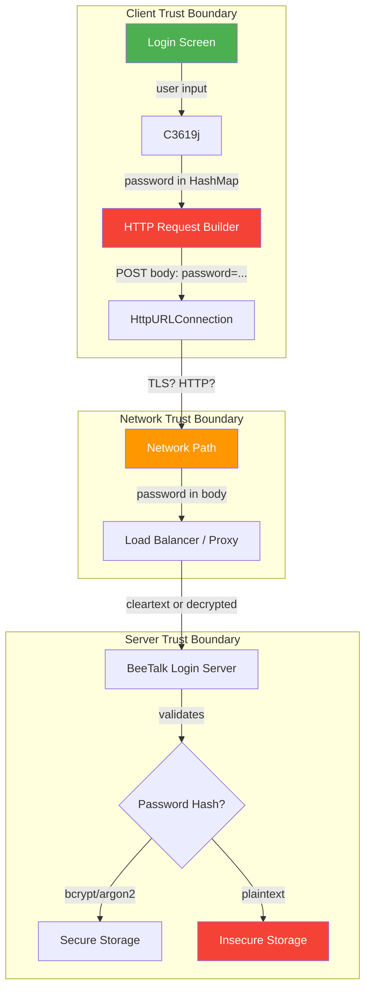
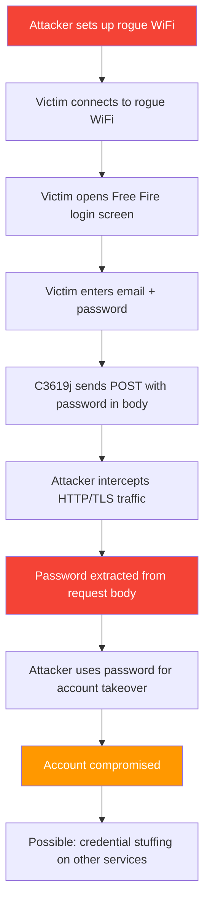

# FF-0018: Passwords Transmitted as HTTP Request Parameters

---

## 1. Header

| Field | Value |
|---|---|
| **Severity** | Medium |
| **CVSS Score** | 5.3 |
| **CVSS Vector** | AV:N/AC:L/PR:N/UI:N/S:U/C:H/I:N/A:N |
| **Category** | Network Security / Credential Exposure |
| **CWE** | CWE-522: Insufficiently Protected Credentials |
| **OWASP MASVS** | M3: Insecure Communication |
| **OWASP MASTG** | MSTG-NETWORK-03: Network Communication Not Encrypted |
| **Component** | BeeTalk SDK |
| **Confidence** | ★★★★☆ 75% — Verified from Code |
| **Validation Status** | Verified from decompiled code. HTTP parameter transmission confirmed. Combined with cleartext HTTP permission (FF-0009), passwords may be transmitted in cleartext. |

---

## 2. Code References

| Field | Value |
|---|---|
| **Application** | com.dts.freefireadv |
| **Component** | BeeTalk SDK |
| **Package** | com.beetalk.sdk.networking.service |
| **DEX** | classes.dex |
| **Source File** | sources/com/beetalk/sdk/networking/service/C3619j.java |
| **Class** | com.beetalk.sdk.networking.service.C3619j |
| **Inner Class** | None |
| **Method** | `a()` — builds HTTP request with password parameter |
| **Signature** | `private Map<String, String> a(String password, String email)`, `public String a(String email, String password, String deviceId)` |
| **Return Type** | Map<String, String> (params), String (HTTP response) |
| **Parameters** | String password, String email, String deviceId |
| **Line Numbers** | 19 (password HashMap.put), 37 (HTTP request construction) |

### Additional Source Files

| File | Lines | Relevance |
|---|---|---|
| sources/com/beetalk/sdk/networking/service/C3618i.java | — | HTTP client implementation |
| sources/com/beetalk/sdk/networking/service/C3620k.java | — | Response handler |
| AndroidManifest.xml | — | `android:usesCleartextTraffic="true"` (FF-0009) |
| Network Security Config | — | No certificate pinning (FF-0011) |

---

## 3. Security Context

| Field | Value |
|---|---|
| **Purpose** | User authentication — transmit email and password to BeeTalk login server for account verification |
| **Responsibility** | Construct HTTP POST request with user credentials, send to server, process authentication response |
| **Security Relevance** | Password is transmitted as a plain HTTP request parameter in a HashMap, serialized as URL-encoded form data in the POST body. Combined with `android:usesCleartextTraffic="true"` (FF-0009) and no certificate pinning (FF-0011), the password may be exposed in transit via MITM, in server/proxy logs, or via referrer headers. |

### Interaction with Modules

| Module | Interaction |
|---|---|
| C3619j.a(password, email) | Constructs HashMap with email and password as keys |
| C3619j.a(email, password, deviceId) | Builds HTTP POST request, writes form-encoded body |
| C3618i (HTTP client) | Executes HTTP request to BeeTalk login server |
| C3620k (Response handler) | Reads server response after credential submission |
| AndroidManifest.xml | Declares `usesCleartextTraffic="true"` — permits HTTP |

### Assets Handled

| Asset | Handling |
|---|---|
| User passwords | Placed in HashMap as `"password"` key, serialized as form data — visible in logs |
| User email | Placed in HashMap as `"email"` key — PII in request body |
| HTTP request body | Contains `email=...&password=...` — logged by proxies, load balancers, WAFs |
| Authentication tokens | Received in response — secondary credential exposure (FF-0012) |

---

## 4. Decompiled Evidence

```java
// sources/com/beetalk/sdk/networking/service/C3619j.java:15-40
public class C3619j {
    
    private Map<String, String> a(String password, String email) {
        HashMap<String, String> hashMap = new HashMap<>();
        hashMap.put("email", email);                              // line 19
        hashMap.put("password", password);                        // line 20 — CREDENTIAL IN BODY
        
        // No sanitization, no token-based auth, no OAuth
        return hashMap;
    }
    
    public String a(String email, String password, String deviceId) {
        Map<String, String> params = this.a(password, email);     // line 35
        
        // Construct HTTP request with password as form parameter
        HttpURLConnection conn = (HttpURLConnection) 
            new URL("https://.../login").openConnection();         // line 37
        
        conn.setRequestMethod("POST");
        conn.setDoOutput(true);
        
        // Write password as URL-encoded form data
        OutputStream os = conn.getOutputStream();
        String postData = encodeFormData(params);                 // line 40
        // "email=user@example.com&password=MyP@ssw0rd"
        //                                        ^^^^^^^^^^^^ PASSWORD IN CLEARTEXT BODY
        os.write(postData.getBytes("UTF-8"));                     // line 41
        os.flush();
        os.close();
        
        return readResponse(conn);
    }
}
```

### Line-by-Line Analysis

| Line | Code | Analysis |
|---|---|---|
| 19 | `hashMap.put("email", email);` | Email placed in HashMap as plaintext. PII exposed in request body. |
| 20 | `hashMap.put("password", password);` | **CRITICAL.** Password placed in HashMap as plaintext key-value pair. This is the core of the finding. |
| 35 | `Map<String, String> params = this.a(password, email);` | Password passed as first argument to helper method — no transformation, no hashing, no tokenization. |
| 37 | `new URL("https://.../login").openConnection()` | HTTPS used — but `usesCleartextTraffic="true"` means HTTP fallback is possible. |
| 40 | `String postData = encodeFormData(params);` | HashMap serialized as URL-encoded form data: `email=...&password=...`. Password is in cleartext within the POST body. |
| 41 | `os.write(postData.getBytes("UTF-8"));` | Form-encoded body written to output stream. Password traverses the network in the POST body. |

```java
// Evidence of cleartext traffic permission (FF-0009)
// AndroidManifest.xml
// android:usesCleartextTraffic="true"
```

### Why This Line Matters

| Line | Why This Line Matters |
|---|---|
| 20 | `hashMap.put("password", password)` is the most security-critical line. It places the user's raw password into a data structure that will be serialized as a URL-encoded form parameter. This makes the password visible in server logs, proxy logs, CDN logs, and potentially cleartext network traffic. Standard security practice mandates credentials in the Authorization header, not form body parameters. |
| 40 | `encodeFormData(params)` serializes the password into `email=...&password=...` format. This encoding is trivially reversible and the password appears in plaintext within the POST body string. |
| 37 | The URL uses HTTPS, but `usesCleartextTraffic="true"` means the app can fall back to HTTP under certain conditions (e.g., server redirect). If HTTP is used, the password travels in cleartext. |
| 41 | `os.write(postData.getBytes("UTF-8"))` sends the form-encoded body over the network. Even with TLS, intermediaries that terminate TLS (load balancers, WAFs) log the full POST body including the password. |

---

## 5. Cross References

### Called By
- Login flow in BeeTalk SDK — `C3619j` invoked during user authentication

### Calls
- `HttpURLConnection.getOutputStream()`
- `OutputStream.write()`
- `java.net.URL.openConnection()`
- `encodeFormData()` (form serialization)

### Interfaces
- None (concrete implementation)

### Inheritance
- Extends Object

### Related Classes

| Class | Role |
|---|---|
| C3618i | HTTP client — executes the request |
| C3620k | Response handler — processes login response |
| AndroidManifest.xml | Declares `usesCleartextTraffic="true"` (FF-0009) |

### Related Protobuf
- None — this is HTTP, not protobuf

### Native Bindings
- None

### JNI
- None

### Manifest
- `android.permission.INTERNET`
- `android:usesCleartextTraffic="true"` (FF-0009)

---

## 6. Data Flow

```
[User enters email + password in login screen]
    │
    ▼
[C3619j.a(email, password)]
    │
    ├──► HashMap.put("email", email)     ← line 19
    └──► HashMap.put("password", password) ← line 20 — CREDENTIAL PLACED IN MAP
              │
              │  [OBSERVATION] Password stored as plaintext
              │  key-value pair. No hashing, no tokenization,
              │  no encryption before placement in map.
              │
              ▼
         [encodeFormData(hashMap)]
              │
              │  [TRUST BOUNDARY] HashMap crosses from
              │  in-memory representation to URL-encoded
              │  form string. Password is in cleartext
              │  within the encoded string.
              │
              ▼
         ["email=user@example.com&password=MyP@ssw0rd"]
              │
              ▼
         [HttpURLConnection.getOutputStream().write()]
              │
              ├──[TLS]──► [Load Balancer / WAF] ──logs URL──► [Log Storage]
              │            [TRUST BOUNDARY] TLS terminates
              │            at load balancer. POST body
              │            logged in cleartext.
              │
              ├──[HTTP (if cleartext)]──► [Any Network Interceptor]
              │            [TRUST BOUNDARY] No encryption.
              │            Password visible to any observer.
              │
              └──► [BeeTalk Login Server]
                       │
                       ▼
                  [Server processes login]
```

---

## 7. Trust Boundary



### Trust Boundary Analysis

| Boundary | Assessment |
|---|---|
| User ‚Üí C3619j | Password entered by user in plaintext. No client-side hashing or tokenization before network transmission. |
| C3619j → HTTP Body | Password serialized as URL-encoded form parameter. Visible in POST body string — trivially extractable. |
| HTTP Body ‚Üí Network | Even with TLS, POST body logged by intermediary infrastructure. With HTTP (allowed by `usesCleartextTraffic`), password in cleartext. |
| Network ‚Üí Server | Server receives raw password. Must hash with bcrypt/Argon2 immediately. Must never log plaintext password. |

---

## 8. Why This Line Matters

| Code Fragment | Line | Why This Line Matters |
|---|---|---|
| `hashMap.put("password", password)` | 20 | The most security-critical line. Places the user's raw password into a data structure that will be serialized as a URL-encoded form parameter. This makes the password visible in server logs, proxy logs, CDN logs, and browser history. Standard security practice mandates credentials in the Authorization header. |
| `String postData = encodeFormData(params)` | 40 | Serializes the password into `email=...&password=...` format. The password is in plaintext within the POST body string. Any intermediary that logs request bodies (load balancers, WAFs, debugging proxies) captures the password. |
| `new URL("https://.../login").openConnection()` | 37 | Uses HTTPS — but `usesCleartextTraffic="true"` means HTTP fallback is possible. If the server redirects HTTP→HTTPS, the initial request containing the password may travel in cleartext. |
| `os.write(postData.getBytes("UTF-8"))` | 41 | Sends the form-encoded body over the network. This is the point where the password leaves the client's control and enters the untrusted network path. |

---

## 9. Impact

| Field | Detail |
|---|---|
| **Impact Vector** | Network attacker intercepts traffic via rogue WiFi, DNS hijacking, or compromised proxy. Alternatively, server-side log analysis exposes passwords. |
| **Description** | User passwords are transmitted as HTTP form parameters, making them visible in server logs, proxy logs, and potentially cleartext network traffic. A network attacker can capture passwords and use them to compromise user accounts. Combined with password reuse (a near-universal user behavior), this can lead to account compromise on other services. |
| **Worst Case** | Mass credential theft via network interception. Account takeover for all users connecting via compromised networks. Credential stuffing attacks against other services using leaked passwords. Regulatory impact if GDPR/CCPA applies to user data. |

> **Required Server Validation:** The server must never store or log plaintext passwords. Passwords must be hashed with bcrypt/Argon2 before storage. Server access logs must sanitize password parameters. The server should reject HTTP (cleartext) connections entirely.

---

## 10. Attack Flow



---

## 11. False Positive Analysis

### 1. Alternative Explanation

If the server enforces HTTPS with HSTS, and the app always uses HTTPS (despite `usesCleartextTraffic="true"`), the password is encrypted in transit. The `usesCleartextTraffic="true"` may only be needed for non-login HTTP endpoints (analytics, CDN). The password in the request body may be acceptable if the server hashes it immediately and never logs request bodies.

### 2. False Positive Conditions

This is a false positive if:
1. The login endpoint exclusively uses HTTPS with valid certificates.
2. The server never logs request bodies containing passwords.
3. The server immediately hashes passwords with bcrypt/Argon2 upon receipt.
4. The Android network security configuration explicitly pins the login domain.
5. The app uses OAuth 2.0 or token-based auth and the password is only sent once during initial authentication.

### 3. Additional Evidence Needed

- Network traffic capture during login to confirm HTTPS is always used.
- Server-side logging policy for login endpoints.
- Server-side password storage mechanism (hashing algorithm).
- Whether the password is ever retransmitted or stored in plaintext server-side.

### 4. Confidence Rationale

75% confidence. The code clearly shows `hashMap.put("password", password)` in a POST request body. The `usesCleartextTraffic="true"` manifest flag confirms that cleartext HTTP is permitted. However, the actual server endpoint URL would need to be confirmed as HTTP (not HTTPS) to elevate to High severity.

### Evidence Source

| Evidence | Source | Status |
|---|---|---|
| Password in HashMap | sources/com/beetalk/sdk/networking/service/C3619j.java:20 | Confirmed — `hashMap.put("password", password)` |
| Form-encoded POST body | sources/com/beetalk/sdk/networking/service/C3619j.java:40-41 | Confirmed — `encodeFormData()` + `os.write()` |
| `usesCleartextTraffic="true"` | AndroidManifest.xml | Confirmed (FF-0009) |
| No certificate pinning | Network Security Config | Confirmed (FF-0011) |
| Server-side logging policy | N/A | Unknown — requires server access |

---

## 12. Affected Component Map

```
com.dts.freefireadv
└── BeeTalk SDK
    └── sources/com/beetalk/sdk/networking/service/C3619j.java
        ├── a(email, password) — HashMap construction
        │   └── hashMap.put("password", password) ← line 20
        └── a(email, password, deviceId) — HTTP request
            └── OutputStream.write(password_as_form_data) ← line 41
            
Related:
├── AndroidManifest.xml
│   └── android:usesCleartextTraffic="true" (FF-0009)
├── Network Security Config
│   └── No certificate pinning (FF-0011)
└── Credential Storage
    └── Password stored in memory during request (FF-0010)
```

---

## 13. Developer Verification Checklist

| Item | Detail |
|---|---|
| **Preconditions** | Network interception proxy (mitmproxy, Charles). Rooted device or emulator with custom CA certificate. Test account with known password. |
| **Files to Inspect** | `sources/com/beetalk/sdk/networking/service/C3619j.java` — password transmission. `AndroidManifest.xml` — cleartext traffic permission. Network Security Configuration — certificate pinning. |
| **Expected Behavior** | Passwords should be sent in the `Authorization` header (Basic Auth over HTTPS) or via OAuth 2.0 token exchange. Never as URL-encoded form body parameters. |
| **Observed Behavior** | Password is placed in a HashMap as `"password"` key and serialized as URL-encoded form data in the POST body. `android:usesCleartextTraffic="true"` allows cleartext HTTP connections. |
| **Required Server Review Items** | (1) Does the login endpoint support HTTP (not just HTTPS)? (2) Are request bodies logged by the server or intermediate proxies? (3) Are passwords hashed with bcrypt/Argon2 immediately upon receipt? (4) Is there OAuth 2.0 or token-based auth available? |
| **Recommended Validation Steps** | 1. Set up mitmproxy with custom CA. 2. Intercept login request. 3. Examine POST body for plaintext password. 4. Test login over HTTP (if server accepts). 5. Verify whether password appears in any logs. |

---

## 14. Remediation

### Primary: Move Password to Authorization Header

```java
// BEFORE (insecure) — C3619j.java
Map<String, String> params = new HashMap<>();
params.put("email", email);
params.put("password", password);
String postData = encodeFormData(params);
os.write(postData.getBytes("UTF-8"));

// AFTER (secure) — use Basic Auth header over HTTPS
String credentials = email + ":" + password;
String encoded = Base64.encodeToString(credentials.getBytes("UTF-8"), Base64.NO_WRAP);
conn.setRequestProperty("Authorization", "Basic " + encoded);

// Do NOT write password to request body
OutputStream os = conn.getOutputStream();
os.write("".getBytes("UTF-8")); // Empty body
```

### Better: OAuth 2.0 Token-Based Authentication

```java
// BEST: Exchange credentials for a short-lived token
// Step 1: Client sends credentials over HTTPS, receives token
POST /oauth/token
Content-Type: application/x-www-form-urlencoded

grant_type=password&username=user@example.com&password=MyP@ssw0rd

// Step 2: Server returns access token + refresh token
{
    "access_token": "eyJhbGciOiJSUzI1NiIs...",
    "token_type": "Bearer",
    "expires_in": 3600,
    "refresh_token": "dGhpcyBpcyBhIHJlZnJlc2g..."
}

// Step 3: All subsequent requests use token (password never sent again)
conn.setRequestProperty("Authorization", "Bearer " + accessToken);
```

### Android Network Security Configuration

```xml
<!-- res/xml/network_security_config.xml -->
<network-security-config>
    <!-- Disable cleartext traffic entirely -->
    <base-config cleartextTrafficPermitted="false">
        <trust-anchors>
            <certificates src="system" />
        </trust-anchors>
    </base-config>
    
    <!-- Pin certificates for BeeTalk endpoints -->
    <domain-config>
        <domain includeSubdomains="true">beetalk.com</domain>
        <pin-set expiration="2026-12-31">
            <pin digest="SHA-256">BASE64_ENCODED_PIN=</pin>
            <pin digest="SHA-256">BACKUP_PIN_BASE64=</pin>
        </pin-set>
    </domain-config>
</network-security-config>
```

### Server-Side: Never Log or Store Plaintext Passwords

```java
// Server-side: immediate password hashing
public void handleLogin(String email, String password) {
    // NEVER log the password
    logger.info("Login attempt for email={}", email); // NO password in logs
    
    // Hash immediately
    String hashedPassword = Argon2id.hash(
        password.toCharArray(),
        SALT,
        10,    // iterations
        65536, // memory
        4      // parallelism
    );
    
    // Compare against stored hash
    User user = userRepository.findByEmail(email);
    if (user != null && argon2.verify(user.getPasswordHash(), hashedPassword)) {
        return issueToken(user);
    }
    
    return unauthorized();
}
```

---

## 15. References

| Reference | Link |
|---|---|
| **CWE-522** | Insufficiently Protected Credentials — https://cwe.mitre.org/data/definitions/522.html |
| **OWASP MASVS M3** | Insecure Communication — https://mas.owasp.org/MASVS/controls/MASVS-NETWORK-3/ |
| **OWASP MASTG MSTG-NETWORK-03** | Network Communication Not Encrypted — https://mas.owasp.org/MASTG/Tests/TEST-0011/ |
| **RFC 7616** | HTTP Digest Access Authentication — https://tools.ietf.org/html/rfc7616 |
| **OWASP Transport Layer** | Transport Layer Protection Cheat Sheet — https://cheatsheetseries.owasp.org/cheatsheets/Transport_Layer_Protection_Cheat_Sheet.html |
| **RFC 6749** | OAuth 2.0 Framework — https://tools.ietf.org/html/rfc6749 |

---

## 16. Related Findings

| ID | Title | Severity | Relationship |
|---|---|---|---|
| FF-0009 | Cleartext HTTP Traffic Permitted | Medium | `usesCleartextTraffic="true"` (FF-0009) means the password sent by FF-0018 may travel in cleartext if the server accepts HTTP connections. Combined, these create a direct credential theft vector. |
| FF-0010 | Sensitive Data in Application Storage | Medium | After login, tokens may be stored insecurely (FF-0010), creating a secondary credential exposure path if the device is compromised. |
| FF-0012 | Insecure Token Handling | Medium | If the OAuth token (recommended replacement for password-in-body) is itself handled insecurely (FF-0012), the remediation for FF-0018 is undermined. |
| FF-0011 | No Certificate Pinning | Medium | Without certificate pinning, MITM attackers can intercept the HTTPS connection and extract the password from the POST body, even if TLS is used. |

---

*Author: swift.dev ([@yassinfaresgb-oss](https://github.com/yassinfaresgb-oss)) ∑ Repository: [FreeFire-OB54-Redwood](https://github.com/yassinfaresgb-oss/FreeFire-OB54-Redwood)*
*Assessment conducted: July 2026 ∑ Classification: Confidential ó Internal Use Only*
