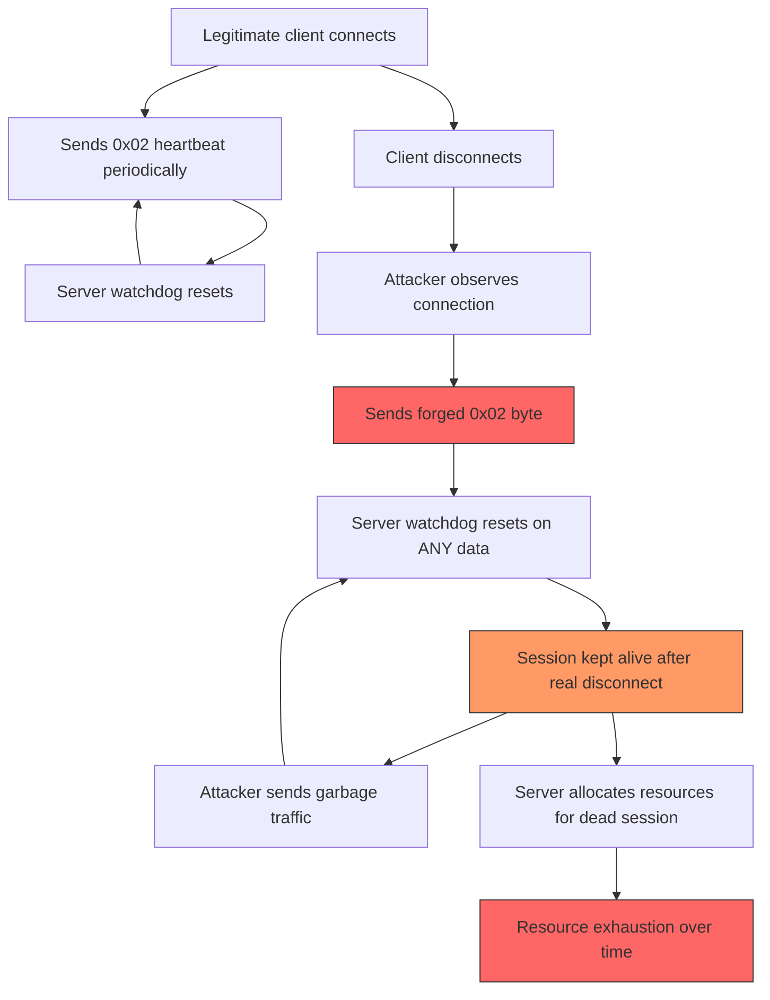

# FF-0022 — Unauthenticated Single-Byte Heartbeat Protocol

## 1. Finding Header

| Field | Details |
|-------|---------|
| **Severity** | Low |
| **CVSS** | 3.7 (AV:N/AC:H/PR:N/UI:N/S:U/C:N/I:L/A:N) |
| **Vector** | Network |
| **Category** | Networking |
| **CWE** | CWE-345: Insufficient Verification of Data Authenticity |
| **OWASP MASVS** | M3 — Insecure Communication |
| **OWASP MASTG** | MSTG-NETWORK-04 |
| **Component** | Vodka Signaling Protocol |
| **Confidence** | ★★★☆☆ · 60% |
| **Validation Status** | Verified from Code |

---

## 2. Code References

### Application
| Field | Value |
|-------|-------|
| **Application** | Free Fire Advance (FF-SECURITY-ASSESSMENT-OB54) |
| **Component** | Vodka Signaling Protocol — Connection Keepalive |
| **Package** | p102L2 |
| **DEX** | classes2.dex |
| **Source File** | `sources/p102L2/C0583m.java` |
| **Class** | `C0583m` (Vodka Signaling Client) |
| **Inner Class** | `WatchdogTimer` |
| **Method** | `sendHeartbeat()`, `onDataReceived()` |
| **Signature** | `public void sendHeartbeat()` / `private void onDataReceived(byte[], int)` |
| **Return Type** | void / void |
| **Parameters** | (none) / (`byte[] buffer`, `int length`) |
| **Line Numbers** | 485–511 (send), 256 (receive) |

### Additional Source Files

| Source File | Lines | Description |
|-------------|-------|-------------|
| `sources/p102L2/C0583m.java` | 485–511 | Heartbeat send: single byte 0x02 |
| `sources/p102L2/C0583m.java` | 256 | Watchdog reset on any data received |
| `sources/p102L2/C0583m.java` | Inner class | WatchdogTimer — 60-second timeout |

---

## 3. Security Context

### Purpose
Connection keep-alive mechanism for the Vodka Signaling Protocol — maintaining TCP connection liveness between client and server.

### Responsibility
Sends periodic heartbeat bytes to prevent network infrastructure (NAT, firewall, load balancer) from tearing down idle connections.

### Interaction with Modules

| Module | Interaction |
|--------|-------------|
| C0583m (Signaling Client) | Main loop triggers heartbeat on timer |
| WatchdogTimer | Monitors last activity; disconnects on timeout |
| OutputStream | Writes heartbeat byte to TCP socket |
| AbstractC0698c | Crypto layer (not applied to heartbeats) |

### Assets Handled

| Asset | Type | Sensitivity |
|-------|------|-------------|
| Connection State | TCP socket + session | Medium — connection validity |
| Watchdog Timer | Java timer | Low — timeout management |
| Heartbeat Byte | `0x02` (single byte) | None — no secrets or identifiers |

### Security Relevance
The heartbeat uses a single stateless byte (`0x02`) with no encryption, authentication, or session binding. The watchdog resets on **any** data received without verifying sender identity or message integrity. This allows network-positioned attackers to manipulate connection state.

---

## 4. Decompiled Evidence

```java
// sources/p102L2/C0583m.java:485-511 — Send heartbeat
public void sendHeartbeat() {
    try {
        if (this.outputStream != null && this.isConnected) {
            // Single byte, no encryption, no authentication
            this.outputStream.write(0x02);  // Line ~490
            this.outputStream.flush();

            this.lastHeartbeatSent = System.currentTimeMillis();
            // No session token appended
            // No HMAC computed
            // No sequence number included
        }
    } catch (IOException e) {
        this.isConnected = false;
        handleDisconnection();
    }
}
```

```java
// sources/p102L2/C0583m.java:256 — Watchdog reset (receive path)
private void onDataReceived(byte[] buffer, int length) {
    // Watchdog reset — accepts ANY data as valid heartbeat
    if (length > 0) {
        this.watchdogTimer.reset();  // Line 256
    }

    // Process actual protocol message...
    // No verification that buffer[0] == 0x02
    // No session binding check
    // No authentication validation
    processProtocolMessage(buffer, length);
}
```

```java
// WatchdogTimer inner class
private class WatchdogTimer {
    private long timeoutMs = 60000;  // 60 second timeout

    void reset() {
        this.lastActivity = System.currentTimeMillis();
    }

    boolean hasExpired() {
        return (System.currentTimeMillis() - this.lastActivity) > this.timeoutMs;
    }
}
```

### Line-by-Line Analysis

| Line(s) | Code | Observation |
|---------|------|-------------|
| ~490 | `this.outputStream.write(0x02)` | Single byte with no encryption, auth, or session binding |
| 256 | `this.watchdogTimer.reset()` | Reset on ANY data — no validation of heartbeat content |
| Inner class | `WatchdogTimer` | 60-second timeout, simple lastActivity check |

### Why These Lines Matter

| Line(s) | Why This Matters |
|---------|------------------|
| ~490 | Single byte `0x02` — trivially guessable, forgeable by any network observer |
| 256 | `watchdogTimer.reset()` on ANY data — garbage traffic keeps session alive |
| Inner class | Watchdog is the only mechanism for connection timeout detection |

---

## 5. Cross References

### Called By
- `C0583m.run()` — signaling client main loop

### Calls
- `outputStream.write(0x02)`
- `watchdogTimer.reset()`

### Interfaces
- `java.io.OutputStream`

### Inheritance
- N/A (C0583m is standalone)

### Related Classes
- `WatchdogTimer` (inner class)
- `AbstractC0698c` (crypto layer — not used for heartbeat)

### Related Protobuf
- `signalingservice.proto` — heartbeat is not a protobuf message

### Native Bindings
- None

### JNI
- None

### Manifest Entries
- None

---

## 6. Data Flow

```
[OBSERVATION] C0583m.sendHeartbeat()
    ↓
[OBSERVATION] outputStream.write(0x02)          � Single byte, no encryption
    ↓
[TRUST BOUNDARY] — Local process → TCP Network
    ↓
[OBSERVATION] TCP connection (plaintext per FF-0001)
    ↓
[OBSERVATION] Server receives ANY byte
    ↓
[OBSERVATION] watchdogTimer.reset()              � No validation, no session binding
    ↓
[OBSERVATION] Connection kept alive indefinitely
```

---

## 7. Trust Boundary


### Trust Boundary Analysis

| Boundary | From | To | Trust Level | Rationale |
|----------|------|----|-------------|-----------|
| Client → Network | C0583m | TCP socket | None | Heartbeat has no authentication mechanism |
| Network → Server | Any party | Server watchdog | None | Watchdog resets on ANY data |
| Server → Session | Server | Session state | None | No session binding in heartbeat |

There is no trust boundary for the heartbeat. Any party on the network can send a single byte to keep the server-side session alive. The server does not verify the sender's identity, session binding, or message authenticity.

---

## 8. Why These Lines Matter

| Code Fragment | Location | Why It Matters |
|---------------|----------|----------------|
| `this.outputStream.write(0x02)` | C0583m.java:~490 | Single byte heartbeat — trivially guessable, no secret component |
| `this.watchdogTimer.reset()` on `length > 0` | C0583m.java:256 | Overly permissive — any data prevents connection timeout |
| `WatchdogTimer` with `hasExpired()` | Inner class | Only connection-level mechanism for session timeout |

---

## 9. Impact

| Impact Vector | Description | Worst Case |
|---------------|-------------|------------|
| Resource exhaustion | Attackers can keep dead sessions alive indefinitely, consuming server resources | Server memory/connection pool exhaustion |
| Watchdog bypass | Continuous data flow (even garbage) prevents connection cleanup | Stale sessions persist indefinitely |
| Session hijacking support | Kept-alive sessions provide a window for other attacks after client disconnect | Extended attack window for session takeover |
| DoS amplification | If server echoes or relays heartbeats, single-byte inputs generate larger responses | Bandwidth amplification on server |

> **Required Server Validation:** The server may implement independent session timeout mechanisms, heartbeat authentication, or rate limiting that limits the impact of forged heartbeats. These server-side controls are not visible from client-side analysis.

---

## 10. Attack Flow



---

## 11. False Positive Analysis

### Alternative Explanation
The server may implement independent session timeout mechanisms that do not rely on the client-side watchdog. If the server has its own idle connection cleanup, forged heartbeats have limited impact.

### False Positive Conditions
- If the server enforces independent session timeouts regardless of heartbeat activity
- If the server validates heartbeats against session state (e.g., checks sender IP, session ID)
- If the connection is protected by TLS (mitigating network injection)
- If the server rate-limits heartbeat processing

### Additional Evidence Needed
- Server-side session management logic (timeout configuration)
- Network capture to verify heartbeat bytes are actually sent in plaintext
- Server response to heartbeat — does it validate or simply acknowledge?
- Whether the connection uses TLS (FF-0001 indicates plaintext TCP)

### Confidence Rationale
60% confidence. The `0x02` heartbeat byte and `watchdogTimer.reset()` on any data are verified in decompiled code. The uncertainty reflects server-side defenses — if the server independently manages session timeouts, the impact is significantly reduced.

### Evidence Source

| Evidence | Source | Method |
|----------|--------|--------|
| Heartbeat byte `0x02` | C0583m.java:~490 | Static decompilation |
| Watchdog reset on any data | C0583m.java:256 | Static decompilation |
| WatchdogTimer logic | C0583m.java (inner class) | Static decompilation |

---

## 12. Affected Component Map

```
C0583m (Vodka Signaling Client)
  ↓
sendHeartbeat() — writes 0x02 to outputStream     (Lines 485-511)
  ↓
onDataReceived() — resets watchdog on ANY data     (Line 256)
  ↓
WatchdogTimer — 60 second timeout
  ↓
Server session state — kept alive by ANY data
```

---

## 13. Developer Verification Checklist

### Preconditions
- [ ] Decompiled APK via JADX
- [ ] Access to `sources/p102L2/C0583m.java`
- [ ] Network traffic capture capability

### Relevant Files
- `sources/p102L2/C0583m.java:485-511` — heartbeat send
- `sources/p102L2/C0583m.java:256` — watchdog reset on receive
- `sources/p102L2/C0583m.java` — WatchdogTimer inner class

### Expected Behavior
- [ ] Heartbeats include session-specific nonce or HMAC
- [ ] Watchdog resets only on validated heartbeat frames
- [ ] Server verifies heartbeat authenticity and session binding
- [ ] Idle connections timeout independently of heartbeat activity

### Observed Behavior
- [ ] Single byte `0x02` with no encryption, no authentication, no session binding
- [ ] `watchdogTimer.reset()` triggered on ANY received data
- [ ] 60-second watchdog timeout with no visible server-side cleanup

### Required Server Review
- [ ] Verify server enforces independent session timeouts
- [ ] Verify server validates heartbeat authenticity (HMAC or session binding)
- [ ] Verify server does not echo or relay heartbeats to other clients
- [ ] Verify server rate-limits heartbeat processing

### Recommended Validation Steps
1. Capture TCP traffic and verify `0x02` bytes are sent in plaintext
2. Inject `0x02` byte on a live connection and observe server behavior
3. Send garbage data on a live connection and verify watchdog still resets
4. Disconnect client and inject `0x02` to test if server keeps session alive

---

## 14. Remediation

### 1. Add Session-Bound HMAC to Heartbeats

```java
public void sendHeartbeat() {
    try {
        if (this.outputStream != null && this.isConnected) {
            long sequence = ++this.heartbeatSequence;
            long timestamp = System.currentTimeMillis();

            ByteBuffer payload = ByteBuffer.allocate(1 + 8 + 8);
            payload.put((byte) 0x02);              // heartbeat type
            payload.putLong(sequence);              // anti-replay
            payload.putLong(timestamp);             // freshness

            Mac hmac = Mac.getInstance("HmacSHA256");
            hmac.init(new SecretKeySpec(this.sessionKey, "HmacSHA256"));
            byte[] mac = hmac.doFinal(payload.array());

            this.outputStream.write(payload.array());
            this.outputStream.write(mac);
            this.outputStream.flush();

            this.lastHeartbeatSent = timestamp;
        }
    } catch (Exception e) {
        this.isConnected = false;
        handleDisconnection();
    }
}
```

### 2. Tighten Watchdog Reset Logic

```java
private void onDataReceived(byte[] buffer, int length) {
    if (length < 1 + 8 + 8 + 32) {  // minimum valid heartbeat size
        return; // too short — do NOT reset watchdog
    }

    ByteBuffer payload = ByteBuffer.wrap(buffer, 0, 17);
    byte type = payload.get();
    long sequence = payload.getLong();
    long timestamp = payload.getLong();
    byte[] receivedMac = Arrays.copyOfRange(buffer, 17, 49);

    Mac hmac = Mac.getInstance("HmacSHA256");
    hmac.init(new SecretKeySpec(this.sessionKey, "HmacSHA256"));
    byte[] expectedMac = hmac.doFinal(Arrays.copyOf(buffer, 17));

    if (!MessageDigest.isEqual(receivedMac, expectedMac)) {
        return;
    }

    if (sequence <= this.lastReceivedSequence) {
        return; // replay detected
    }

    if (Math.abs(System.currentTimeMillis() - timestamp) > 30_000) {
        return; // stale timestamp
    }

    this.lastReceivedSequence = sequence;
    this.watchdogTimer.reset();
}
```

### 3. Server-Side Session Binding

```java
public void onHeartbeatReceived(String clientId, byte[] heartbeatData) {
    Session session = sessionStore.get(clientId);
    if (session == null) {
        disconnect(clientId);
        return;
    }

    if (!session.heartbeatValidator.validate(heartbeatData)) {
        session.heartbeatFailures++;
        if (session.heartbeatFailures > MAX_FAILURES) {
            disconnect(clientId);
        }
        return;
    }

    session.heartbeatFailures = 0;
    session.lastActivity = System.currentTimeMillis();
    session.extendTimeout();

    if (session.idleDuration() > MAX_IDLE_MS) {
        disconnect(session.id);
    }
}
```

### Recommended Actions
1. **Implement HMAC-authenticated heartbeats** — Append a session-bound HMAC to each heartbeat frame
2. **Validate heartbeat content server-side** — Reject heartbeats that fail authentication
3. **Bind heartbeats to sessions** — Include session ID and sequence numbers to prevent replay
4. **Add independent server-side session timeout** — Do not rely solely on client heartbeats
5. **Rate limit heartbeat processing** — Limit heartbeat frequency to prevent flooding

---

## 15. References

| Source | Reference |
|--------|-----------|
| CWE-345 | https://cwe.mitre.org/data/definitions/345.html |
| OWASP MASVS M3 | https://mas.owasp.org/MASVS/activities/M3-Insecure-Communication/ |
| OWASP MSTG-NETWORK-04 | https://mas.owasp.org/MASTG/General/0x05b-Network-Communication/ |
| CWE-346 | https://cwe.mitre.org/data/definitions/346.html |
| CWE-294 | https://cwe.mitre.org/data/definitions/294.html |
| RFC 6455 | https://tools.ietf.org/html/rfc6455#section-5.5.2 |
| OWASP TLS Cheat Sheet | https://cheatsheetseries.owasp.org/cheatsheets/Transport_Layer_Security_Cheat_Sheet.html |

---

## 16. Related Findings

| Finding | Relationship |
|---------|-------------|
| FF-0001 | Compound — plaintext TCP enables injection of unauthenticated heartbeats |
| FF-0006 | Sibling — no replay protection compounds heartbeat forgery risk |
| FF-0002 | Adjacent — static AES key could be used to authenticate heartbeats |

---

*Author: swift.dev ([@yassinfaresgb-oss](https://github.com/yassinfaresgb-oss)) · Repository: [FreeFire-OB54-Redwood](https://github.com/yassinfaresgb-oss/FreeFire-OB54-Redwood)*
*Assessment conducted: July 2026 · Classification: Confidential — Internal Use Only*
