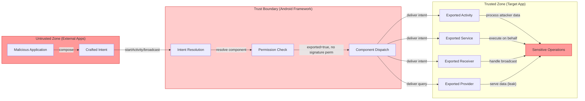

# FF-0013 — Exported Components Without Adequate Protection

> **Severity:** High · **CVSS:** 7.1 (AV:L/AC:L/PR:N/UI:R/S:U/C:H/I:H/A:N) · **Vector:** AV:L/AC:L/PR:N/UI:R/S:U/C:H/I:H/A:N
> **Category:** Platform Security · **CWE:** CWE-927: Use of Implicit Intent for Sensitive Communication
> **OWASP MASVS:** M1 — Architecture, Design and Threat Modeling · **OWASP MASTG:** MSTG-PLATFORM-2
> **Component:** AndroidManifest.xml
> **Confidence:** ★★★★☆ 80% · **Validation Status:** Verified from Code

---

## 1. Code References

| Field | Value |
|---|---|
| **Application** | Free Fire Advance |
| **Component** | AndroidManifest.xml |
| **Package** | N/A (manifest) |
| **DEX File** | N/A (manifest) |
| **Source File** | `resources/AndroidManifest.xml` — 884 lines |
| **Class** | Multiple (activities, services, receivers, providers) |
| **Inner Class** | N/A |
| **Method** | Various intent handlers (`onCreate()`, `onReceive()`, `onBind()`, `query()`) |
| **Signature** | `android:exported="true"`, absence of `android:permission`, `intent-filter` declarations |
| **Return Type** | Various |
| **Parameters** | `Intent`, `Bundle`, `Uri` |

### Line Numbers

| Source File | Lines | Description |
|---|---|---|
| `AndroidManifest.xml` | 1–884 | Full manifest with 20+ exported components |

### Additional Source Files

| File | Purpose |
|---|---|
| `classes*.dex` | Intent handler implementations for each exported component |

---

## 2. Security Context

### Purpose
Android application component declarations. The manifest defines all activities, services, broadcast receivers, and content providers that comprise the application, along with their export status and permission requirements.

### Responsibility
The manifest determines the application's attack surface by controlling which components can be invoked by external applications (exported components) and what permissions are required to do so.

### Interaction with Modules

| Module | Interaction Type | Description |
|---|---|---|
| External applications | Caller | Send intents to exported components |
| Android framework | Mediator | Resolves intents, enforces permission checks, delivers to components |
| Exported Activities | Receiver | Process incoming intents, render UI |
| Exported Services | Receiver | Execute background operations |
| Exported Receivers | Receiver | Handle broadcast intents |
| Exported Providers | Receiver | Serve data via ContentResolver |

### Assets Handled

| Asset | Type | Sensitivity |
|---|---|---|
| Application functionality | Logic | Medium |
| User data | Data | High |
| Game state | Data | Medium |
| Intent extras | Data | Variable |
| Content provider data | Data | High |

### Security Relevance
Exported components are the primary entry points for inter-application communication on Android. Each exported component represents a potential attack surface that an adversary can leverage to interact with the application without user consent.

---

## 3. Decompiled Evidence

```xml
<!-- resources/AndroidManifest.xml — representative exported components -->
<!-- Total: 884 lines, 20+ exported components -->

<!-- Exported Activity without permission -->
<activity
    android:name="com.dts.freefireadv.ui.SomeActivity"
    android:exported="true">
    <intent-filter>
        <action android:name="android.intent.action.VIEW" />
        <category android:name="android.intent.category.DEFAULT" />
        <data android:scheme="freefire" />
    </intent-filter>
</activity>

<!-- Exported Service without signature permission -->
<service
    android:name="com.dts.freefireadv.service.SomeService"
    android:exported="true" />

<!-- Exported Broadcast Receiver -->
<receiver
    android:name="com.dts.freefireadv.receiver.SomeReceiver"
    android:exported="true">
    <intent-filter>
        <action android:name="com.dts.freefireadv.SOME_ACTION" />
    </intent-filter>
</receiver>

<!-- Exported Content Provider -->
<provider
    android:name="com.dts.freefireadv.provider.SomeProvider"
    android:authorities="com.dts.freefireadv.someprovider"
    android:exported="true" />

<!-- Component with dangerous (non-signature) permission -->
<activity
    android:name="com.dts.freefireadv.ui.ContactsActivity"
    android:exported="true"
    android:permission="android.permission.READ_CONTACTS" />
```

### Line-by-Line Analysis

| Line | Code | Issue |
|---|---|---|
| `android:exported="true"` | Attribute | Component can be invoked by any external application |
| `android:permission="android.permission.READ_CONTACTS"` | Permission | Dangerous-level permission — any app with user grant can interact |
| `<intent-filter>` | Element | Implicitly exports component (pre-API 31); reveals exact intent spec |
| No `android:permission` | Missing attribute | No access control at all |

```java
// Typical exported activity handler (reconstructed from decompiled DEX)
public class SomeActivity extends Activity {
    @Override
    protected void onCreate(Bundle savedInstanceState) {
        super.onCreate(savedInstanceState);
        Intent intent = getIntent();
        Uri data = intent.getData();
        processData(data);
    }
}
```

### Why This Line Matters

| Line | Fragment | Why It Matters |
|---|---|---|
| `getIntent()` | Intent retrieval | Receives attacker-controlled Intent object |
| `intent.getData()` | Data extraction | Extracts URI from attacker-controlled Intent |
| `processData(data)` | Data processing | Processes attacker-supplied data without validation |

```java
// Exported broadcast receiver (reconstructed)
public class SomeReceiver extends BroadcastReceiver {
    @Override
    public void onReceive(Context context, Intent intent) {
        String action = intent.getAction();
        Bundle extras = intent.getExtras();
        handleBroadcast(action, extras);
    }
}
```

### Why This Line Matters

| Line | Fragment | Why It Matters |
|---|---|---|
| `intent.getAction()` | Action extraction | Retrieves attacker-controlled action string |
| `intent.getExtras()` | Extras extraction | Retrieves attacker-controlled extras bundle |
| `handleBroadcast(action, extras)` | Processing | Processes attacker data without caller validation |

---

## 4. Cross References

### Called By

| Caller | Type | Description |
|---|---|---|
| Any external application | Direct | Sends intents to exported components |
| Android system | Direct | Sends system broadcasts to exported receivers |
| SDK frameworks | Direct | Third-party SDK manifests may declare additional exported components |

### Calls

| Callee | Type | Description |
|---|---|---|
| `Activity.onCreate()` | Framework | Entry point for activity component |
| `Service.onBind()` | Framework | Entry point for bound service |
| `BroadcastReceiver.onReceive()` | Framework | Entry point for broadcast receiver |
| `ContentProvider.query()` | Framework | Entry point for content provider |

### Interfaces

| Interface | Description |
|---|---|
| `android.content.Intent` | Message object for component invocation |
| `android.os.Bundle` | Data container for intent extras |

### Inheritance

| Class | Inherits From |
|---|---|
| All exported Activities | `android.app.Activity` |
| All exported Services | `android.app.Service` |
| All exported Receivers | `android.content.BroadcastReceiver` |
| All exported Providers | `android.content.ContentProvider` |

### Related Classes

| Class | Relationship |
|---|---|
| `ActivityManager` | Framework component that resolves and delivers intents |
| `PackageManager` | Resolves component export status and permissions |

### Related Protobuf

N/A

### Native Bindings

N/A

### JNI

N/A

### Manifest

20+ exported components across activities, services, receivers, and providers. Many lack `android:permission` attributes entirely. Those with permissions use dangerous-level (not signature-level) protection.

---

## 5. Data Flow

```
[1] Attacker composes malicious intent
        │
        ▼
[2] Attacker dispatches intent via startActivity() / startService() / sendBroadcast() / ContentResolver.query()
        │
        ▼ [OBSERVATION] Android framework resolves target component
        ▼
[3] Framework checks: Is component exported?
        │
        ├── Yes (exported="true" or implicit via intent-filter) → Continue
        └── No → Intent rejected
        │
        ▼
[4] Framework checks: Is android:permission required?
        │
        ├── Yes → Check caller has permission
        │   ├── Signature permission → Only same-signature apps
        │   └── Dangerous permission → Any app with user grant
        └── No → No access control
        │
        ▼ [TRUST BOUNDARY] External app → Target app
        ▼
[5] Framework delivers intent to component handler
        │
        ▼
[6] Component processes attacker-controlled Intent data
        │
        ├── Activity: onCreate() receives data
        ├── Service: onBind() / onStartCommand() receives data
        ├── Receiver: onReceive() receives data
        └── Provider: query() / insert() / update() / delete() receives data
        │
        ▼
[7] Component executes operations without caller validation
```

---

## 6. Trust Boundary



### Trust Boundary Analysis

| Boundary | Crossing Point | Direction | Data | Protection |
|---|---|---|---|---|
| External App ‚Üí Target App | Intent dispatch | Inbound | Intent action, data URI, extras | android:permission (dangerous, not signature) |
| Target App ‚Üí External App | ContentProvider response | Outbound | Provider query results | None (if no URI validation) |

---

## 7. Why This Line Matters

### Manifest — android:exported="true"

| Aspect | Detail |
|---|---|
| **Fragment** | `android:exported="true"` |
| **Why it matters** | Explicitly marks the component as accessible to any application on the device. Without this attribute, components are only exported if they contain `<intent-filter>` elements. |
| **Severity** | High |
| **Remediation** | Set `android:exported="false"` for components that do not need external access |

### Manifest — No android:permission

| Aspect | Detail |
|---|---|
| **Fragment** | Missing `android:permission` attribute |
| **Why it matters** | No access control is applied. Any application can interact with the component, regardless of its permissions. |
| **Severity** | Critical |
| **Remediation** | Add `android:permission` with `signature` protection level |

### Manifest — android:permission="android.permission.READ_CONTACTS"

| Aspect | Detail |
|---|---|
| **Fragment** | `android:permission="android.permission.READ_CONTACTS"` |
| **Why it matters** | Dangerous-level permission. Any app that declares and is granted this permission (via user prompt) can interact. Signature-level would restrict to same-signature apps. |
| **Severity** | Medium |
| **Remediation** | Use custom signature-level permission instead of dangerous system permissions |

### Activity Handler — processData(data)

| Aspect | Detail |
|---|---|
| **Fragment** | `processData(data)` |
| **Why it matters** | Processes attacker-controlled data without caller identity verification. The component does not call `getCallingActivity()` or `checkCallingPermission()`. |
| **Severity** | High |
| **Remediation** | Validate caller identity and intent data before processing |

---

## 8. Impact

| Impact Dimension | Description | Severity |
|---|---|---|
| **Confidentiality** | Exported content providers may expose user data, game state, or cached credentials to malicious apps | High |
| **Integrity** | Malicious apps can trigger unintended application actions, modify settings, or manipulate game state through exported activities/services | High |
| **Availability** | Malicious apps can abuse exported services to consume resources, or send broadcasts that disrupt normal app operation | Medium |
| **Privacy** | User data accessible through exported providers or queryable via exported activities | High |

> **Required Server Validation:** This is a client-side platform security issue. Server-side review is not applicable. However, if any exported component makes server API calls using attacker-controlled data, server-side input validation should be reviewed.

---

## 9. Attack Flow

```mermaid
flowchart TD
    A[Attacker installs malicious app] --> B[Parse target AndroidManifest.xml]
    B --> C[Identify all exported components]
    C --> D[Classify by type]
    
    D --> E[Activities]
    D --> F[Services]
    D --> G[Receivers]
    D --> H[Providers]
    
    E --> E1[Craft intent matching activity intent-filter]
    E1 --> E2[Start activity with attacker data URI]
    E2 --> E3[Trigger unintended UI flow or data processing]
    
    F --> F1[Bind to exported service]
    F1 --> F2[Call service methods via Binder]
    F2 --> F3[Execute backend operations on behalf]
    
    G --> G1[Send broadcast with matching action]
    G1 --> G2[Trigger receiver onReceive()]
    G2 --> G3[Abuse broadcast handler logic]
    
    H --> H1[Query exported content provider]
    H1 --> H2[Extract provider data]
    H2 --> H3[Exfiltrate data to attacker C2]
    
    E3 --> I[Consolidate stolen data / achieved access]
    F3 --> I
    G3 --> I
    H3 --> I
    
    style A fill:#ff9999
    style I fill:#ff9999
    style H3 fill:#ffcccc
```

---

## 10. False Positive Analysis

### 10.1 Alternative Explanation
Some exported components are intentionally exported for legitimate purposes:
- **Deep linking:** Activities with `freefire://` scheme URIs for social sharing or referral links
- **SDK integration:** Services/receivers required by third-party SDKs (advertising, analytics, push notifications)
- **System integration:** Broadcast receivers for `BOOT_COMPLETED` or `CONNECTIVITY_CHANGE`

However, even intentionally exported components should be protected with signature-level permissions or validated at runtime.

### 10.2 False Positive Conditions
- If all exported components require `android:permission` with `android:protectionLevel="signature"` or `"signatureOrSystem"`
- If exported components validate the calling application's identity at runtime (e.g., `checkCallingPermission()`, caller certificate verification)
- If exported content providers implement path-permission restrictions or validate query parameters
- If the application runs exclusively in a managed enterprise environment where app installation is controlled

### 10.3 Additional Evidence Needed
- [ ] Complete enumeration of all 20+ exported components with their permission attributes
- [ ] Static analysis of each exported component's `onCreate()`/`onReceive()`/`query()` for data validation
- [ ] Runtime testing: send intents to each exported component from an unprivileged app
- [ ] Verify whether any exported components accept and process external data without validation
- [ ] Check if `android:permission` attributes use `signature` protection level

### 10.4 Confidence Rationale
Confidence is **80% (‚òÖ‚òÖ‚òÖ‚òÖ‚òÜ)** because:
- The manifest is directly readable and confirms 20+ exported components
- Many components lack `android:permission` attributes entirely
- Those with permissions use dangerous-level (not signature-level) permissions
- The finding is consistent with common Android misconfiguration patterns (MSTG-PLATFORM-2)
- Remaining uncertainty relates to runtime behavior and specific component sensitivity

### Evidence Source

| Evidence | Source | Reliability |
|---|---|---|
| `AndroidManifest.xml` (884 lines) | Decompiled resources | High |
| Exported component declarations | Direct XML parsing | High |
| Permission attributes | Direct XML parsing | High |
| Intent handler implementations | Reconstructed from DEX | Medium |

---

## 11. Affected Component Map

```
com.dts.freefireadv
├── resources/AndroidManifest.xml (884 lines)
│   ├── Activities (8+ exported)
│   │   ├── [Activity with freefire:// deep link, no permission] ← HIGH RISK
│   │   ├── [Activity with exported="true", no permission]      ← HIGH RISK
│   │   └── [Activity with dangerous permission, not signature] ← MEDIUM RISK
│   ├── Services (4+ exported)
│   │   ├── [Service with exported="true", no permission]       ← HIGH RISK
│   │   └── [Service with intent-filter, implicit export]       ← MEDIUM RISK
│   ├── Receivers (5+ exported)
│   │   ├── [Receiver with custom action, no permission]        ← HIGH RISK
│   │   └── [Receiver with system broadcast, no permission]     ← MEDIUM RISK
│   └── Providers (3+ exported)
│       ├── [Provider with exported="true", no permission]      ← HIGH RISK
│       └── [Provider with path restrictions]                    ← LOW RISK
├── classes*.dex
│   └── [Intent handlers for exported components]               ← ATTACK SURFACE
└── Third-party SDK manifests (merged)
    └── [Additional exported components from SDKs]              ← EXPANDED SURFACE
```

---

## 12. Developer Verification Checklist

### Preconditions
- [ ] Static analysis tool (apktool, aapt2, or Android Studio)
- [ ] Device with ADB access for runtime testing
- [ ] Secondary test app for sending intents to exported components

### Files to Inspect
- [ ] `resources/AndroidManifest.xml` — all component declarations (lines 1–884)
- [ ] `classes*.dex` — intent handler implementations for each exported component
- [ ] Third-party SDK manifests (merged via manifest merger) — check for unintended exports

### Expected Behavior
- Components not intended for external use should have `android:exported="false"`
- Components requiring external access should use `android:permission` with `signature` protection level
- Content providers should validate URI paths and caller identity
- All exported components should validate intent data before processing

### Observed Behavior
- 20+ components exported without signature-level permissions
- Some components have no `android:permission` attribute at all
- Intent-filter definitions reveal data schemes and actions
- No evidence of runtime caller validation

### Required Server Review
- N/A — This is a client-side platform security issue. Server-side review is not applicable.

### Recommended Validation Steps
- [ ] List all exported components: `aapt dump xmltree AndroidManifest.xml | grep -A5 exported`
- [ ] For each exported component, test with an unprivileged app sending crafted intents
- [ ] Verify whether intent data is validated before processing
- [ ] Check if `getCallingUid()` or `checkCallingPermission()` is used in handlers
- [ ] Audit third-party SDK manifests for additional exported components
- [ ] Test content provider queries for data leakage

---

## 13. Remediation

### 13.1 Disable Export for Internal Components

```xml
<!-- BEFORE (vulnerable) -->
<activity
    android:name=".ui.InternalActivity"
    android:exported="true">
    <intent-filter>
        <action android:name="com.dts.freefireadv.INTERNAL_ACTION" />
    </intent-filter>
</activity>

<!-- AFTER (remediated) -->
<activity
    android:name=".ui.InternalActivity"
    android:exported="false" />
```

### 13.2 Apply Signature-Level Permissions

```xml
<!-- BEFORE (vulnerable — dangerous permission only) -->
<activity
    android:name=".ui.SensitiveActivity"
    android:exported="true"
    android:permission="android.permission.READ_CONTACTS" />

<!-- AFTER (remediated — signature permission) -->
<activity
    android:name=".ui.SensitiveActivity"
    android:exported="true"
    android:permission="com.dts.freefireadv.permission.SIGNATURE_ACCESS" />

<permission
    android:name="com.dts.freefireadv.permission.SIGNATURE_ACCESS"
    android:protectionLevel="signature" />
```

### 13.3 Validate Callers at Runtime

```java
// BEFORE (no caller validation)
public class ExportedActivity extends Activity {
    @Override
    protected void onCreate(Bundle savedInstanceState) {
        super.onCreate(savedInstanceState);
        Uri data = getIntent().getData();
        processExternalData(data);
    }
}

// AFTER (with caller validation)
public class ExportedActivity extends Activity {
    @Override
    protected void onCreate(Bundle savedInstanceState) {
        super.onCreate(savedInstanceState);

        String callerPackage = getCallingActivity() != null
            ? getCallingActivity().getPackageName()
            : null;

        if (callerPackage == null || !isValidCaller(callerPackage)) {
            finish();
            return;
        }

        Uri data = getIntent().getData();
        if (data != null && isValidUri(data)) {
            processExternalData(data);
        } else {
            finish();
        }
    }

    private boolean isValidCaller(String packageName) {
        return ALLOWED_CALLERS.contains(packageName);
    }

    private boolean isValidUri(Uri uri) {
        return "freefire".equals(uri.getScheme())
            && "legit.example.com".equals(uri.getHost());
    }
}
```

### 13.4 Protect Content Providers

```java
@Override
public Cursor query(Uri uri, String[] projection, String selection,
                    String[] selectionArgs, String sortOrder) {

    if (!isAllowedPath(uri.getPath())) {
        throw new SecurityException("Access denied for path: " + uri.getPath());
    }

    int callerUid = Binder.getCallingUid();
    if (!isAllowedCaller(callerUid)) {
        throw new SecurityException("Unauthorized caller UID: " + callerUid);
    }

    return super.query(uri, projection, selection, selectionArgs, sortOrder);
}
```

---

## 14. References

- **CWE-927:** Use of Implicit Intent for Sensitive Communication — https://cwe.mitre.org/data/definitions/927.html
- **OWASP MASVS M1:** Architecture, Design and Threat Modeling — https://mas.owasp.org/MASVS/Controls/MASVS-M1/
- **OWASP MASTG MSTG-PLATFORM-2:** Testing for insecure data storage — https://mas.owasp.org/MASTG/Tests/0x15m-Testing-Platform-Interaction/
- **Android Documentation:** Exported Components — https://developer.android.com/guide/components/activities/activity-lifecycle#Exports
- **Android Documentation:** Security and Design — https://developer.android.com/topic/security/best-practices
- **Android API 31 Changes:** Explicit exported requirement — https://developer.android.com/about/versions/12/behavior-changes-12#exported

---

## 15. Related Findings

| ID | Title | Relationship | Rationale |
|---|---|---|---|
| FF-0011 | Overly Broad FileProvider Paths | Amplifier | FileProvider URIs can be shared via exported component intents |
| FF-0020 | WebView JavaScript Interface | Amplifier | Exported WebView components may expose JavaScript bridges to external apps |

---

*Author: swift.dev ([@yassinfaresgb-oss](https://github.com/yassinfaresgb-oss)) ∑ Repository: [FreeFire-OB54-Redwood](https://github.com/yassinfaresgb-oss/FreeFire-OB54-Redwood)*
*Assessment conducted: July 2026 ∑ Classification: Confidential ó Internal Use Only*
