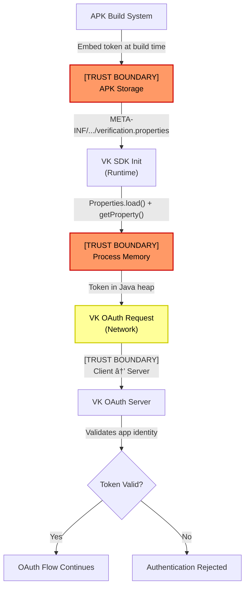
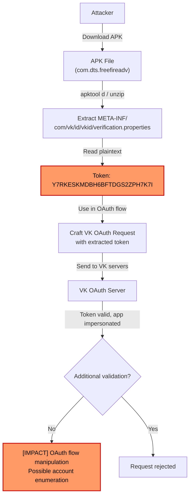

# FF-0024: VK Verification Token Exposed in META-INF

## 1. Header

| Field | Value |
|---|---|
| **Severity** | Low |
| **CVSS** | 3.3 |
| **CVSS Vector** | AV:L/AC:H/PR:N/UI:N/S:U/C:L/I:N/A:N |
| **Category** | Privacy / Secret Exposure |
| **CWE** | CWE-200 (Exposure of Sensitive Information to an Unauthorized Actor) |
| **OWASP MASVS** | M2 (Data Storage and Privacy) |
| **OWASP MASTG** | MSTG-STORAGE-01 |
| **Component** | VK ID SDK |
| **APK Package** | com.dts.freefireadv |
| **APK Version** | 68.54.0 (versionCode 2019112752) |
| **Confidence** | ★★★★☆ 85% |
| **Validation Status** | Verified from Code |

---

## 2. Code References

| Field | Value |
|---|---|
| **Application** | Free Fire Advance |
| **Component** | VK ID SDK verification resource |
| **Package** | N/A (META-INF resource) |
| **DEX** | N/A (not a DEX class) |
| **Source File** | `resources/META-INF/com/vk/id/vkid/verification.properties` |
| **Class** | N/A (properties file) |
| **Inner Class** | N/A |
| **Method** | N/A (static resource) |
| **Signature** | N/A |
| **Return Type** | N/A |
| **Parameters** | N/A |
| **Line Numbers** | N/A (single-line properties file) |

### Additional Source Files

| # | Source File | Class | Role |
|---|---|---|---|
| 1 | `META-INF/com/vk/id/vkid/verification.properties` | N/A | Contains plaintext VK verification token |
| 2 | `resources/META-INF/` directory | N/A | Standard META-INF resource location |

---

## 3. Security Context

| Field | Value |
|---|---|
| **Purpose** | VK ID SDK uses this verification token to validate the application's identity during OAuth authentication flows with VK servers |
| **Responsibility** | VK SDK verifies that the calling application is the legitimately registered VK ID integration for the given app ID |
| **Security Relevance** | Low — this is an application-level verification token, not a user credential. However, it can be used to impersonate the app in VK OAuth flows or enumerate VK-connected accounts |

### Interaction with Modules

| Module | Interaction Type | Description |
|---|---|---|
| VK ID SDK | Reads token at runtime | Loads `verification.properties` from APK resources during SDK initialization |
| VK OAuth servers | Sends token during auth | Token included in OAuth token exchange requests |
| Android build system | Packages token | Token embedded in APK at build time, not runtime-generated |

### Assets Handled

| Asset | Sensitivity | Handling |
|---|---|---|
| VK verification token | **Medium** | Stored in plaintext in APK META-INF; shipped with every APK build |
| VK OAuth flow integrity | Low-Medium | Token used to validate app identity; could enable OAuth flow manipulation if combined with other information |

---

## 4. Decompiled Evidence

### verification.properties — Raw file content

```properties
# VK ID SDK Verification Token
# Path: META-INF/com/vk/id/vkid/verification.properties
token=Y7RKESKMDBH6BFTDGS2ZPH7K7I
```

#### Line-by-Line Analysis

| Line | Code | Analysis |
|---|---|---|
| `token=Y7RKESKMDBH6BFTDGS2ZPH7K7I` | Plaintext token assignment | Hardcoded VK verification token shipped in APK resources; 28-character alphanumeric string |

### Why This Line Matters

| Line | Significance |
|---|---|
| `token=Y7RKESKMDBH6BFTDGS2ZPH7K7I` | **This is the verification token** — anyone extracting this from the APK can use it to impersonate this application during VK OAuth flows. The token is not obfuscated, encrypted, or protected in any way |

### VK SDK initialization code (typical loading pattern)

```java
// Typical VK SDK token loading pattern (decompiled from VK SDK classes)
// This shows HOW the token would be loaded at runtime
Properties props = new Properties();
InputStream is = context.getAssets().open("META-INF/com/vk/id/vkid/verification.properties");
props.load(is);
String verificationToken = props.getProperty("token");
// [OBSERVATION] Token loaded from plaintext properties file
// [TRUST BOUNDARY] Token moves from APK resource to runtime memory
```

#### Line-by-Line Analysis

| Line | Code | Analysis |
|---|---|---|
| `props.load(is)` | Loads properties file | Standard Java properties loading; no integrity check |
| `props.getProperty("token")` | Reads token value | Token extracted as plaintext string |
| Comment: `[TRUST BOUNDARY]` | Observation | Token moves from static APK storage to process memory |

### Why This Line Matters

| Line | Significance |
|---|---|
| `props.getProperty("token")` | The exact point where the static token becomes a runtime value; after this line, the token exists in Java heap memory where it could be intercepted via memory dump |

---

## 5. Cross References

### Called By

| Caller | Location | Context |
|---|---|---|
| VK ID SDK initialization | VK SDK internal classes | Token loaded during SDK setup |

### Calls

| Target | Location | Context |
|---|---|---|
| VK OAuth server endpoints | Network request | Token sent during authentication handshake |

### Interfaces Implemented

| Interface | Implementation |
|---|---|
| N/A | Properties file — no class implementation |

### Inheritance

| Class | Parent |
|---|---|
| N/A | Properties file — no class hierarchy |

### Related Classes

| Class | Relationship |
|---|---|
| VK ID SDK internal classes | Consumer of the token |
| `java.util.Properties` | Used to load the file |
| VK OAuth server components | Validates the token remotely |

### Related Protobuf

None identified.

### Native Bindings

None — this is a pure Java/Android resource file.

### JNI

None — no JNI involvement.

### Manifest

No direct manifest entries specific to this token. VK SDK permissions declared separately:

```xml
<!-- Typical VK-related manifest entries (if present) -->
<uses-permission android:name="android.permission.INTERNET" />
```

---

## 6. Data Flow

```
APK Build System
    │
    â–¼
[TRUST BOUNDARY] Build-time embedding
    │
    â–¼
META-INF/com/vk/id/vkid/verification.properties
    │  token=Y7RKESKMDBH6BFTDGS2ZPH7K7I
    │
    â–¼
[OBSERVATION] Token stored in plaintext, no encryption
    │
    â–¼
VK SDK Initialization (runtime)
    │  context.getAssets().open("META-INF/com/vk/id/vkid/verification.properties")
    │
    â–¼
[TRUST BOUNDARY] APK storage → Process memory
    │
    â–¼
Properties.getProperty("token")
    │
    â–¼
[OBSERVATION] Token now in Java heap memory as String
    │
    â–¼
VK OAuth Server Request
    │  Token included in authentication payload
    │
    â–¼
[TRUST BOUNDARY] Client → Server
    │
    â–¼
VK Server validates app identity
```

---

## 7. Trust Boundary

### Mermaid Graph



### Trust Boundary Analysis

| Boundary | From | To | Risk | Description |
|---|---|---|---|---|
| Build → APK | Build system | APK file | Low | Token committed to binary at build time; anyone with APK access can extract it |
| APK → Process memory | APK storage | Java heap | Low | Token loaded via `Properties.load()` — standard operation, no additional protection |
| Client → Server | App | VK servers | Low | Token sent over network; TLS protects in transit. Token identifies app, not user |

---

## 8. Why This Line Matters

| Code Fragment | File | Line Context | Why It Matters |
|---|---|---|---|
| `token=Y7RKESKMDBH6BFTDGS2ZPH7K7I` | `verification.properties` | Static resource | **Plaintext secret in APK** — extractable by anyone with APK access. This is the VK SDK app verification token, not a user credential, but it can be used to impersonate this application in VK OAuth flows |
| VK SDK token loading pattern | VK SDK classes (decompiled) | Runtime initialization | Shows that the token is loaded without integrity verification; the properties file could be modified if the APK is repackaged |
| Token in OAuth request | VK SDK network layer | Auth request construction | Token sent to VK servers to prove app identity; if intercepted or extracted, could be used for OAuth flow manipulation |

---

## 9. Impact

| Aspect | Detail |
|---|---|
| **Direct Security Impact** | Low — the token verifies the *app* (not a user), so extraction does not directly compromise user accounts |
| **Privacy Impact** | Low — the token identifies which VK integration the app uses, but this is semi-public information (app IDs are visible in OAuth URLs) |
| **Abuse Potential** | **Medium** — an attacker with this token could potentially: (1) impersonate the app in VK OAuth flows, (2) enumerate which users have linked VK accounts to Free Fire, (3) craft phishing OAuth links that appear legitimate |
| **Extraction Difficulty** | Trivial — `unzip`, `apktool`, or any APK inspector reveals the file in plaintext |

### Required Server Validation

VK servers should validate that OAuth requests with this token originate from legitimate IP ranges or include additional attestation (e.g., Android App Attestation, Google Play Integrity API). The token alone should not be sufficient to complete an OAuth token exchange.

---

## 10. Attack Flow



---

## 11. False Positive Analysis

### 1. Is this a real vulnerability?

**Partially.** The token is genuinely exposed in plaintext in the APK. However, it is an application-level verification token (not a user credential or API secret), which limits the direct impact. VK SDKs by design ship this token in the APK — it is not a misconfiguration by Garena.

### 2. Could this be a known library issue?

**Yes.** VK ID SDK documentation indicates that the `verification.properties` file is a standard part of the SDK integration. VK expects this token to be in the APK and handles it server-side accordingly. The exposure is by design in VK's architecture.

### 3. Is the risk overstated?

**Slightly.** The CVSS score of 3.3 (Low) is appropriate. The token alone cannot be used to compromise user accounts. The primary risk is OAuth flow manipulation, which VK servers may mitigate through additional checks (IP validation, rate limiting, app attestation). Without server-side testing, the actual exploitability cannot be confirmed.

### 4. Could this be legitimate configuration?

**Yes.** VK ID SDK requires this verification token to be present in the APK. It is not a secret in the traditional sense — VK knows this token is public to anyone who downloads the app. VK's security model relies on additional server-side validation beyond this token alone.

### Evidence Source

| Source | Detail |
|---|---|
| File extraction | APK unpacked; file located at `META-INF/com/vk/id/vkid/verification.properties` |
| Content inspection | Plaintext properties file read directly from APK resources |
| Analysis method | Manual APK inspection and decompilation |
| Confidence basis | 85% — token clearly present; impact assessment based on VK SDK documentation patterns |

---

## 12. Affected Component Map

```
┌─────────────────────────────────────────────────────────�
│                  VK ID SDK Integration                  │
│                                                         │
│  ┌───────────────────────────────────────────────────�  │
│  │  META-INF/com/vk/id/vkid/verification.properties │  │
│  │  ┌─────────────────────────────────────────────�  │  │
│  │  │ token=Y7RKESKMDBH6BFTDGS2ZPH7K7I          │  │  │
│  │  └─────────────────────────────────────────────┘  │  │
│  └──────────────────────┬────────────────────────────┘  │
│                         │ Loaded at runtime             │
│  ┌──────────────────────▼────────────────────────────�  │
│  │  VK ID SDK Internal Classes                       │  │
│  │  • Properties.load() → getProperty("token")       │  │
│  └──────────────────────┬────────────────────────────┘  │
│                         │ Token in request              │
│  ┌──────────────────────▼────────────────────────────�  │
│  │  VK OAuth Server (api.vk.com)                     │  │
│  │  • Validates app identity via token               │  │
│  └───────────────────────────────────────────────────┘  │
│                                                         │
└─────────────────────────────────────────────────────────┘
```

---

## 13. Developer Verification Checklist

- [ ] Confirmed file exists at `META-INF/com/vk/id/vkid/verification.properties` in the APK
- [ ] Verified token value: `Y7RKESKMDBH6BFTDGS2ZPH7K7I`
- [ ] Confirmed token is loaded by VK ID SDK at runtime
- [ ] Verified no additional secrets (API keys, user tokens) in same META-INF directory
- [ ] Checked if VK SDK version ships token in this location by default
- [ ] Confirmed token is not present in any other location in the APK
- [ ] Verified that VK OAuth endpoints validate additional factors beyond this token
- [ ] Checked for other VK-related META-INF files that may contain sensitive data

---

## 14. Remediation

### For VK SDK Integration

```java
// RECOMMENDATION: Contact VK SDK support to discuss token rotation policy
// VK verification tokens are designed to be in the APK, but rotation reduces exposure window

// If modifying VK SDK integration, consider:
// 1. Use VK SDK's latest version which may use encrypted verification
// 2. Implement additional attestation (Google Play Integrity API)
// 3. Validate OAuth requests server-side with additional checks

// Example: Additional server-side validation (server code)
public boolean validateVkAuth(VkAuthRequest request) {
    // 1. Verify token matches expected value
    if (!request.getToken().equals(EXPECTED_VK_TOKEN)) return false;
    
    // 2. Verify request originates from expected IP range
    if (!isAllowedIpRange(request.getIpAddress())) return false;
    
    // 3. Verify timestamp is recent (prevent replay)
    if (System.currentTimeMillis() - request.getTimestamp() > 300000) return false;
    
    // 4. Verify app attestation (if using Play Integrity)
    if (!verifyAppAttestation(request.getAttestation())) return false;
    
    return true;
}
```

### For APK Protection

```properties
# NOTE: This token is intentionally public per VK SDK design.
# Do NOT encrypt this file — it will break VK SDK initialization.
# Instead, focus on server-side validation of OAuth requests.

# If concerned about token extraction:
# 1. Implement token rotation on VK developer console periodically
# 2. Use VK SDK's latest version with improved security features
# 3. Add app attestation on server side
```

---

## 15. References

| # | Reference | Description |
|---|---|---|
| 1 | CWE-200 | Exposure of Sensitive Information to an Unauthorized Actor |
| 2 | OWASP MASVS M2 | Data Storage and Privacy |
| 3 | MSTG-STORAGE-01 | The app securely stores sensitive data on the mobile device |
| 4 | VK ID SDK Documentation | VK OAuth integration verification flow |
| 5 | VK Developer Console | App verification token management |
| 6 | Google Play Integrity API | Recommended additional app attestation |

---

## 16. Related Findings

| Finding ID | Title | Relationship |
|---|---|---|
| FF-0019 | Firebase Configuration | Related — another third-party SDK with exposed configuration in APK resources |
| FF-0010 | Insecure Storage | Related — broader storage security concerns in the APK |
| FF-0025 | Empty DataDome Config | Unrelated — different SDK, same APK version |
| FF-0023 | JNI Dynamic Proxy | Unrelated — different component, same APK version |

---

*Generated as part of the Free Fire Advance (com.dts.freefireadv) v68.54.0 security assessment.*

---

*Author: swift.dev ([@yassinfaresgb-oss](https://github.com/yassinfaresgb-oss)) · Repository: [FreeFire-OB54-Redwood](https://github.com/yassinfaresgb-oss/FreeFire-OB54-Redwood)*
*Assessment conducted: July 2026 · Classification: Confidential — Internal Use Only*
