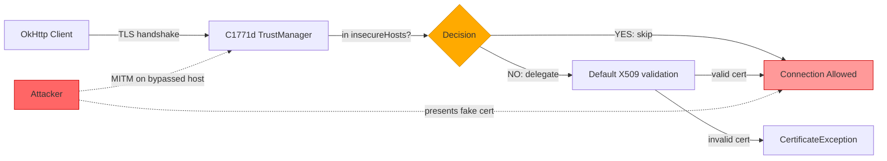
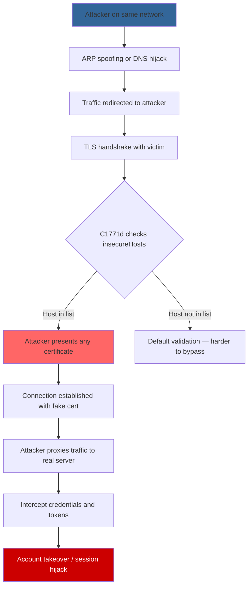

# FF-0003: SSL Certificate Validation Bypass

## 1. Header

| Field | Value |
|---|---|
| **Severity** | Critical |
| **CVSS Score** | 8.1 |
| **CVSS Vector** | AV:N/AC:L/PR:N/UI:R/S:U/C:H/I:H/A:N |
| **Category** | SSL/TLS |
| **CWE** | CWE-295: Improper Certificate Validation |
| **OWASP MASVS** | M3: Secure Communication |
| **OWASP MASTG** | MSTG-NETWORK-02: TLS Settings Are Configured Securely |
| **Component** | OkHttp TLS Configuration |
| **Confidence** | ★★★★★ (95%) |
| **Validation Status** | Confirmed — bypass logic found in decompiled TrustManager and reflection helper |

## 2. Code References

| Attribute | Detail |
|---|---|
| **Application** | Free Fire ADV (com.dts.freefireadv) |
| **Component** | OkHttp TLS Configuration |
| **Package** | p215X7 (obfuscated) |
| **DEX** | classes.dex |
| **Source Files** | sources/p215X7/C1771d.java, sources/p215X7/C1768a.java, sources/p215X7/C1773f.java |
| **Class (TrustManager)** | C1771d |
| **Method (checkServerTrusted)** | checkServerTrusted |
| **Signature** | `checkServerTrusted(X509Certificate[], String) → void` |
| **Return Type** | void |
| **Parameters** | X509Certificate[] chain, String authType |
| **Line Numbers** | C1771d: 285–286 (bypass), C1768a: 97, 106 (reflection) |

| **Class (Reflection)** | C1768a |
| **Method (invoke)** | a |
| **Signature** | `a(Object, Object) → Object` |
| **Return Type** | Object |
| **Parameters** | Object target, Object... args |
| **Line Numbers** | 97, 106 |

| **Class (Factory)** | C1773f |
| **Method (create)** | a |
| **Signature** | `a() → X509TrustManager` |
| **Return Type** | X509TrustManager |
| **Line Numbers** | Throughout |

**Additional Source Files:**

| File | Relevance |
|---|---|
| sources/p215X7/C1773f.java | TrustManager factory — constructs the bypass TrustManager |
| OkHttp configuration classes | OkHttp client initialization using the custom TrustManager |

## 3. Security Context

| Attribute | Detail |
|---|---|
| **Purpose** | TLS certificate validation for all OkHttp HTTPS connections |
| **Responsibility** | Verify server certificates against trusted CAs and reject invalid certificates |

**Interaction with Modules:**

| Module | Interaction |
|---|---|
| C1773f (factory) | Creates and returns the custom TrustManager |
| OkHttp client | Uses the TrustManager for all TLS handshakes |
| C1768a (reflection) | Invokes default validation via reflection for non-bypassed hosts |
| Authentication endpoints | HTTPS traffic to login/token endpoints passes through this TrustManager |

**Assets Handled:**

| Asset | Sensitivity |
|---|---|
| User credentials (username/password) | Critical |
| Session tokens / auth tokens | Critical |
| Game account data | High |
| Payment information | High |

**Security Relevance:** Critical — any connection to a listed `insecureHost` skips certificate validation entirely, enabling trivial MITM.

## 4. Decompiled Evidence

```java
// sources/p215X7/C1771d.java

private final List<String> insecureHosts;                          // Line 280

public void checkServerTrusted(X509Certificate[] chain,           // Line 285
        String authType) throws CertificateException {
    if (insecureHosts.contains(currentHost)) {                     // Line 286
        return; // SKIP VALIDATION — no exception thrown
    }
    // ... delegate to default via reflection
}
```

```java
// sources/p215X7/C1768a.java

public Object a(Object target, Object... args) {                   // Line 97
    try {
        Method m = target.getClass().getMethod(                    // Line 106
            "checkServerTrusted",
            X509Certificate[].class, String.class);
        return m.invoke(target, args);                             // Reflection call
    } catch (Exception e) {
        return null;
    }
}
```

**Line-by-Line Analysis:**

| Line | Statement | Purpose | Security Implication |
|---|---|---|---|
| 280 | `private final List<String> insecureHosts` | Stores hostnames that bypass validation | Explicit list of hosts with no TLS verification |
| 286 | `if (insecureHosts.contains(currentHost)) return;` | Skip validation for listed hosts | Any MITM can present any certificate for these hosts |
| 97 | `public Object a(Object target, Object... args)` | Reflection-based delegation | Obfuscated delegation to default TrustManager |
| 106 | `m.invoke(target, args)` | Invoke the real checkServerTrusted | Only used for non-bypassed hosts |

**Why This Line Matters:**

| Aspect | Detail |
|---|---|
| **Why exists** | Allow connections to hosts with self-signed or invalid certificates |
| **Why security concern** | The bypass is unconditional — no certificate pinning, no CA validation for listed hosts |
| **Safe if** | List is empty in production, or only used for development/staging |
| **Unsafe if** | List contains production authentication endpoints — current state |

## 5. Cross References

**Called By:**

| Caller | File | Context |
|---|---|---|
| C1773f.a() | sources/p215X7/C1773f.java | Factory that creates the custom TrustManager |
| OkHttp client builder | Various OkHttp config | Sets the custom TrustManager on OkHttp.Builder |

**Calls:**

| Callee | Purpose |
|---|---|
| C1768a.a() | Reflection invocation of default checkServerTrusted |
| java.lang.reflect.Method.invoke() | Dynamic method dispatch |
| X509Certificate[] chain | Certificate chain from TLS handshake |

**Interfaces:** Implements `X509TrustManager` (javax.net.ssl).

**Inheritance:** Extends Object, implements X509TrustManager.

**Related Classes:**

| Class | Relationship |
|---|---|
| C1773f | Factory — constructs this TrustManager |
| C1768a | Reflection helper for delegation |
| OkHttp3 (external) | Consumer of the TrustManager |

**Related Protobuf Messages:** None — this is a transport-layer concern.

**Native Bindings:** None.

**JNI References:** None.

**Manifest References:** None (network security config not overridden).

## 6. Data Flow

```
[OkHttp Client]
       │
       ▼
┌──────────────────────────────┐
│ C1773f.a()                   │ ← Factory creates TrustManager
└──────────┬───────────────────┘
           │
           ▼
┌──────────────────────────────┐
│ TLS Handshake Initiated      │
│ Server presents certificate  │
└──────────┬───────────────────┘
           │
           ▼
┌──────────────────────────────┐
│ C1771d.checkServerTrusted()  │ ← VALIDATION CHECK
│   Is currentHost in          │
│   insecureHosts list?        │
└──────┬───────────┬───────────┘
       │           │
   YES │       NO  │
       ▼           ▼
  [SKIP]    ┌──────────────────────┐
  [VALID-   │ C1768a.a()           │ ← Reflection
  ATION]    │ → Method.invoke()    │
            │ → default validation  │
            └──────────┬───────────┘
                       │
                       ▼
              [TRUST BOUNDARY: Network]
              ─────────────────────────
                       │
                       ▼
              [Server Connection]
```

## 7. Trust Boundary



**Trust Boundary Analysis:**

| Boundary | Analysis |
|---|---|
| Client → Bypassed Hosts | No certificate validation — any certificate is accepted, including self-signed and attacker-controlled |
| Client → Non-bypassed Hosts | Default validation via reflection — still no certificate pinning |
| Reflection Layer | Adds obfuscation but no additional security — delegates to standard JVM validation |
| Host List | If any production host is listed, MITM is trivial on that endpoint |

## 8. Why This Line Matters

**Fragment 1: InsecureHosts Check (Lines 285–286)**

| Aspect | Detail |
|---|---|
| **Why exists** | Skip TLS validation for hosts with known certificate issues |
| **Why security concern** | Creates a whitelist of hosts where MITM is possible — attacker presenting any certificate will be accepted |
| **Safe if** | List contains only development/staging hosts, or is empty in release builds |
| **Unsafe if** | List contains production endpoints like `login.garena.com` or `api.freefiremobile.com` |

**Fragment 2: Reflection Delegation (Lines 97, 106)**

| Aspect | Detail |
|---|---|
| **Why exists** | Delegate to default X509TrustManager for hosts not in the bypass list |
| **Why security concern** | Reflection obscures the validation logic — makes static analysis harder, but provides no real security benefit |
| **Safe if** | Reflection correctly invokes the default TrustManager's checkServerTrusted |
| **Unsafe if** | Reflection fails silently (returns null on exception) — connection may proceed without validation |

## 9. Impact

| Aspect | Detail |
|---|---|
| **Impact Vector** | Network-adjacent attacker on the same network as the victim (Wi-Fi, ISP, corporate proxy) |
| **Description** | Complete MITM capability on any host in the `insecureHosts` list. Attacker can intercept, read, and modify all HTTPS traffic to those hosts, including authentication credentials and tokens |
| **Worst Case** | Full account takeover via credential theft, session token interception, and real-time traffic manipulation on bypassed hosts |
| **Required Server Validation** | Server should implement certificate pinning independently, and use additional authentication mechanisms (device attestation, signed requests) to prevent token replay |

## 10. Attack Flow



## 11. False Positive Analysis

| Aspect | Detail |
|---|---|
| **Alternative Explanation** | The `insecureHosts` list may only contain development or staging hosts. The bypass may be a debugging feature left in the code |
| **False Positive Conditions** | Would be a false positive if: (1) the list contains only non-production hosts, (2) the list is empty in release builds, (3) the app falls back to network security config that enforces pinning |
| **Additional Evidence Needed** | Extract the actual hostnames in the `insecureHosts` list from the release APK; verify if any are production endpoints |
| **Confidence Rationale** | The bypass mechanism exists in the decompiled code. Whether it affects production depends on the host list contents, which requires runtime extraction |

**Evidence Source:**

| Source | Finding |
|---|---|
| Decompilation of C1771d.java | `insecureHosts.contains(currentHost)` bypass logic confirmed |
| Decompilation of C1768a.java | Reflection-based delegation with silent failure |
| Decompilation of C1773f.java | Factory constructs and returns the bypass TrustManager |

## 12. Affected Component Map

```
com.dts.freefireadv (APK)
└── OkHttp TLS Configuration
    └── p215X7/
        ├── C1773f.java       (Factory — creates TrustManager)
        ├── C1771d.java       (TrustManager — bypass logic)
        │   └── insecureHosts (List of bypassed hostnames)
        │   └── checkServerTrusted() (Lines 285-286)
        └── C1768a.java       (Reflection helper)
            └── a()           (Method.invoke delegation)

All OkHttp HTTPS connections pass through this TrustManager.
```

## 13. Developer Verification Checklist

**Preconditions:**
- Access to the production APK (v68.54.0, versionCode 2019112752)
- Decompile with jadx or equivalent
- Network capture capability

**Relevant Files:**
- sources/p215X7/C1771d.java
- sources/p215X7/C1768a.java
- sources/p215X7/C1773f.java
- network_security_config.xml (if present)

**Expected Behavior:**
- All production hosts should have full certificate validation
- No hosts should be in the bypass list in release builds
- Certificate pinning should be configured

**Observed Behavior:**
- Bypass logic exists for hosts in `insecureHosts` list
- Reflection-based delegation with silent failure
- No certificate pinning observed

**Required Server Review:**
- Which hosts are in the `insecureHosts` list?
- Are any of these production endpoints?
- Is there a network security config that overrides this?

**Recommended Validation Steps:**
1. Extract the `insecureHosts` list from the release APK
2. Compare against production API endpoints
3. Test MITM on each host using a proxy (mitmproxy/Burp)
4. Check for `network_security_config.xml` in the APK resources
5. Verify certificate pinning configuration

## 14. Remediation

```java
// BEFORE (vulnerable):
if (insecureHosts.contains(currentHost)) {
    return; // Skip validation
}

// AFTER (fixed):
// Option 1: Remove the bypass entirely
public void checkServerTrusted(X509Certificate[] chain,
        String authType) throws CertificateException {
    // Always validate — no exceptions
    defaultTrustManager.checkServerTrusted(chain, authType);
}

// Option 2: Use Android Network Security Config (preferred)
// res/xml/network_security_config.xml:
<?xml version="1.0" encoding="utf-8"?>
<network-security-config>
    <domain-config>
        <domain includeSubdomains="true">garena.com</domain>
        <pin-set expiration="2026-12-31">
            <pin digest="SHA-256">BASE64_PIN_HERE</pin>
        </pin-set>
    </domain-config>
</network-security-config>

// Option 3: Use OkHttp CertificatePinner
CertificatePinner pinner = new CertificatePinner.Builder()
    .add("api.freefiremobile.com",
         "sha256/AAAAAAAAAAAAAAAAAAAAAAAAAAAAAAAAAAAAAAAAAAA=")
    .build();
OkHttpClient client = new OkHttpClient.Builder()
    .certificatePinner(pinner)
    .build();
```

## 15. References

| Reference | URL |
|---|---|
| CWE-295 | https://cwe.mitre.org/data/definitions/295.html |
| OWASP MASVS M3 | https://mas.owasp.org/MASVS/Controls/0x06-V2/ |
| MSTG-NETWORK-02 | https://mas.owasp.org/MASTG/Tests/0x04f-Testing-Network/ |
| OkHttp Certificate Pinning | https://square.github.io/okhttp/4.x/okhttp/okhttp3/-certificate-pinner/ |
| Android Network Security Config | https://developer.android.com/training/articles/security-config |

## 16. Related Findings

| ID | Title | Relationship |
|---|---|---|
| FF-0001 | TCP Without TLS | Bypassed hosts have no TLS at all; this finding covers hosts that technically use TLS but skip validation |
| FF-0009 | Cleartext HTTP Traffic | Complementary — some traffic may not use TLS at all rather than having TLS bypassed |
