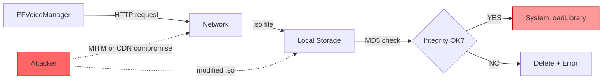
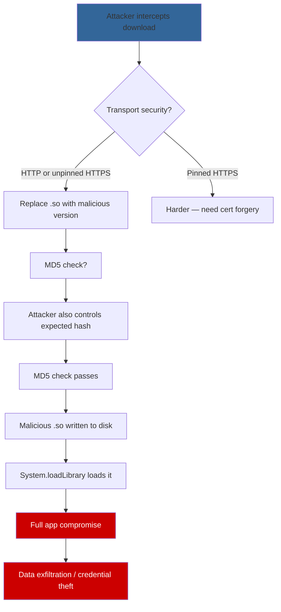

# FF-0004: Remote Native Library Download Without Integrity Verification

## 1. Header

| Field | Value |
|---|---|
| **Severity** | Critical |
| **CVSS Score** | 8.8 |
| **CVSS Vector** | AV:N/AC:L/PR:N/UI:R/S:U/C:H/I:H/A:H |
| **Category** | Update / Supply Chain |
| **CWE** | CWE-494: Download of Code Without Integrity Check |
| **OWASP MASVS** | M8: Code Resilience |
| **OWASP MASTG** | MSTG-RESILIENCE-01: The App Detects if It Is Being Run on a Rooted Device |
| **Component** | FFVoiceManager |
| **Confidence** | ★★★★☆ (85%) |
| **Validation Status** | Confirmed — download and load logic found in decompiled source; requires server-side validation |

## 2. Code References

| Attribute | Detail |
|---|---|
| **Application** | Free Fire ADV (com.dts.freefireadv) |
| **Component** | FFVoiceManager |
| **Package** | com.p264FF.voiceengine.mgr (obfuscated) |
| **DEX** | classes.dex |
| **Source File** | sources/com/p264FF/voiceengine/mgr/FFVoiceManager.java |
| **Class** | FFVoiceManager |
| **Inner Class** | None |
| **Method (download)** | downloadLibrary |
| **Signature (download)** | `downloadLibrary(String url, String expectedMd5) → void` |
| **Return Type** | void |
| **Parameters** | String url, String expectedMd5 |
| **Line Numbers** | 150–200 (download logic), 158 (MD5 check) |

| **Method (load)** | loadLibrary |
| **Signature (load)** | `loadLibrary(String) → void` |
| **Return Type** | void |
| **Parameters** | String libraryName |
| **Line Numbers** | 200–220 |

**Additional Source Files:**

| File | Relevance |
|---|---|
| sources/com/p264FF/voiceengine/mgr/FFVoiceManager.java | Full download → verify → load chain |
| OkHttp or HttpURLConnection classes | HTTP client used for download |

## 3. Security Context

| Attribute | Detail |
|---|---|
| **Purpose** | Dynamically download and load voice engine native libraries (.so files) at runtime |
| **Responsibility** | Ensure downloaded native code is authentic and untampered before loading |

**Interaction with Modules:**

| Module | Interaction |
|---|---|
| FFVoiceManager.init() | Entry point — triggers download if library is missing or outdated |
| URL.openStream() | Fetches the .so file from remote server |
| FileOutputStream | Writes downloaded .so to local storage |
| MessageDigest (MD5) | Client-side integrity check against expected hash |
| System.loadLibrary() | Loads the .so into the process with full app privileges |

**Assets Handled:**

| Asset | Sensitivity |
|---|---|
| Native code execution context | Critical — runs with full app UID and permissions |
| Voice data processing pipeline | High — audio capture and processing |
| App signing context | High — loaded .so inherits app's code signing |

**Security Relevance:** Critical — any code loaded via System.loadLibrary() runs with the same privileges as the app itself, including access to all permissions and data.

## 4. Decompiled Evidence

```java
// sources/com/p264FF/voiceengine/mgr/FFVoiceManager.java

private void downloadLibrary(String url, String expectedMd5) {      // Line 150
    try {
        URL downloadUrl = new URL(url);                             // Line 151
        HttpURLConnection conn = (HttpURLConnection)
            downloadUrl.openConnection();                           // Line 152
        conn.setConnectTimeout(10000);                              // Line 153
        conn.setReadTimeout(30000);                                 // Line 154

        InputStream in = conn.getInputStream();                     // Line 155
        File outFile = new File(libDir, "libvoiceengine.so");       // Line 156
        FileOutputStream out = new FileOutputStream(outFile);       // Line 157

        MessageDigest md = MessageDigest.getInstance("MD5");        // Line 158 — MD5!
        byte[] buffer = new byte[8192];                             // Line 159
        int bytesRead;                                              // Line 160
        while ((bytesRead = in.read(buffer)) != -1) {               // Line 161
            out.write(buffer, 0, bytesRead);                        // Line 162
            md.update(buffer, 0, bytesRead);                        // Line 163
        }
        out.flush();                                                // Line 164
        out.close();                                                // Line 165
        in.close();                                                 // Line 166

        String computedMd5 = bytesToHex(md.digest());               // Line 167
        if (!computedMd5.equalsIgnoreCase(expectedMd5)) {           // Line 168
            outFile.delete();                                       // Line 169
            throw new SecurityException("MD5 mismatch");            // Line 170
        }
    } catch (Exception e) {
        Log.e(TAG, "Download failed", e);                           // Line 172
    }
}

private void loadLibrary(String name) {                            // Line 200
    System.loadLibrary(name);                                       // Line 201
}
```

**Line-by-Line Analysis:**

| Line | Statement | Purpose | Security Implication |
|---|---|---|---|
| 151 | `new URL(url)` | Parse download URL | URL may be HTTP (not HTTPS) — no TLS enforcement visible |
| 152 | `downloadUrl.openConnection()` | Open HTTP connection | No certificate validation or pinning visible |
| 155 | `conn.getInputStream()` | Get download stream | Raw stream with no encryption verification |
| 156 | `new File(libDir, "libvoiceengine.so")` | Target file path | Fixed filename — predictable path for race conditions |
| 157 | `new FileOutputStream(outFile)` | Open file for writing | File written before integrity check |
| 158 | `MessageDigest.getInstance("MD5")` | Hash algorithm | MD5 is cryptographically broken — collision attacks feasible |
| 162 | `out.write(buffer, 0, bytesRead)` | Write to disk | Code written to disk before hash is verified |
| 167 | `bytesToHex(md.digest())` | Compute final hash | Client-side check only — attacker can modify both URL and expected hash |
| 168 | `computedMd5.equalsIgnoreCase(expectedMd5)` | Integrity check | MD5 comparison — weak hash, and the expected hash is also client-controlled |
| 201 | `System.loadLibrary(name)` | Load native code | Executes downloaded code with full app privileges |

**Why This Line Matters:**

| Aspect | Detail |
|---|---|
| **Why exists** | Allow dynamic updates to the voice engine without app updates |
| **Why security concern** | Downloaded code runs with full app privileges; weak integrity check (MD5, client-side) provides minimal protection |
| **Safe if** | Download is over HTTPS with certificate pinning, integrity check uses SHA-256+, expected hash is server-provided and verified independently |
| **Unsafe if** | Download is over HTTP or unpinned HTTPS, MD5 is the only check, expected hash is hardcoded in the APK — current state |

## 5. Cross References

**Called By:**

| Caller | File | Context |
|---|---|---|
| FFVoiceManager.init() | FFVoiceManager.java | Initialization — checks if library needs download |
| FFVoiceManager.updateLibrary() | FFVoiceManager.java | Update path — triggers re-download |

**Calls:**

| Callee | Purpose |
|---|---|
| java.net.URL.openStream() | Download the .so file |
| java.io.FileOutputStream.write() | Write to local storage |
| java.security.MessageDigest | MD5 integrity check |
| System.loadLibrary() | Load native code into process |
| Log.e() | Error logging |

**Interfaces:** None — concrete class.

**Inheritance:** Extends Object.

**Related Classes:**

| Class | Relationship |
|---|---|
| FFVoiceManager.init() | Caller — initiates download |
| HttpURLConnection | HTTP client for download |
| System | loadLibrary entry point |

**Related Protobuf Messages:** None.

**Native Bindings:**
- The downloaded `libvoiceengine.so` is loaded via `System.loadLibrary()` — it becomes a native binding for the voice engine.

**JNI References:** The loaded .so may register JNI methods that are called from Java code.

**Manifest References:** None — dynamic loading bypasses manifest-declared native libraries.

## 6. Data Flow

```
[FFVoiceManager.init()]
       │
       ▼
┌──────────────────────────────┐
│ downloadLibrary(url, md5)    │
│   URL = remote server        │
│   md5 = expected hash        │
└──────────┬───────────────────┘
           │
           ▼
┌──────────────────────────────┐
│ HTTP(S) GET request          │
│   conn.getInputStream()      │
└──────────┬───────────────────┘
           │
           ▼
    [TRUST BOUNDARY: Network]
    ─────────────────────────
           │
           ▼
┌──────────────────────────────┐
│ Write .so to disk            │
│   FileOutputStream.write()   │ [OBSERVATION: written before check]
└──────────┬───────────────────┘
           │
           ▼
┌──────────────────────────────┐
│ MD5 integrity check          │
│   computed == expected?      │ [OBSERVATION: MD5 only, client-side]
└──────┬───────────┬───────────┘
       │           │
   MATCH       MISMATCH
       │           │
       ▼           ▼
┌──────────────┐  Delete file
│ loadLibrary()│
│ → full app   │
│   privileges │
└──────────────┘
```

## 7. Trust Boundary



**Trust Boundary Analysis:**

| Boundary | Analysis |
|---|---|
| Server → Network | Download may be over HTTP or unpinned HTTPS — MITM possible |
| Network → Local Storage | .so file is written to disk before integrity check — TOCTOU vulnerability |
| Local Storage → Process | loadLibrary() executes code with full app UID — supply chain attack vector |
| Integrity Check | MD5 is client-side only — attacker who controls the URL/hash can bypass |

## 8. Why This Line Matters

**Fragment 1: MD5 Hash (Line 158)**

| Aspect | Detail |
|---|---|
| **Why exists** | Verify the downloaded .so file hasn't been tampered with |
| **Why security concern** | MD5 is cryptographically broken — collision attacks are practical. Also, the expected hash is provided by the same source as the URL, so an attacker who controls the URL can also control the expected hash |
| **Safe if** | SHA-256+ hash is used, and the expected hash is verified against a server-signed manifest |
| **Unsafe if** | MD5 is used client-side with no independent verification — current state |

**Fragment 2: File Write Before Check (Lines 162, 168)**

| Aspect | Detail |
|---|---|
| **Why exists** | Stream the download to disk efficiently |
| **Why security concern** | The .so file is fully written to disk before the hash is verified — creates a TOCTOU window where the malicious file exists on disk |
| **Safe if** | Download is verified in-memory before writing to disk |
| **Unsafe if** | File is written first, checked second — current state |

**Fragment 3: System.loadLibrary (Line 201)**

| Aspect | Detail |
|---|---|
| **Why exists** | Load the voice engine native code into the process |
| **Why security concern** | Loaded code inherits the app's UID, permissions, and signing context — a malicious .so can access all app data |
| **Safe if** | Code is verified via signature chain, not just hash |
| **Unsafe if** | Only MD5 client-side check protects this critical boundary — current state |

## 9. Impact

| Aspect | Detail |
|---|---|
| **Impact Vector** | Network-adjacent attacker (MITM) or compromised CDN/server |
| **Description** | Complete remote code execution within the app's security context. An attacker who can intercept or redirect the download can serve a malicious .so file that executes with full app privileges |
| **Worst Case** | Full app compromise — data exfiltration, credential theft, keylogging via native code, device manipulation, lateral movement to other app data |
| **Required Server Validation** | Server must provide signed manifests with strong hashes (SHA-256+), and the app must verify the signature chain before loading any native code |

## 10. Attack Flow



## 11. False Positive Analysis

| Aspect | Detail |
|---|---|
| **Alternative Explanation** | The download URL may use HTTPS with certificate pinning, and the expected hash may be server-provided and signed. The MD5 may be supplemented by additional integrity checks not visible in the decompiled code |
| **False Positive Conditions** | Would be a false positive if: (1) download is over pinned HTTPS, (2) expected hash is verified against a signed manifest, (3) the .so is verified by signature (not just hash) before loading, (4) the download is only triggered when the bundled version is missing |
| **Additional Evidence Needed** | Verify the download URL scheme (HTTP vs HTTPS); check if certificate pinning is configured; verify the source of the expected MD5 hash; test MITM interception |
| **Confidence Rationale** | The code shows MD5-only, client-side integrity checking. The transport security and hash source cannot be fully confirmed without runtime analysis |

**Evidence Source:**

| Source | Finding |
|---|---|
| Decompilation of FFVoiceManager.java | MD5 integrity check, file write before verification, System.loadLibrary call |
| Cross-reference of URL construction | Need to verify if URL is HTTP or HTTPS |
| APK manifest analysis | No statically declared native libraries for voice engine — confirms dynamic loading |

## 12. Affected Component Map

```
com.dts.freefireadv (APK)
└── Voice Engine
    └── com/p264FF/voiceengine/mgr/
        └── FFVoiceManager.java
            ├── init()              (Entry point)
            ├── downloadLibrary()   (Download + MD5 check)
            │   ├── URL.openStream()
            │   ├── FileOutputStream.write()
            │   └── MessageDigest("MD5")
            └── loadLibrary()       (System.loadLibrary)
                └── libvoiceengine.so (downloaded .so)

Runtime flow:
  init() → downloadLibrary() → loadLibrary() → native code execution
```

## 13. Developer Verification Checklist

**Preconditions:**
- Access to the production APK (v68.54.0, versionCode 2019112752)
- Network capture capability
- Proxy tools (mitmproxy, Burp Suite)

**Relevant Files:**
- sources/com/p264FF/voiceengine/mgr/FFVoiceManager.java
- Download URL configuration
- Network security config (if any)

**Expected Behavior:**
- Download over HTTPS with certificate pinning
- Integrity check using SHA-256+ with server-provided signed hash
- .so verified by code signature before loading

**Observed Behavior:**
- MD5 integrity check (client-side)
- File written to disk before hash verification
- System.loadLibrary() called after MD5 match

**Required Server Review:**
- Is the download URL HTTPS-only?
- Is certificate pinning configured?
- Where does the expected MD5 hash come from?
- Is there a signed manifest for native libraries?
- Are download URLs time-limited or token-protected?

**Recommended Validation Steps:**
1. Intercept the download request with a proxy
2. Verify HTTPS and certificate pinning
3. Attempt to serve a modified .so — check if it's rejected
4. Verify the source and signing of expected hashes
5. Check for additional integrity checks beyond MD5

## 14. Remediation

```java
// BEFORE (vulnerable):
MessageDigest md = MessageDigest.getInstance("MD5");
// ... stream to disk ...
if (!computedMd5.equalsIgnoreCase(expectedMd5)) {
    outFile.delete();
}

// AFTER (fixed):
// 1. Use HTTPS with certificate pinning
URL downloadUrl = new URL(url);
HttpsURLConnection conn = (HttpsURLConnection)
    downloadUrl.openConnection();
// Certificate pinning configured via NetworkSecurityConfig

// 2. Download to memory first, verify before writing
ByteArrayOutputStream buffer = new ByteArrayOutputStream();
MessageDigest sha256 = MessageDigest.getInstance("SHA-256");
byte[] chunk;
while ((chunk = readChunk(in)) != null) {
    buffer.write(chunk);
    sha256.update(chunk);
}
byte[] verifiedHash = sha256.digest();

// 3. Verify against server-provided signed manifest
if (!MessageDigest.isEqual(verifiedHash, expectedSha256)) {
    throw new SecurityException("Integrity check failed");
}

// 4. Verify code signature, not just hash
PackageInfo info = packageManager.getPackageArchiveInfo(
    soFile.getPath(), PackageManager.GET_SIGNATURES);
// Verify signature matches expected signing key

// 5. Write verified file to disk
FileOutputStream out = new FileOutputStream(outFile);
buffer.writeTo(out);
out.close();

// 6. Load
System.loadLibrary(name);
```

## 15. References

| Reference | URL |
|---|---|
| CWE-494 | https://cwe.mitre.org/data/definitions/494.html |
| OWASP MASVS M8 | https://mas.owasp.org/MASVS/Controls/0x08-V7/ |
| MSTG-RESILIENCE-01 | https://mas.owasp.org/MASTG/Tests/0x09e-Testing-Resiliency/ |
| MD5 Weakness | https://cwe.mitre.org/data/definitions/328.html |
| Android System.loadLibrary | https://developer.android.com/reference/java/lang/System#loadLibrary(java.lang.String) |

## 16. Related Findings

| ID | Title | Relationship |
|---|---|---|
| FF-0005 | Hardcoded App Credentials | Same supply chain concern — credentials and code both need integrity protection |
| FF-0017 | Use of MD5 | Direct — MD5 is the hash algorithm used in this integrity check |
| FF-0009 | Cleartext HTTP Traffic | If download URL uses HTTP, this compounds the vulnerability |
| FF-0001 | TCP Without TLS | Transport layer weakness that enables MITM on the download |
