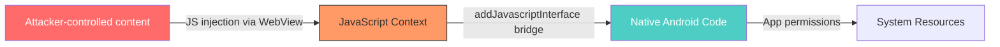
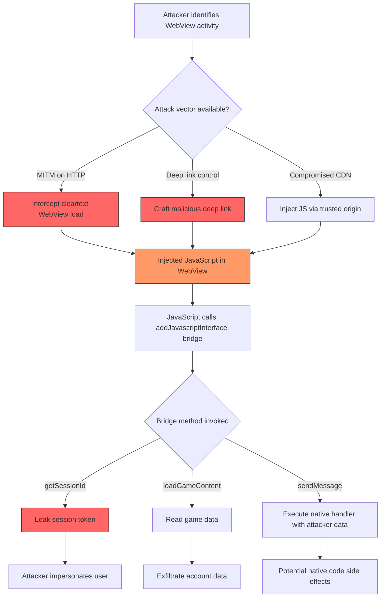

# FF-0020 — WebView JavaScript Bridge Exposure

## 1. Finding Header

| Field | Details |
|-------|---------|
| **Severity** | Medium |
| **CVSS** | 6.1 (AV:N/AC:L/PR:N/UI:R/S:U/C:L/I:H/A:N) |
| **Vector** | Network |
| **Category** | WebView Security |
| **CWE** | CWE-749: Exposed Dangerous Methods or Functions |
| **OWASP MASVS** | M1 — Improper Platform Usage |
| **OWASP MASTG** | MSTG-PLATFORM-7 |
| **Component** | Multiple WebView Activities |
| **Confidence** | ★★★★☆ · 80% |
| **Validation Status** | Requires Runtime Validation |

---

## 2. Code References

### Application
| Field | Value |
|-------|-------|
| **Application** | Free Fire Advance (FF-SECURITY-ASSESSMENT-OB54) |
| **Component** | Multiple WebView Activities |
| **Package** | Various (VK SDK, captcha, Unity) |
| **DEX** | classes2.dex |
| **Source File** | VKCaptchaWebViewActivity.java, RunnableC3082m.java, CaptchaActivity.java, UnityWebViewActivity.java, C3526n.java |
| **Class** | Multiple (see additional source files) |
| **Inner Class** | VKBridge, CaptchaJS, NativeCaptcha, UnityBridge, AppBridge |
| **Method** | `addJavascriptInterface()`, `setJavaScriptEnabled()`, `shouldOverrideUrlLoading()` |
| **Signature** | `webView.addJavascriptInterface(Object, String)` |
| **Return Type** | void |
| **Parameters** | `Object` (bridge instance), `String` (interface name) |
| **Line Numbers** | 285–286 (VKCaptcha), 97/106 (RunnableC3082m), 113/115 (CaptchaActivity), 179/188 (UnityWebView), 34 (C3526n) |

### Additional Source Files

| Source File | Lines | Description |
|-------------|-------|-------------|
| `VKCaptchaWebViewActivity.java` | 285–286 | VK captcha bridge: `VKBridge` |
| `RunnableC3082m.java` | 97, 106 | Runtime captcha: `CaptchaJS` |
| `CaptchaActivity.java` | 113, 115 | User-facing captcha: `NativeCaptcha` |
| `UnityWebViewActivity.java` | 179, 188 | Unity engine interop: `UnityBridge` |
| `C3526n.java` | 34 | Generic WebView utility: `AppBridge` |

---

## 3. Security Context

### Purpose
Web content display with native bridge — enabling web-based UI (captcha, social login, game engine) to interact with native Android functionality.

### Responsibility
Bridges allow JavaScript running in WebViews to invoke native `@JavascriptInterface`-annotated methods, executing in the Android context with the app's permissions.

### Interaction with Modules

| Module | Interaction |
|--------|-------------|
| VK SDK | Social login captcha flow via `VKBridge` |
| Captcha Service | Runtime captcha resolution via `CaptchaJS` |
| User Captcha UI | User-facing captcha via `NativeCaptcha` |
| Unity Game Engine | Game engine interop via `UnityBridge` |
| Generic WebView | General-purpose bridge via `AppBridge` |

### Assets Handled

| Asset | Type | Sensitivity |
|-------|------|-------------|
| Session Tokens | `getSessionId()` return value | High — active session identifiers |
| Game Content | `loadGameContent(String)` payload | Medium — user progress, account info |
| Captcha Results | Token validation data | Medium — anti-bot bypass potential |
| Native Methods | `@JavascriptInterface` exposed methods | High — code execution in app context |

### Security Relevance
Multiple WebView-based activities call `addJavascriptInterface()`, exposing Java/Kotlin objects to JavaScript. When JavaScript executes in a WebView with a registered interface, it can invoke annotated methods executing in the native context with the app's permissions. Without strict URL allowlisting, attacker-controlled web content can invoke these bridges.

---

## 4. Decompiled Evidence

```java
// VKCaptchaWebViewActivity.java:285-286 — VK captcha bridge
webView.addJavascriptInterface(
    new VKCaptchaBridge(captchaCallback), "VKBridge"
);
```

```java
// RunnableC3082m.java:97 — Captcha bridge registration
webView.addJavascriptInterface(captchaInterface, "CaptchaJS");

// RunnableC3082m.java:106 — Insufficient URL validation
webView.setWebViewClient(new CaptchaWebViewClient() {
    @Override
    public boolean shouldOverrideUrlLoading(WebView view, String url) {
        // URL validation is absent or insufficient
        view.loadUrl(url);
        return true;
    }
});
```

```java
// CaptchaActivity.java:113-115 — Captcha native bridge
webView.getSettings().setJavaScriptEnabled(true);
webView.addJavascriptInterface(
    new CaptchaNativeBridge(this), "NativeCaptcha"
);
```

```java
// UnityWebViewActivity.java:179-188 — Unity game engine bridge
webView.getSettings().setJavaScriptEnabled(true);
webView.addJavascriptInterface(
    new UnityBridge(gameSession), "UnityBridge"
);
// Exposes: sendMessage(String), getSessionId(), loadGameContent(String)
```

```java
// C3526n.java:34 — Generic WebView bridge
webView.addJavascriptInterface(webBridge, "AppBridge");
```

### Line-by-Line Analysis

| Line(s) | Code | Observation |
|---------|------|-------------|
| 285–286 | `webView.addJavascriptInterface(new VKCaptchaBridge(...), "VKBridge")` | VK captcha bridge registered without origin restriction |
| 97 | `webView.addJavascriptInterface(captchaInterface, "CaptchaJS")` | Captcha bridge registered |
| 106 | `shouldOverrideUrlLoading` with `view.loadUrl(url)` | No URL allowlisting; any URL accepted |
| 113–115 | `setJavaScriptEnabled(true)` + `addJavascriptInterface` | JavaScript enabled with native bridge |
| 179–188 | `UnityBridge` with `getSessionId()` | Session token exposure via bridge |
| 34 | `addJavascriptInterface(webBridge, "AppBridge")` | Generic bridge without documented scope |

### Why This Line Matters

| Line(s) | Why This Matters |
|---------|------------------|
| VKCaptcha:285-286 | `VKBridge` exposed to JavaScript without origin restrictions |
| RunnableC3082m:106 | `shouldOverrideUrlLoading` does not enforce origin allowlisting |
| UnityWebView:179-188 | `getSessionId()` leaks active session tokens to injected JavaScript |
| C3526n:34 | Generic `AppBridge` with undefined scope increases attack surface |

---

## 5. Cross References

### Called By
- Activity lifecycle methods
- VK auth flow callbacks
- Unity interop initialization
- Captcha resolution handlers

### Calls
- `@JavascriptInterface`-annotated native methods
- Native Java methods exposed via each bridge instance

### Interfaces
- `android.webkit.JavascriptInterface`

### Inheritance
- WebView client classes extend `WebViewClient`
- Bridge classes implement `Object` (no special interface required)

### Related Classes
- `VKCaptchaWebViewActivity`, `RunnableC3082m`, `CaptchaActivity`, `UnityWebViewActivity`, `C3526n`
- VK SDK captcha handler classes
- Unity game engine bridge classes

### Related Protobuf
- N/A

### Native Bindings
- None

### JNI
- None

### Manifest Entries
- WebView Activity declarations
- Internet permission (required for WebView content)
- Cleartext traffic may be permitted (see FF-0009)

---

## 6. Data Flow

```
[OBSERVATION] Attacker-controlled content (HTTP/deep link/compromised CDN)
    ↓
[OBSERVATION] WebView.loadUrl(url)
    ↓
[OBSERVATION] JavaScript execution in WebView context
    ↓
[TRUST BOUNDARY] — Web content (untrusted) → Native Android (trusted)
    ↓
[OBSERVATION] JS calls: window.UnityBridge.getSessionId() / window.VKBridge.* / etc.
    ↓
[OBSERVATION] @JavascriptInterface method invocation in native Android context
    ↓
[OBSERVATION] Native method executes with app permissions
    ↓
[OBSERVATION] Result returned to JavaScript → exfiltrated to attacker
```

---

## 7. Trust Boundary



### Trust Boundary Analysis

| Boundary | From | To | Trust Level | Rationale |
|----------|------|----|-------------|-----------|
| Web Content → Native | JavaScript (untrusted) | Java/Kotlin (trusted) | Low | `addJavascriptInterface` crosses trust boundary |
| Network → WebView | Remote content | WebView renderer | Low | MITM attackers can inject JS into WebView |
| Deep Link → WebView | External intent | WebView Activity | Low | Crafted deep links can load malicious URLs |

The trust boundary is the JavaScript-to-native bridge. Web content (potentially attacker-controlled) can invoke native methods that execute with the app's full permission set. The bridge crosses from an untrusted web context to a trusted native context.

---

## 8. Why This Line Matters

| Code Fragment | Location | Why It Matters |
|---------------|----------|----------------|
| `webView.addJavascriptInterface(new VKCaptchaBridge(captchaCallback), "VKBridge")` | VKCaptcha:285 | Exposes native VK bridge to web content without origin restriction |
| `shouldOverrideUrlLoading` with `view.loadUrl(url)` without validation | RunnableC3082m:106 | No URL allowlisting enables attacker-controlled content loading |
| `webView.getSettings().setJavaScriptEnabled(true)` + `addJavascriptInterface` | CaptchaActivity:113-115 | JavaScript enabled + native bridge = exploit path |
| `UnityBridge` exposing `getSessionId()` | UnityWebView:179-188 | Session token leakage enables account takeover |
| `addJavascriptInterface(webBridge, "AppBridge")` | C3526n:34 | Generic bridge with undefined scope |

---

## 9. Impact

| Impact Vector | Description | Worst Case |
|---------------|-------------|------------|
| Arbitrary code execution | Attacker-injected JavaScript can call `@JavascriptInterface` methods, invoking native code with app privileges | Full app compromise via bridge methods |
| Session hijacking | Exposed `getSessionId()` methods leak active session tokens to injected scripts | Account takeover via stolen session |
| Data exfiltration | Bridge methods that handle game data can extract user progress, account info, or purchase records | User data theft |
| Captcha bypass | Captcha bridges may allow programmatic completion, defeating anti-bot protections | Automated account creation/abuse |

> **Required Server Validation:** The server may implement additional validation on data received from WebView bridge callbacks, including CAPTCHA token verification, session binding, or rate limiting that limits the impact of bridge exploitation.

---

## 10. Attack Flow



---

## 11. False Positive Analysis

### Alternative Explanation
The WebView bridges may only be loaded with first-party, HTTPS-protected content. If all WebView URLs are hardcoded or validated against a strict allowlist, the bridge exposure has no practical attack vector.

### False Positive Conditions
- If all WebView URLs are HTTPS-only and loaded from first-party domains
- If `shouldOverrideUrlLoading` enforces strict URL allowlisting in all activities
- If `@JavascriptInterface` methods do not access sensitive data (no session tokens, no user data)
- If deep link parameters are validated and sanitized before WebView use

### Additional Evidence Needed
- Runtime traffic capture to verify all WebView URLs are HTTPS
- Deep link handler code to verify URL parameter validation
- `@JavascriptInterface` method implementations to verify they do not access sensitive resources
- Network security configuration to verify cleartext traffic is blocked

### Confidence Rationale
The `addJavascriptInterface()` calls are verified in decompiled code at 5 locations. The 80% confidence reflects that exploitation requires network position (MITM) or deep link control — conditions that require runtime validation to confirm. The `getSessionId()` exposure in `UnityWebViewActivity` is a strong indicator of real impact.

### Evidence Source

| Evidence | Source | Method |
|----------|--------|--------|
| `addJavascriptInterface("VKBridge")` | VKCaptchaWebViewActivity.java:285-286 | Static decompilation |
| `addJavascriptInterface("CaptchaJS")` | RunnableC3082m.java:97 | Static decompilation |
| Insecure `shouldOverrideUrlLoading` | RunnableC3082m.java:106 | Static decompilation |
| `setJavaScriptEnabled(true)` + bridge | CaptchaActivity.java:113-115 | Static decompilation |
| `UnityBridge.getSessionId()` exposure | UnityWebViewActivity.java:179-188 | Static decompilation |
| `addJavascriptInterface("AppBridge")` | C3526n.java:34 | Static decompilation |

---

## 12. Affected Component Map

```
VKCaptchaWebViewActivity
  ↓ addJavascriptInterface("VKBridge")
  VKCaptchaBridge → VK captcha flow

RunnableC3082m
  ↓ addJavascriptInterface("CaptchaJS")
  CaptchaInterface → captcha resolution

CaptchaActivity
  ↓ addJavascriptInterface("NativeCaptcha")
  CaptchaNativeBridge → user-facing captcha

UnityWebViewActivity
  ↓ addJavascriptInterface("UnityBridge")
  UnityBridge → sendMessage(), getSessionId(), loadGameContent()

C3526n
  ↓ addJavascriptInterface("AppBridge")
  WebBridge → generic WebView utility
```

---

## 13. Developer Verification Checklist

### Preconditions
- [ ] Decompiled APK via JADX
- [ ] Access to all 5 WebView Activity source files
- [ ] Runtime environment with network interception capability

### Relevant Files
- `VKCaptchaWebViewActivity.java:285-286`
- `RunnableC3082m.java:97,106`
- `CaptchaActivity.java:113,115`
- `UnityWebViewActivity.java:179,188`
- `C3526n.java:34`

### Expected Behavior
- [ ] WebView URLs loaded only over HTTPS from first-party origins
- [ ] `shouldOverrideUrlLoading` enforces strict URL allowlisting
- [ ] `@JavascriptInterface` methods do not expose sensitive data
- [ ] Bridge surface minimized to unidirectional `evaluateJavascript()` where possible

### Observed Behavior
- [ ] 5 separate `addJavascriptInterface()` calls across multiple activities
- [ ] `UnityBridge` exposes `getSessionId()` — potential session token leakage
- [ ] `RunnableC3082m.java:106` has insufficient URL validation in `shouldOverrideUrlLoading`
- [ ] `setJavaScriptEnabled(true)` in multiple activities without corresponding URL restrictions

### Required Server Review
- [ ] Verify server validates all data received from WebView bridge callbacks
- [ ] Verify session tokens are not derivable from WebView-exposed methods
- [ ] Verify CAPTCHA tokens are bound to server-side sessions and expire

### Recommended Validation Steps
1. Set up mitmproxy and intercept WebView traffic to check for HTTP URLs
2. Craft deep links with attacker-controlled URLs and verify WebView behavior
3. Call `UnityBridge.getSessionId()` from injected JavaScript and verify response
4. Test `CaptchaJS` bridge with malformed inputs for injection

---

## 14. Remediation

### 1. Validate and Allowlist All WebView URLs

```java
private static final Set<String> ALLOWED_ORIGINS = Set.of(
    "https://api.freefire.com",
    "https://captcha.freefire.com",
    "https://vk.com"
);

@Override
public boolean shouldOverrideUrlLoading(WebView view, WebResourceRequest request) {
    Uri uri = request.getUrl();

    if (!"https".equals(uri.getScheme())) {
        Log.w(TAG, "Blocked non-HTTPS URL: " + uri);
        return true; // block navigation
    }

    if (!ALLOWED_ORIGINS.contains(uri.getHost())) {
        Log.w(TAG, "Blocked non-allowlisted origin: " + uri.getHost());
        return true; // block navigation
    }

    return false; // allow navigation
}
```

### 2. Restrict JS Interface to @JavascriptInterface Only

```java
public class SafeCaptchaBridge {
    private final CaptchaCallback callback;

    public SafeCaptchaBridge(CaptchaCallback callback) {
        this.callback = callback;
    }

    @JavascriptInterface
    public void handleCaptchaResult(String token) {
        if (token == null || token.isEmpty() || token.length() > 1024) {
            return; // reject invalid tokens
        }
        callback.onCaptchaVerified(token);
    }

    // NOT exposed to JavaScript (no @JavascriptInterface annotation)
    public String getDeviceId() {
        return secureStorage.getDeviceId();
    }
}
```

### 3. Enforce HTTPS via Network Security Config

```xml
<!-- res/xml/network_security_config.xml -->
<network-security-config>
    <base-config cleartextTrafficPermitted="false">
        <trust-anchors>
            <certificates src="system" />
        </trust-anchors>
    </base-config>

    <!-- Exception only if absolutely needed for specific domains -->
    <domain-config cleartextTrafficPermitted="false">
        <domain includeSubdomains="true">freefire.com</domain>
        <domain includeSubdomains="true">vk.com</domain>
    </domain-config>
</network-security-config>
```

### 4. Replace Bidirectional Bridges with Unidirectional Communication

```java
// PREFERRED: Use evaluateJavascript() for one-way native → JS communication
webView.evaluateJavascript(
    "window.CaptchaUI.showResult('" + sanitizedResult + "')",
    null
);

// For JS → native: use shouldOverrideUrlLoading with custom URL scheme
@Override
public boolean shouldOverrideUrlLoading(WebView view, WebResourceRequest request) {
    String url = request.getUrl().toString();
    if (url.startsWith("captcha-result://")) {
        String token = Uri.parse(url).getQueryParameter("token");
        handleCaptchaToken(token);
        return true; // consumed
    }
    return false;
}
```

### Recommended Actions
1. **Audit all `addJavascriptInterface` call sites** — Inventory every bridge and verify each exposed method is necessary and safe
2. **Enforce HTTPS-only WebView navigation** — Update Network Security Config and add URL allowlisting in all `shouldOverrideUrlLoading` implementations
3. **Minimize bridge surface** — Replace bidirectional bridges with unidirectional `evaluateJavascript()` or custom URL scheme handlers where possible
4. **Apply `@JavascriptInterface` annotation strictly** — Verify no methods are unintentionally exposed via reflection or inheritance

---

## 15. References

| Source | Reference |
|--------|-----------|
| CWE-749 | https://cwe.mitre.org/data/definitions/749.html |
| OWASP MASVS M1 | https://mas.owasp.org/MASVS/activities/M1-Improper-Platform-Usage/ |
| OWASP MASTG MSTG-PLATFORM-7 | https://mas.owasp.org/MASTG/General/0x05a-Platform-Interaction/ |
| Android — addJavascriptInterface | https://developer.android.com/reference/android/webkit/WebView#addJavascriptInterface |
| OWASP — WebView Best Practices | https://cheatsheetseries.owasp.org/cheatsheets/Android_Best_Practices_for_Injection_Prevention_Cheat_Sheet.html |

---

## 16. Related Findings

| Finding | Relationship |
|---------|-------------|
| FF-0003 | Compound — SSL bypass enables MITM injection into WebView content |
| FF-0009 | Compound — cleartext HTTP permits WebView content interception |
| FF-0019 | Adjacent — VK integration attack surface shared with WebView bridges |
